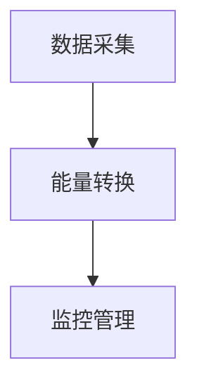

                 


# 《海洋经济开发中的投资机会分析》

## 关键词：海洋经济，投资机会，系统分析，风险评估，项目实战

## 摘要：  
随着全球资源竞争的加剧和海洋经济的重要性日益凸显，海洋经济开发成为投资领域的新热点。本文从海洋经济的定义、资源分类、开发模式等方面展开分析，结合投资机会评估的数学模型和系统架构设计，深入探讨海洋经济开发中的投资机会，并通过实际案例分析提供可操作的项目实战指导。本文旨在为投资者和决策者提供全面的分析框架和实践建议。

---

# 第1章: 海洋经济开发的背景与现状

## 1.1 海洋经济的定义与内涵  
海洋经济是指利用海洋资源进行的经济活动，涵盖海洋渔业、海洋能源、海洋交通、海洋旅游等多个领域。海洋经济的核心要素包括海洋资源、技术、资本和人力资源。可持续发展是海洋经济发展的核心理念，强调在资源开发中平衡经济效益与环境保护。

## 1.2 海洋经济开发的现状  
全球海洋经济近年来持续增长，但区域发展不均衡。中国作为海洋大国，海洋经济总量位居世界前列，但在开发过程中面临资源利用效率低、技术落后、生态环境脆弱等问题。此外，海洋经济开发还面临政策法规不完善、国际竞争加剧等挑战。

## 1.3 海洋经济开发中的投资机会  
海洋经济开发潜力巨大，尤其是海洋能源、海洋生物医药和海洋旅游等领域。投资者需要结合市场需求、技术可行性、政策支持等多方面因素，选择合适的投资机会。本文将从投资评估的数学模型和系统架构设计两方面进行深入分析。

---

# 第2章: 海洋经济开发的核心概念与理论框架

## 2.1 海洋资源的分类与特征  
海洋资源可分为可再生资源（如渔业资源）和不可再生资源（如海底矿产）。各类资源具有不同的开发难度、利用效率和环境影响。例如，海洋能源（如潮汐能、风能）具有清洁、可再生的特点，但开发成本较高。

## 2.2 海洋经济开发的模式与特点  
海洋经济开发模式包括政府主导型、企业主导型和混合型。政府主导型注重生态保护，企业主导型强调经济效益，混合型则兼顾两者。不同模式在投资回报、风险承担和资源配置方面存在显著差异。

## 2.3 海洋经济开发的理论框架  
海洋经济开发的理论框架包括资源基础理论、经济效益分析和风险评估模型。资源基础理论强调资源禀赋对经济活动的支撑作用，经济效益分析关注投资回报的量化评估，风险评估模型则用于预测和应对开发中的不确定性。

---

# 第3章: 海洋经济开发中的投资分析方法

## 3.1 投资机会分析的基本原理  
投资机会分析是通过评估项目的可行性和盈利能力，判断是否值得投资的过程。分析步骤包括问题识别、数据收集、模型构建和结果评估。

## 3.2 投资评估的数学模型  
净现值（NPV）和内部收益率（IRR）是常用的评估指标。  
- 净现值公式：$$ NPV = \sum_{t=0}^{n} \frac{C_t}{(1+r)^t} $$  
  其中，\( C_t \) 是第 \( t \) 年的现金流，\( r \) 是贴现率。  
- 内部收益率公式：$$ IRR = r \text{ 满足 } NPV = 0 $$  

## 3.3 投资风险分析与管理  
风险识别是通过SWOT分析等方法，评估项目可能面临的市场、技术和环境风险。风险管理策略包括分散投资、保险机制和应急预案。

---

# 第4章: 海洋经济开发的系统分析与架构设计

## 4.1 系统分析的基本方法  
系统分析包括问题分析、目标设定和方案设计。通过分析海洋经济开发中的关键问题，设定合理的开发目标，并设计可行的解决方案。

## 4.2 系统架构设计  
系统架构设计包括功能模块划分和系统架构图。例如，海洋能源开发系统可以分为数据采集、能量转换和监控管理三个模块。系统架构图如下：



## 4.3 系统接口设计  
系统接口设计需要考虑模块之间的数据交互。例如，数据采集模块通过传感器获取海洋环境数据，并传送给能量转换模块。

---

# 第5章: 项目实战——海洋能源开发案例分析

## 5.1 项目背景与目标  
本项目旨在开发 offshore wind farm，利用风能发电，满足沿海地区的能源需求。项目目标包括提高能源利用效率和保护海洋生态环境。

## 5.2 系统功能设计  
系统功能包括数据采集、能量转换和监控管理。数据采集模块使用传感器获取海洋环境数据，能量转换模块将风能转化为电能，监控管理模块实时监控系统运行状态。

## 5.3 项目实施与代码实现  
以下是系统核心代码示例：
```python
def calculate_power(wind_speed):
    return 0.5 * wind_speed ** 3

wind_speed = 12  # 米/秒
power = calculate_power(wind_speed)
print(f"发电功率为：{power} 千瓦")
```

## 5.4 案例分析与小结  
通过本案例分析，我们可以看到海洋能源开发的潜力和挑战。投资者需要结合技术可行性和市场 demand，选择合适的投资机会。

---

# 第6章: 总结与展望

## 6.1 本章总结  
本文从背景、核心概念、分析方法和项目实战四个方面，全面分析了海洋经济开发中的投资机会。通过数学模型和系统架构设计，为投资者提供了科学的决策依据。

## 6.2 未来展望  
未来，海洋经济开发将更加注重技术创新和可持续发展。投资者需要关注新兴技术（如海洋生物技术）和国际合作，抓住新的投资机会。

---

# 小结与注意事项

## 小结  
本文通过系统分析和案例研究，为海洋经济开发中的投资机会提供了全面的分析框架和实践指导。投资者可以根据本文的理论和方法，制定科学的投资策略。

## 注意事项  
1. 投资者应充分考虑海洋经济开发的政策法规和环境风险。  
2. 在系统设计中，需注重模块的可扩展性和灵活性。  
3. 项目实施过程中，应加强与当地社区和政府的合作，确保开发活动的可持续性。

---

# 扩展阅读

1. 《海洋经济与可持续发展》  
2. 《投资评估的数学模型与应用》  
3. 《系统架构设计与优化》  

通过以上内容，本文为海洋经济开发中的投资机会分析提供了全面而深入的探讨，希望对投资者和研究者有所帮助。

