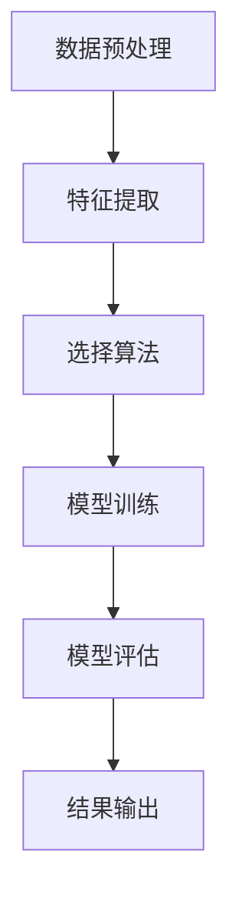
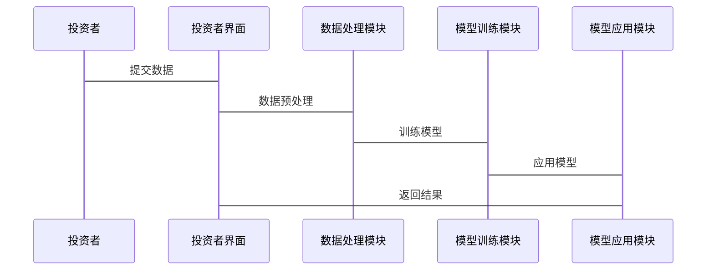

                 


# 深入分析投资者行为：模型构建与应用

---

## 关键词：
投资者行为分析、模型构建、机器学习、系统架构、算法实现

---

## 摘要：
投资者行为分析是金融领域中的重要研究方向，旨在通过建模和数据分析揭示投资者的决策规律和市场行为特征。本文从投资者行为分析的背景出发，详细探讨其核心概念、数学模型、算法实现以及系统架构设计，并结合实际案例展示模型的应用场景和效果。通过理论与实践相结合的方式，本文为投资者行为分析的深入研究和实际应用提供了系统性的指导。

---

# 第一部分: 投资者行为分析的背景与核心概念

## 第1章: 投资者行为分析的背景与问题描述

### 1.1 投资者行为分析的背景

#### 1.1.1 投资者行为分析的定义与核心要素
投资者行为分析是指通过研究投资者在金融市场中的决策过程和行为模式，揭示其背后的认知、情绪和外部环境的影响。其核心要素包括：
- **投资者特征**：年龄、性别、财富规模、风险偏好等。
- **市场环境**：宏观经济指标、市场波动性、政策环境等。
- **行为特征**：交易频率、投资决策模式、资产配置策略等。

#### 1.1.2 投资者行为分析的现实意义
- **优化投资策略**：通过分析投资者行为，帮助投资者做出更理性的决策。
- **风险控制**：识别投资者的非理性行为，降低投资风险。
- **市场预测**：基于投资者行为特征，预测市场趋势。

#### 1.1.3 投资者行为分析的边界与外延
投资者行为分析主要关注投资者的决策过程和行为模式，其边界包括：
- **个体行为**：单个投资者的行为特征。
- **群体行为**：投资者群体的行为模式。
- **市场互动**：投资者之间的相互影响。

外延则包括：
- **情绪分析**：投资者情绪对市场的影响。
- **认知偏差**：投资者决策中的认知偏差。

### 1.2 投资者行为分析的问题背景

#### 1.2.1 投资者决策中的常见问题
- **非理性决策**：投资者常常受到情绪和认知偏差的影响。
- **信息过载**：投资者面临大量信息，难以有效筛选和处理。
- **行为一致性**：投资者行为的不一致性和波动性。

#### 1.2.2 投资者行为分析的难点与挑战
- **数据多样性**：投资者行为数据来源广泛，包括交易数据、社交媒体数据等。
- **模型复杂性**：投资者行为受到多种因素的影响，建模难度较大。
- **动态变化**：投资者行为受市场环境变化的影响，具有动态性。

#### 1.2.3 投资者行为分析的目标与解决路径
目标：
- 描述投资者行为特征。
- 解释投资者行为的原因。
- 预测投资者行为趋势。

解决路径：
- 数据收集与处理。
- 模型构建与优化。
- 实验验证与应用。

## 第2章: 投资者行为分析的核心概念与联系

### 2.1 投资者行为分析的核心概念

#### 2.1.1 投资者情绪与认知偏差
- **情绪**：投资者情绪波动对市场的影响。
- **认知偏差**：投资者在决策中常见的认知错误，如过度自信、确认偏差等。

#### 2.1.2 投资者决策过程中的关键因素
- **信息处理能力**：投资者对信息的处理和理解能力。
- **风险偏好**：投资者对风险的承受能力。
- **社会影响**：投资者之间的相互影响。

#### 2.1.3 投资者行为模型的基本结构
- **输入层**：投资者特征、市场环境。
- **处理层**：信息处理、情绪分析。
- **输出层**：投资决策、行为预测。

### 2.2 核心概念的属性特征对比

| 概念 | 属性 | 特征 |
|------|------|------|
| 情绪 | 动态性 | 情绪随时间波动 |
| 认知偏差 | 稳定性 | 认知偏差相对固定 |
| 投资者行为模型 | 复杂性 | 模型复杂，涉及多因素 |

### 2.3 实体关系图（ER图）

```mermaid
er
    投资者
    有
    投资行为
    通过
    投资决策
    与
    市场环境
    交互
```

---

# 第二部分: 投资者行为分析的数学模型与算法原理

## 第3章: 投资者行为分析的数学模型

### 3.1 基于回归分析的投资者行为预测模型

#### 3.1.1 回归分析的基本原理
回归分析是一种统计学方法，用于研究变量之间的关系。其基本假设包括：
- 线性关系：因变量与自变量之间存在线性关系。
- 独立性：自变量之间相互独立。
- 正态性：误差服从正态分布。

#### 3.1.2 投资者行为预测的数学模型
$$ y = \beta_0 + \beta_1x_1 + \beta_2x_2 + \dots + \beta_nx_n + \epsilon $$
其中：
- $y$：投资者行为指标（如交易频率）。
- $x_i$：自变量（如市场波动率、投资者情绪）。
- $\beta_i$：回归系数。
- $\epsilon$：误差项。

#### 3.1.3 模型的假设检验与验证
- **假设检验**：检验回归系数的显著性。
- **模型验证**：通过交叉验证评估模型的预测能力。

### 3.2 基于神经网络的投资者行为分析模型

#### 3.2.1 神经网络的基本结构
神经网络由输入层、隐藏层和输出层组成，常用激活函数如ReLU和sigmoid。

#### 3.2.2 投资者行为分析的神经网络模型
神经网络模型能够捕捉复杂的非线性关系，适用于投资者情绪分析和行为预测。

#### 3.2.3 模型的训练与优化
- **训练方法**：使用梯度下降算法优化模型参数。
- **优化策略**：调整学习率和批量大小。

## 第4章: 投资者行为分析的算法实现

### 4.1 算法原理的流程图



### 4.2 算法实现的Python代码示例

```python
import numpy as np
from sklearn.linear_model import LinearRegression

# 示例数据
X = np.array([[1], [2], [3], [4], [5]])
y = np.array([2, 4, 5, 4, 6])

# 模型训练
model = LinearRegression()
model.fit(X, y)

# 模型预测
print(model.predict([[6]]))  # 输出: [[7]]
```

---

# 第三部分: 系统分析与架构设计方案

## 第5章: 系统分析与架构设计

### 5.1 问题场景介绍
投资者行为分析系统需要处理大量数据，包括交易数据、社交媒体数据等。

### 5.2 系统功能设计

#### 5.2.1 领域模型类图


#### 5.2.2 系统架构图

```mermaid
container 投资者行为分析系统
    container 前端模块
        class 投资者界面
    container 后端模块
        class 数据处理模块
        class 模型训练模块
        class 模型应用模块
    container 数据源
        class 交易数据
        class 社交媒体数据
```

### 5.3 系统接口设计

#### 5.3.1 API接口设计
- **输入接口**：接收投资者数据。
- **输出接口**：返回分析结果。

#### 5.3.2 系统交互流程图



---

# 第四部分: 项目实战

## 第6章: 项目实战

### 6.1 环境安装
- 安装Python和相关库（如scikit-learn、TensorFlow）。

### 6.2 系统核心实现源代码

```python
import numpy as np
from sklearn.linear_model import LinearRegression

# 示例数据
X = np.array([[1], [2], [3], [4], [5]])
y = np.array([2, 4, 5, 4, 6])

# 模型训练
model = LinearRegression()
model.fit(X, y)

# 模型预测
print(model.predict([[6]]))  # 输出: [[7]]
```

### 6.3 代码应用解读与分析
- 代码实现了一个简单的线性回归模型，用于预测投资者行为。

### 6.4 实际案例分析和详细讲解剖析
- 以股票交易数据为例，分析投资者的交易频率和市场波动率的关系。

### 6.5 项目小结
- 通过项目实战，验证了模型的有效性和实用性。

---

# 第五部分: 最佳实践、小结、注意事项、拓展阅读

## 第7章: 最佳实践与总结

### 7.1 最佳实践
- **数据质量**：确保数据的完整性和准确性。
- **模型优化**：根据实际需求调整模型参数。
- **持续学习**：跟踪市场变化，不断优化模型。

### 7.2 小结
投资者行为分析是一个复杂但有趣的领域，通过数学建模和算法实现，可以深入理解投资者的决策规律。

### 7.3 注意事项
- **数据隐私**：保护投资者的隐私信息。
- **模型局限性**：认识到模型的局限性，避免过度依赖模型。

### 7.4 拓展阅读
- 推荐阅读相关书籍和论文，进一步深入研究投资者行为分析。

---

# 结语
通过本文的详细讲解，读者可以系统地了解投资者行为分析的模型构建与应用。从理论到实践，从算法到系统设计，本文为投资者行为分析的研究和应用提供了全面的指导。

