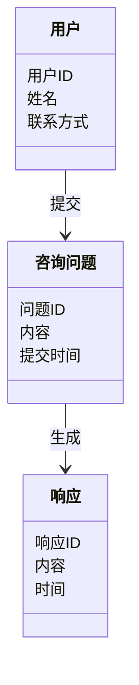
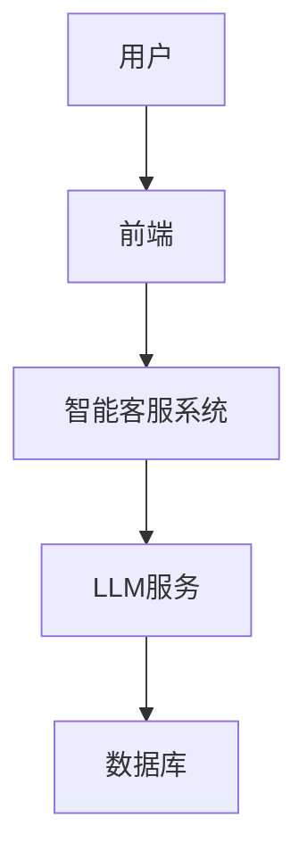

                 


# 第一部分: 大语言模型（LLM）的背景与核心概念

# 第1章: 大语言模型（LLM）概述

## 1.1 什么是大语言模型
### 1.1.1 大语言模型的定义
大语言模型（Large Language Model, LLM）是一种基于深度学习的自然语言处理模型，旨在理解和生成人类语言。这些模型通常基于Transformer架构，通过大量文本数据进行预训练，能够执行多种NLP任务，如文本生成、机器翻译、问答系统等。

### 1.1.2 大语言模型的核心特点
- **大规模训练数据**：LLM通常使用数百万或数十亿的文本样本进行训练。
- **自注意力机制**：通过自注意力机制，模型能够捕捉文本中的长距离依赖关系。
- **多任务学习能力**：LLM可以在多种任务上进行微调，适应不同的应用场景。
- **生成能力**：模型能够生成连贯且有意义的文本。

### 1.1.3 大语言模型与传统NLP模型的区别
传统的NLP模型通常针对特定任务进行训练，如支持向量机（SVM）用于文本分类，而大语言模型通过预训练可以适应多种任务，减少对特定任务数据的依赖。

## 1.2 大语言模型的发展历程
### 1.2.1 从GPT到GPT-3的演进
- **GPT-1**：2018年，OpenAI发布GPT-1，引入了自注意力机制。
- **GPT-2**：2019年，GPT-2通过更大的模型参数和更多的训练数据，显著提升了生成能力。
- **GPT-3**：2020年，GPT-3拥有1750亿个参数，能够执行复杂的语言任务。

### 1.2.2 大语言模型的训练方法
- **预训练**：在大规模通用数据集上进行无监督学习。
- **微调**：针对特定任务，在标注数据上进行有监督学习。
- **提示调优（Prompt Tuning）**：通过调整提示来影响模型的输出，而不需要重新训练模型。

### 1.2.3 大语言模型的应用场景
- **文本生成**：用于内容创作、代码生成等。
- **问答系统**：提供智能客服、自动问答服务。
- **机器翻译**：实现多种语言之间的翻译。
- **情感分析**：分析文本的情感倾向。

## 1.3 大语言模型在企业级应用中的潜力
### 1.3.1 企业级应用的定义与特点
企业级应用是指在企业内部或面向企业客户的系统，通常涉及复杂业务流程和高可用性要求。

### 1.3.2 大语言模型在企业中的应用场景
- **智能客服**：通过LLM提供更智能的客服响应。
- **文档处理**：自动生成、总结和分析文档。
- **业务流程自动化**：通过自然语言指令自动化处理业务流程。

### 1.3.3 企业级大语言模型的优势与挑战
- **优势**：提高效率、降低成本、增强用户体验。
- **挑战**：数据隐私、模型计算资源需求、模型的可解释性。

# 第2章: 大语言模型的核心概念与原理

## 2.1 大语言模型的数学基础
### 2.1.1 语言模型的基本原理
语言模型通过概率分布来预测下一个词，通常使用交叉熵损失函数进行优化。

公式：
$$
\text{损失} = -\sum_{i=1}^{n} \log P(w_i | w_{i-1}, ..., w_1)
$$

### 2.1.2 概率论与信息论基础
- **条件概率**：$P(w_i | w_{i-1}, ..., w_1)$
- **熵**：衡量数据的不确定性。

### 2.1.3 深度学习的基本概念
- **神经网络**：由层组成，用于学习数据的特征表示。
- **训练目标**：最小化损失函数。

## 2.2 大语言模型的训练过程
### 2.2.1 预训练任务的定义
预训练任务通常包括：
- **掩码语言模型**：随机遮蔽部分词，预测被遮蔽的词。
- **下文改写任务**：预测下一个词或句子。

### 2.2.2 生成任务的实现
生成任务通常使用解码器结构，通过贪婪搜索或随机采样生成输出。

### 2.2.3 监督学习与无监督学习的结合
- **无监督学习**：在预训练阶段进行。
- **监督学习**：在微调阶段进行，针对特定任务。

## 2.3 大语言模型的评估指标
### 2.3.1 常见的评估指标
- **BLEU**：基于n-gram的精确匹配。
- **ROUGE**：基于召回率的评估。
- **人类评价**：通过人工评估生成文本的质量。

### 2.3.2 BLEU、ROUGE等指标的计算方法
- **BLEU公式**：
$$
\text{BLEU} = \exp\left( r \cdot \log \text{B}_r \right)
$$

### 2.3.3 人类评价与自动评价的结合
通过结合自动评价指标和人工评价，可以更全面地评估生成文本的质量。

# 第3章: 大语言模型的算法原理

## 3.1 变压器（Transformer）模型
### 3.1.1 Transformer模型的结构
Transformer由编码器和解码器组成，编码器负责将输入序列转换为表示，解码器负责生成输出序列。

### 3.1.2 自注意力机制的实现
自注意力机制计算每个词对其他词的注意力权重。

公式：
$$
\text{注意力权重} = \text{softmax}(\frac{QK^T}{\sqrt{d}})
$$

### 3.1.3 前馈网络的结构与作用
每个编码器层包括多头自注意力和前馈网络，用于提取上下文信息。

## 3.2 大语言模型的训练流程
### 3.2.1 数据预处理与特征提取
- **分词**：将文本分割成词或短语。
- **嵌入表示**：将词转换为向量表示。

### 3.2.2 损失函数的定义
交叉熵损失函数用于衡量预测与真实分布的差异。

### 3.2.3 优化算法的选择与实现
- **Adam优化器**：结合动量和自适应学习率。
- **学习率调度**：通常采用余弦退火策略。

## 3.3 大语言模型的推理过程
### 3.3.1 解码器的结构与作用
解码器生成输出序列，通常使用贪婪搜索或采样策略。

### 3.3.2 生成策略的选择
- **贪婪搜索**：逐个生成最可能的词。
- **随机采样**：基于概率分布随机选择词。

### 3.3.3 模型的调优与优化
通过调整温度参数、top-k采样等方法优化生成结果的质量。

# 第4章: 大语言模型的系统架构与设计

## 4.1 企业级应用的系统架构
### 4.1.1 系统架构的定义与特点
企业级系统通常采用分层架构，包括数据层、业务逻辑层和表现层。

### 4.1.2 企业级系统的常见架构模式
- **微服务架构**：各个服务独立开发和部署。
- **单体架构**：适合小型应用，但扩展性较差。

### 4.1.3 大语言模型在企业系统中的集成
将LLM作为服务集成到企业系统中，提供自然语言处理功能。

## 4.2 大语言模型的训练与部署

### 4.2.1 训练环境的选择
- **本地训练**：适合小规模数据和小模型。
- **云服务**：利用云计算资源进行大规模训练。

### 4.2.2 部署策略
- **模型服务化**：将LLM封装成API，供其他系统调用。
- **边缘计算**：在边缘设备上部署轻量级模型。

### 4.2.3 模型更新与维护
定期更新模型，保持其性能和准确性。

# 第5章: 项目实战 - 企业级智能客服系统

## 5.1 项目背景与目标
智能客服系统通过自然语言处理技术，提供24/7的客户支持服务。

## 5.2 系统设计与实现
### 5.2.1 领域模型设计
使用Mermaid绘制领域模型类图，展示主要实体及其关系。



### 5.2.2 系统架构设计
使用Mermaid绘制系统架构图，展示各组件的交互关系。



### 5.2.3 关键接口设计
- **提交问题接口**：用户提交问题到前端。
- **生成响应接口**：前端调用LLM服务生成响应。
- **存储响应接口**：将生成的响应存储到数据库。

### 5.2.4 系统实现
#### 5.2.4.1 环境安装
- 安装Python 3.8+
- 安装必要的库：`transformers`, `torch`

#### 5.2.4.2 核心代码实现
```python
from transformers import GPT2LMHeadModel, GPT2Tokenizer
import torch

tokenizer = GPT2Tokenizer.from_pretrained('gpt2')
model = GPT2LMHeadModel.from_pretrained('gpt2')

def generate_response(prompt):
    inputs = tokenizer.encode(prompt, return_tensors='pt')
    outputs = model.generate(inputs, max_length=100, do_sample=True)
    response = tokenizer.decode(outputs[0], skip_special_tokens=True)
    return response
```

#### 5.2.4.3 系统设计与实现细节
- **前端设计**：用户提交问题，显示生成的响应。
- **后端设计**：接收请求，调用LLM生成响应并返回结果。
- **数据库设计**：存储用户问题和响应，便于后续分析和优化。

#### 5.2.4.4 项目小结
通过项目实战，展示了如何将大语言模型应用于企业级智能客服系统，实现高效的客户支持服务。

## 5.3 最佳实践与经验总结
### 5.3.1 系统设计建议
- **模块化设计**：便于维护和扩展。
- **性能优化**：合理选择模型大小和优化计算资源。

### 5.3.2 模型调优技巧
- **微调模型**：在特定任务数据上进行微调。
- **优化提示**：通过调整提示提高生成结果的质量。

### 5.3.3 部署与维护
- **容器化部署**：使用Docker容器化模型服务，便于部署和管理。
- **监控与日志**：实时监控系统状态，记录日志以便排查问题。

### 5.3.4 安全与隐私
- **数据加密**：保护用户数据安全。
- **访问控制**：限制对模型服务的访问权限。

# 第6章: 最佳实践与注意事项

## 6.1 系统设计与优化
### 6.1.1 系统设计建议
- **模块化设计**：将系统划分为独立的模块，便于维护和扩展。
- **高可用性设计**：确保系统在部分组件故障时仍能正常运行。

### 6.1.2 性能优化技巧
- **缓存机制**：减少重复计算，提高响应速度。
- **并行处理**：利用多线程或多进程提高处理效率。

## 6.2 模型调优与维护
### 6.2.1 模型调优建议
- **微调模型**：在特定领域数据上进行微调，提高模型的性能。
- **优化提示**：通过调整提示格式和内容，引导模型生成更准确的结果。

### 6.2.2 模型维护
- **定期更新**：随着数据的积累和模型技术的发展，定期更新模型。
- **监控模型性能**：持续监控模型的准确性和生成效果，及时发现问题。

## 6.3 部署与维护注意事项
### 6.3.1 部署注意事项
- **资源分配**：合理分配计算资源，确保模型运行顺畅。
- **容错机制**：设计容错机制，减少系统故障对业务的影响。

### 6.3.2 安全与隐私保护
- **数据加密**：对敏感数据进行加密处理，防止数据泄露。
- **访问控制**：通过权限管理，限制对模型服务的访问权限。

## 6.4 拓展阅读与进一步学习
### 6.4.1 拓展阅读
- 《Deep Learning》—— Ian Goodfellow
- 《Effective Python》—— Brett Slatkin
- 《Transformers in Action》—— Peter Mueller

### 6.4.2 进一步学习方向
- **研究最新的模型架构**：如GPT-4、PaLM等。
- **探索大语言模型的伦理与安全问题**：如偏见、滥用等。
- **参与开源项目**：如Hugging Face的Transformers库，贡献代码或文档。

# 第7章: 总结与展望

## 7.1 本章总结
通过本章的学习，我们深入理解了大语言模型的原理、系统架构，并通过项目实战掌握了如何将大语言模型应用于企业级智能客服系统。同时，我们还总结了最佳实践和注意事项，为实际应用提供了宝贵的参考。

## 7.2 未来展望
随着技术的不断发展，大语言模型在企业级应用中的潜力将更加巨大。未来，我们可以期待更高效、更智能的模型出现，为企业带来更大的价值。同时，模型的可解释性、安全性和隐私保护也将成为研究的重要方向。

---

# 文章标题：深入理解LLM大模型：从GPT到企业级应用

## 关键词：大语言模型（LLM）、GPT、企业级应用、自然语言处理、深度学习

## 摘要：
本文深入探讨了大语言模型（LLM）的核心概念、算法原理及其在企业级应用中的实践。通过从GPT系列模型的背景介绍，到模型的数学基础、训练过程，再到系统架构设计和实际项目案例，详细分析了LLM在企业级智能客服系统中的应用。文章还总结了最佳实践和未来展望，为读者提供了全面的视角和实用的指导。

