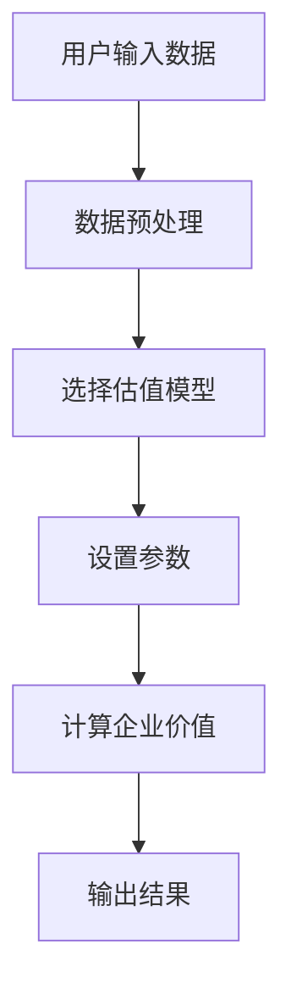
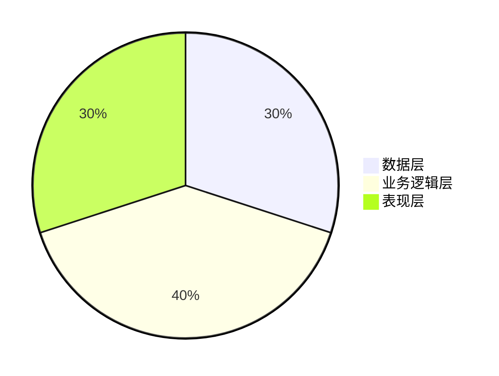
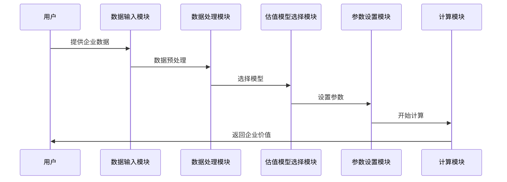

                 


# 第3章: 企业估值的算法原理

## 3.3 现金流预测方法

现金流预测是DCF模型的关键步骤，准确的预测能够显著提高估值的准确性。常用的现金流预测方法包括历史数据分析法、行业趋势分析法和财务模型预测法。

### 3.3.1 历史数据分析法
通过分析企业过去几年的现金流数据，识别出现金流的增长趋势和周期性变化，从而预测未来的现金流。这种方法适用于现金流数据稳定且易于预测的企业。

### 3.3.2 行业趋势分析法
结合行业整体发展趋势，预测企业未来的现金流。例如，在技术进步迅速的行业，企业可能需要更高的研发支出，从而影响现金流。

### 3.3.3 财务模型预测法
通过构建财务模型，假设未来的收入增长率、利润率和资本支出等参数，预测未来的现金流。这种方法需要对企业的财务状况有深入了解。

## 3.4 相对估值法

相对估值法是通过比较可比公司的估值指标来确定目标公司的价值。这种方法适用于难以直接预测现金流的情况。

### 3.4.1 EV/EBITDA法
计算企业价值与息税折旧及摊销前利润（EBITDA）的比率，从而估计企业的估值。

### 3.4.2 EV/Revenue法
计算企业价值与收入的比率，适用于高增长企业，因为收入增长率是关键因素。

## 3.5 现金流折现模型（DCF模型）的代码实现

下面是一个简单的DCF模型代码示例，用于计算企业价值：

```python
def calculate_discounted_cash_flows(future_cash_flows, discount_rate, horizon):
    # 计算未来现金流的现值
    present_value = 0
    for year in range(1, horizon + 1):
        present_value += future_cash_flows[year] / (1 + discount_rate) ** year
    return present_value

def calculate_terminal_value(growth_rate, discount_rate, horizon_cash_flow):
    # 计算终值
    terminal_value = horizon_cash_flow * (1 + growth_rate) / (discount_rate - growth_rate)
    return terminal_value

def calculate_enterprise_value(future_cash_flows, discount_rate, horizon, terminal_growth_rate):
    # 计算企业价值
    ev = 0
    for year in range(1, horizon + 1):
        ev += future_cash_flows[year] / (1 + discount_rate) ** year
    terminal_value = calculate_terminal_value(terminal_growth_rate, discount_rate, future_cash_flows[horizon + 1])
    ev += terminal_value / (1 + discount_rate) ** horizon
    return ev

# 示例：假设未来5年的现金流和第6年的现金流作为终值起点
future_cash_flows = {
    1: 100,
    2: 120,
    3: 140,
    4: 160,
    5: 180,
    6: 200
}

discount_rate = 0.1  # 10%
terminal_growth_rate = 0.02  # 2%
horizon = 5

enterprise_value = calculate_enterprise_value(future_cash_flows, discount_rate, horizon, terminal_growth_rate)
print("企业价值：", enterprise_value)
```

## 3.6 算法原理的数学模型与公式

以下是DCF模型的数学公式：

$$
\text{企业价值} = \sum_{t=1}^{n} \frac{\text{现金流}_t}{(1+r)^t} + \frac{\text{终值}}{(1+r)^n}
$$

其中：
- $\text{现金流}_t$ 是第t年的现金流
- $r$ 是折现率
- $n$ 是预测期
- 终值是预测期后的终值，假设永续增长率 $g$

## 3.7 DCF模型的优缺点

### 优点：
1. 能够反映企业的内在价值
2. 考虑了时间价值和风险因素
3. 可以用于不同行业的企业估值

### 缺点：
1. 需要预测未来现金流，具有较高的主观性
2. 对折现率的选择敏感
3. 适用于稳定增长的企业，对周期性企业效果较差

# 第4章: 企业估值的系统分析与架构设计方案

## 4.1 企业估值系统功能设计

### 4.1.1 系统功能模块
- 数据输入与处理模块
- 估值模型选择模块
- 参数设置与调整模块
- 结果输出与可视化模块

### 4.1.2 功能流程图（Mermaid）



## 4.2 系统架构设计

### 4.2.1 架构选择
采用分层架构，包括数据层、业务逻辑层和表现层。

### 4.2.2 系统架构图（Mermaid）



## 4.3 系统接口设计

### 4.3.1 接口描述
- 数据输入接口：接收企业财务数据和市场数据
- 模型调用接口：调用不同估值模型
- 结果输出接口：显示估值结果

## 4.4 系统交互设计

### 4.4.1 交互流程图（Mermaid）



# 第5章: 企业估值的项目实战

## 5.1 项目背景与目标

选择一家典型企业（例如，苹果公司）进行估值，应用DCF模型和相对估值法进行对比分析。

## 5.2 项目环境与工具

- 数据来源：财务报表、行业报告
- 工具：Excel、Python（Pandas, NumPy）
- 环境：Windows或Linux系统

## 5.3 核心代码实现

### 5.3.1 数据处理代码

```python
import pandas as pd

# 加载财务数据
df = pd.read_csv('apple_finance.csv')
print(df.head())
```

### 5.3.2 DCF模型实现

```python
def calculate_dcfvaluation(fcf, wacc, horizon=5, growth=0):
    terminal_value = fcf[horizon] * (1 + growth) / (wacc - growth)
    enterprise_value = sum(fcf[i] / (1 + wacc) ** i for i in range(1, horizon + 1)) + terminal_value / (1 + wacc) ** horizon
    return enterprise_value

# 示例数据
fcf = [100, 120, 140, 160, 180, 200]
wacc = 0.1
growth = 0.02
print("企业价值：", calculate_dcfvaluation(fcf, wacc, 5, growth))
```

## 5.4 案例分析与结果解读

通过实际数据计算，得出企业的估值结果，并与市场价进行对比，分析模型的准确性和适用性。

## 5.5 项目小结

总结项目实施过程中的经验和教训，提出改进建议。

# 第6章: 企业估值的总结与最佳实践

## 6.1 总结

企业估值是投资决策的重要环节，合理应用各种方法和工具能够提高估值的准确性。

## 6.2 最佳实践

1. 选择合适的方法：根据企业特点选择DCF模型或相对估值法
2. 数据准确性：确保数据来源可靠
3. 模型调整：根据实际情况调整参数
4. 多模型对比：结合多种方法验证结果

## 6.3 注意事项

- 避免过度依赖单一模型
- 定期更新数据和参数
- 考虑宏观经济因素的影响

## 6.4 案例分析与小结

通过具体案例分析，总结企业估值的关键点和注意事项。

## 6.5 进一步阅读与拓展

推荐相关书籍和文献，鼓励读者深入学习。

---

通过以上内容，读者可以系统地理解企业估值的计算公式、应用场景和实际操作方法，掌握企业估值的核心技术和实践技巧。

