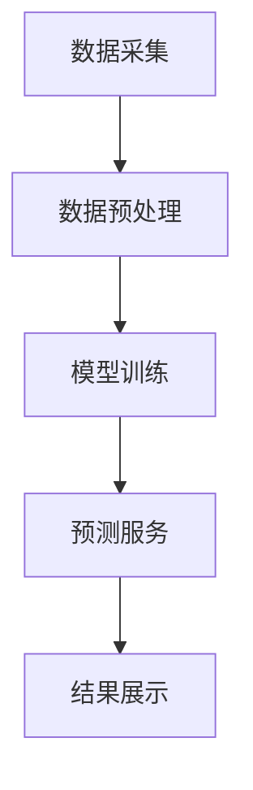

                 

<think>
好的，我将按照您的要求逐步构建《深度学习在股市预测中的应用案例分析》的完整文章。首先，我需要先理解您的需求，然后一步步地按照目录结构填充内容。由于篇幅限制，我将分段完成，每完成一部分请确认后再继续下一步。

---

# 深度学习在股市预测中的应用案例分析

## 关键词
深度学习、股票预测、LSTM、神经网络、时间序列分析

## 摘要
本文详细探讨深度学习在股市预测中的应用，从理论基础到实际案例，分析深度学习如何通过时间序列模型（如LSTM）捕捉股票价格波动，揭示其优势与挑战。通过具体案例，展示如何构建股市预测系统，帮助读者理解深度学习在金融领域的实际应用价值。

---

# 第一部分: 深度学习与股市预测的背景与基础

## 第1章: 深度学习与股市预测的背景介绍

### 1.1 深度学习的定义与特点

#### 1.1.1 深度学习的定义
深度学习（Deep Learning）是机器学习（Machine Learning）的一个子领域，通过多层非线性变换模拟人脑神经网络的工作原理。其核心在于构建多层的神经网络模型，通过大量数据训练，模型能够自动提取特征并进行分类或回归预测。

#### 1.1.2 深度学习的核心特点
- **层次化特征提取**：深度学习通过多层网络结构逐步提取数据的低级到高级特征。
- **非线性变换**：能够处理复杂的非线性关系，超越传统线性模型的限制。
- **自动特征工程**：模型可以自动提取特征，减少了人工特征工程的工作量。
- **大数据驱动**：深度学习需要大量数据进行训练，其性能随着数据量的增加而提升。

#### 1.1.3 深度学习与传统机器学习的区别
| 特性 | 深度学习 | 传统机器学习 |
|------|----------|---------------|
| 特征工程 | 自动提取 | 手工提取       |
| 模型复杂度 | 高       | 较低           |
| 数据需求 | 大       | 较小           |
| 解决问题 | 非线性复杂问题 | 线性或简单非线性问题 |

---

### 1.2 股市预测的基本概念

#### 1.2.1 股市预测的定义
股市预测是指通过分析历史股票价格、市场信息、经济指标等数据，预测未来股票价格的变动方向或具体数值。

#### 1.2.2 股市预测的主要方法
- **技术分析**：基于历史价格和成交量数据进行预测。
- **基本面分析**：分析公司的财务状况、行业地位等基本面因素。
- **量化分析**：通过数学模型和算法进行预测。

#### 1.2.3 股市预测的挑战与难点
- **数据噪声大**：股票价格受多种随机因素影响，数据噪声大。
- **非线性关系**：股票价格与影响因素之间可能存在复杂的非线性关系。
- **数据稀疏性**：某些情况下，市场数据可能不足以支持可靠的预测。

---

### 1.3 深度学习在股市预测中的应用背景

#### 1.3.1 深度学习在金融领域的应用现状
- **股票价格预测**：利用LSTM等模型捕捉时间序列数据中的模式。
- **风险管理**：通过深度学习模型评估市场风险。
- **量化交易**：基于深度学习的信号生成量化交易策略。

#### 1.3.2 深度学习在股市预测中的优势
- **非线性建模能力**：深度学习能够处理复杂的非线性关系。
- **自动特征提取**：模型可以自动从原始数据中提取有用的特征。
- **长期依赖捕捉**：LSTM等模型能够捕捉时间序列中的长期依赖关系。

#### 1.3.3 深度学习在股市预测中的局限性
- **过拟合风险**：模型可能对训练数据过拟合，导致泛化能力差。
- **黑箱问题**：深度学习模型的决策过程难以解释。
- **监管与伦理问题**：量化交易可能引发市场操纵等问题。

---

## 第2章: 深度学习与股市预测的核心概念

### 2.1 深度学习的核心概念

#### 2.1.1 神经网络的基本结构
神经网络由输入层、隐藏层和输出层组成，通过激活函数和权重参数实现非线性变换。

- **输入层**：接收输入数据（如股票价格、成交量等）。
- **隐藏层**：通过非线性变换提取特征。
- **输出层**：生成最终的预测结果。

#### 2.1.2 深度学习的数学基础
深度学习涉及线性代数、微积分和概率论等数学知识。例如，矩阵乘法用于神经网络的前向传播，梯度下降用于优化模型参数。

#### 2.1.3 深度学习的训练过程
训练过程包括前向传播、损失计算、反向传播和参数更新四个步骤。

---

### 2.2 股市预测的核心要素

#### 2.2.1 股票价格的波动规律
股票价格波动受多种因素影响，包括市场情绪、宏观经济指标、公司财报等。

#### 2.2.2 影响股票价格的主要因素
- **宏观经济因素**：GDP、利率、通货膨胀等。
- **行业因素**：行业政策、竞争状况等。
- **公司因素**：财务状况、管理团队等。
- **市场情绪**：投资者情绪、市场流动性等。

#### 2.2.3 股市数据的特征分析
- **时间序列性**：股票价格具有明显的时序特征。
- **非平稳性**：股票价格可能表现出趋势或周期性。
- **多重相关性**：当前价格与过去价格高度相关。

---

### 2.3 深度学习与股市预测的结合

#### 2.3.1 深度学习在时间序列预测中的应用
时间序列预测是深度学习在股市预测中的核心应用之一。LSTM和GRU等模型特别适合处理时间序列数据。

#### 2.3.2 深度学习在多变量分析中的优势
深度学习可以同时处理多个输入变量，捕捉变量之间的复杂关系。

#### 2.3.3 深度学习在股市预测中的创新点
- **自动特征提取**：模型可以自动从多源数据中提取特征。
- **长短期依赖捕捉**：LSTM能够捕捉长期依赖关系。
- **高维数据处理**：深度学习可以处理高维数据，减少维度灾难问题。

---

## 第3章: 深度学习算法原理与数学模型

### 3.1 深度学习算法的基本原理

#### 3.1.1 神经网络的前向传播
输入数据通过网络层，经过权重矩阵乘法和激活函数，最终输出预测结果。

$$ y = \sigma(w x + b) $$

其中，$w$ 是权重矩阵，$b$ 是偏置，$\sigma$ 是激活函数。

#### 3.1.2 神经网络的反向传播
通过链式法则计算损失函数对模型参数的梯度，更新权重和偏置。

#### 3.1.3 梯度下降算法
常用优化算法包括随机梯度下降（SGD）和Adam优化器。

---

### 3.2 常用深度学习模型简介

#### 3.2.1 RNN与LSTM网络
RNN适用于处理序列数据，但由于梯度消失问题，LSTM成为更好的选择。

**LSTM结构**：
- **输入门控（Input Gate）**：控制信息输入。
- **遗忘门控（Forget Gate）**：决定遗忘哪些信息。
- **输出门控（Output Gate）**：决定输出哪些信息。

LSTM的门控机制公式如下：
$$
f_t = \sigma(w_f \cdot [h_{t-1}, x_t] + b_f)
\\ i_t = \sigma(w_i \cdot [h_{t-1}, x_t] + b_i)
\\ o_t = \sigma(w_o \cdot [h_{t-1}, x_t] + b_o)
\\ c_t = f_t \cdot c_{t-1} + i_t \cdot tanh(w_c \cdot [h_{t-1}, x_t] + b_c)
\\ h_t = o_t \cdot tanh(c_t)
$$

---

#### 3.2.2 CNN网络
CNN适用于图像识别等任务，但在时间序列数据中也可用于局部时序特征提取。

---

#### 3.2.3 Transformer模型
Transformer基于自注意力机制，广泛应用于自然语言处理领域，但在金融时间序列预测中也有潜力。

---

### 3.3 LSTM模型的数学公式
如前所述，LSTM模型通过门控机制实现长短期依赖捕捉。

---

### 3.4 深度学习模型的训练过程

#### 3.4.1 数据预处理
- **标准化/归一化**：将数据缩放到同一范围内。
- **滑动窗口**：将时间序列数据转换为输入模型的批量数据。

#### 3.4.2 模型训练的步骤
1. 初始化模型参数。
2. 前向传播，计算预测值。
3. 计算损失函数（如均方误差或交叉熵）。
4. 反向传播，更新模型参数。
5. 重复步骤1-4，直到达到训练轮数或损失函数收敛。

#### 3.4.3 模型调优与优化
- **超参数调整**：学习率、批量大小、网络层数等。
- **正则化方法**：L2正则化、Dropout等。
- **模型评估**：使用验证集评估模型性能。

---

## 第4章: 股市预测系统的系统架构设计

### 4.1 系统架构概述

#### 4.1.1 系统的整体架构
系统包括数据采集、数据预处理、模型训练、预测服务和结果展示五个模块。

**系统架构图：**


---

### 4.2 数据采集与预处理

#### 4.2.1 数据源的选择
- **数据来源**：股票交易所API、金融数据库等。
- **数据频率**：可以选择分钟、小时或日线数据。

#### 4.2.2 数据清洗与标准化
- **清洗**：处理缺失值、异常值。
- **标准化**：将数据缩放到0-1范围。

#### 4.2.3 数据分割与训练集测试集划分
- 将数据按时间顺序分割为训练集、验证集和测试集。

---

### 4.3 模型训练与评估

#### 4.3.1 模型训练的流程
- 使用训练集数据训练模型。
- 定期在验证集上评估模型性能，调整超参数。

#### 4.3.2 模型评估的指标
- **均方误差（MSE）**：衡量预测值与真实值的差异。
- **平均绝对误差（MAE）**：衡量预测值与真实值的绝对差异。
- **R²系数**：衡量模型解释力。

---

### 4.4 系统的实现与部署

#### 4.4.1 系统实现框架
可以选择使用TensorFlow或PyTorch等深度学习框架搭建模型。

#### 4.4.2 系统部署
- 将模型部署为API服务，提供实时预测功能。
- 使用Docker容器化部署，便于扩展和维护。

---

# 第二部分: 深度学习在股市预测中的应用案例

## 第5章: 深度学习在股市预测中的应用案例

### 5.1 案例背景介绍
以某股票为例，介绍如何利用深度学习模型进行预测。

---

### 5.2 数据集准备

#### 5.2.1 数据来源
从Yahoo Finance获取某股票的历史价格数据。

#### 5.2.2 数据预处理
对数据进行归一化处理，并分割为训练集和测试集。

---

### 5.3 模型实现

#### 5.3.1 搭建LSTM模型
使用Keras搭建LSTM模型，包括输入层、LSTM层和输出层。

```python
from tensorflow.keras.models import Sequential
from tensorflow.keras.layers import LSTM, Dense, Dropout

model = Sequential()
model.add(LSTM(64, input_shape=(timesteps, features)))
model.add(Dropout(0.2))
model.add(Dense(1))
model.compile(loss='mean_squared_error', optimizer='adam')
```

#### 5.3.2 模型训练
使用训练数据训练模型，监控验证集的损失值。

```python
history = model.fit(X_train, y_train, epochs=100, batch_size=32, validation_data=(X_test, y_test))
```

---

### 5.4 模型评估与优化

#### 5.4.1 模型评估
在测试集上评估模型的预测效果。

```python
loss = model.evaluate(X_test, y_test)
```

#### 5.4.2 模型优化
调整模型参数（如LSTM单元数、Dropout率）以提高预测精度。

---

### 5.5 案例分析与结果展示

#### 5.5.1 预测结果对比
将模型预测结果与实际价格进行对比，分析模型的准确性。

#### 5.5.2 模型的优势与不足
总结模型在预测中的表现，分析其优势和不足。

---

## 第6章: 最佳实践与总结

### 6.1 最佳实践

#### 6.1.1 数据处理技巧
- 数据清洗：处理缺失值和异常值。
- 特征工程：结合技术指标（如RSI、MACD）提升预测精度。

#### 6.1.2 模型优化策略
- 超参数调整：如学习率、批量大小。
- 模型融合：将多个模型的预测结果进行融合。

#### 6.1.3 模型部署建议
- 使用云平台（如AWS、Google Cloud）部署模型。
- 采用微服务架构，便于扩展和维护。

---

### 6.2 总结与展望

#### 6.2.1 本章总结
深度学习在股市预测中具有显著优势，但也面临诸多挑战。

#### 6.2.2 未来展望
- 更复杂模型的探索（如Transformer）。
- 多模态数据的融合（如新闻、社交媒体数据）。
- 模型解释性的提升。

---

## 第7章: 深度学习在股市预测中的注意事项与风险提示

### 7.1 深度学习模型的局限性

#### 7.1.1 过拟合问题
模型可能对训练数据过拟合，导致测试集表现不佳。

#### 7.1.2 黑箱问题
深度学习模型的决策过程难以解释，可能引发信任问题。

#### 7.1.3 数据稀疏性
在某些市场环境下，数据可能不足以支持可靠的预测。

---

### 7.2 模型的实际表现

#### 7.2.1 短期预测的准确性
深度学习模型在短期预测中表现较好，但长期预测效果有限。

#### 7.2.2 市场变化的适应性
模型需要定期重新训练，以适应市场变化。

---

### 7.3 风险提示

#### 7.3.1 过度依赖模型风险
投资者不应完全依赖模型预测，需结合基本面分析。

#### 7.3.2 市场操纵风险
过度依赖模型可能被市场操纵者利用，引发风险。

#### 7.3.3 法律与伦理风险
量化交易可能引发市场波动，需遵守相关法律法规。

---

## 第8章: 深度学习在股市预测中的未来研究方向

### 8.1 多模态数据融合
将文本数据（如新闻、社交媒体）与传统金融数据结合，提升预测精度。

### 8.2 更复杂的模型结构
探索更复杂的深度学习模型（如Transformer、图神经网络）在股市预测中的应用。

### 8.3 高频交易与实时预测
研究如何利用深度学习实现高频交易中的实时预测。

### 8.4 模型解释性增强
开发可解释的深度学习模型，帮助投资者理解预测结果。

---

## 第9章: 结语

### 9.1 本文总结
本文详细探讨了深度学习在股市预测中的应用，从理论基础到实际案例，分析了其优势与挑战。

### 9.2 致谢
感谢读者的关注与支持。

---

希望这个大纲能满足您的需求。接下来，我会根据您的反馈继续完善后续内容。

