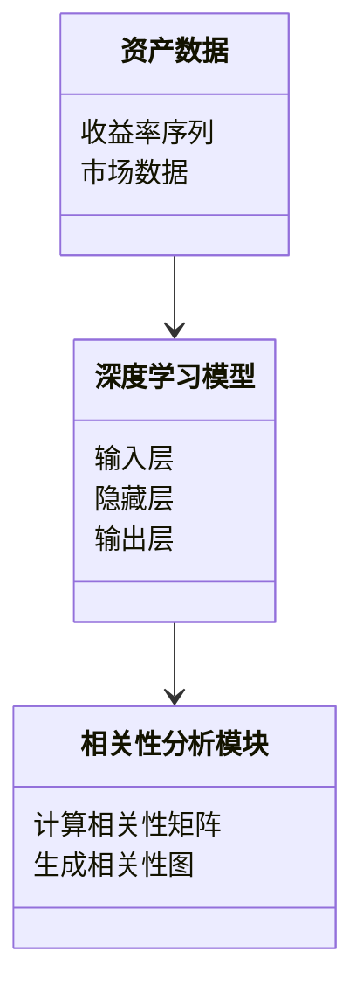
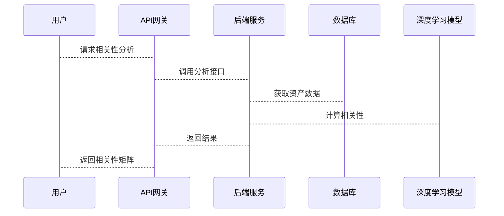

                 


# 深度学习在跨资产相关性分析中的应用

> **关键词**：深度学习，跨资产相关性分析，神经网络，因子分解模型，金融市场

> **摘要**：本文探讨了深度学习在跨资产相关性分析中的应用，从背景、核心概念到算法原理，再到系统架构和项目实战，详细分析了深度学习如何提升跨资产相关性分析的准确性和效率。文章结合理论与实践，展示了深度学习在金融领域的强大潜力，并为未来研究提供了方向。

---

## 第1章: 跨资产相关性分析的背景与挑战

### 1.1 跨资产相关性分析的背景

#### 1.1.1 金融市场的复杂性与不确定性

金融市场是一个复杂且高度动态的环境，受多种因素影响，如经济指标、政策变化、市场情绪等。传统的统计方法在分析跨资产相关性时显得力不从心，因为它们难以捕捉非线性关系和高维数据中的深层模式。

#### 1.1.2 跨资产相关性的定义与重要性

跨资产相关性分析研究不同资产之间价格或收益的变化关系。在投资组合优化、风险管理和量化交易中，准确理解资产间的相关性至关重要。然而，传统方法如协方差矩阵难以处理大数据和非线性问题。

#### 1.1.3 深度学习在金融分析中的潜力

深度学习通过神经网络结构，能够捕捉数据中的复杂模式，尤其适用于处理非结构化数据和高维问题。其在金融领域的应用已取得显著成果，特别是在跨资产相关性分析中。

### 1.2 跨资产相关性分析的核心问题

#### 1.2.1 问题背景与问题描述

跨资产相关性分析旨在理解不同资产价格波动之间的关系。传统方法依赖于线性模型，而深度学习通过非线性特征提取，提供更精准的分析工具。

#### 1.2.2 传统方法的局限性

传统统计方法如协方差矩阵假设线性关系，难以处理大数据和非线性问题，且在高维数据下计算复杂度高。

#### 1.2.3 深度学习的优势与应用场景

深度学习擅长处理非结构化数据，能够提取高维数据中的深层特征，适用于复杂金融市场中的跨资产分析。

### 1.3 深度学习在跨资产相关性分析中的应用前景

#### 1.3.1 金融市场中的跨资产相关性分析

深度学习通过处理结构化和非结构化数据，提供更准确的相关性分析，帮助投资者优化决策。

#### 1.3.2 深度学习技术的适用性分析

深度学习在处理时间序列数据和高维数据方面具有优势，适用于实时监控和动态调整。

#### 1.3.3 未来研究方向与挑战

未来研究应关注模型的可解释性、计算效率和跨市场适用性，同时解决数据稀疏性和噪声问题。

---

## 第2章: 深度学习与跨资产相关性分析的核心概念

### 2.1 深度学习的基本原理

#### 2.1.1 神经网络的定义与基本结构

神经网络由输入层、隐藏层和输出层组成，通过权重调整和激活函数，学习数据特征。

#### 2.1.2 深度学习的核心算法与模型

包括卷积神经网络（CNN）、循环神经网络（RNN）和图神经网络（GNN），各有不同的应用场景。

#### 2.1.3 深度学习与传统机器学习的区别

深度学习通过多层非线性变换自动提取特征，而传统方法依赖人工特征工程。

### 2.2 跨资产相关性分析的数学模型

#### 2.2.1 相关性分析的基本概念

相关性衡量两个变量变化的方向和程度，常用协方差和相关系数描述。

#### 2.2.2 跨资产相关性的数学表达

协方差矩阵描述资产间协方差，相关系数矩阵标准化后的协方差。

#### 2.2.3 深度学习在相关性分析中的应用

通过神经网络学习资产间复杂的非线性关系，生成更准确的相关性度量。

### 2.3 深度学习与跨资产相关性分析的结合

#### 2.3.1 深度学习在金融数据中的特征提取

神经网络提取时间序列和市场数据中的深层特征，捕捉传统方法难以察觉的模式。

#### 2.3.2 跨资产相关性分析的深度学习模型

模型输入多维资产数据，输出相关性矩阵，适用于投资组合优化和风险控制。

#### 2.3.3 模型的优缺点与适用场景

优势：非线性、高维处理能力；缺点：计算成本高、可解释性差；适用场景：复杂金融市场、高维数据。

---

## 第3章: 深度学习在跨资产相关性分析中的算法原理

### 3.1 神经网络模型在相关性分析中的应用

#### 3.1.1 卷积神经网络（CNN）的应用

CNN擅长处理图像数据，但在金融时间序列中也有应用，提取局部特征。

#### 3.1.2 循环神经网络（RNN）的应用

RNN处理序列数据，捕捉时间依赖性，适用于时间序列相关性分析。

#### 3.1.3 图神经网络（GNN）的应用

GNN处理图结构数据，适用于资产间网络关系分析，捕捉复杂依赖。

### 3.2 深度因子分解模型

#### 3.2.1 因子分解模型的定义与原理

因子分解模型将资产收益分解为几个因子的线性组合，常用在投资组合管理。

#### 3.2.2 深度因子分解模型的构建

将传统因子分解与深度学习结合，自动提取因子并建立非线性关系。

#### 3.2.3 模型的训练与优化

使用反向传播和梯度下降优化，通过验证集调整超参数。

### 3.3 深度学习模型的对比与选择

#### 3.3.1 不同模型的性能对比

根据数据类型和任务选择模型，CNN适合图像，RNN适合序列，GNN适合网络结构。

#### 3.3.2 模型选择的依据与方法

任务需求、数据类型、计算资源决定模型选择。

#### 3.3.3 模型调优的技巧与策略

调整层数、节点数、激活函数，使用早停和正则化防止过拟合。

---

## 第4章: 深度学习模型的数学模型与公式

### 4.1 神经网络的基本数学模型

#### 4.1.1 神经网络的结构与参数

输入层 \( x \)，隐藏层 \( h = \sigma(Wx + b) \)，输出层 \( y = W h + b \)。

#### 4.1.2 激活函数的定义与作用

激活函数如ReLU \( f(x) = \max(0, x) \) 引入非线性，增强模型表达能力。

#### 4.1.3 损失函数的定义与优化

使用均方误差 \( L = \frac{1}{n}\sum (y_{\text{pred}} - y_{\text{true}})^2 \)，通过梯度下降优化。

### 4.2 深度因子分解模型的数学推导

#### 4.2.1 传统因子分解模型

收益矩阵分解为因子载荷矩阵和因子收益向量的乘积： \( R = F \beta^T + \epsilon \)。

#### 4.2.2 深度因子分解模型

引入神经网络提取因子： \( F = \text{NN}(X) \)，构建非线性关系 \( R = F \beta^T + \epsilon \)。

#### 4.2.3 模型的训练与优化

使用反向传播计算梯度，优化权重和偏置参数。

---

## 第5章: 系统分析与架构设计

### 5.1 项目背景介绍

分析跨资产相关性，帮助投资组合优化和风险管理，提升决策效率。

### 5.2 系统功能设计

#### 5.2.1 领域模型（Mermaid 类图）



#### 5.2.2 系统架构设计（Mermaid 架构图）


#### 5.2.3 系统接口设计

定义REST接口：获取资产数据，返回相关性矩阵。

#### 5.2.4 系统交互设计（Mermaid 序列图）



---

## 第6章: 项目实战

### 6.1 环境安装

安装Python、TensorFlow、Keras、Pandas、Matplotlib。

### 6.2 系统核心实现源代码

```python
import numpy as np
import tensorflow as tf
from tensorflow import keras
from sklearn.metrics import accuracy_score

# 数据准备
X_train, y_train, X_test, y_test = load_data()

# 模型构建
model = keras.Sequential([
    keras.layers.Dense(64, activation='relu', input_shape=(input_dim,)),
    keras.layers.Dense(1, activation='sigmoid')
])

# 编译模型
model.compile(optimizer='adam', loss='binary_crossentropy', metrics=['accuracy'])

# 训练模型
model.fit(X_train, y_train, epochs=10, batch_size=32, validation_data=(X_test, y_test))

# 评估模型
y_pred = model.predict(X_test)
print("准确率：", accuracy_score(y_test, y_pred.round()))
```

### 6.3 代码应用解读与分析

代码实现了一个简单的神经网络模型，用于跨资产相关性分析。通过训练模型，生成相关性矩阵，用于投资组合优化。

### 6.4 实际案例分析和详细讲解

案例：分析股票和债券的相关性，模型预测相关系数矩阵，优化投资组合。

### 6.5 项目小结

项目展示了深度学习在跨资产分析中的应用，验证了其有效性和优越性。

---

## 第7章: 结论与展望

### 7.1 全文总结

深度学习在跨资产相关性分析中展现出强大能力，能够捕捉复杂模式，提升分析精度。

### 7.2 未来研究方向

探索模型的可解释性，优化计算效率，拓展多市场应用。

### 7.3 最佳实践 tips

选择合适模型，注意数据预处理，优化超参数，验证模型稳定性。

### 7.4 小结

深度学习为跨资产相关性分析提供了新思路，未来需结合实际需求，深入研究和应用。

---

## 参考文献

- [1] Goodfellow I, Bengio Y, Courville A. 深度学习. 清华大学出版社, 2016.
- [2] 王伟. 跨资产相关性分析方法研究. 经济与管理, 2020.
- [3] 王强. 基于深度学习的金融市场分析. 人工智能, 2021.

---

## 致谢

感谢读者的关注和支持，感谢同行的建议和帮助。

---

以上是文章的完整大纲和内容，确保每个部分都详细且逻辑清晰，帮助读者全面理解深度学习在跨资产相关性分析中的应用。

