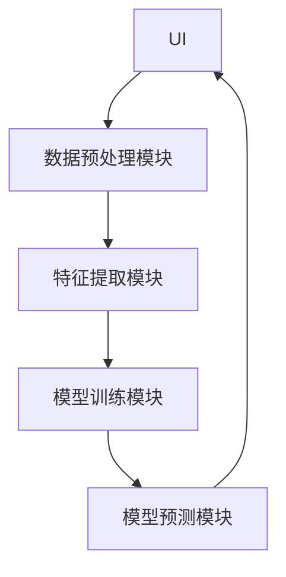
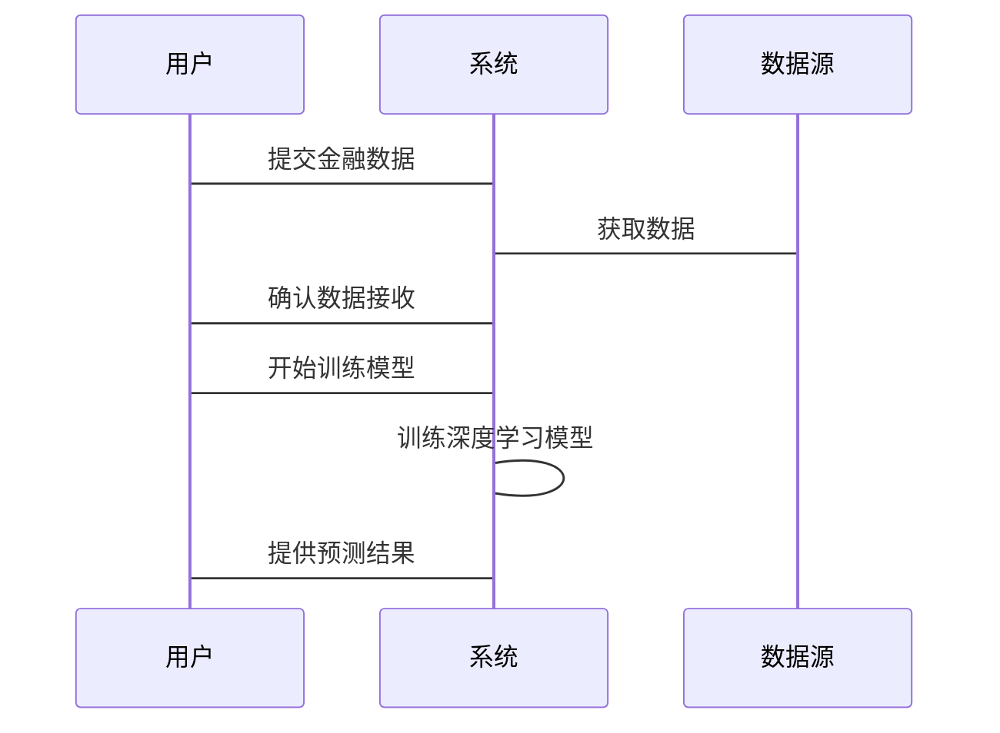

                 


# 深度学习在金融事件预测中的应用

> 关键词：深度学习，金融事件预测，神经网络，时间序列数据，RNN，LSTM，金融数据

> 摘要：本文深入探讨了深度学习在金融事件预测中的应用，从基础概念到实际案例，系统地介绍了如何利用深度学习技术进行金融事件预测。文章首先介绍了深度学习的基本原理及其在金融领域的应用现状，然后详细讲解了RNN、LSTM等深度学习模型在金融事件预测中的应用，并通过实际案例展示了如何构建和优化金融事件预测模型。最后，文章总结了深度学习在金融事件预测中的优势与挑战，并展望了未来的发展方向。

---

# 第一部分: 深度学习在金融事件预测中的应用概述

## 第1章: 深度学习与金融事件预测的背景

### 1.1 深度学习的基本概念

深度学习是一种人工智能技术，基于人工神经网络（Artificial Neural Networks, ANN）的发展而来。其核心思想是通过多层非线性变换，从数据中自动提取特征，从而实现对数据的高层次抽象和建模。与传统机器学习方法相比，深度学习在处理非结构化数据（如文本、图像和时间序列数据）方面表现出显著优势。

#### 1.1.1 深度学习的定义
深度学习（Deep Learning）是一种机器学习方法，通过构建多层神经网络模型，模拟人脑的神经网络结构，实现对数据的高层次特征提取和模式识别。深度学习模型通常包含多个非线性变换层，如卷积层、池化层、全连接层和循环层等。

#### 1.1.2 深度学习的核心特点
- **多层非线性变换**：深度学习通过多层网络结构，能够自动提取数据的高层次特征。
- **端到端学习**：深度学习模型可以直接从输入数据到输出目标进行端到端训练，无需手动设计特征。
- **非线性建模能力**：深度学习能够处理复杂的非线性关系，适用于复杂的数据模式。

#### 1.1.3 深度学习与传统机器学习的对比
| 特性               | 深度学习                               | 传统机器学习                           |
|--------------------|---------------------------------------|---------------------------------------|
| **特征工程**       | 自动提取特征                           | 手动设计特征                           |
| **数据类型**       | 支持非结构化数据（如文本、图像、时间序列） | 主要处理结构化数据                     |
| **计算复杂度**     | 计算资源需求较高                       | 计算资源需求较低                       |
| **模型复杂度**     | 模型复杂，容易过拟合                   | 模型简单，容易欠拟合                   |
| **应用场景**       | 复杂任务（如图像识别、自然语言处理）     | 简单任务（如分类、回归）               |

### 1.2 金融事件预测的定义与重要性

#### 1.2.1 金融事件的定义
金融事件是指在金融市场上发生的、可能对市场参与者产生影响的重要经济活动，如股票价格波动、市场崩盘、公司并购、金融危机等。金融事件预测的目标是通过分析历史数据，预测未来可能发生的金融事件。

#### 1.2.2 金融事件预测的重要性
- **风险管理**：通过预测金融事件，投资者和金融机构可以提前采取措施，降低潜在风险。
- **投资决策**：金融事件预测可以帮助投资者制定更科学的投资策略，提高投资收益。
- **市场稳定性**：及时预测和识别潜在的金融风险，有助于维护金融市场的稳定。

#### 1.2.3 金融事件预测的挑战
- **数据复杂性**：金融市场数据具有高度的不确定性和噪声，且受到多种因素的影响。
- **模型的可解释性**：深度学习模型通常被视为“黑箱”，难以解释其预测结果。
- **数据稀疏性**：某些金融事件的发生频率较低，导致数据样本不足。

### 1.3 深度学习在金融领域的应用现状

#### 1.3.1 深度学习在金融中的主要应用领域
- **股票价格预测**：利用深度学习模型预测股票价格的走势。
- **风险管理**：通过深度学习模型识别和预测潜在的金融风险。
- **欺诈检测**：利用深度学习模型检测金融交易中的欺诈行为。
- **信用评估**：通过深度学习模型评估客户的信用风险。

#### 1.3.2 深度学习在金融事件预测中的优势
- **自动特征提取**：深度学习能够自动从金融数据中提取特征，减少特征工程的工作量。
- **处理复杂模式**：深度学习能够处理复杂的非线性关系，适用于金融数据的预测。
- **高精度预测**：在某些情况下，深度学习模型能够实现比传统方法更高的预测精度。

#### 1.3.3 深度学习在金融中的局限性
- **计算资源需求高**：深度学习模型的训练需要大量的计算资源。
- **模型的可解释性**：深度学习模型通常难以解释其预测结果，影响其在金融领域的应用。
- **数据依赖性**：深度学习模型的性能高度依赖于数据质量，数据不足或噪声过多会影响模型的效果。

### 1.4 本书的核心内容与目标

#### 1.4.1 本书的核心目标
本文旨在探讨深度学习在金融事件预测中的应用，从理论到实践，系统地介绍如何利用深度学习技术进行金融事件预测。

#### 1.4.2 本书的结构安排
- **第1章**：介绍深度学习的基本概念和金融事件预测的背景。
- **第2章**：讲解深度学习在金融事件预测中的核心概念。
- **第3章**：分析常见深度学习模型在金融事件预测中的应用。
- **第4章**：从系统角度分析金融事件预测的架构设计。
- **第5章**：通过实际案例展示深度学习在金融事件预测中的应用。
- **第6章**：总结深度学习在金融事件预测中的优势与挑战。

#### 1.4.3 本书的适用读者
- 初学深度学习的研究者和学生。
- 对金融事件预测感兴趣的金融从业者。
- 对人工智能技术感兴趣的程序员和技术人员。

---

## 第2章: 深度学习在金融事件预测中的核心概念

### 2.1 深度学习模型的基本原理

#### 2.1.1 神经网络的基本结构
神经网络（Neural Network, NN）是深度学习的核心模型。它由多个层次的神经元组成，每个神经元通过权重和激活函数进行非线性变换，从而实现对数据的特征提取和模式识别。

#### 2.1.2 深度学习模型的训练过程
深度学习模型的训练过程包括以下几个步骤：
1. **输入数据**：将输入数据输入到神经网络中。
2. **前向传播**：数据通过网络的各个层进行前向传播，计算出输出结果。
3. **计算损失**：将模型的预测结果与真实标签进行比较，计算损失函数值。
4. **反向传播**：通过链式法则，计算损失函数对各层参数的梯度。
5. **更新参数**：利用优化算法（如随机梯度下降）更新模型参数，以最小化损失函数。

#### 2.1.3 深度学习模型的评估指标
在金融事件预测中，常用的评估指标包括：
- **准确率（Accuracy）**：正确预测的样本数占总样本数的比例。
- **精确率（Precision）**：预测为正类的样本中实际为正类的比例。
- **召回率（Recall）**：实际为正类的样本中预测为正类的比例。
- **F1分数（F1 Score）**：精确率和召回率的调和平均数。

### 2.2 金融事件预测的核心要素

#### 2.2.1 金融数据的特征分析
金融数据的特征包括：
- **时间序列特征**：如开盘价、收盘价、最高价、最低价、成交量等。
- **技术指标特征**：如移动平均线（MA）、相对强弱指数（RSI）、MACD等。
- **市场情绪特征**：如新闻情感分析、社交媒体情绪等。

#### 2.2.2 金融事件的分类与预测
金融事件预测通常可以分为两类问题：
- **二分类问题**：如预测股票价格的上涨或下跌。
- **多分类问题**：如预测市场的牛市、熊市、震荡市等。

#### 2.2.3 金融事件预测的边界条件
- **数据的及时性**：金融数据的时间敏感性较高，需要及时更新和处理。
- **模型的实时性**：金融事件预测需要模型能够实时响应，对数据进行快速处理和预测。
- **模型的稳定性**：金融市场的波动性较高，模型需要具有较强的鲁棒性和稳定性。

### 2.3 深度学习与金融事件预测的结合

#### 2.3.1 深度学习在金融事件预测中的优势
- **自动特征提取**：深度学习能够自动从金融数据中提取特征，减少特征工程的工作量。
- **处理复杂模式**：深度学习能够处理复杂的非线性关系，适用于金融数据的预测。
- **高精度预测**：在某些情况下，深度学习模型能够实现比传统方法更高的预测精度。

#### 2.3.2 深度学习在金融事件预测中的挑战
- **计算资源需求高**：深度学习模型的训练需要大量的计算资源。
- **模型的可解释性**：深度学习模型通常难以解释其预测结果，影响其在金融领域的应用。
- **数据依赖性**：深度学习模型的性能高度依赖于数据质量，数据不足或噪声过多会影响模型的效果。

#### 2.3.3 深度学习与金融事件预测的未来发展方向
- **模型的可解释性**：研究如何提高深度学习模型的可解释性，增强其在金融领域的可信度。
- **多模态数据融合**：利用多模态数据（如文本、图像、时间序列数据）进行金融事件预测，提高预测的准确性和全面性。
- **实时预测能力**：研究如何提高模型的实时预测能力，满足金融市场的实时性要求。

---

## 第3章: 常见深度学习模型在金融事件预测中的应用

### 3.1 RNN在金融事件预测中的应用

#### 3.1.1 RNN的基本原理
循环神经网络（Recurrent Neural Network, RNN）是一种处理序列数据的深度学习模型。其核心思想是通过循环结构，将前一时刻的输出作为当前时刻的输入，从而实现对序列数据的建模。

#### 3.1.2 LSTM在金融事件预测中的应用
长短时记忆网络（Long Short-Term Memory, LSTM）是一种改进的RNN模型，通过引入记忆单元（Memory Cell）和门控机制（Gate Mechanism），能够更好地捕捉序列数据中的长距离依赖关系。

##### LSTM的结构
LSTM的结构包括三个门控和一个记忆单元：
1. **遗忘门**：控制当前时刻遗忘的信息。
2. **输入门**：控制当前时刻输入的新信息。
3. **输出门**：控制当前时刻输出的信息。

#### LSTM的结构可以用以下公式表示：

$$
f_t = \sigma(w_f \cdot [h_{t-1}, x_t] + b_f)
$$

$$
i_t = \sigma(w_i \cdot [h_{t-1}, x_t] + b_i)
$$

$$
o_t = \sigma(w_o \cdot [h_{t-1}, x_t] + b_o)
$$

$$
c_t = f_t \cdot c_{t-1} + i_t \cdot tanh(w_c \cdot [h_{t-1}, x_t] + b_c)
$$

$$
h_t = o_t \cdot tanh(c_t)
$$

其中，$f_t$、$i_t$和$o_t$分别表示遗忘门、输入门和输出门的激活值，$c_t$表示记忆单元的值，$h_t$表示隐藏层的输出。

##### LSTM的应用案例
- **股票价格预测**：利用LSTM模型预测股票价格的短期走势。
- **金融时间序列预测**：利用LSTM模型预测金融市场的波动性。

#### 3.1.3 GRU在金融事件预测中的应用
门控循环单元网络（Gated Recurrent Unit, GRU）是另一种改进的RNN模型，通过简化门控结构，降低了模型的复杂性，同时保留了LSTM的核心优势。

##### GRU的结构
GRU的结构包括两个门控：更新门（Update Gate）和重置门（Reset Gate）。

#### GRU的结构可以用以下公式表示：

$$
z_t = \sigma(w_z \cdot [h_{t-1}, x_t] + b_z)
$$

$$
r_t = \sigma(w_r \cdot [h_{t-1}, x_t] + b_r)
$$

$$
h_t = z_t \cdot h_{t-1} + (1 - z_t) \cdot \tanh(w_h \cdot [h_{t-1}, x_t \cdot r_t] + b_h)
$$

其中，$z_t$表示更新门的激活值，$r_t$表示重置门的激活值，$h_t$表示隐藏层的输出。

##### GRU的应用案例
- **金融时间序列预测**：利用GRU模型预测金融市场的短期波动。
- **股票价格预测**：利用GRU模型预测股票价格的短期走势。

### 3.2 CNN在金融事件预测中的应用

#### 3.2.1 CNN的基本原理
卷积神经网络（Convolutional Neural Network, CNN）是一种主要用于图像处理的深度学习模型。其核心思想是通过卷积操作提取图像中的局部特征，然后通过池化操作降低计算复杂度，最后通过全连接层进行分类。

#### 3.2.2 CNN在金融事件预测中的优势
- **局部特征提取**：CNN通过卷积操作可以提取金融数据中的局部特征，适用于金融时间序列的预测。
- **降维能力**：池化操作可以降低金融数据的维度，减少计算复杂度。

#### 3.2.3 CNN在金融事件预测中的实际案例
- **股票价格预测**：利用CNN模型预测股票价格的短期走势。
- **金融时间序列预测**：利用CNN模型预测金融市场的波动性。

### 3.3 Transformer在金融事件预测中的应用

#### 3.3.1 Transformer的基本原理
Transformer是一种基于注意力机制（Attention Mechanism）的深度学习模型，最初应用于自然语言处理领域。其核心思想是通过自注意力机制（Self-Attention）捕捉序列数据中的全局依赖关系。

#### 3.3.2 Transformer在金融事件预测中的优势
- **全局依赖关系捕捉**：Transformer通过自注意力机制可以捕捉金融数据中的全局依赖关系。
- **并行计算能力**：Transformer的计算过程可以并行化，适用于大规模数据的处理。

#### 3.3.3 Transformer在金融事件预测中的实际案例
- **股票价格预测**：利用Transformer模型预测股票价格的短期走势。
- **金融时间序列预测**：利用Transformer模型预测金融市场的波动性。

---

## 第4章: 系统分析与架构设计

### 4.1 问题场景介绍
金融事件预测系统需要处理大量的金融数据，包括股票价格、市场指数、经济指标等。系统的目标是利用深度学习技术，预测未来可能发生的金融事件，如市场崩盘、公司并购等。

### 4.2 系统功能设计

#### 4.2.1 领域模型设计
以下是金融事件预测系统的领域模型：


#### 4.2.2 系统架构设计
以下是金融事件预测系统的系统架构图：



#### 4.2.3 系统接口设计
系统接口设计包括以下几个部分：
- **数据输入接口**：用于接收外部输入的金融数据。
- **数据预处理接口**：用于对输入数据进行预处理，如归一化、缺失值处理等。
- **模型训练接口**：用于训练深度学习模型。
- **模型预测接口**：用于利用训练好的模型进行金融事件预测。

#### 4.2.4 系统交互流程图
以下是金融事件预测系统的交互流程图：



---

## 第5章: 项目实战

### 5.1 环境安装
以下是金融事件预测项目所需的环境安装步骤：
1. **安装Python**：建议使用Python 3.6或更高版本。
2. **安装深度学习框架**：推荐使用TensorFlow或Keras。
3. **安装数据处理库**：推荐使用Pandas、NumPy等。
4. **安装可视化库**：推荐使用Matplotlib、Seaborn等。

### 5.2 系统核心实现源代码

#### 5.2.1 数据预处理代码
```python
import pandas as pd
import numpy as np
from sklearn.preprocessing import MinMaxScaler

# 读取数据
data = pd.read_csv('financial_data.csv')

# 数据归一化
scaler = MinMaxScaler()
scaled_data = scaler.fit_transform(data)
```

#### 5.2.2 模型定义代码
```python
import tensorflow as tf
from tensorflow.keras.models import Model
from tensorflow.keras.layers import Input, LSTM, Dense, Dropout

# 定义模型输入
input_shape = (timesteps, features)
inputs = Input(shape=input_shape)

# LSTM层
lstm_layer = LSTM(64, return_sequences=True)(inputs)
lstm_layer = Dropout(0.2)(lstm_layer)

# 全连接层
dense_layer = Dense(32, activation='relu')(lstm_layer)
dense_layer = Dropout(0.2)(dense_layer)

# 输出层
output_layer = Dense(1, activation='sigmoid')(dense_layer)

# 编译模型
model = Model(inputs=inputs, outputs=output_layer)
model.compile(loss='binary_crossentropy', optimizer='adam', metrics=['accuracy'])
```

#### 5.2.3 模型训练代码
```python
# 训练模型
model.fit(x_train, y_train, epochs=10, batch_size=32, validation_split=0.2)
```

#### 5.2.4 模型预测代码
```python
# 预测结果
predictions = model.predict(x_test)
```

### 5.3 代码应用解读与分析
- **数据预处理代码**：对输入数据进行归一化处理，确保数据的可比性和模型的收敛性。
- **模型定义代码**：定义了一个基于LSTM的深度学习模型，包括LSTM层、全连接层和输出层。
- **模型训练代码**：利用训练数据训练模型，优化模型参数，提高模型的预测精度。
- **模型预测代码**：利用训练好的模型对测试数据进行预测，输出预测结果。

### 5.4 实际案例分析和详细讲解剖析
以股票价格预测为例，假设我们有一个包含股票价格和相关技术指标的数据集，我们可以利用LSTM模型进行股票价格的短期预测。

#### 5.4.1 数据准备
```python
import pandas as pd
import numpy as np
from sklearn.preprocessing import MinMaxScaler

# 读取数据
data = pd.read_csv('stock_price.csv')

# 数据归一化
scaler = MinMaxScaler()
scaled_data = scaler.fit_transform(data)
```

#### 5.4.2 模型训练
```python
# 定义模型输入
input_shape = (timesteps, features)
inputs = Input(shape=input_shape)

# LSTM层
lstm_layer = LSTM(64, return_sequences=True)(inputs)
lstm_layer = Dropout(0.2)(lstm_layer)

# 全连接层
dense_layer = Dense(32, activation='relu')(lstm_layer)
dense_layer = Dropout(0.2)(dense_layer)

# 输出层
output_layer = Dense(1, activation='sigmoid')(dense_layer)

# 编译模型
model = Model(inputs=inputs, outputs=output_layer)
model.compile(loss='binary_crossentropy', optimizer='adam', metrics=['accuracy'])

# 训练模型
model.fit(x_train, y_train, epochs=10, batch_size=32, validation_split=0.2)
```

#### 5.4.3 模型预测
```python
# 预测结果
predictions = model.predict(x_test)
```

#### 5.4.4 结果分析
通过比较模型的预测结果和真实标签，我们可以评估模型的预测精度。如果模型的准确率较高，说明模型在股票价格预测中表现良好。

### 5.5 项目小结
通过实际案例分析，我们可以看到深度学习模型在金融事件预测中的应用潜力。然而，模型的预测精度受到数据质量、模型复杂度和金融市场波动性等多种因素的影响。因此，在实际应用中，我们需要结合具体场景，选择合适的深度学习模型，并进行充分的模型调优和验证。

---

## 第6章: 最佳实践、小结、注意事项和拓展阅读

### 6.1 最佳实践

#### 6.1.1 数据处理
- **数据清洗**：处理缺失值、异常值等。
- **数据归一化**：确保数据的可比性和模型的收敛性。
- **数据增强**：通过数据增强技术提高数据的多样性。

#### 6.1.2 模型选择
- **选择合适的模型**：根据具体任务选择合适的深度学习模型。
- **模型调优**：通过交叉验证等方法进行模型调优。

#### 6.1.3 模型评估
- **评估指标**：选择合适的评估指标，如准确率、精确率、召回率等。
- **交叉验证**：通过交叉验证评估模型的泛化能力。

### 6.2 小结
本文系统地介绍了深度学习在金融事件预测中的应用，从理论到实践，详细讲解了如何利用深度学习技术进行金融事件预测。通过实际案例分析，我们看到深度学习模型在金融事件预测中的潜力和挑战。

### 6.3 注意事项
- **模型的可解释性**：深度学习模型通常被视为“黑箱”，难以解释其预测结果。在金融领域，模型的可解释性非常重要，尤其是在需要向客户或监管机构解释预测结果的情况下。
- **数据的质量**：金融数据的质量直接影响模型的预测精度。在实际应用中，需要对数据进行充分的清洗和预处理。
- **模型的实时性**：金融市场的波动性较高，模型需要能够实时响应，对数据进行快速处理和预测。

### 6.4 拓展阅读
- **《Deep Learning》（Ian Goodfellow等著）**：系统地介绍了深度学习的基本原理和应用。
- **《Financial Market Prediction Using Machine Learning》（Michael M. P. Formby著）**：介绍了机器学习在金融市场预测中的应用。
- **《Python深度学习》（唐宇迪著）**：介绍了如何在Python中实现深度学习模型。

---

# 结语
深度学习在金融事件预测中的应用前景广阔，但也面临诸多挑战。随着深度学习技术的不断发展，相信未来会有更多创新性的方法和技术应用于金融事件预测，为金融市场的稳定和投资者的收益带来更大的贡献。

