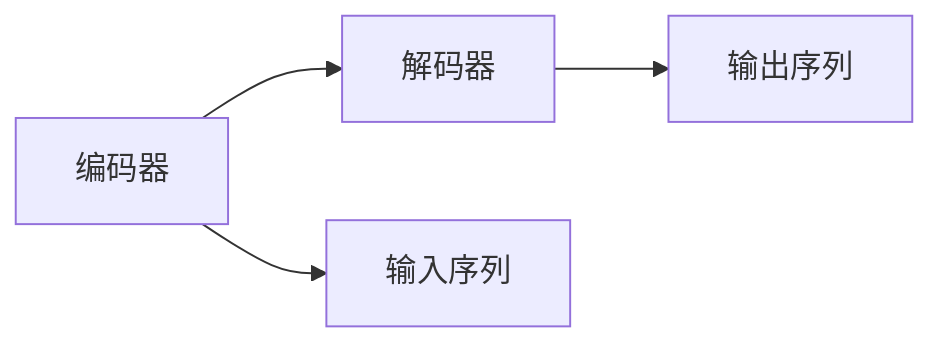
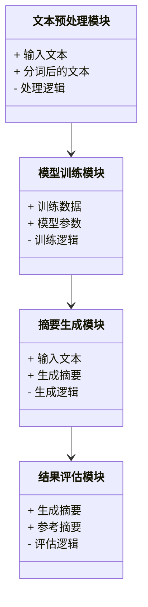
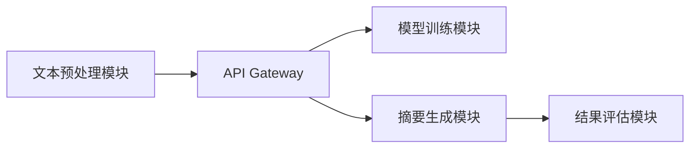
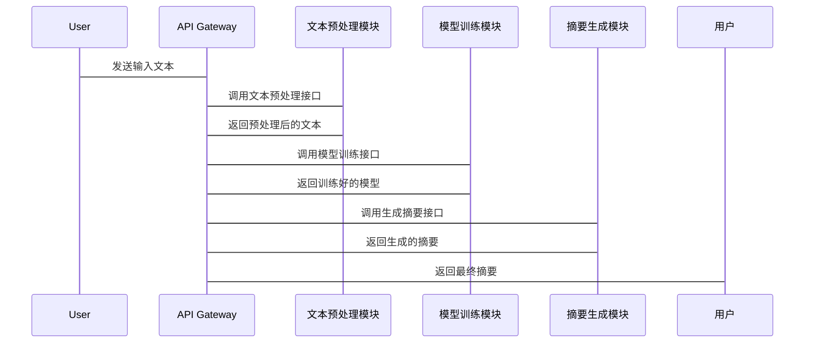

                 


# 深度学习在金融文本摘要生成中的应用

## 关键词：深度学习、文本摘要、金融文本、自然语言处理、预训练语言模型

## 摘要：深度学习技术在金融文本摘要生成中的应用，结合神经网络、注意力机制、预训练语言模型等技术，分析其原理、实现方法及其在金融领域的实际应用价值。

---

# 第四部分: 深度学习在金融文本摘要中的算法实现与优化

## 第4章: 金融文本摘要的算法实现与优化

### 4.1 基于Seq2Seq模型的文本摘要算法

#### 4.1.1 Seq2Seq模型的基本结构

Seq2Seq（序列到序列）模型是文本摘要的经典模型，主要包括编码器和解码器两个部分。编码器将输入文本转换为一个固定长度的向量，解码器根据这个向量生成目标摘要。

图4-1展示了Seq2Seq模型的基本结构：



#### 4.1.2 基于Transformer的Seq2Seq模型

Transformer模型通过自注意力机制和位置编码，能够捕捉文本中的长距离依赖关系，显著提高了文本摘要的效果。其核心公式如下：

自注意力机制的计算公式：

$$
\text{Attention}(Q, K, V) = \text{softmax}\left(\frac{QK^T}{\sqrt{d_k}}\right)V
$$

其中，$Q$、$K$、$V$分别是查询、键和值向量，$d_k$是向量的维度。

图4-2展示了基于Transformer的Seq2Seq模型结构：


#### 4.1.3 模型的训练与优化方法

模型训练时，通常使用交叉熵损失函数作为优化目标：

$$
\mathcal{L} = -\sum_{i=1}^{n} \sum_{j=1}^{m} y_{i,j} \log p(y_{i,j} | x_i)
$$

其中，$y_{i,j}$是目标摘要的第$j$个词的概率，$x_i$是输入文本。

为了优化训练效果，可以采用以下策略：

1. **学习率衰减**：使用学习率衰减方法（如CosineAnnealingLR）来优化训练过程。
2. **序列截断**：对过长的输入文本进行截断，以提高训练效率。
3. **数据增强**：通过数据增强技术（如随机删除部分词汇）来增强模型的鲁棒性。

### 4.2 基于预训练语言模型的文本摘要算法

#### 4.2.1 基于BERT的文本摘要算法

BERT（Bidirectional Encoder Representations from Transformers）是一种双向预训练语言模型。基于BERT的文本摘要方法通常采用以下步骤：

1. **输入预处理**：将输入文本分词并转换为BERT输入格式。
2. **模型编码**：将预处理后的文本输入BERT模型，获取编码结果。
3. **生成摘要**：基于编码结果生成摘要，可以采用贪心策略或采样方法。

#### 4.2.2 基于GPT的文本摘要算法

GPT（Generative Pre-trained Transformer）是一种单向预训练语言模型，适合生成式摘要任务。GPT模型生成摘要的过程如下：

1. **输入处理**：将输入文本进行分词并转换为模型的输入格式。
2. **生成摘要**：通过贪心策略或蒙特卡洛采样方法生成目标摘要。
3. **模型微调**：对GPT模型进行微调，以适应特定的摘要任务。

#### 4.2.3 模型优化策略

为了提高摘要质量，可以采用以下优化策略：

1. **多任务学习**：结合其他任务（如文本分类）进行联合训练。
2. **对抗训练**：引入对抗网络来优化生成结果。
3. **评价指标优化**：使用ROUGE、BLEU等指标指导模型优化。

---

# 第五部分: 系统设计与架构

## 第5章: 金融文本摘要系统的系统设计与架构

### 5.1 问题场景介绍

金融文本摘要系统需要处理大量的金融新闻、研究报告等文本数据，生成简洁准确的摘要。系统设计需要考虑文本处理效率、模型训练成本以及生成结果的可解释性。

### 5.2 项目介绍

本项目旨在开发一个基于深度学习的金融文本摘要系统，核心目标是实现高效的文本摘要生成，满足金融领域的实际需求。

### 5.3 系统功能设计

系统功能模块包括：

1. **文本预处理模块**：负责文本清洗、分词等预处理工作。
2. **模型训练模块**：用于模型的训练和优化。
3. **摘要生成模块**：根据输入文本生成摘要。
4. **结果评估模块**：对生成的摘要进行质量评估。

图5-1展示了系统功能模块的类图：



### 5.4 系统架构设计

系统架构采用微服务架构，各模块之间通过API进行交互。

图5-2展示了系统的架构图：



### 5.5 系统接口设计

系统主要接口包括：

1. `/api/text-preprocess`：文本预处理接口。
2. `/api/train-model`：模型训练接口。
3. `/api/generate-summary`：生成摘要接口。
4. `/api/evaluate-summary`：评估摘要接口。

### 5.6 系统交互设计

图5-3展示了系统的交互序列图：



---

# 第六部分: 项目实战

## 第6章: 金融文本摘要系统的项目实战

### 6.1 环境安装

需要安装以下工具和库：

- Python 3.8+
- PyTorch 1.9+
- Transformers库 4.10+
- Hugging Face的Transformers库

安装命令示例：

```bash
pip install torch transformers
```

### 6.2 系统核心实现源代码

以下是一个基于BERT的文本摘要生成的代码示例：

```python
from transformers import BertTokenizer, BertModel, Seq2SeqTrainer, Seq2SeqTrainingArguments
import torch

class TextSummarizer:
    def __init__(self):
        self.tokenizer = BertTokenizer.from_pretrained('bert-base-uncased')
        self.model = BertModel.from_pretrained('bert-base-uncased')

    def preprocess(self, text):
        inputs = self.tokenizer(text, return_tensors='pt', truncation=True, padding=True)
        return inputs

    def summarize(self, inputs, max_length=10):
        outputs = self.model.generate(inputs.input_ids, max_length=max_length)
        summary = self.tokenizer.decode(outputs[0], skip_special_tokens=True)
        return summary

# 使用示例
summarizer = TextSummarizer()
text = "The stock market crashed due to the financial crisis. Investors are worried about the future."
inputs = summarizer.preprocess(text)
summary = summarizer.summarize(inputs)
print("输入文本:", text)
print("生成摘要:", summary)
```

### 6.3 代码应用解读与分析

1. **预处理模块**：将输入文本分词并转换为模型的输入格式。
2. **模型生成**：使用预训练的BERT模型生成摘要。
3. **结果分析**：输出生成的摘要，评估其质量。

### 6.4 实际案例分析和详细讲解

案例：对金融新闻的摘要生成。

输入文本：
```
The Federal Reserve announced a new round of quantitative easing measures to stimulate the economy. Analysts predict this will boost the stock market in the short term.
```

生成摘要：
```
Federal Reserve announces new quantitative easing measures to boost stock market.
```

分析：生成的摘要准确概括了原文的核心内容，同时保持了简洁性。

### 6.5 项目小结

通过本项目的实践，我们了解了如何基于深度学习技术实现金融文本摘要生成系统。代码实现简单明了，但实际应用中需要考虑更多的优化策略和实际问题。

---

# 第七部分: 总结与展望

## 第7章: 总结与展望

### 7.1 全文总结

本文详细介绍了深度学习在金融文本摘要中的应用，包括核心概念、算法原理、系统设计与实现。通过理论分析和实践案例，展示了深度学习在金融领域的巨大潜力。

### 7.2 对未来的展望

随着预训练语言模型的不断发展，金融文本摘要将更加智能化和自动化。未来的研究方向可能包括：

1. **多模态摘要**：结合图像、语音等多模态信息进行摘要生成。
2. **实时摘要**：实现对实时金融数据的快速摘要。
3. **可解释性研究**：提高模型的可解释性，增强用户信任。

---

通过以上内容，我们系统地介绍了深度学习在金融文本摘要中的应用，从理论到实践，为读者提供了全面的视角。希望本文能为相关领域的研究和应用提供有价值的参考。

