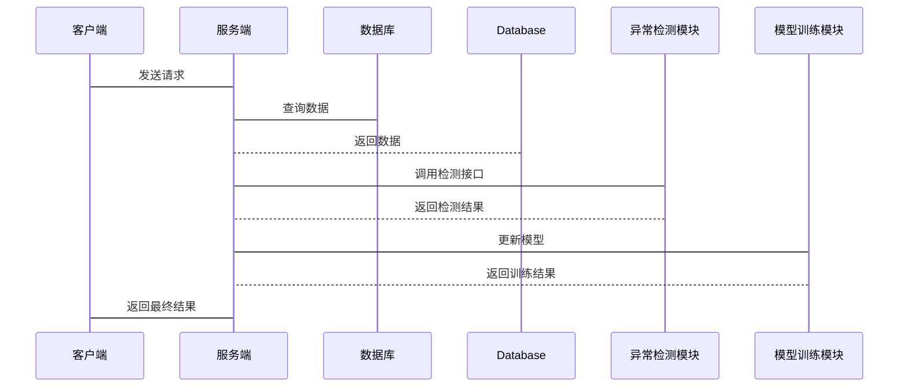

                 


# 第三部分: 算法原理

## 第3章: 基于LSTM的时间序列异常检测

### 3.1 LSTM模型的原理

#### 3.1.1 LSTM的结构与特点
长短期记忆网络（Long Short-Term Memory，LSTM）是一种特殊的循环神经网络（RNN），通过引入记忆单元和门控机制，能够有效捕捉时间序列中的长期依赖关系。LSTM的三个主要组件是输入门（Input Gate）、遗忘门（Forget Gate）和输出门（Output Gate），这些门控机制共同作用，控制信息的流动和存储。

#### 3.1.2 LSTM的数学公式
LSTM的基本运算如下：

- 遗忘门（Forget Gate）：
$$
f_t = \sigma(g_{f}(h_{t-1}, x_t))
$$

- 输入门（Input Gate）：
$$
i_t = \sigma(g_{i}(h_{t-1}, x_t))
$$

- 输出门（Output Gate）：
$$
o_t = \sigma(g_{o}(h_{t-1}, x_t))
$$

- 更新记忆单元（Cell State）：
$$
c_t = f_t \cdot c_{t-1} + i_t \cdot tanh(g_c(h_{t-1}, x_t))
$$

- 最终输出（Hidden State）：
$$
h_t = o_t \cdot c_t
$$

其中，$\sigma$ 表示sigmoid函数，$g_f$, $g_i$, $g_o$ 和 $g_c$ 是全连接层，用于生成门控信号和记忆单元更新信号。

#### 3.1.3 LSTM在时间序列异常检测中的应用
LSTM模型适用于捕捉时间序列中的非线性模式，特别适合处理金融数据中复杂的波动和趋势变化。通过训练LSTM模型，可以预测正常情况下的序列值，当实际值与预测值之间的差异超过一定阈值时，即可判断为异常。

#### 3.1.4 代码实现与解读
以下是基于Keras实现的LSTM异常检测模型：

```python
import numpy as np
from tensorflow.keras.models import Sequential
from tensorflow.keras.layers import LSTM, Dense, Dropout

# 假设X_train和y_train已经准备好
model = Sequential()
model.add(LSTM(64, input_shape=(timesteps, features)))
model.add(Dropout(0.2))
model.add(Dense(1, activation='sigmoid'))

model.compile(loss='binary_crossentropy', optimizer='adam', metrics=['accuracy'])
model.fit(X_train, y_train, epochs=10, batch_size=32)
```

### 3.2 基于Transformer的时间序列异常检测

#### 3.2.1 Transformer模型的原理
Transformer模型通过自注意力机制（Self-Attention）和前馈神经网络（FFN）实现全局依赖关系的捕捉。自注意力机制能够有效处理时间序列中不同位置之间的依赖关系，特别适合捕捉复杂的模式。

#### 3.2.2 Transformer的数学公式
自注意力机制的计算公式如下：

$$
\text{Attention}(Q, K, V) = \text{softmax}\left(\frac{QK^T}{\sqrt{d_k}}\right)V
$$

其中，$Q$、$K$ 和 $V$ 分别是查询（Query）、键（Key）和值（Value）向量，$d_k$ 是键向量的维度。

#### 3.2.3 Transformer在时间序列异常检测中的应用
Transformer模型通过全局注意力机制捕捉时间序列中的长距离依赖关系，适用于处理金融数据中复杂的模式。通过构建一个编码器-解码器结构，可以生成一个重建的序列，当实际序列与重建序列之间的差异超过阈值时，即可判断为异常。

#### 3.2.4 代码实现与解读
以下是基于Keras实现的Transformer异常检测模型：

```python
import numpy as np
from tensorflow.keras.models import Model
from tensorflow.keras.layers import Input, Dense, MultiHeadAttention, Dropout

def build_model(input_shape):
    inputs = Input(shape=input_shape)
    attention = MultiHeadAttention(heads=8, key_dim=64)(inputs, inputs)
    x = Dropout(0.2)(attention)
    x = Dense(64, activation='relu')(x)
    outputs = Dense(1, activation='sigmoid')(x)
    return Model(inputs=inputs, outputs=outputs)

model = build_model((timesteps, features))
model.compile(loss='binary_crossentropy', optimizer='adam', metrics=['accuracy'])
model.fit(X_train, y_train, epochs=10, batch_size=32)
```

### 3.3 模型优缺点分析

#### 3.3.1 优势
- LSTM模型能够有效捕捉时间序列的长期依赖关系。
- Transformer模型通过自注意力机制捕捉全局依赖关系，适合处理复杂的金融数据。

#### 3.3.2 局限性
- LSTM模型在处理非常长的时间序列时，可能会出现梯度消失或梯度爆炸的问题。
- Transformer模型的计算复杂度较高，对硬件要求较高。

### 3.4 本章小结
本章详细介绍了基于LSTM和Transformer的深度学习模型在时间序列异常检测中的应用，包括模型的原理、数学公式和代码实现。通过对比分析，读者可以理解不同模型的优缺点，并在实际应用中选择合适的模型。

# 第四部分: 系统分析与架构设计

## 第4章: 系统分析与架构设计

### 4.1 问题场景介绍
金融时间序列异常检测系统需要实时监控金融市场的各种指标，如股票价格、交易量等，及时发现异常事件，防止潜在的金融风险。

### 4.2 项目介绍
本项目旨在构建一个基于深度学习的时间序列异常检测系统，实现对金融数据的实时监控和异常检测。

### 4.3 系统功能设计
系统功能包括数据采集、数据预处理、模型训练、异常检测和结果展示。

### 4.4 系统架构设计


### 4.5 系统接口设计
系统接口包括数据接口、模型接口和结果接口。

### 4.6 系统交互流程



### 4.7 本章小结
本章详细介绍了金融时间序列异常检测系统的架构设计，包括系统功能模块、系统架构图和系统交互流程，为后续的系统实现提供了理论基础。

# 第五部分: 项目实战

## 第5章: 项目实战

### 5.1 环境安装
需要安装以下工具和库：
- Python 3.8+
- Keras 2.4.3+
- TensorFlow 2.4.0+
- Pandas 1.3.5+
- Scikit-learn 0.24.1+
- Matplotlib 3.3.4+
- Jupyter Notebook

### 5.2 核心代码实现

#### 5.2.1 数据预处理代码
```python
import pandas as pd
import numpy as np
from sklearn.preprocessing import MinMaxScaler

# 加载数据
data = pd.read_csv('金融时间序列数据.csv')

# 数据标准化
scaler = MinMaxScaler()
data_scaled = scaler.fit_transform(data)

# 划分训练集和测试集
train_data = data_scaled[:int(len(data_scaled)*0.8)]
test_data = data_scaled[int(len(data_scaled)*0.8):]
```

#### 5.2.2 LSTM模型实现
```python
from tensorflow.keras.models import Sequential
from tensorflow.keras.layers import LSTM, Dense, Dropout

# 构建LSTM模型
model = Sequential()
model.add(LSTM(64, input_shape=(timesteps, features)))
model.add(Dropout(0.2))
model.add(Dense(1, activation='sigmoid'))

# 编译模型
model.compile(loss='binary_crossentropy', optimizer='adam', metrics=['accuracy'])

# 训练模型
model.fit(X_train, y_train, epochs=10, batch_size=32)
```

#### 5.2.3 Transformer模型实现
```python
from tensorflow.keras.models import Model
from tensorflow.keras.layers import Input, MultiHeadAttention, Dense, Dropout

# 构建Transformer模型
def build_model(input_shape):
    inputs = Input(shape=input_shape)
    attention = MultiHeadAttention(heads=8, key_dim=64)(inputs, inputs)
    x = Dropout(0.2)(attention)
    x = Dense(64, activation='relu')(x)
    outputs = Dense(1, activation='sigmoid')(x)
    return Model(inputs=inputs, outputs=outputs)

model = build_model((timesteps, features))
model.compile(loss='binary_crossentropy', optimizer='adam', metrics=['accuracy'])
model.fit(X_train, y_train, epochs=10, batch_size=32)
```

### 5.3 实际案例分析
以股票价格预测为例，假设我们已经训练好了LSTM和Transformer模型，现在可以对测试数据进行预测，并判断是否存在异常。

### 5.4 项目小结
本章通过实际案例展示了如何使用LSTM和Transformer模型进行金融时间序列异常检测，包括数据预处理、模型训练和结果解读。

# 第六部分: 高级主题与最佳实践

## 第6章: 高级主题与最佳实践

### 6.1 模型调优与优化
- 调整模型参数，如学习率、批量大小、网络层数等。
- 使用早停法（Early Stopping）防止过拟合。
- 使用模型集成（Ensemble Learning）提高检测精度。

### 6.2 在线异常检测
- 实现实时数据流的处理和检测。
- 使用滑动窗口方法进行在线更新。

### 6.3 可解释性与鲁棒性
- 提升模型的可解释性，帮助理解异常事件的原因。
- 增强模型的鲁棒性，使其在噪声干扰下仍能准确检测异常。

### 6.4 最佳实践 tips
- 定期更新模型，以适应市场变化。
- 结合多种模型和特征，提高检测效果。
- 优化系统架构，提高处理效率。

### 6.5 本章小结
本章讨论了模型调优、在线检测和可解释性等高级主题，并提供了一些实际建议，帮助读者在实际应用中优化模型和系统。

# 第七部分: 附录

## 第7章: 附录

### 7.1 数据集
- 示例数据集：股票价格、交易量等金融数据。

### 7.2 工具库
- Python库：Pandas、NumPy、Keras、TensorFlow。
- 可视化工具：Matplotlib、Seaborn。

### 7.3 参考文献
- 《深度学习》—— Ian Goodfellow
- 《时间序列分析》—— 张润新
- 《金融数据分析与建模》—— 李俊杰

### 7.4 扩展阅读
- 《注意力机制在时间序列中的应用》
- 《深度学习模型的可解释性研究》
- 《金融时间序列预测的最新进展》

### 7.5 本章小结
本章提供了与本文相关的数据集、工具库和参考文献，为读者进一步学习和研究提供了方向。

# 第八部分: 结束语

## 第8章: 结束语

随着金融市场的复杂化和数据量的增加，深度学习在时间序列异常检测中的应用越来越广泛。本文详细介绍了深度学习模型的原理、系统设计和项目实现，为读者提供了一个全面的指导。未来，随着技术的进步，深度学习在金融领域的应用将更加广泛和深入。

### 8.1 致谢
感谢在撰写本文过程中提供帮助和支持的团队和同事。

### 8.2 未来展望
未来的研究方向可以包括模型的可解释性、在线检测和多模态数据的融合，以进一步提升异常检测的准确性和实用性。

### 8.3 本章小结
本文总结了深度学习在金融时间序列异常检测中的应用，展望了未来的研究方向，并对读者表示感谢。

---

通过以上目录和文章内容，读者可以系统地学习深度学习在金融时间序列异常检测中的应用，从理论到实践，逐步深入。

