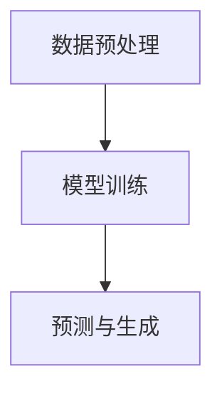

                 


# 深度学习在金融时间序列生成中的应用

**关键词**：深度学习，时间序列，金融，生成模型，神经网络

**摘要**：本文深入探讨了深度学习在金融时间序列生成中的应用，从基本概念到核心算法，再到系统架构和项目实战，全面分析了深度学习在金融时间序列生成中的优势、挑战及解决方案。通过对比不同模型的原理与性能，结合实际案例，本文为读者提供了从理论到实践的系统性指导。

---

## 第一部分: 深度学习与时间序列生成基础

### 第1章: 深度学习与时间序列生成概述

#### 1.1 深度学习的基本概念
深度学习是一种基于人工神经网络的机器学习方法，通过多层非线性变换模拟人类大脑的神经网络结构。其核心算法包括：

- **神经网络**：由输入层、隐藏层和输出层组成，通过权重和激活函数进行信息处理。
- **损失函数**：衡量模型输出与真实值的差距，常用均方误差（MSE）和交叉熵损失。
- **优化器**：用于调整模型参数以最小化损失函数，常用随机梯度下降（SGD）和Adam优化器。

深度学习在金融领域的应用潜力巨大，特别是在时间序列分析和生成任务中。

#### 1.2 时间序列的基本概念
时间序列是一组按时间顺序排列的数据点，具有以下特征：

- **趋势**：数据的长期走向。
- **周期性**：数据在固定周期内的重复模式。
- **噪声**：随机波动。

金融时间序列分析的核心目标是预测未来值或识别潜在模式。

#### 1.3 深度学习在时间序列生成中的优势
传统时间序列分析方法（如ARIMA）依赖于线性假设，而深度学习模型（如LSTM和Transformer）能够捕捉非线性关系和长距离依赖，显著提升了预测精度。

---

### 第2章: 深度学习中的时间序列生成模型

#### 2.1 基于RNN的时间序列生成模型
**循环神经网络（RNN）**通过处理序列数据中的时序关系，适用于时间序列生成。其局限性在于长序列中的梯度消失或爆炸问题。

- **长短时记忆网络（LSTM）**：通过引入记忆单元和门控机制，有效解决了RNN的时序依赖问题。
  - **输入门**：控制新信息的输入。
  - **遗忘门**：决定哪些信息需要遗忘。
  - **输出门**：生成输出。

- **门控循环单元网络（GRU）**：简化了LSTM的结构，同时保留了其核心优势。

#### 2.2 基于Transformer的时间序列生成模型
**Transformer**通过自注意力机制捕获长距离依赖关系，适用于捕捉时间序列中的全局模式。

- **自注意力机制**：计算序列中每对元素的相关性，生成注意力权重。
- **位置编码**：将时间位置信息融入模型。

#### 2.3 混合模型与集成模型
- **混合模型**：结合RNN和Transformer的优势，适用于复杂时间序列任务。
- **集成模型**：通过集成多个模型的结果，提升预测稳定性。

---

### 第3章: 金融时间序列生成的核心概念与联系

#### 3.1 金融时间序列的核心要素
金融时间序列具有以下特殊性：

- **高波动性**：金融市场的剧烈波动。
- **非线性关系**：价格波动受多种因素影响。
- **小样本与高维度**：金融数据通常具有高维度和小样本特征。

#### 3.2 核心概念的对比分析
| 模型 | 基础结构 | 优势 | 局限性 |
|------|----------|------|--------|
| LSTM | RNN结构 | 长时记忆能力 | 计算复杂度高 |
| Transformer | 自注意力机制 | 长距离依赖捕捉 | 易受噪声影响 |

---

### 第4章: 深度学习算法原理与数学模型

#### 4.1 LSTM网络的算法原理
LSTM的数学模型如下：

$$
f_t = \sigma(W_f x_t + U_f h_{t-1})
$$

其中，$f_t$为输入门，$\sigma$为sigmoid函数。

#### 4.2 Transformer网络的算法原理
自注意力机制的计算公式为：

$$
\text{Attention}(Q, K, V) = \text{softmax}\left(\frac{QK^T}{\sqrt{d_k}}\right)V
$$

---

## 第二部分: 金融时间序列生成系统设计

### 第5章: 金融时间序列生成系统设计

#### 5.1 系统功能设计
- **数据预处理模块**：清洗和归一化金融数据。
- **模型训练模块**：选择合适模型进行训练。
- **预测与生成模块**：生成未来时间序列值。

#### 5.2 系统架构设计
系统架构图（Mermaid）：


---

## 第三部分: 项目实战

### 第6章: 金融时间序列生成项目实战

#### 6.1 环境安装
安装必要的库：
```bash
pip install numpy pandas keras tensorflow
```

#### 6.2 核心代码实现
LSTM模型实现：
```python
from tensorflow.keras.models import Sequential
from tensorflow.keras.layers import LSTM, Dense

model = Sequential()
model.add(LSTM(50, input_shape=(timesteps, features)))
model.add(Dense(1))
model.compile(optimizer='adam', loss='mean_squared_error')
```

#### 6.3 案例分析
使用股票价格数据进行训练，评估模型的预测能力。

---

## 第四部分: 最佳实践

### 第7章: 最佳实践与总结

#### 7.1 小结
深度学习在金融时间序列生成中具有显著优势，但也面临挑战。

#### 7.2 注意事项
- 数据质量对模型性能影响重大。
- 模型调参需谨慎。

#### 7.3 拓展阅读
推荐学习时间序列分析的经典书籍和深度学习的最新论文。

---

**结束语**：通过本文的系统性分析，读者可以全面了解深度学习在金融时间序列生成中的应用，并能够将其应用于实际项目中。

