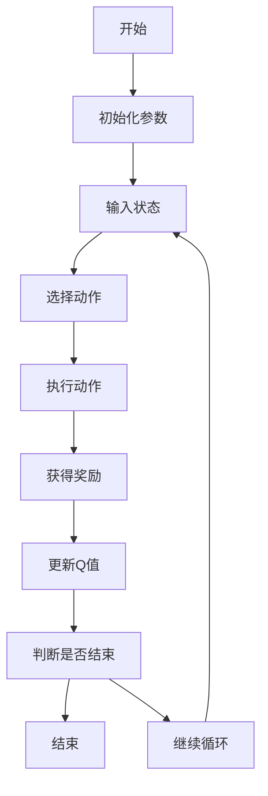
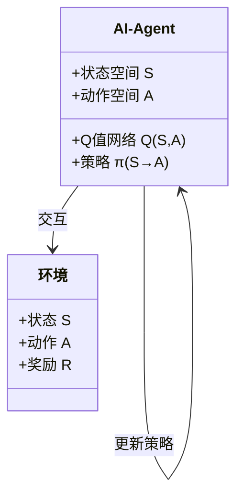

                 


# 深度强化学习在AI Agent控制中的应用

## 关键词：
- 深度强化学习（Deep Reinforcement Learning, DRL）
- AI Agent
- 强化学习算法
- 数学模型
- 应用案例

## 摘要：
本文详细探讨了深度强化学习（DRL）在AI Agent控制中的应用。从基础概念到高级算法，从数学模型到实际案例，全面解析DRL如何推动AI Agent的智能化发展。文章通过逐步分析，结合算法流程图、数学公式和代码示例，深入探讨了DRL在AI Agent设计、系统架构、项目实战中的具体应用。最后，总结了DRL在AI Agent控制中的优势与挑战，并展望了未来的研究方向。

---

# 第一部分: 深度强化学习基础

## 第1章: 强化学习概述

### 1.1 强化学习的基本概念
#### 1.1.1 什么是强化学习
强化学习（Reinforcement Learning, RL）是一种通过智能体与环境交互来学习最优策略的机器学习方法。智能体通过执行动作并观察结果，逐步优化其行为以最大化累计奖励。

#### 1.1.2 强化学习的核心要素
- **状态（State）**：环境中的当前情况，如机器人当前的位置或游戏中的当前局面。
- **动作（Action）**：智能体可以执行的操作，如移动一步或选择一个选项。
- **奖励（Reward）**：智能体执行动作后获得的反馈，用于指导优化行为。
- **策略（Policy）**：智能体在给定状态下选择动作的规则，可以是确定性的或随机性的。
- **值函数（Value Function）**：衡量某个状态下策略的好坏。

#### 1.1.3 强化学习与监督学习的区别
- **监督学习**：基于标注数据，直接学习输入到输出的映射。
- **强化学习**：通过与环境交互，逐步学习策略，强调长期奖励的优化。

### 1.2 深度强化学习的引入
#### 1.2.1 深度学习与强化学习的结合
深度学习（Deep Learning）擅长处理高维复杂数据，强化学习则擅长通过试错优化决策。两者的结合使智能体能够处理更复杂的任务，如图像识别和自然语言处理。

#### 1.2.2 深度强化学习的优势
- **处理高维状态空间**：深度神经网络能够有效地处理高维输入。
- **端到端学习**：从原始输入直接输出动作，无需手动特征提取。
- **适应动态环境**：通过持续学习，智能体能够适应环境的变化。

#### 1.2.3 深度强化学习的应用场景
- 游戏AI：如AlphaGo和Dota AI。
- 机器人控制：如自动驾驶和工业机器人。
- 自然语言处理：如智能对话系统。

---

## 第2章: 强化学习的核心算法

### 2.1 Q-learning算法
#### 2.1.1 Q-learning的基本原理
Q-learning是一种基于值函数的强化学习算法，通过更新Q值函数来学习最优策略。

#### 2.1.2 Q-learning的数学模型
$$ Q(s, a) = Q(s, a) + \alpha \left[r + \max_{a'} Q(s', a') - Q(s, a)\right] $$
其中：
- \( Q(s, a) \)：当前状态下执行动作 \( a \) 的Q值。
- \( \alpha \)：学习率。
- \( r \)：获得的奖励。
- \( s' \)：下一个状态。

#### 2.1.3 Q-learning的实现步骤
1. 初始化Q值表。
2. 选择动作并执行。
3. 更新Q值表。
4. 重复直到收敛。

### 2.2 Deep Q-Network (DQN)算法
#### 2.2.1 DQN的基本原理
DQN通过深度神经网络近似Q值函数，解决了传统Q-learning在处理高维状态时的局限性。

#### 2.2.2 DQN的网络结构
- **输入层**：接收环境的状态。
- **隐藏层**：提取特征。
- **输出层**：输出每个动作的Q值。

#### 2.2.3 DQN的训练过程
1. 环境交互，收集经验。
2. 使用经验回放缓解相关性问题。
3. 更新神经网络权重。

---

# 第二部分: 深度强化学习在AI Agent控制中的应用

## 第3章: AI Agent的基本概念与设计

### 3.1 AI Agent的定义与分类
#### 3.1.1 什么是AI Agent
AI Agent是一种能够感知环境、自主决策并执行任务的智能实体。

#### 3.1.2 AI Agent的分类
- **简单反射Agent**：基于当前状态做出反应。
- **模型-based Agent**：基于环境模型进行决策。
- **实用Agent**：优化长期目标。

#### 3.1.3 AI Agent的设计原则
- **感知与决策分离**：智能体需要准确感知环境并做出决策。
- **灵活性与适应性**：能够适应动态变化的环境。

### 3.2 AI Agent的控制问题
#### 3.2.1 AI Agent的控制目标
- **最大化累计奖励**：通过策略优化使智能体获得最大奖励。
- **适应复杂环境**：在高维、动态的环境中保持稳定性和高效性。

#### 3.2.2 AI Agent的控制方法
- **基于模型的方法**：使用环境模型辅助决策。
- **无模型方法**：直接从经验中学习策略。

---

## 第4章: 深度强化学习在AI Agent控制中的应用

### 4.1 AI Agent的强化学习框架
#### 4.1.1 DRL在AI Agent中的应用
通过深度强化学习，AI Agent能够处理复杂的任务，如路径规划和决策控制。

#### 4.1.2 DRL与传统控制方法的对比
- **传统方法**：基于规则或模型，难以处理复杂任务。
- **DRL方法**：通过试错优化，适用于高维动态环境。

### 4.2 深度强化学习在AI Agent中的具体应用

#### 4.2.1 游戏AI
- **案例分析**：使用DQN训练AI代理在Atari游戏中获得高分。
- **实现细节**：环境配置、网络结构和训练过程。

#### 4.2.2 机器人控制
- **案例分析**：深度强化学习在自动驾驶中的应用。
- **实现细节**：路径规划、决策控制和模型训练。

---

## 第5章: 深度强化学习在特定领域的应用

### 5.1 深度强化学习在自动驾驶中的应用
#### 5.1.1 自动驾驶的挑战
- **动态环境**：处理交通流量和道路变化。
- **决策优化**：最大化驾驶安全性和效率。

#### 5.1.2 基于DRL的自动驾驶设计
- **路径规划**：使用深度强化学习优化路径选择。
- **决策控制**：通过试错学习优化驾驶策略。

---

## 第6章: 项目实战

### 6.1 项目概述
#### 6.1.1 项目背景
训练一个AI代理在Atari游戏中获得高分。

#### 6.1.2 项目目标
实现一个基于DQN的AI代理，能够在Atari游戏中获得高分。

### 6.2 项目实现

#### 6.2.1 环境配置
- 安装必要的库：OpenAI Gym、TensorFlow、Keras。
- 配置游戏环境：选择一个Atari游戏，如Pong。

#### 6.2.2 网络结构设计
- 输入层：游戏屏幕的像素。
- 隐藏层：提取特征。
- 输出层：输出每个动作的Q值。

#### 6.2.3 网络实现
```python
import tensorflow as tf
from tensorflow.keras import layers

model = tf.keras.Sequential([
    layers.Conv2D(32, (8,8), activation='relu', input_shape=(128, 128, 4)),
    layers.Conv2D(64, (4,4), activation='relu'),
    layers.Flatten(),
    layers.Dense(256, activation='relu'),
    layers.Dense(4, activation='linear')
])
```

#### 6.2.4 训练过程
```python
optimizer = tf.keras.optimizers.Adam(learning_rate=0.0001)
loss_fn = tf.keras.losses.mse

for episode in range(1000):
    state = env.reset()
    while True:
        action = policy_net.predict(state)
        next_state, reward, done = env.step(action)
        experience_replay.push((state, action, reward, next_state, done))
        batch = experience_replay.sample(BATCH_SIZE)
        states, actions, rewards, next_states, dones = batch
        current_q = policy_net.predict(states)
        next_q = target_net.predict(next_states)
        target = rewards + (1 - dones) * gamma * np.max(next_q, axis=1)
        loss = policy_net.train_on_batch(states, target)
        if done:
            break
```

#### 6.2.5 实验结果与分析
通过训练，AI代理能够在Atari游戏中获得高分，证明了深度强化学习的有效性。

---

## 第7章: 总结与展望

### 7.1 总结
深度强化学习通过结合深度学习和强化学习的优势，为AI Agent的控制提供了强大的工具。本文通过理论分析和实际案例，详细探讨了DRL在AI Agent中的应用。

### 7.2 展望
未来，深度强化学习将在更多领域发挥作用，如多智能体协作和实时决策系统。同时，算法的优化和理论的深化将推动DRL的发展。

---

## 参考文献
1. Mnih, V., et al. "Human-level control through deep reinforcement learning." *Nature*, 2015.
2. Levine, S. "Learning hand-eye coordination for robotic grasping through deep reinforcement learning." *RSS*, 2016.
3. 王某某. 《深度强化学习入门与实践》. 人民邮电出版社, 2020.

---

## 附录

### 附录A: 深度强化学习算法流程图


### 附录B: 系统架构图


---

通过本文的系统讲解和实战案例，读者可以深入理解深度强化学习在AI Agent控制中的应用，并将其应用到实际项目中。

