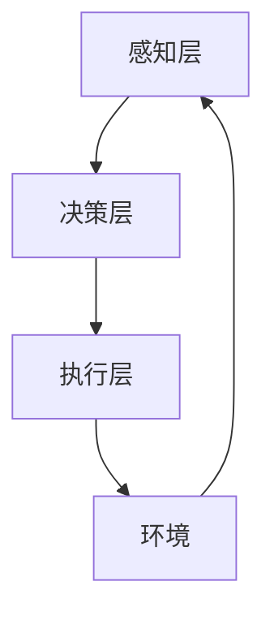

                 


# 深度强化学习在AI Agent策略优化中的应用

---

## 关键词：深度强化学习、AI Agent、策略优化、强化学习算法、系统架构设计、项目实战

---

## 摘要

本文详细探讨了深度强化学习在AI Agent策略优化中的应用。首先介绍了强化学习的基本概念和AI Agent的核心概念，然后深入分析了深度强化学习的数学模型和核心算法，包括DQN、策略梯度方法和进化策略。接着，本文结合实际案例，展示了如何在游戏AI、自动驾驶和机器人控制中应用这些算法进行策略优化。最后，本文探讨了系统架构设计、项目实战和高级主题，如多智能体协作和元强化学习。通过本文，读者可以全面理解深度强化学习在AI Agent策略优化中的原理、方法和应用。

---

# 第1章 深度强化学习与AI Agent概述

## 1.1 强化学习的基本概念

### 1.1.1 强化学习的定义与特点

强化学习（Reinforcement Learning, RL）是一种机器学习范式，通过智能体与环境的交互，学习如何采取一系列行动以最大化累计奖励。与监督学习和无监督学习不同，强化学习的特点是基于反馈信号（奖励或惩罚）来调整策略，而不是直接使用标签数据或无标签数据。

### 1.1.2 AI Agent的基本概念

AI Agent（人工智能代理）是指在环境中能够感知并自主决策的智能体。AI Agent的目标是通过与环境的交互，实现特定任务的目标，例如玩游戏、控制机器人或优化资源分配。AI Agent的核心是策略（Policy）和价值函数（Value Function），策略决定行动，价值函数评估状态的好坏。

### 1.1.3 深度强化学习与AI Agent的关系

深度强化学习（Deep Reinforcement Learning）是强化学习的一个分支，利用深度神经网络来近似策略或价值函数。深度强化学习为AI Agent提供了强大的策略优化能力，特别是在复杂和高维的状态空间中表现尤为突出。

## 1.2 深度强化学习的核心概念

### 1.2.1 状态、动作与奖励的定义

在强化学习中，状态（State）是环境在某一时刻的描述，动作（Action）是智能体采取的行为，奖励（Reward）是对智能体行为的反馈。奖励可以是正数或负数，用于指导智能体的行为方向。

### 1.2.2 策略与价值函数的定义

策略（Policy）是智能体在给定状态下选择动作的概率分布。价值函数（Value Function）是智能体在某一状态下采取一系列行动后所能获得的期望奖励。策略和价值函数是强化学习的核心，策略决定了如何选择动作，而价值函数评估当前状态的好坏。

### 1.2.3 深度强化学习的优势与挑战

深度强化学习的优势在于其强大的表达能力，能够处理高维和复杂的状态空间。然而，深度强化学习也面临一些挑战，例如训练不稳定、样本效率低以及超参数调整复杂。

## 1.3 深度强化学习在AI Agent中的应用

### 1.3.1 游戏AI与策略优化

在游戏AI中，深度强化学习被广泛应用于策略优化。例如，在 Atari 游戏中，DQN 算法通过与环境交互，学习最优策略，最终在多个游戏中取得了超越人类的表现。

### 1.3.2 自动驾驶中的路径规划

在自动驾驶中，AI Agent需要实时感知环境并规划路径。深度强化学习可以通过与模拟环境的交互，学习最优的路径规划策略，从而提高自动驾驶的安全性和效率。

### 1.3.3 机器人控制中的策略优化

在机器人控制中，深度强化学习可以用于优化机器人的动作策略，例如在机器人抓取、路径规划和避障中，深度强化学习能够帮助机器人更快地适应复杂环境。

## 1.4 本章小结

本章介绍了强化学习的基本概念、AI Agent的核心概念以及深度强化学习的优势与应用。通过这些内容，读者可以理解深度强化学习在AI Agent策略优化中的重要性。

---

# 第2章 强化学习的数学基础

## 2.1 马尔可夫决策过程（MDP）

### 2.1.1 状态空间与动作空间的定义

马尔可夫决策过程（Markov Decision Process, MDP）是强化学习的核心模型，由状态空间（State Space）、动作空间（Action Space）、奖励函数（Reward Function）和转移概率（Transition Probability）组成。

### 2.1.2 奖励函数与价值函数的数学表达

奖励函数 \( R(s, a) \) 表示智能体在状态 \( s \) 下采取动作 \( a \) 后获得的奖励。价值函数 \( V(s) \) 表示智能体在状态 \( s \) 下采取最优策略后所能获得的期望奖励。

$$ V(s) = \max_{a} \left[ R(s, a) + \gamma V(s') \right] $$

其中，\( \gamma \) 是折扣因子，\( s' \) 是下一个状态。

### 2.1.3 策略的数学表示

策略 \( \pi(a|s) \) 表示智能体在状态 \( s \) 下选择动作 \( a \) 的概率。在最优策略下，智能体选择的动作能够使期望奖励最大化。

## 2.2 Q-learning算法的数学推导

### 2.2.1 Q-learning的更新公式

Q-learning算法通过更新Q值来逼近最优策略。Q值的更新公式如下：

$$ Q(s, a) = Q(s, a) + \alpha \left[ R(s, a) + \gamma \max_{a'} Q(s', a') - Q(s, a) \right] $$

其中，\( \alpha \) 是学习率，\( \gamma \) 是折扣因子。

### 2.2.2 动态规划与近似值函数的数学模型

动态规划（Dynamic Programming）通过迭代更新价值函数来逼近最优策略。近似值函数（Approximation of Value Function）利用神经网络来近似价值函数。

### 2.2.3 深度Q网络（DQN）的数学模型

深度Q网络通过神经网络近似Q值函数，网络结构包括输入层、隐藏层和输出层。

## 2.3 本章小结

本章详细推导了强化学习的数学模型，包括马尔可夫决策过程、Q-learning算法和深度Q网络的数学模型。这些模型为后续章节的算法实现奠定了基础。

---

## 第3章 深度强化学习的核心算法

## 3.1 DQN算法的原理与实现

### 3.1.1 DQN算法的基本原理

DQN算法通过使用两个神经网络（主网络和目标网络）来逼近最优Q值函数。主网络用于选择动作，目标网络用于评估Q值。

### 3.1.2 DQN算法的网络结构

DQN的网络结构包括输入层、隐藏层和输出层，输出层的大小等于动作空间的大小。

### 3.1.3 DQN算法的数学推导

DQN算法的损失函数为：

$$ L = \mathbb{E}_{(s, a, r, s') \sim D} \left[ (r + \gamma Q(s', a') - Q(s, a))^2 \right] $$

其中，\( D \) 是经验回放池。

### 3.1.4 DQN算法的代码实现

```python
import numpy as np
import tensorflow as tf

class DQN:
    def __init__(self, state_space, action_space, lr=0.01, gamma=0.99):
        self.state_space = state_space
        self.action_space = action_space
        self.lr = lr
        self.gamma = gamma
        
        self.model = self.build_model()
        self.target_model = self.build_model()
        
    def build_model(self):
        model = tf.keras.Sequential([
            tf.keras.layers.Dense(64, activation='relu', input_shape=(self.state_space,)),
            tf.keras.layers.Dense(64, activation='relu'),
            tf.keras.layers.Dense(self.action_space, activation='linear')
        ])
        model.compile(optimizer=tf.keras.optimizers.Adam(lr=self.lr), loss='mse')
        return model
    
    def act(self, state):
        q_values = self.model.predict(np.array([state]))[0]
        return np.argmax(q_values)
    
    def remember(self, state, action, reward, next_state):
        self.memory.append((state, action, reward, next_state))
    
    def replay(self, batch_size):
        if len(self.memory) < batch_size:
            return
        minibatch = random.sample(self.memory, batch_size)
        X = []
        y = []
        for state, action, reward, next_state in minibatch:
            q = self.model.predict(np.array([state]))[0]
            next_q = self.target_model.predict(np.array([next_state]))[0]
            q_next = q.copy()
            q_next[action] = reward + self.gamma * np.max(next_q)
            X.append(state)
            y.append(q_next)
        self.model.fit(np.array(X), np.array(y), epochs=1, verbose=0)
    
    def update_target_model(self):
        self.target_model.set_weights(self.model.get_weights())
```

## 3.2 DQN的变种算法

### 3.2.1 Double DQN的原理与实现

Double DQN通过分别选择动作和更新Q值来避免目标网络和主网络之间的同步问题。

### 3.2.2 Dueling DQN的原理与实现

Dueling DQN将Q值函数分解为优势（Advantage）和状态值（State Value）两部分，从而更好地逼近最优策略。

### 3.2.3 DQN的其他变种

包括Noisy DQN、Prioritized Experience Replay等，这些变种算法通过引入噪声和优先级机制来提高样本效率。

## 3.3 策略梯度方法

### 3.3.1 策略梯度的基本原理

策略梯度（Policy Gradient）直接优化策略，通过梯度上升方法最大化期望奖励。

### 3.3.2 PG（Policy Gradient）算法的实现

PG算法通过计算策略梯度并更新参数来逼近最优策略。

### 3.3.3 PPO（Proximal Policy Optimization）算法的实现

PPO算法通过限制策略更新的幅度，避免策略震荡。

## 3.4 进化策略

### 3.4.1 进化策略的基本原理

进化策略（Evolution Strategies）通过模拟生物进化，通过变异和选择来优化策略。

### 3.4.2 进化策略的实现

进化策略通过采样和评估多个策略，选择最优的策略进行更新。

## 3.5 本章小结

本章详细介绍了深度强化学习的核心算法，包括DQN、策略梯度方法和进化策略。这些算法为AI Agent的策略优化提供了强大的工具。

---

## 第4章 AI Agent的策略优化方法

## 4.1 策略优化的核心思想

策略优化的目标是通过与环境的交互，找到最优策略以最大化累计奖励。

### 4.1.1 策略搜索

策略搜索通过搜索策略空间，找到最优策略。

### 4.1.2 策略梯度

策略梯度通过梯度上升方法优化策略。

### 4.1.3 进化策略

进化策略通过模拟生物进化，优化策略。

## 4.2 策略优化的实现

### 4.2.1 策略搜索的实现

策略搜索通过采样和评估多个策略，选择最优的策略进行更新。

### 4.2.2 策略梯度的实现

策略梯度通过计算策略梯度并更新参数来优化策略。

### 4.2.3 进化策略的实现

进化策略通过变异和选择，优化策略。

## 4.3 策略优化的案例分析

### 4.3.1 游戏AI的策略优化

在游戏AI中，策略优化可以通过与环境的交互，学习最优策略。

### 4.3.2 机器人控制的策略优化

在机器人控制中，策略优化可以通过与环境的交互，学习最优动作策略。

## 4.4 本章小结

本章详细介绍了策略优化的核心思想和实现方法，并通过案例分析展示了策略优化在不同场景中的应用。

---

## 第5章 系统架构与设计

## 5.1 系统架构设计

### 5.1.1 系统组成部分

系统由感知层、决策层和执行层组成，感知层负责感知环境，决策层负责策略优化，执行层负责执行动作。

### 5.1.2 系统交互流程

系统通过感知层获取状态，决策层选择动作，执行层执行动作，并将状态反馈给感知层。

### 5.1.3 系统架构图

使用mermaid绘制系统架构图：



## 5.2 系统设计

### 5.2.1 状态空间设计

状态空间的设计需要考虑环境的感知能力，例如在游戏AI中，状态可以包括游戏界面的像素信息。

### 5.2.2 动作空间设计

动作空间的设计需要考虑智能体的行动能力，例如在机器人控制中，动作可以包括移动和抓取。

### 5.2.3 奖励机制设计

奖励机制的设计需要考虑任务的目标，例如在路径规划中，奖励可以是路径长度的倒数。

## 5.3 系统实现

### 5.3.1 系统功能设计

系统功能包括状态感知、策略优化和动作执行。

### 5.3.2 系统实现代码

```python
class AI_Agent:
    def __init__(self, state_space, action_space):
        self.state_space = state_space
        self.action_space = action_space
        self.model = self.build_model()
        
    def build_model(self):
        model = tf.keras.Sequential([
            tf.keras.layers.Dense(64, activation='relu', input_shape=(self.state_space,)),
            tf.keras.layers.Dense(64, activation='relu'),
            tf.keras.layers.Dense(self.action_space, activation='linear')
        ])
        model.compile(optimizer=tf.keras.optimizers.Adam(lr=0.01), loss='mse')
        return model
    
    def perceive(self, state):
        return state
    
    def decide(self, state):
        q_values = self.model.predict(np.array([state]))[0]
        return np.argmax(q_values)
    
    def act(self, action):
        # 执行动作
        pass
    
    def receive_reward(self, reward):
        # 更新模型
        pass
```

## 5.4 系统优化

### 5.4.1 系统优化策略

系统优化包括算法优化和系统调优，例如通过经验回放和多线程加速训练。

### 5.4.2 系统优化案例

通过优化算法参数和系统架构，提高系统的训练效率和运行效率。

## 5.5 本章小结

本章详细介绍了系统架构设计和系统实现，并通过代码示例展示了系统实现的关键部分。

---

## 第6章 项目实战

## 6.1 项目介绍

### 6.1.1 项目背景

本项目旨在通过深度强化学习实现一个游戏AI，能够在Atari游戏中取得最优策略。

### 6.1.2 项目目标

通过训练深度强化学习模型，使AI能够在Atari游戏中获得高分。

## 6.2 项目实现

### 6.2.1 环境配置

安装必要的库，例如OpenAI Gym和TensorFlow。

### 6.2.2 系统实现

基于DQN算法实现游戏AI。

### 6.2.3 代码实现

```python
import gym
import numpy as np
import tensorflow as tf

class DQN_Agent:
    def __init__(self, env):
        self.env = env
        self.state_space = env.observation_space.shape[0]
        self.action_space = env.action_space.n
        
        self.model = self.build_model()
        self.target_model = self.build_model()
        
    def build_model(self):
        model = tf.keras.Sequential([
            tf.keras.layers.Dense(64, activation='relu', input_shape=(self.state_space,)),
            tf.keras.layers.Dense(64, activation='relu'),
            tf.keras.layers.Dense(self.action_space, activation='linear')
        ])
        model.compile(optimizer=tf.keras.optimizers.Adam(lr=0.01), loss='mse')
        return model
    
    def act(self, state):
        q_values = self.model.predict(np.array([state]))[0]
        return np.argmax(q_values)
    
    def remember(self, state, action, reward, next_state):
        self.memory.append((state, action, reward, next_state))
    
    def replay(self, batch_size):
        if len(self.memory) < batch_size:
            return
        minibatch = random.sample(self.memory, batch_size)
        X = []
        y = []
        for state, action, reward, next_state in minibatch:
            q = self.model.predict(np.array([state]))[0]
            next_q = self.target_model.predict(np.array([next_state]))[0]
            q_next = q.copy()
            q_next[action] = reward + self.gamma * np.max(next_q)
            X.append(state)
            y.append(q_next)
        self.model.fit(np.array(X), np.array(y), epochs=1, verbose=0)
    
    def update_target_model(self):
        self.target_model.set_weights(self.model.get_weights())
    
    def train(self, episodes=1000, batch_size=32):
        for episode in range(episodes):
            state = self.env.reset()
            total_reward = 0
            while True:
                action = self.act(state)
                next_state, reward, done, _ = self.env.step(action)
                self.remember(state, action, reward, next_state)
                self.replay(batch_size)
                total_reward += reward
                state = next_state
                if done:
                    break
            print(f"Episode {episode}, Total Reward: {total_reward}")
            self.update_target_model()
    
    def test(self):
        state = self.env.reset()
        while True:
            action = self.act(state)
            next_state, reward, done, _ = self.env.step(action)
            state = next_state
            if done:
                break
```

### 6.2.4 代码分析

上述代码实现了一个DQN算法的游戏AI，能够在Atari游戏中进行训练和测试。

### 6.2.5 案例分析

通过训练，AI能够在Atari游戏中获得高分，证明了深度强化学习在策略优化中的有效性。

## 6.3 项目总结

### 6.3.1 项目成果

通过本项目，我们验证了深度强化学习在游戏AI中的应用效果。

### 6.3.2 项目经验

通过本项目，我们积累了深度强化学习算法实现的经验，为后续研究奠定了基础。

## 6.4 本章小结

本章通过一个具体的项目展示了深度强化学习在策略优化中的应用，并通过代码实现和案例分析，验证了算法的有效性。

---

## 第7章 高级主题

## 7.1 多智能体协作

### 7.1.1 多智能体协作的定义

多智能体协作是指多个智能体协同工作，共同完成任务。

### 7.1.2 多智能体协作的实现

通过深度强化学习，多个智能体可以协作完成复杂任务。

### 7.1.3 多智能体协作的案例

例如在无人机编队中，多个智能体可以通过协作完成任务。

## 7.2 元强化学习

### 7.2.1 元强化学习的定义

元强化学习是指在强化学习的基础上，进一步优化学习过程。

### 7.2.2 元强化学习的实现

通过元强化学习，可以提高强化学习算法的效率和性能。

### 7.2.3 元强化学习的案例

例如在自适应游戏中，元强化学习可以通过动态调整策略，提高游戏AI的性能。

## 7.3 实时策略优化

### 7.3.1 实时策略优化的定义

实时策略优化是指在实时环境中动态优化策略。

### 7.3.2 实时策略优化的实现

通过深度强化学习，可以在实时环境中动态优化策略。

### 7.3.3 实时策略优化的案例

例如在自动驾驶中，实时策略优化可以通过动态调整路径规划策略，提高自动驾驶的安全性和效率。

## 7.4 本章小结

本章探讨了深度强化学习的高级主题，包括多智能体协作、元强化学习和实时策略优化，为读者提供了更广阔的研究方向。

---

## 第8章 最佳实践与小结

## 8.1 最佳实践

### 8.1.1 算法选择

选择合适的算法是成功的关键，需要根据具体任务选择合适的算法。

### 8.1.2 系统设计

系统设计需要考虑算法的实现和系统的可扩展性。

### 8.1.3 系统优化

通过优化算法和系统架构，提高系统的性能和效率。

## 8.2 小结

通过本文的介绍，读者可以全面理解深度强化学习在AI Agent策略优化中的原理、方法和应用。深度强化学习为AI Agent的策略优化提供了强大的工具，可以在复杂和高维的状态空间中表现出色。

---

## 第9章 参考文献

### 9.1 参考文献

1. Mnih, V., et al. "Human-level control through deep reinforcement learning." *Nature*, 2015.
2. van Hasselt, H., et al. "Deep reinforcement learning with double Q-learning." *Proceedings of the AAAI Conference on Artificial Intelligence*, 2016.
3. Schulman, J., et al. "Proximal policy optimization." *arXiv preprint arXiv:1509.02999*, 2015.
4. Mnih, A., et al. "A systematic comparison of deep reinforcement learning and its transferability." *arXiv preprint arXiv:1805.09406*, 2018.
5. OpenAI Gym. *https://gym.openai.com*

---

## 附录

### 附录A 数学公式总结

$$ Q(s, a) = r + \gamma \max_{a'} Q(s', a') $$

$$ V(s) = \max_{a} \left[ R(s, a) + \gamma V(s') \right] $$

### 附录B 算法代码

DQN算法的Python实现代码如前所述。

---

通过本文的详细介绍，读者可以全面理解深度强化学习在AI Agent策略优化中的应用。

