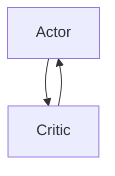
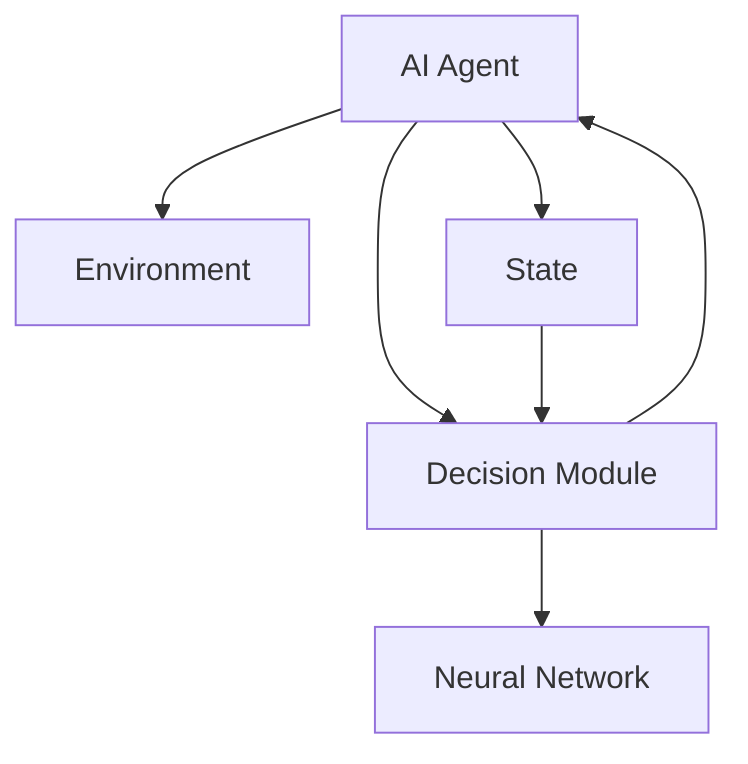
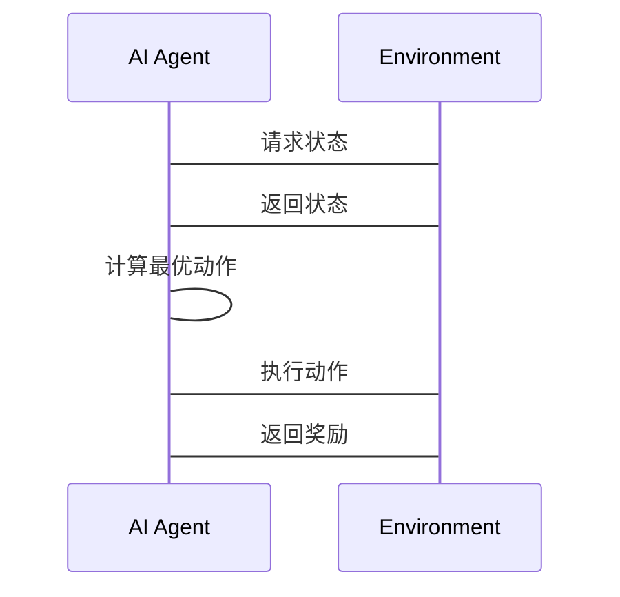

                 


# 深度强化学习在AI Agent长期规划中的应用

> 关键词：深度强化学习，AI Agent，长期规划，强化学习，人工智能，智能体，AI规划

> 摘要：本文探讨了深度强化学习（Deep Reinforcement Learning, DRL）在AI Agent长期规划中的应用，详细分析了DRL的核心概念、算法原理、系统架构设计以及实际项目中的应用案例。通过结合理论与实践，本文旨在帮助读者理解DRL在AI Agent长期规划中的优势、挑战及解决方案。

---

## 第一部分：深度强化学习与AI Agent概述

### 第1章：深度强化学习与AI Agent的基本概念

#### 1.1 强化学习的定义与特点
强化学习（Reinforcement Learning, RL）是一种机器学习范式，其中智能体通过与环境交互来学习策略，以最大化累积奖励。其核心特点包括：
- **目标导向**：智能体通过最大化累积奖励来实现目标。
- **试错学习**：智能体通过试错学习策略，逐步优化行为。
- **环境动态**：环境的状态和奖励具有动态性，智能体需适应变化。

#### 1.2 深度强化学习的定义与特点
深度强化学习（Deep Reinforcement Learning, DRL）是强化学习的一种形式，通过深度神经网络来逼近策略或价值函数。其特点包括：
- **高维状态空间**：深度神经网络能够处理高维状态空间。
- **非线性关系**：深度神经网络能够捕捉复杂非线性关系。
- **端到端学习**：DRL可以直接从输入状态到输出动作，无需显式建模。

#### 1.3 AI Agent的定义与特点
AI Agent（智能体）是能够感知环境并采取行动以实现目标的实体。其特点包括：
- **自主性**：智能体能够自主决策。
- **反应性**：智能体能够实时响应环境变化。
- **目标导向**：智能体的行为以最大化目标函数为驱动。

#### 1.4 深度强化学习在AI Agent中的应用
深度强化学习在AI Agent中的应用广泛，尤其是在需要长期规划的场景中。其优势包括：
- **复杂决策**：DRL能够处理复杂的决策问题。
- **长期目标**：DRL能够优化长期累积奖励。
- **实时交互**：DRL能够实时与环境交互并调整策略。

---

### 第2章：深度强化学习的核心概念与原理

#### 2.1 Q-learning算法
Q-learning是一种经典的强化学习算法，通过学习Q值函数（Q(s, a)）来逼近最优策略。其数学模型如下：

$$ Q(s, a) = Q(s, a) + \alpha [r + \gamma \max_{a'} Q(s', a') - Q(s, a)] $$

其中，$\alpha$为学习率，$\gamma$为折扣因子，$r$为奖励。

#### 2.2 策略梯度方法
策略梯度方法通过优化策略直接寻找最优动作分布。其数学模型如下：

$$ \nabla \theta \leftarrow \nabla \log \pi_\theta(s) \cdot Q(s, a) $$

其中，$\theta$为策略参数，$\pi_\theta(s)$为策略分布，$Q(s, a)$为Q值。

#### 2.3 Actor-Critic架构
Actor-Critic架构结合了策略梯度和Q-learning的优势，通过Actor优化策略，Critic评估Q值。其流程如下：



---

## 第二部分：深度强化学习在AI Agent长期规划中的应用

### 第3章：深度强化学习在长期规划中的应用

#### 3.1 长期规划的定义与特点
长期规划是指智能体在多步决策中优化累积奖励的过程。其特点包括：
- **多步决策**：需要考虑当前动作对未来状态的影响。
- **累积奖励**：目标是最大化长期累积奖励。
- **不确定性**：环境状态和奖励具有不确定性。

#### 3.2 深度强化学习在长期规划中的优势
- **复杂环境建模**：DRL能够处理高维复杂环境。
- **端到端学习**：DRL可以直接从输入状态到输出动作。
- **自适应优化**：DRL能够根据环境变化自适应优化策略。

---

### 第4章：系统分析与架构设计

#### 4.1 问题场景介绍
假设我们设计一个智能助手AI Agent，帮助用户完成日程管理、任务分配等长期规划任务。

#### 4.2 系统功能设计
系统功能包括：
- **状态感知**：感知当前环境状态。
- **决策制定**：基于当前状态制定最优动作。
- **奖励反馈**：根据用户反馈调整策略。

#### 4.3 系统架构设计


#### 4.4 系统接口设计
- **输入接口**：接收环境状态和用户反馈。
- **输出接口**：输出最优动作和调整后的策略。

#### 4.5 系统交互流程


---

### 第5章：项目实战

#### 5.1 环境配置
安装必要的库：
```bash
pip install gym torch numpy
```

#### 5.2 核心实现
实现DRL算法的代码示例：
```python
import torch
import numpy as np

class DRLAgent:
    def __init__(self, state_space, action_space):
        self.state_space = state_space
        self.action_space = action_space
        self.model = torch.nn.Sequential(
            torch.nn.Linear(state_space, 64),
            torch.nn.ReLU(),
            torch.nn.Linear(64, action_space)
        )
    
    def act(self, state):
        state = torch.FloatTensor(state)
        with torch.no_grad():
            return self.model(state).argmax().item()
    
    def update(self, state, action, reward, next_state):
        state = torch.FloatTensor(state)
        target = reward + 0.99 * torch.max(self.model(next_state)).item()
        output = self.model(state)[action]
        loss = (output - target).pow(2)
        loss.backward()
        self.optimizer.step()
        self.optimizer.zero_grad()
```

#### 5.3 测试与优化
测试环境并优化算法参数，如学习率和折扣因子。

---

### 第6章：总结与展望

#### 6.1 总结
本文详细探讨了深度强化学习在AI Agent长期规划中的应用，分析了其核心概念、算法原理和系统架构设计，并通过实际案例展示了其应用价值。

#### 6.2 展望
未来的研究方向包括：
- 更高效的算法设计
- 更强大的模型架构
- 更广泛的实际应用

---

通过本文的分析，读者可以全面理解深度强化学习在AI Agent长期规划中的应用，并将其应用于实际项目中。

