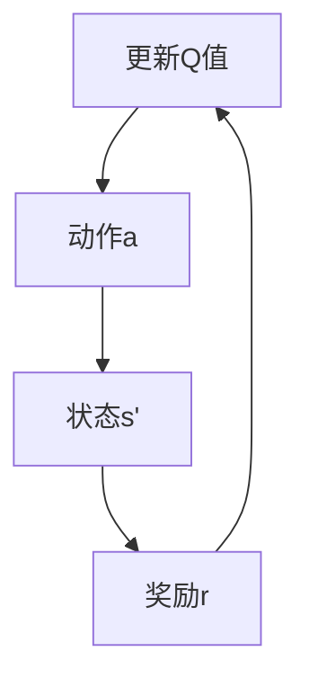
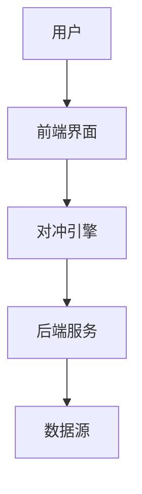
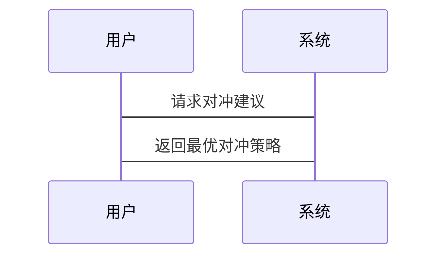

                 

# 深度强化学习在动态对冲策略中的应用

> 关键词：深度强化学习、动态对冲策略、金融风险管理、神经网络、强化学习算法

> 摘要：本文探讨了深度强化学习（Deep Reinforcement Learning，DRL）在动态对冲策略中的应用。文章首先介绍了深度强化学习的基本概念和动态对冲策略的核心原理，然后详细分析了DRL在金融风险管理中的优势和挑战。通过构建数学模型和算法框架，本文展示了如何将DRL应用于动态对冲策略，以优化投资组合的风险管理。文章还通过实际案例分析了DRL在动态对冲中的应用，并展望了未来的研究方向。

---

# 第1章：深度强化学习与动态对冲策略概述

## 1.1 深度强化学习的基本概念

### 1.1.1 深度学习与强化学习的结合

深度学习（Deep Learning）通过多层神经网络模型从数据中学习高层次特征，而强化学习（Reinforcement Learning）通过智能体与环境的交互来学习最优策略。深度强化学习（DRL）是两者的结合，利用深度神经网络作为策略或价值函数，通过与环境交互优化目标。

### 1.1.2 动态对冲策略的定义与特点

动态对冲策略是一种金融风险管理技术，旨在通过动态调整投资组合中的对冲头寸，以降低市场波动带来的风险。其特点是能够根据市场变化实时调整对冲策略，具有高度的灵活性和适应性。

## 1.2 深度强化学习在金融中的应用

### 1.2.1 金融市场的复杂性与不确定性

金融市场高度复杂，受多种因素影响，如市场波动、经济政策、投资者情绪等。传统的对冲策略在面对这些复杂性和不确定性时，往往难以适应快速变化的市场环境。

### 1.2.2 动态对冲策略在金融中的重要性

动态对冲策略能够实时调整对冲头寸，有效降低投资组合的风险。然而，传统的动态对冲策略依赖于复杂的数学模型和假设，难以在实际应用中实现最优调整。

## 1.3 本书的核心目标与结构安排

### 1.3.1 本书的核心目标

本文旨在探讨如何利用深度强化学习技术优化动态对冲策略，构建一种能够适应复杂金融环境的智能对冲系统。

### 1.3.2 本书的结构安排

文章将分为七章，从基础概念到实际应用，逐步展开深度强化学习在动态对冲策略中的应用。每章将详细阐述相关理论和方法，并通过案例分析验证其可行性。

---

# 第2章：深度强化学习的核心算法原理

## 2.1 深度强化学习的基本原理

### 2.1.1 强化学习的基本概念

强化学习是一种通过试错机制，智能体通过与环境交互，学习最优策略的机器学习方法。其核心在于通过奖励机制，引导智能体做出最优决策。

### 2.1.2 深度学习在强化学习中的应用

深度学习通过多层神经网络模型，能够从高维、复杂的数据中学习特征表示，为强化学习提供高效的策略或价值函数表示。

## 2.2 深度强化学习的核心算法

### 2.2.1 Q-learning算法

Q-learning是一种经典的强化学习算法，通过学习状态-动作值函数（Q-value）来优化决策策略。其算法流程如下：

### 2.2.2 Deep Q-Networks (DQN) 算法

DQN算法将Q-learning与深度神经网络结合，利用神经网络近似Q值函数，避免了传统Q-learning中离散动作空间的限制。

### 2.2.3 Policy Gradient Methods

策略梯度方法直接优化策略，通过计算梯度更新参数，使得策略在每次迭代中趋近于最优。

## 2.3 深度强化学习的数学模型

### 2.3.1 状态空间与动作空间的定义

状态空间表示智能体所处的环境状态，动作空间表示智能体可采取的动作。例如，在动态对冲策略中，状态可以是市场参数，动作可以是对冲头寸的调整。

### 2.3.2 Q-value函数的数学表达式

$$ Q(s, a) = \theta \cdot \phi(s, a) $$

其中，$\theta$是参数，$\phi(s, a)$是状态-动作对的特征向量。

### 2.3.3 策略函数的数学表达式

策略函数将状态映射到动作概率分布：

$$ \pi(a|s) = \text{softmax}(\theta \cdot \phi(s)) $$

## 2.4 深度强化学习的神经网络结构

### 2.4.1 卷积神经网络在强化学习中的应用

卷积神经网络（CNN）常用于处理具有空间结构的数据，如图像。在强化学习中，CNN可以用于处理高维状态空间。

### 2.4.2 循环神经网络在强化学习中的应用

循环神经网络（RNN）适合处理时序数据，能够捕捉状态间的依赖关系。

### 2.4.3 多层感知机在强化学习中的应用

多层感知机（MLP）是最常用的神经网络结构，适用于大多数强化学习场景。

---

# 第3章：动态对冲策略的数学模型与算法

## 3.1 动态对冲策略的基本概念

### 3.1.1 动态对冲的定义

动态对冲是一种实时调整对冲头寸的策略，以降低投资组合的市场风险。

### 3.1.2 动态对冲的数学模型

动态对冲策略可以通过随机过程建模，例如：

$$ dS_t = \mu dt + \sigma dW_t $$

其中，$S_t$是资产价格，$\mu$是漂移率，$\sigma$是波动率，$W_t$是布朗运动。

## 3.2 动态对冲策略的核心算法

### 3.2.1 基于随机过程的动态对冲模型

通过随机微分方程建模资产价格，动态调整对冲头寸以抵消风险。

### 3.2.2 基于状态空间模型的动态对冲算法

使用状态空间模型描述市场状态，并根据状态调整对冲策略。

## 3.3 动态对冲策略的优化方法

### 3.3.1 基于均值-方差优化的动态对冲策略

通过优化投资组合的均值和方差，实现风险与收益的最优平衡。

### 3.3.2 基于风险中性定价的动态对冲策略

利用风险中性定价方法，动态调整对冲头寸。

### 3.3.3 基于机器学习的动态对冲策略

将机器学习算法应用于动态对冲策略，以捕捉市场中的非线性关系。

---

# 第4章：深度强化学习与动态对冲策略的结合

## 4.1 深度强化学习在动态对冲中的应用

### 4.1.1 深度强化学习在动态对冲中的优势

DRL能够处理高维、非线性的状态空间，适用于复杂金融市场的动态对冲。

### 4.1.2 深度强化学习在动态对冲中的挑战

市场环境的高度不确定性增加了DRL模型的训练难度。

## 4.2 动态对冲策略中的强化学习建模

### 4.2.1 状态空间的定义与建模

将市场参数（如资产价格、波动率等）作为状态输入。

### 4.2.2 动作空间的定义与建模

将对冲头寸的调整动作（如增加或减少头寸）作为动作输出。

### 4.2.3 奖励函数的设计与实现

奖励函数衡量对冲策略的收益与风险，例如：

$$ R = -\text{VaR} + \text{Return} $$

其中，VaR是风险价值，Return是收益。

## 4.3 深度强化学习在动态对冲中的策略优化

### 4.3.1 基于Q-learning的动态对冲策略优化

通过Q-learning算法优化对冲策略，实现最优风险调整。

### 4.3.2 基于策略梯度的动态对冲策略优化

利用策略梯度方法直接优化对冲策略，提高策略的稳定性。

---

# 第5章：系统分析与架构设计方案

## 5.1 问题场景介绍

构建一个实时动态对冲系统，应用于股票投资组合的风险管理。

## 5.2 系统功能设计

### 5.2.1 领域模型

### 5.2.2 系统架构

### 5.2.3 接口设计

系统接口包括数据接口、用户接口和引擎接口。

### 5.2.4 交互设计

---

# 第6章：项目实战

## 6.1 环境配置

安装必要的库，如TensorFlow、Keras、OpenAI Gym等。

## 6.2 核心实现

### 6.2.1 环境构建

定义动态对冲的环境，包括状态空间、动作空间和奖励函数。

### 6.2.2 神经网络设计

设计深度神经网络结构，如DQN的主网和目标网。

### 6.2.3 训练过程

通过强化学习算法训练模型，优化对冲策略。

## 6.3 实际案例分析

通过具体案例展示DRL在动态对冲中的应用，分析其效果和优势。

## 6.4 小结

总结项目实施的关键点和注意事项。

---

# 第7章：总结与展望

## 7.1 总结

本文探讨了深度强化学习在动态对冲策略中的应用，展示了其在金融风险管理中的优势。

## 7.2 展望

未来研究可以进一步优化算法，扩展应用场景，提升动态对冲策略的智能化水平。

---

# 附录

## 附录A：术语表

列出文章中涉及的专业术语及其简要解释。

## 附录B：参考文献

列出文章中引用的相关文献和资料。

---

通过以上结构和内容，文章系统地介绍了深度强化学习在动态对冲策略中的应用，从理论到实践，为读者提供了全面的视角和深入的分析。

