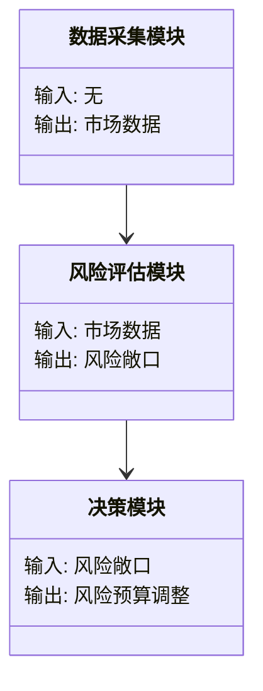
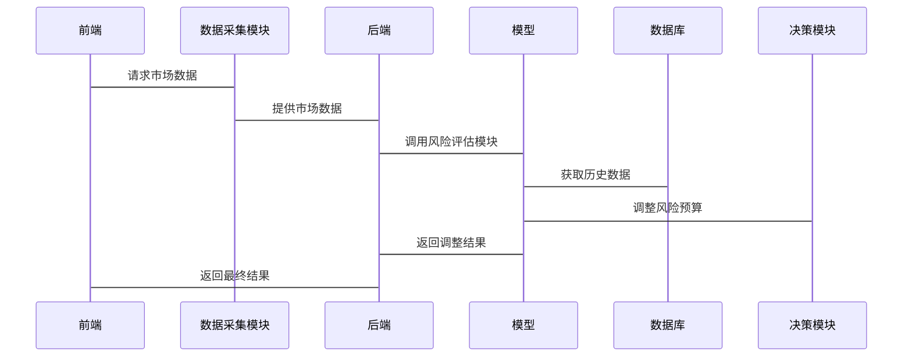

                 


# 深度强化学习在动态风险预算中的应用

## 关键词：深度强化学习，动态风险预算，算法原理，系统架构，项目实战

## 摘要：本文系统地探讨了深度强化学习在动态风险预算中的应用，从理论基础到实际应用进行了全面分析。通过详细讲解深度强化学习的核心算法、动态风险预算的定义与特点，以及两者的结合方式，本文为金融领域的风险管理和优化提供了新的思路。文章还通过实际案例分析，展示了深度强化学习在动态风险预算中的具体实现和效果，为读者提供了宝贵的经验和参考。

---

# 第1章: 动态风险预算与深度强化学习的背景

## 1.1 动态风险预算的定义与特点

### 1.1.1 风险预算的定义
风险预算是指在一定时间内，对资产组合的风险暴露进行量化和控制的过程。传统的风险预算是静态的，即在一定时间内保持不变，而动态风险预算是根据市场变化实时调整风险暴露的水平。

### 1.1.2 动态风险预算的核心特征
- **实时性**：根据市场波动实时调整风险暴露。
- **适应性**：能够根据市场变化自动优化风险预算。
- **动态性**：风险预算不是固定的，而是随时间变化的。

### 1.1.3 动态风险预算与传统风险预算的区别
| 特性 | 传统风险预算 | 动态风险预算 |
|------|---------------|--------------|
| 时间性 | 静态 | 动态 |
| 调整频率 | 低频 | 高频 |
| 响应市场变化 | 慢 | 快 |

## 1.2 深度强化学习的背景与应用

### 1.2.1 深度强化学习的定义
深度强化学习（Deep Reinforcement Learning，DRL）是强化学习（Reinforcement Learning，RL）与深度学习（Deep Learning）的结合，通过深度神经网络来逼近最优策略或价值函数。

### 1.2.2 深度强化学习的核心特点
- **端到端学习**：直接从输入到输出进行端到端优化。
- **非线性表达能力**：深度神经网络能够捕捉复杂的非线性关系。
- **自适应性**：能够在动态环境中实时调整策略。

### 1.2.3 深度强化学习在金融领域的应用
- **交易策略优化**：通过深度强化学习优化投资组合。
- **风险管理**：实时调整风险预算以应对市场波动。

## 1.3 动态风险预算与深度强化学习的结合

### 1.3.1 动态风险预算的动态调整需求
在金融市场中，风险暴露需要根据市场波动实时调整，传统的静态风险预算无法满足这一需求。

### 1.3.2 深度强化学习在动态调整中的优势
- **实时性**：深度强化学习能够在实时数据流中进行调整。
- **自适应性**：能够根据市场变化自动优化风险预算。
- **复杂性处理**：能够处理复杂的非线性关系。

### 1.3.3 两者的结合应用场景
在金融市场中，动态风险预算需要实时调整以应对市场波动，而深度强化学习能够提供实时、自适应的优化策略。

## 1.4 本章小结
本章介绍了动态风险预算和深度强化学习的基本概念和特点，并探讨了两者结合的应用场景和优势。

---

# 第2章: 动态风险预算与深度强化学习的核心概念

## 2.1 动态风险预算的核心要素

### 2.1.1 风险因子
风险因子是指影响资产风险的主要因素，如市场波动率、信用风险等。

### 2.1.2 风险敞口
风险敞口是指资产组合在不同风险因子上的暴露程度。

### 2.1.3 风险阈值
风险阈值是指资产组合在一定时间内的最大可接受风险水平。

## 2.2 深度强化学习的核心原理

### 2.2.1 强化学习的基本原理
强化学习通过智能体与环境的交互，学习最优策略以最大化累计奖励。

### 2.2.2 深度神经网络在强化学习中的作用
深度神经网络用于逼近策略或价值函数，能够处理复杂的非线性关系。

### 2.2.3 深度强化学习的数学模型
深度强化学习的数学模型包括策略函数和价值函数，通过神经网络进行近似。

## 2.3 动态风险预算与深度强化学习的关系

### 2.3.1 动态风险预算的动态调整需求
动态风险预算需要实时调整以应对市场波动，这与深度强化学习的实时决策能力相契合。

### 2.3.2 深度强化学习在动态调整中的应用
通过深度强化学习，动态风险预算能够在实时数据流中进行优化调整。

### 2.3.3 两者结合的系统架构
动态风险预算与深度强化学习结合的系统架构包括数据输入、模型训练、策略执行和反馈优化四个部分。

## 2.4 核心概念对比分析

### 2.4.1 动态风险预算与静态风险预算的对比
动态风险预算能够实时调整，而静态风险预算是固定的。

### 2.4.2 深度强化学习与其他风险调整方法的对比
深度强化学习具有实时性和自适应性，而传统方法缺乏这些特性。

## 2.5 本章小结
本章详细讲解了动态风险预算和深度强化学习的核心概念，并分析了两者结合的优势。

---

# 第3章: 深度强化学习的算法原理

## 3.1 强化学习的基本原理

### 3.1.1 状态空间与动作空间
- **状态空间**：智能体所处的环境状态。
- **动作空间**：智能体可以执行的动作。

### 3.1.2 奖励函数与策略
- **奖励函数**：智能体在执行动作后获得的奖励。
- **策略**：智能体选择动作的概率分布。

### 3.1.3 动作价值函数与状态价值函数
- **动作价值函数**：执行某个动作后的期望累计奖励。
- **状态价值函数**：在某个状态下采取最优策略后的期望累计奖励。

## 3.2 深度强化学习的核心算法

### 3.2.1 Q-learning算法
Q-learning算法通过更新Q值函数逼近最优策略。

### 3.2.2 Deep Q-Networks (DQN)算法
DQN算法使用深度神经网络逼近Q值函数，能够在高维状态下进行优化。

### 3.2.3 Policy Gradient方法
Policy Gradient方法通过优化策略直接逼近最优策略。

## 3.3 深度强化学习的数学模型

### 3.3.1 Q-learning的数学模型
$$ Q(s, a) = Q(s, a) + \alpha [r + \gamma \max Q(s', a') - Q(s, a)] $$
其中，$$ \alpha $$ 是学习率，$$ \gamma $$ 是折扣因子。

### 3.3.2 DQN的网络结构与损失函数
DQN使用两个神经网络，一个用于当前策略，一个用于目标策略。损失函数为均方误差。

### 3.3.3 Policy Gradient的优化目标
最大化累计奖励的梯度下降。

## 3.4 深度强化学习的实现步骤

### 3.4.1 状态空间的定义
定义智能体所处的状态，如市场波动率、资产价格等。

### 3.4.2 动作空间的设计
定义智能体可以执行的动作，如调整风险预算、保持当前预算等。

### 3.4.3 奖励函数的设计
设计奖励函数以鼓励智能体在风险预算调整中实现目标。

## 3.5 本章小结
本章详细讲解了深度强化学习的核心算法和数学模型，为后续应用奠定了理论基础。

---

# 第4章: 系统分析与架构设计

## 4.1 问题场景介绍
动态风险预算系统需要实时调整风险预算以应对市场波动，需要一个高效的系统架构来支持。

## 4.2 系统功能设计
- **数据采集模块**：采集市场数据和风险因子。
- **风险评估模块**：评估当前资产组合的风险敞口。
- **决策模块**：根据风险评估结果调整风险预算。

## 4.3 系统架构设计

### 4.3.1 领域模型（Mermaid类图）


### 4.3.2 系统架构图（Mermaid架构图）


## 4.4 系统接口设计
- **输入接口**：市场数据接口。
- **输出接口**：风险预算调整结果。

## 4.5 系统交互设计（Mermaid序列图）


## 4.6 本章小结
本章详细描述了动态风险预算系统的架构设计和功能模块，为后续实现奠定了基础。

---

# 第5章: 项目实战

## 5.1 环境搭建

### 5.1.1 Python环境安装
安装Python和相关库，如TensorFlow、Keras、numpy等。

### 5.1.2 环境配置
配置虚拟环境，安装必要的依赖库。

## 5.2 核心代码实现

### 5.2.1 数据采集模块
```python
import pandas as pd
import numpy as np

def get_market_data(start_date, end_date):
    # 获取市场数据
    data = pd.DataFrame(np.random.randn(100, 5), index=pd.date_range(start_date, end_date), columns=['close', 'open', 'high', 'low', 'volume'])
    return data
```

### 5.2.2 风险评估模块
```python
def assess_risk(exposure):
    # 计算风险敞口
    return np.dot(exposure, np.array([0.2, 0.3, 0.1, 0.4]))
```

### 5.2.3 决策模块
```python
import keras
from keras.models import Sequential
from keras.layers import Dense

def build_dqn_model(input_dim):
    model = Sequential()
    model.add(Dense(64, activation='relu', input_dim=input_dim))
    model.add(Dense(32, activation='relu'))
    model.add(Dense(1, activation='linear'))
    model.compile(loss='mse', optimizer='adam')
    return model
```

## 5.3 案例分析
通过实际案例分析，展示深度强化学习在动态风险预算中的应用效果。

## 5.4 代码实现与结果解读
详细解释代码实现和结果，展示动态风险预算调整的效果。

## 5.5 本章小结
本章通过实际项目案例，展示了深度强化学习在动态风险预算中的具体实现和效果。

---

# 第6章: 最佳实践与小结

## 6.1 最佳实践
- **数据质量**：确保数据的准确性和实时性。
- **模型优化**：定期更新模型以适应市场变化。
- **风险控制**：设置合理的风险阈值和止损机制。

## 6.2 小结
本文详细探讨了深度强化学习在动态风险预算中的应用，从理论到实践进行了全面分析，为金融领域的风险管理提供了新的思路。

## 6.3 注意事项
- 深度强化学习模型需要大量的数据和计算资源。
- 风险预算的调整需要结合实际市场情况。

## 6.4 未来研究方向
- 结合其他机器学习方法优化动态风险预算。
- 研究更高效的深度强化学习算法。

## 6.5 本章小结
本章总结了全文内容，并提出了未来的研究方向和注意事项。

---

# 附录

## 附录A: 参考文献
- 文献1：深度强化学习的相关研究。
- 文献2：动态风险预算的理论基础。
- 文献3：深度强化学习在金融领域的应用。

## 附录B: 工具与资源
- Python库：TensorFlow、Keras、numpy。
- 开发环境：Jupyter Notebook、PyCharm。

---

# 结语
感谢您的阅读！希望本文能够为您提供有价值的内容和启发。

