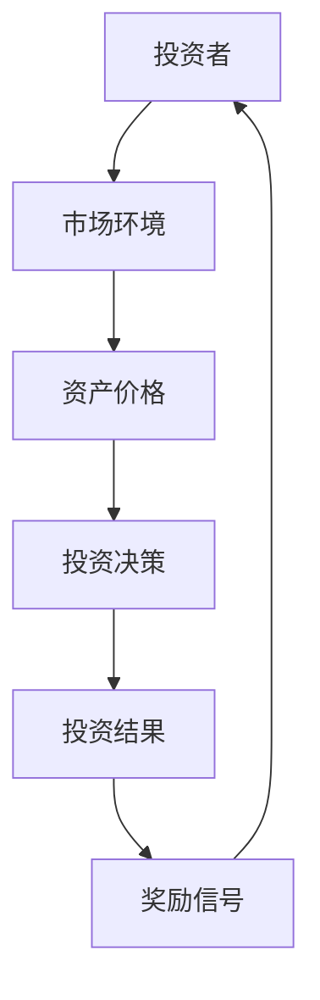

                 


# 深度强化学习在多周期投资决策中的应用

> 关键词：深度强化学习，多周期投资，强化学习，投资决策，金融建模

> 摘要：本文探讨了深度强化学习（DRL）在多周期投资决策中的应用。通过分析DRL的核心原理、算法实现、系统架构，结合实际案例，展示了如何利用DRL优化投资策略，提升决策效率和准确性。文章内容涵盖从基础概念到高级应用的全过程，为金融领域的技术实践者提供有价值的参考。

---

## 第一部分: 深度强化学习与多周期投资决策概述

### 第1章: 深度强化学习的基本概念

#### 1.1 强化学习的基本原理

- **1.1.1 强化学习的定义与特点**
  - 强化学习（Reinforcement Learning, RL）是一种机器学习范式，通过智能体与环境的交互，学习最优策略以最大化累积奖励。
  - 特点：基于反馈的试错学习，非监督学习，策略优化。

- **1.1.2 深度强化学习的核心概念**
  - 结合深度学习与强化学习，利用神经网络处理高维状态空间。
  - 突破传统RL在复杂环境中的应用限制。

- **1.1.3 深度强化学习与传统机器学习的区别**
  - 数据需求：DRL依赖环境反馈，传统ML依赖标注数据。
  - 目标函数：DRL优化奖励函数，传统ML优化预测准确性。

#### 1.2 多周期投资决策的定义与特点

- **1.2.1 投资决策的基本概念**
  - 投资决策：在不同时间点做出买入、持有或卖出资产的决策。
  - 多周期：涉及多个时间段的连续决策，考虑资产价格的动态变化。

- **1.2.2 多周期投资的挑战与复杂性**
  - 市场动态：价格波动、市场情绪变化影响决策。
  - 多目标：风险与收益的平衡，短期与长期目标的协调。

- **1.2.3 深度强化学习在多周期投资中的优势**
  - 处理复杂非线性关系，适应动态变化的市场环境。

---

### 第2章: 深度强化学习在投资决策中的应用背景

#### 2.1 当前投资决策的主要方法

- **2.1.1 基于统计的方法**
  - 市场平均数、历史数据分析，依赖统计假设。

- **2.1.2 基于机器学习的方法**
  - 使用回归、分类模型预测价格，依赖大量历史数据。

- **2.1.3 基于规则的方法**
  - 固定的买卖规则，如移动平均线策略。

#### 2.2 深度强化学习在投资中的独特优势

- **2.2.1 非线性关系的捕捉能力**
  - 神经网络能够捕捉市场中的复杂模式。

- **2.2.2 动态决策的优势**
  - 能够根据实时反馈调整策略。

- **2.2.3 多目标优化的能力**
  - 在收益、风险、流动性之间找到平衡点。

---

### 第3章: 深度强化学习的核心概念与联系

#### 3.1 深度强化学习的数学模型

- **3.1.1 状态空间的定义**
  - 状态：市场数据、资产价格、持有仓位等。

- **3.1.2 动作空间的定义**
  - 动作：买入、卖出、持有。

- **3.1.3 奖励函数的设计**
  - 奖励：基于投资收益、风险指标等。

#### 3.2 深度强化学习算法的核心原理

- **3.2.1 Q-learning算法的原理**
  - 动作值函数：$Q(s, a)$ 表示状态s下动作a的预期奖励。
  - 更新公式：$$ Q(s, a) = Q(s, a) + \alpha [r + \gamma \max Q(s', a') - Q(s, a)] $$

- **3.2.2 Deep Q-Networks (DQN) 的原理**
  - 使用神经网络近似Q值函数。
  - 网络结构：输入层（市场数据）→ 隐藏层 → 输出层（Q值）。

- **3.2.3 Policy Gradient Methods 的原理**
  - 直接优化策略，而非值函数。
  - 策略函数：$ \pi(a|s) $，表示在状态s下选择动作a的概率。

#### 3.3 深度强化学习与投资决策的实体关系图



---

### 第4章: 深度强化学习算法的数学模型与公式

#### 4.1 DQN算法的数学模型

- **Q-learning的更新公式：**
  $$ Q(s, a) = Q(s, a) + \alpha [r + \gamma \max Q(s', a') - Q(s, a)] $$

- **DQN的神经网络结构：**
  - 输入：状态向量。
  - 输出：动作值函数Q(s, a)。

#### 4.2 实际应用中的优化

- **经验回放：**
  - 使用经验回放缓冲区存储历史经验，随机采样以减少相关性。

- **目标网络：**
  - 使用目标网络作为稳定器，定期更新主网络。

---

## 第二部分: 投资决策系统的深度强化学习架构

### 第5章: 系统分析与架构设计

#### 5.1 问题场景介绍

- **多周期投资决策问题：**
  - 需要考虑多个时间点的决策，资产价格的动态变化。

#### 5.2 系统功能设计

- **功能模块：**
  1. 数据采集模块：获取市场数据。
  2. 特征提取模块：处理市场数据，提取有用特征。
  3. 策略生成模块：基于DRL算法生成投资策略。
  4. 策略执行模块：根据策略执行交易。

#### 5.3 系统架构设计


#### 5.4 接口设计与交互

- **数据接口：**
  - 输入：市场数据、当前仓位。
  - 输出：决策动作。

- **交互流程：**
  - 系统接收市场数据，生成策略，执行交易，并反馈结果。

---

### 第6章: 项目实战

#### 6.1 环境安装

- **安装Python环境：**
  - 使用Anaconda或虚拟环境，安装TensorFlow、Keras、numpy等库。

#### 6.2 核心代码实现

```python
import numpy as np
import tensorflow as tf
from tensorflow.keras.models import Sequential
from tensorflow.keras.layers import Dense

# 定义DQN网络
def build_dqn(input_dim, action_dim):
    model = Sequential()
    model.add(Dense(64, activation='relu', input_dim=input_dim))
    model.add(Dense(action_dim))
    return model

# 定义经验回放类
class ReplayBuffer:
    def __init__(self, max_size):
        self.max_size = max_size
        self.buffer = []
    
    def add(self, experience):
        if len(self.buffer) < self.max_size:
            self.buffer.append(experience)
        else:
            self.buffer.pop(0)
    
    def sample(self, batch_size):
        indices = np.random.randint(len(self.buffer), size=batch_size)
        return [self.buffer[i] for i in indices]
```

#### 6.3 案例分析

- **股票投资案例：**
  - 数据来源：历史股票价格。
  - 策略执行：DRL算法生成买卖信号。

#### 6.4 代码解读与分析

- **DQN网络：**
  - 输入层：市场数据（如开盘价、收盘价等）。
  - 隐藏层：处理非线性关系。
  - 输出层：动作值（买入、卖出、持有）。

---

## 第三部分: 最佳实践与未来展望

### 第7章: 最佳实践

#### 7.1 小结

- 深度强化学习在多周期投资中的应用前景广阔。
- 系统设计需要考虑实时性、稳定性。

#### 7.2 注意事项

- 数据质量：需要高质量的市场数据。
- 模型调优：需要多次试验和优化。

#### 7.3 未来研究方向

- 多智能体DRL：多个投资者的互动。
- 结合NLP：分析新闻公告对市场的影响。

#### 7.4 拓展阅读

- 推荐书籍：《深度强化学习入门》。
- 推荐论文：相关领域的最新研究成果。

---

## 总结

深度强化学习在多周期投资决策中的应用，为金融领域带来了新的可能性。通过系统化的架构设计和实际案例分析，展示了DRL在优化投资策略方面的强大能力。未来，随着算法的改进和计算能力的提升，DRL在投资决策中的应用将更加广泛和深入。

