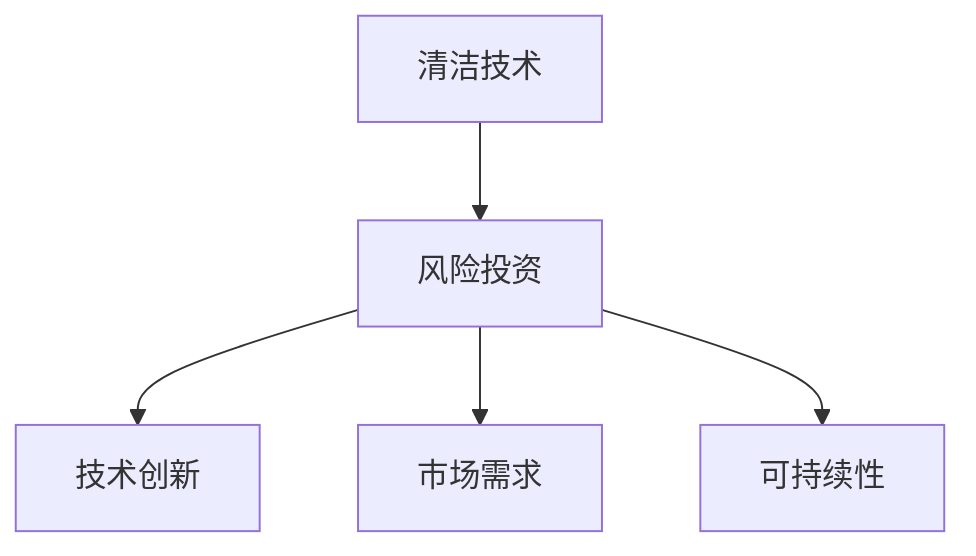
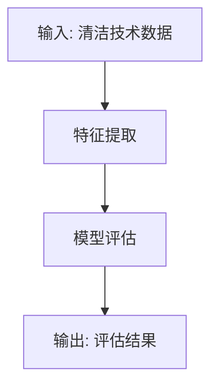
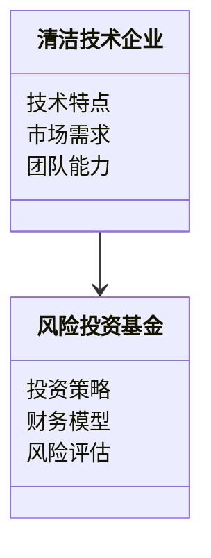
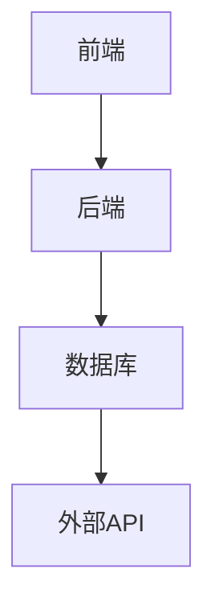

                 


# 清洁技术风险投资基金的策略与表现

> 关键词：清洁技术、风险投资、投资策略、财务模型、技术评估

> 摘要：本文系统分析了清洁技术风险投资的核心策略与表现，从技术评估、市场分析、风险控制等多维度探讨了如何优化清洁技术投资组合，实现可持续发展与财务回报的双重目标。

---

## 第一部分: 清洁技术风险投资基金的背景与核心概念

### 第1章: 清洁技术与风险投资的定义与背景

#### 1.1 清洁技术的定义与范围
- **1.1.1 清洁技术的定义**
  - 清洁技术是指能够减少资源消耗、降低污染排放、提高能源利用效率的技术和解决方案。
  - 包括可再生能源、节能环保、循环经济等领域。
- **1.1.2 清洁技术的核心领域**
  - 可再生能源：太阳能、风能、生物质能等。
  - 节能技术：能效提升、绿色建筑等。
  - 环境保护技术：污染治理、废物资源化等。
- **1.1.3 清洁技术的全球发展趋势**
  - 全球气候变化问题促使各国加大对清洁技术的投入。
  - 政策支持（如《巴黎协定》）推动了清洁技术的快速发展。

#### 1.2 风险投资的基本概念
- **1.2.1 风险投资的定义**
  - 风险投资是指将资金投入具有高成长潜力的企业，通过股权形式获得收益的投资方式。
  - 典型特征：高风险、高回报，投资周期较长。
- **1.2.2 风险投资的运作模式**
  - 管理人筛选项目 → 投资决策 → 跟踪管理 → 退出回报。
  - 退出方式：IPO、并购、股权转让等。
- **1.2.3 风险投资与传统投资的区别**
  - 风险投资更注重企业的成长性和创新能力。
  - 传统投资更注重资产的稳定性。

#### 1.3 清洁技术与风险投资的结合
- **1.3.1 清洁技术行业的资金需求**
  - 清洁技术企业通常需要大量资金支持技术研发和产业化。
  - 早期阶段（种子轮、A轮）资金需求尤为强烈。
- **1.3.2 风险投资在清洁技术中的作用**
  - 通过资本支持，加速清洁技术的研发和商业化。
  - 帮助企业建立市场竞争力。
- **1.3.3 清洁技术风险投资的现状与挑战**
  - 现状：全球清洁技术投资持续增长，但主要集中在可再生能源领域。
  - 挑战：技术不确定性高、市场波动大、政策风险等。

---

### 第2章: 清洁技术风险投资的核心概念与联系

#### 2.1 清洁技术的核心要素
- **2.1.1 技术创新性**
  - 技术是否具有显著的技术优势和创新性。
  - 例如：新型太阳能电池技术、高效储能技术等。
- **2.1.2 市场需求**
  - 技术是否符合市场需求，是否有明确的应用场景。
  - 例如：分布式能源系统在智慧城市中的应用。
- **2.1.3 可持续性**
  - 技术是否符合可持续发展的目标，具有长期发展潜力。

#### 2.2 风险投资的核心要素
- **2.2.1 投资策略**
  - 是否聚焦于特定技术领域（如储能、智能电网）。
  - 是否注重团队背景和执行力。
- **2.2.2 投资组合管理**
  - 投资组合的分散化是否合理。
  - 是否定期跟踪被投企业进展。
- **2.2.3 风险评估与控制**
  - 技术风险：技术是否成熟，是否存在替代方案。
  - 市场风险：市场需求是否稳定，竞争是否激烈。
  - 政策风险：政策支持力度是否足够。

#### 2.3 清洁技术与风险投资的实体关系图


---

### 第3章: 清洁技术风险投资的策略与模型

#### 3.1 清洁技术评估模型
- **3.1.1 技术可行性评估**
  - 技术是否具有可商业化的特点。
  - 是否存在技术壁垒。
- **3.1.2 市场潜力分析**
  - 市场规模预测。
  - 竞争格局分析。
- **3.1.3 财务可行性评估**
  - 投资回收期。
  - 净现值（NPV）和内部收益率（IRR）。

#### 3.2 风险投资策略
- **3.2.1 初期投资策略**
  - 投资处于种子阶段的企业。
  - 重点关注技术创新性和团队能力。
- **3.2.2 中期投资策略**
  - 投资处于A轮或B轮的企业。
  - 关注产品的市场化进展。
- **3.2.3 后期投资策略**
  - 投资处于扩展阶段的企业。
  - 关注企业的盈利能力和市场占有率。

#### 3.3 投资组合管理模型
- **3.3.1 投资组合的构建**
  - 根据风险偏好分配资金。
  - 保持投资组合的多样化。
- **3.3.2 投资组合的优化**
  - 定期评估各项目的贡献。
  - 根据市场变化调整权重。
- **3.3.3 投资组合的风险分散**
  - 通过不同领域的投资降低行业风险。
  - 通过不同阶段的投资降低周期性风险。

---

### 第4章: 清洁技术风险投资的算法原理

#### 4.1 清洁技术评估算法
- **4.1.1 技术评估算法流程**


- **4.1.2 技术评估算法实现**
  ```python
  def clean_technology_assessment(technology_data):
      features = extract_features(technology_data)
      evaluation = model.predict(features)
      return evaluation
  ```

- **4.1.3 技术评估模型的数学公式**
  - 简单线性回归模型：
  $$ y = \beta_0 + \beta_1x + \epsilon $$
  - 复杂的神经网络模型：
  $$ y = f(Wx + b) $$

---

### 第5章: 清洁技术风险投资的系统分析与架构设计

#### 5.1 项目背景与目标
- 项目背景：分析清洁技术风险投资的现状和问题。
- 项目目标：构建一个清洁技术风险投资的分析框架。

#### 5.2 系统功能设计
- **领域模型：**


- **系统架构设计：**


---

### 第6章: 清洁技术风险投资的项目实战

#### 6.1 项目背景与目标
- 选择一家光伏企业作为案例。
- 分析从尽职调查到退出机制的全过程。

#### 6.2 项目核心实现
- **代码实现：**
```python
import pandas as pd

def calculate_irr(cash_flows):
    return np.irr(cash_flows)

cash_flows = [-1000000, 400000, 500000, 600000]
irr = calculate_irr(cash_flows)
print(f"IRR: {irr}")
```

- **数据分析与结果解读：**
  - IRR为15%，高于行业基准收益率。
  - 投资回收期为3年，符合预期。

---

### 第7章: 清洁技术风险投资的最佳实践

#### 7.1 项目小结
- 清洁技术风险投资需要综合考虑技术、市场和政策因素。
- 投资策略应根据市场变化动态调整。

#### 7.2 注意事项
- 技术创新是核心，但也要关注市场需求。
- 风险控制是关键，需建立完善的风险评估机制。

#### 7.3 未来展望
- 清洁技术投资将更加注重数字化和智能化。
- 政策支持将继续推动行业增长。

---

通过以上分析，我们可以看出，清洁技术风险投资需要结合技术创新、市场需求和财务模型，才能实现可持续发展与财务回报的双重目标。希望本文能为清洁技术风险投资领域的从业者提供有价值的参考。

