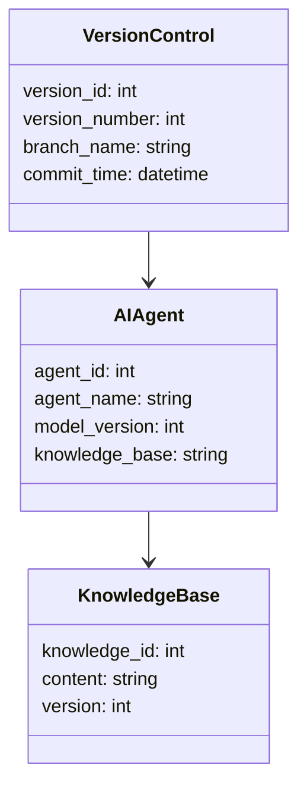
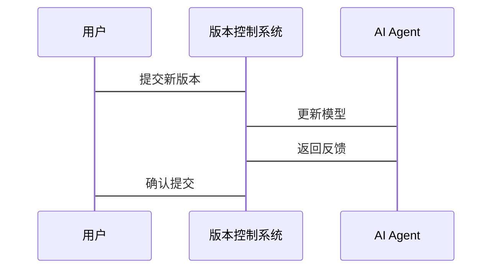

                 


# 版本控制：管理AI Agent的演进

---

## 关键词

版本控制、AI Agent、演进、系统架构、算法原理

---

## 摘要

AI Agent作为一种智能实体，其行为和能力的演进需要通过有效的版本控制来管理。本文从版本控制的基本概念出发，详细探讨了版本控制在AI Agent演进中的作用，分析了AI Agent的定义、特点及其与版本控制的关联性。通过对比分析，本文揭示了版本控制在AI Agent演进中的核心原理，并结合实际案例，展示了如何通过系统架构设计和算法实现，构建一个支持AI Agent演进的版本控制系统。最后，本文总结了版本控制在AI Agent管理中的重要性，并展望了未来的发展方向。

---

## 第一部分：版本控制与AI Agent的背景介绍

### 第1章：版本控制的基本概念与AI Agent的关联

#### 1.1 版本控制的核心概念

版本控制是一种跟踪和管理文件或系统变化的技术，主要用于记录每个版本的状态、依赖关系和变更历史。在软件开发中，版本控制帮助团队协作、追溯问题、恢复到特定状态，并支持分支开发和合并流程。版本控制的核心功能包括：

- **版本记录**：记录每个版本的状态和变更历史。
- **分支与合并**：支持并行开发和版本合并。
- **冲突解决**：处理不同版本之间的冲突。
- **版本标签**：为特定版本打标签以便快速定位。

版本控制在AI Agent的演进中扮演了重要角色，因为它可以跟踪AI Agent的行为、模型和知识的更新，确保演进过程的可追溯性和稳定性。

#### 1.2 AI Agent的定义与特点

AI Agent（人工智能代理）是一种能够感知环境、执行任务并做出决策的智能实体。AI Agent的核心特点包括：

- **自主性**：能够在没有外部干预的情况下自主执行任务。
- **反应性**：能够感知环境并实时做出响应。
- **学习能力**：通过数据和经验不断优化自身行为。
- **社交能力**：能够与其他AI Agent或人类进行交互和协作。

AI Agent的演进是指其在任务执行过程中，通过学习和优化逐步提升能力的过程。版本控制在这一过程中至关重要，因为它需要记录AI Agent的每一次更新，确保演进的可追溯性和可靠性。

#### 1.3 版本控制与AI Agent的关联性

AI Agent的演进需要版本控制来管理其行为、模型和知识的更新。版本控制在以下方面与AI Agent密切相关：

- **行为记录**：记录AI Agent在不同版本中的行为模式。
- **模型更新**：管理AI Agent模型的更新和优化。
- **知识管理**：跟踪AI Agent知识库的变更和扩展。

通过版本控制，可以确保AI Agent的演进过程透明、可追溯，并能够在需要时恢复到特定版本。

---

### 1.4 本章小结

本章介绍了版本控制的基本概念及其在AI Agent演进中的作用，详细阐述了AI Agent的定义和特点，并分析了版本控制与AI Agent之间的关联性。接下来，我们将深入探讨版本控制与AI Agent的核心概念与联系。

---

## 第二部分：版本控制与AI Agent的核心概念与联系

### 第2章：版本控制与AI Agent的核心概念原理

#### 2.1 版本控制的原理

版本控制的实现依赖于分支与合并机制、版本号计算和冲突解决等核心原理。

- **分支与合并机制**：分支用于并行开发，合并用于将分支的变更整合到主分支。
- **版本号计算**：通过数学模型计算版本号，确保版本的唯一性和有序性。
- **冲突解决**：通过算法检测和解决不同版本之间的冲突。

#### 2.2 AI Agent的演进机制

AI Agent的演进机制包括迭代过程、知识更新和优化。

- **迭代过程**：AI Agent通过不断迭代更新其行为和模型。
- **知识更新**：AI Agent通过学习和训练更新其知识库。
- **优化**：通过优化算法提升AI Agent的性能和能力。

#### 2.3 版本控制与AI Agent的关联性分析

版本控制在AI Agent演进中的作用体现在以下方面：

- **行为记录**：记录AI Agent在不同版本中的行为模式。
- **模型更新**：管理AI Agent模型的更新和优化。
- **知识管理**：跟踪AI Agent知识库的变更和扩展。

#### 2.4 核心概念对比表格

| **属性**       | **版本控制**                     | **AI Agent**                     |
|----------------|----------------------------------|----------------------------------|
| 核心功能       | 记录版本变更、支持分支与合并       | 感知环境、自主决策、学习优化       |
| 关键要素       | 版本号、分支、冲突解决           | 行为、模型、知识库               |
| 目标           | 管理文件或系统的变更             | 提升智能实体的能力和性能           |

#### 2.5 ER实体关系图

```mermaid
erd
  entity VersionControl {
    key: version_id
    version_number: int
    branch_name: string
    commit_time: datetime
  }
  entity AIAgent {
    key: agent_id
    agent_name: string
    model_version: int
    knowledge_base: string
  }
  version_control has_many ai_agents
  ai_agent has_one version_control
```

---

## 第三部分：版本控制与AI Agent的算法原理

### 第3章：版本控制与AI Agent的算法原理

#### 3.1 版本控制的算法流程

版本控制的算法流程包括以下步骤：

1. **创建版本**：生成新的版本号并记录变更。
2. **分支与合并**：创建分支进行开发，合并分支到主分支。
3. **冲突检测**：检测不同版本之间的冲突。
4. **冲突解决**：手动或自动解决冲突。
5. **版本标签**：为特定版本打标签。

流程图如下：

```mermaid
graph TD
    A[开始] -> B[创建新版本]
    B -> C[生成版本号]
    C -> D[记录变更]
    D -> E[分支开发]
    E -> F[合并分支]
    F -> G[冲突检测]
    G -> H[解决冲突]
    H -> I[打标签]
    I -> 结束
```

#### 3.2 AI Agent演进的算法原理

AI Agent的演进算法包括以下步骤：

1. **感知环境**：AI Agent感知环境并获取输入。
2. **决策制定**：基于当前知识和模型做出决策。
3. **执行操作**：执行决策并生成输出。
4. **反馈学习**：根据反馈更新知识和模型。
5. **优化提升**：通过优化算法提升性能。

流程图如下：

```mermaid
graph TD
    A[开始] -> B[感知环境]
    B -> C[决策制定]
    C -> D[执行操作]
    D -> E[获取反馈]
    E -> F[更新知识]
    F -> G[优化提升]
    G -> 结束
```

#### 3.3 算法实现的Python代码示例

以下是一个版本控制算法的Python代码示例：

```python
def create_version(agent, current_version):
    # 生成新版本号
    new_version = current_version + 1
    # 记录变更
    commit = {
        'version': new_version,
        'changes': get_changes(agent),
        'time': datetime.now()
    }
    # 打标签
    tag = f'version_{new_version}'
    return commit, tag
```

数学模型与公式：

版本号计算公式：
$$ \text{new\_version} = \text{current\_version} + 1 $$

冲突解决算法示例：
$$ \text{解决冲突} = \text{选择最新版本} $$

---

## 第四部分：版本控制与AI Agent的系统分析与架构设计

### 第4章：版本控制与AI Agent的系统分析与架构设计

#### 4.1 系统功能设计

系统功能包括版本管理、AI Agent管理、知识库管理和冲突解决。

- **版本管理**：记录和管理版本信息。
- **AI Agent管理**：管理AI Agent的行为和模型。
- **知识库管理**：跟踪知识库的变更和扩展。
- **冲突解决**：检测和解决版本冲突。

领域模型类图如下：



#### 4.2 系统架构设计

系统架构包括数据层、逻辑层和接口层。

- **数据层**：存储版本信息和知识库。
- **逻辑层**：实现版本控制和AI Agent的逻辑。
- **接口层**：提供API供其他系统调用。

架构图如下：


#### 4.3 系统接口设计

系统接口包括：

- `get_version_info(version_id)`：获取指定版本的信息。
- `update_agent_model(agent_id, new_model)`：更新AI Agent的模型。
- `resolve_conflict(branch1, branch2)`：解决分支冲突。

#### 4.4 系统交互流程

系统交互流程如下：



---

## 第五部分：版本控制与AI Agent的项目实战

### 第5章：版本控制与AI Agent的项目实战

#### 5.1 环境安装

需要安装以下工具：

- Git：版本控制工具。
- Python：编程语言。
- TensorFlow：AI Agent模型训练框架。

#### 5.2 核心代码实现

以下是版本控制的核心代码示例：

```python
import git

def create_branch(repo, branch_name):
    repo = git.Repo(repo)
    repo.git.checkout('-b', branch_name)
    return True

def merge_branch(repo, branch_name):
    repo = git.Repo(repo)
    repo.git.merge(branch_name)
    return True
```

AI Agent的核心代码示例：

```python
import tensorflow as tf

class AIAgent:
    def __init__(self, model_version):
        self.model_version = model_version
        self.model = self.load_model(model_version)
    
    def load_model(self, version):
        # 加载对应版本的模型
        pass
```

#### 5.3 案例分析

案例：一个AI客服系统的版本控制。

1. 开发新功能时，创建新分支。
2. 更新AI Agent模型并提交。
3. 合并分支到主分支。
4. 解决可能的冲突。

#### 5.4 最佳实践

- 定期备份版本。
- 使用标签标记重要版本。
- 保持代码规范和文档清晰。

---

## 第六部分：总结与展望

### 第6章：总结与展望

#### 6.1 总结

版本控制是管理AI Agent演进的核心技术。通过版本控制，可以确保AI Agent的演进过程透明、可追溯，并能够快速恢复到特定版本。本文详细探讨了版本控制与AI Agent的核心概念、算法原理和系统架构，并通过案例分析展示了实际应用。

#### 6.2 展望

未来，版本控制在AI Agent管理中的应用将更加广泛。随着AI技术的发展，版本控制需要支持更复杂的AI Agent演进机制，例如动态版本管理、实时冲突解决和自适应模型更新。版本控制与AI Agent的结合将推动智能系统的管理和演进进入新的阶段。

---

## 结语

版本控制是AI Agent演进的关键技术，其在AI Agent的行为记录、模型更新和知识管理中发挥着重要作用。通过本文的探讨，我们希望能够为读者提供一个全面的视角，理解版本控制在AI Agent管理中的重要性，并为未来的研究和实践提供参考。

