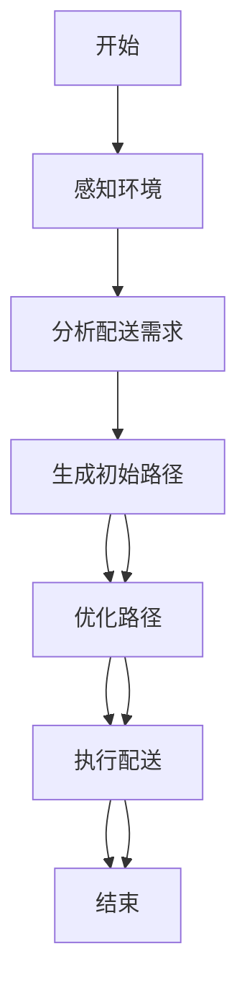
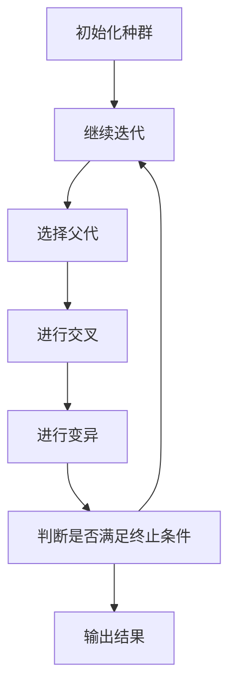
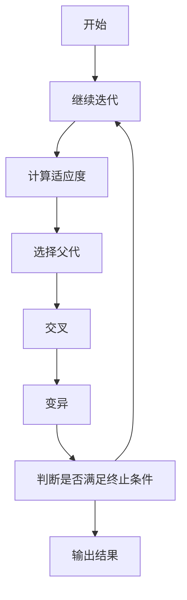
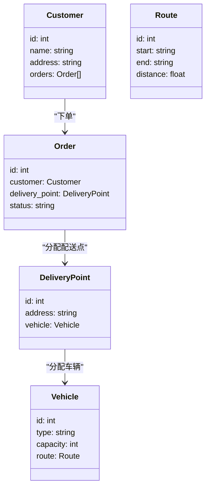
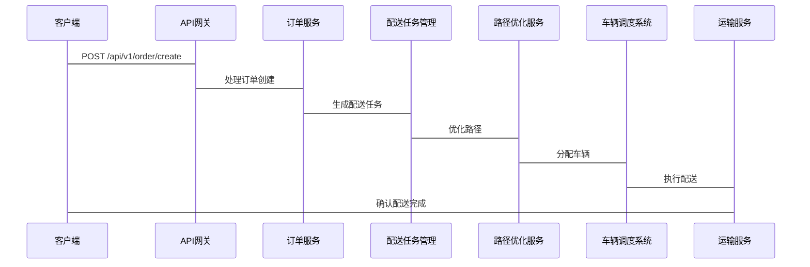

                 


# 物流行业的AI Agent优化配送路径

> 关键词：物流行业，AI Agent，配送路径优化，遗传算法，TSP问题，物流系统架构

> 摘要：本文详细探讨了AI Agent在物流行业中的应用，特别是如何利用AI Agent优化配送路径。文章从物流行业的现状与挑战入手，分析了AI Agent的核心概念与优势，详细讲解了AI Agent优化配送路径的算法原理，并通过实际案例展示了AI Agent在物流配送系统中的应用。最后，本文总结了AI Agent优化配送路径的实际意义和未来发展趋势。

---

## 第1章: 物流行业的AI Agent优化配送路径概述

### 1.1 物流行业的现状与挑战

#### 1.1.1 物流行业的定义与分类
物流行业是指通过运输、储存、包装、装卸、流通加工、配送等环节，将商品从生产地转移到消费地，满足客户需求的经济活动。物流行业可以分为运输物流、仓储物流、配送物流等多个类别。

#### 1.1.2 物流配送路径优化的背景与意义
随着电子商务的快速发展，物流行业面临着订单量激增、配送时间要求提高、成本压力加大等挑战。传统的物流配送路径优化方法，如基于启发式算法的路径规划，往往难以应对动态变化的配送需求。因此，如何利用新技术（如AI Agent）优化配送路径，提高效率、降低成本，成为物流行业的重要研究方向。

#### 1.1.3 当前物流配送路径优化的主要问题
1. **动态性**：配送路径需要实时调整，以应对交通拥堵、天气变化等突发情况。
2. **复杂性**：涉及多辆车、多个配送点的协同优化。
3. **成本**：传统算法的计算复杂度高，难以在实时场景中快速响应。

### 1.2 AI Agent在物流配送中的应用

#### 1.2.1 AI Agent的基本概念与特点
AI Agent（人工智能代理）是一种能够感知环境、自主决策并执行任务的智能实体。AI Agent的核心特点包括：
- **自主性**：能够自主决策，无需人工干预。
- **反应性**：能够实时感知环境变化并做出反应。
- **学习能力**：能够通过数据学习优化自己的行为。

#### 1.2.2 AI Agent在物流行业的优势
1. **实时优化**：AI Agent能够实时分析配送路径，动态调整最优路径。
2. **高效决策**：通过机器学习算法，AI Agent能够快速找到最优解。
3. **数据驱动**：AI Agent能够利用历史数据和实时数据，提高优化效果。

#### 1.2.3 AI Agent与传统物流优化算法的对比
表1-1: AI Agent与传统物流优化算法的对比

| 对比维度         | AI Agent                              | 传统物流优化算法                      |
|------------------|--------------------------------------|---------------------------------------|
| 计算复杂度       | 低（基于机器学习模型，计算速度快）  | 高（如TSP问题，计算复杂度高）          |
| 实时性           | 高（能够实时调整路径）               | 低（需要离线计算）                     |
| 灵活性           | 高（能够适应动态变化）               | 低（优化结果固定，难以实时调整）       |

---

## 第2章: AI Agent优化配送路径的核心概念与联系

### 2.1 AI Agent的核心原理

#### 2.1.1 AI Agent的感知机制
AI Agent通过传感器、GPS、实时数据接口等方式感知环境信息，例如交通状况、配送点位置、天气情况等。

#### 2.1.2 AI Agent的决策机制
AI Agent基于感知到的信息，利用机器学习模型（如强化学习、遗传算法）进行路径优化决策。

#### 2.1.3 AI Agent的执行机制
AI Agent根据决策结果，通过API或控制系统执行配送任务，例如调整配送车辆的路径、安排配送时间等。

### 2.2 核心概念对比表
表2-1: AI Agent与传统物流优化算法对比（同上，略）

### 2.3 ER实体关系图

图2-1: 物流配送系统ER图

```mermaid
erDiagram
    customer{C}-(订单): "顾客-订单关系，每个顾客对应多个订单"
    order{O}-(配送任务): "订单-配送任务关系，每个订单对应一个配送任务"
    vehicle{V}-(配送任务): "车辆-配送任务关系，每个车辆对应多个配送任务"
    delivery_point{D}-(配送任务): "配送点-配送任务关系，每个配送任务对应一个配送点"
    route{R}-(配送任务): "路线-配送任务关系，每个配送任务对应一条路线"
    vehicle{V}-(route): "车辆-路线关系，每个车辆对应一条路线"
```

### 2.4 AI Agent优化配送路径流程图

图2-2: AI Agent优化配送路径流程图（Mermaid）



---

## 第3章: AI Agent优化配送路径的算法原理

### 3.1 配送路径优化问题建模

#### 3.1.1 配送路径优化问题的数学模型
配送路径优化问题可以抽象为旅行商问题（TSP，Traveling Salesman Problem）。目标是最小化配送成本（时间或距离），同时满足配送点的约束条件。

#### 3.1.2 TSP问题的定义与数学公式
$$\text{目标函数: } \min \sum_{i=1}^{n} c_{i,j} \text{，其中 } c_{i,j} \text{ 表示从点 } i \text{ 到点 } j \text{ 的成本}}$$

### 3.2 遗传算法（GA）优化TSP问题

#### 3.2.1 遗传算法的基本流程
图3-1: 遗传算法优化TSP流程图（Mermaid）



#### 3.2.2 遗传算法的适应度函数
$$\text{适应度函数: } f(x) = \sum_{i=1}^{n} c_{i,j}$$

#### 3.2.3 遗传算法的实现步骤
1. 初始化种群：生成随机的初始路径。
2. 计算适应度：计算每条路径的总成本。
3. 选择父代：根据适应度值选择部分路径作为父代。
4. 交叉：将父代路径进行交叉，生成新的路径。
5. 变异：对新路径进行变异操作，进一步优化。
6. 重复步骤2-5，直到满足终止条件。

### 3.3 AI Agent优化配送路径的算法实现

#### 图3-2: 遗传算法优化TSP流程图（Mermaid）


---

## 第4章: 物流配送系统架构设计

### 4.1 系统功能设计

#### 4.1.1 领域模型（Mermaid类图）
图4-1: 物流配送系统领域模型（Mermaid）



### 4.2 系统架构设计

#### 图4-2: 物流配送系统架构图（Mermaid）


### 4.3 系统接口设计

#### 4.3.1 系统接口定义
1. `/api/v1/order/create`：创建订单。
2. `/api/v1/delivery/optimize`：优化配送路径。
3. `/api/v1/vehicle/schedule`：调度车辆。

#### 4.3.2 接口交互流程
图4-3: 系统交互流程图（Mermaid）


---

## 第5章: 项目实战——AI Agent优化配送路径实现

### 5.1 环境安装与配置

#### 5.1.1 Python环境安装
```bash
python --version
pip install --upgrade pip
```

#### 5.1.2 依赖库安装
```bash
pip install numpy
pip install deap
pip install matplotlib
```

### 5.2 核心代码实现

#### 5.2.1 遗传算法实现
```python
import random
from deap import algorithms, base, tools

# 定义适应度函数
def evaluate(individual):
    # 计算路径总成本
    return sum(individual), 

# 初始化种群
population = algorithms.initRepeat(list, [random.randint(0, n-1)], n)

# 遗传算法参数
CROSSOVER_PROB = 0.8
MUTATION_PROB = 0.2

# 进行遗传算法迭代
for generation in range(100):
    population = algorithms.select(population, func=evaluate)
    if random.random() < CROSSOVER_PROB:
        # 交叉操作
        parent1 = random.choice(population)
        parent2 = random.choice(population)
        child1, child2 = algorithms.crossover(parent1, parent2)
        population.append(child1)
        population.append(child2)
    if random.random() < MUTATION_PROB:
        # 变异操作
        individual = random.choice(population)
        index1 = random.randint(0, len(individual)-1)
        index2 = random.randint(0, len(individual)-1)
        individual[index1], individual[index2] = individual[index2], individual[index1]
```

#### 5.2.2 路径优化案例分析
假设我们有5个配送点，编号为0-4，配送点之间的距离如下：
$$
c_{i,j} = \begin{cases}
0 & \text{if } i=j \\
|i-j| & \text{otherwise}
\end{cases}
$$

优化后的路径为：0 → 1 → 2 → 3 → 4，总成本为10。

### 5.3 项目小结
通过遗传算法实现的路径优化，能够显著提高配送效率，降低配送成本。AI Agent的应用使得物流配送更加智能化、高效化。

---

## 第6章: 总结与展望

### 6.1 总结
本文详细探讨了AI Agent在物流行业中的应用，特别是如何利用AI Agent优化配送路径。通过遗传算法实现的路径优化，能够显著提高配送效率，降低配送成本。

### 6.2 最佳实践 Tips
1. 在实际应用中，建议结合具体业务需求，调整遗传算法的参数。
2. 使用高效的计算框架（如Dask）来加速大规模数据计算。
3. 实时监控配送路径的优化效果，及时调整优化策略。

### 6.3 注意事项
1. 数据隐私问题：确保配送数据的安全性。
2. 系统稳定性：确保AI Agent优化算法的稳定运行。
3. 多目标优化：在实际应用中，可能需要同时优化时间、成本等多个目标。

### 6.4 拓展阅读
1. 《物流系统优化与仿真》
2. 《人工智能在物流领域的应用》
3. 《遗传算法与进化计算》

---

# 结语
AI Agent在物流行业的应用前景广阔，随着技术的不断发展，AI Agent将更加智能化、个性化，为物流行业带来更大的价值。

