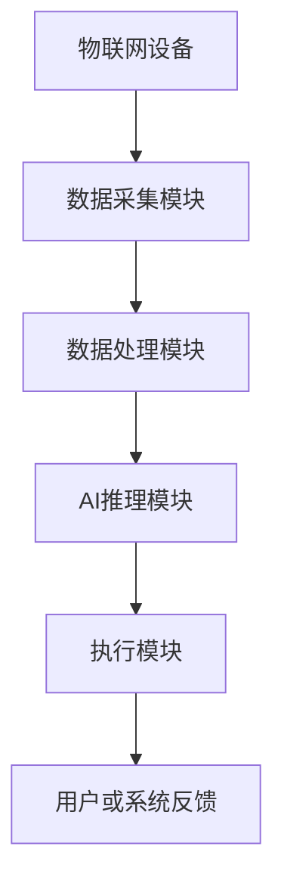
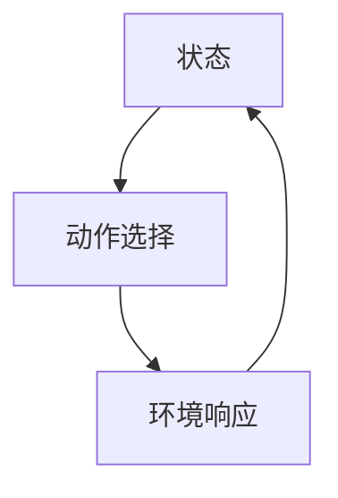
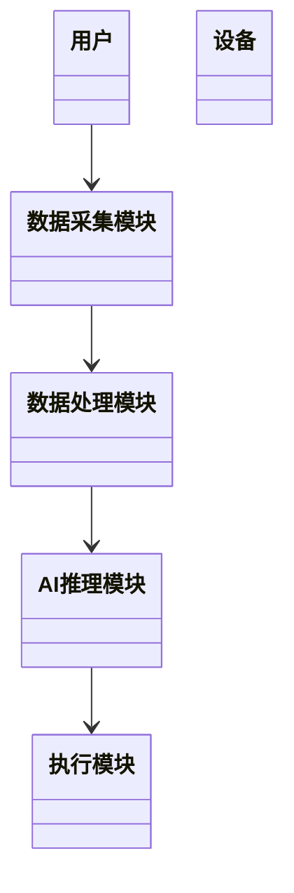
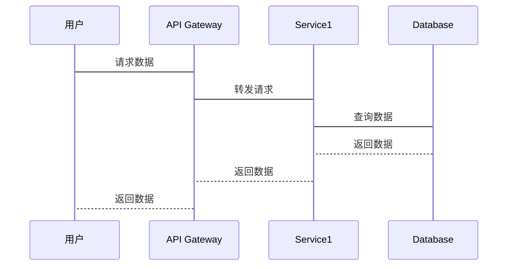

                 


# 物联网AI：构建智能家居和工业互联网的AI Agent

## 关键词：物联网、AI Agent、智能家居、工业互联网、算法原理、系统架构、项目实战

## 摘要：
本文探讨了物联网AI Agent在智能家居和工业互联网中的应用，分析其核心概念、算法原理、系统架构，并通过项目实战展示其应用。文章从背景介绍入手，详细阐述AI Agent的工作原理，结合强化学习和图神经网络等算法，设计系统架构，最后通过具体案例分析，总结经验和教训，为读者提供全面的指导。

---

# 第一部分：物联网与AI Agent概述

## 第1章：物联网与AI Agent的背景与概念

### 1.1 物联网的基本概念
#### 1.1.1 物联网的定义与特点
物联网（Internet of Things, IoT）是指通过各种信息传感设备，如传感器、射频识别（RFID）、全球定位系统（GPS）、红外感应器等，按照约定的协议，把任何物品与互联网连接起来，进行信息交换和通信，以实现智能化识别、定位、跟踪、监控和管理。

物联网的特点包括：
- **广泛连接**：设备之间的互联互通。
- **实时感知**：通过传感器实时采集数据。
- **智能处理**：数据的分析和处理。
- **分布式架构**：系统分散在多个设备中。

#### 1.1.2 物联网的核心技术与应用场景
物联网的核心技术包括：
- **感知层**：通过传感器采集数据。
- **网络层**：数据传输的网络支持。
- **应用层**：数据处理和应用。

物联网的应用场景包括智能家居、智慧城市、工业物联网（IIoT）、医疗物联网等。

#### 1.1.3 物联网与AI的结合
AI（人工智能）与物联网的结合使物联网设备能够更加智能化，能够自主决策和执行任务。这种结合提升了系统的自动化水平和响应速度。

### 1.2 AI Agent的基本概念
#### 1.2.1 AI Agent的定义与分类
AI Agent（智能体）是指能够感知环境并采取行动以实现目标的实体。AI Agent可以分为：
- **反应式AI Agent**：基于当前感知做出反应，不依赖于内部模型。
- **基于模型的AI Agent**：依赖于内部模型，考虑过去、现在和未来的状态。

#### 1.2.2 AI Agent的核心功能与特点
AI Agent的核心功能包括：
- **感知环境**：通过传感器或其他输入方式获取信息。
- **决策与推理**：基于感知的信息进行推理和决策。
- **执行操作**：根据决策结果执行操作。

AI Agent的特点包括自主性、反应性、目标导向性和社会性。

#### 1.2.3 AI Agent在物联网中的作用
AI Agent在物联网中的作用是通过智能化的决策和执行，优化物联网系统的运行效率，提升用户体验。

### 1.3 物联网AI Agent的应用场景
#### 1.3.1 智能家居中的AI Agent
在智能家居中，AI Agent可以控制家中的各种设备，如智能灯泡、空调、智能门锁等，根据用户的习惯和环境变化自动调节设备状态。

#### 1.3.2 工业互联网中的AI Agent
在工业互联网中，AI Agent可以用于设备监控、预测性维护、生产优化等场景，提升工业生产的效率和可靠性。

#### 1.3.3 其他典型应用场景
AI Agent还可以应用于智能交通、智能医疗等领域，通过智能化的决策和执行提升系统的性能。

---

## 第2章：物联网AI Agent的核心概念与联系

### 2.1 物联网AI Agent的核心原理
#### 2.1.1 感知层：数据采集与处理
感知层通过传感器采集环境数据，并将这些数据传递给处理层。

#### 2.1.2 决策层：AI算法与推理
决策层利用AI算法对感知层提供的数据进行处理和推理，生成决策指令。

#### 2.1.3 执行层：指令输出与反馈
执行层根据决策层生成的指令执行操作，并将执行结果反馈给感知层，形成闭环。

### 2.2 物联网AI Agent的属性特征对比
以下表格对比了反应式AI Agent和基于模型的AI Agent的属性特征：

| 属性       | 反应式AI Agent          | 基于模型的AI Agent        |
|------------|-------------------------|---------------------------|
| 感知能力   | 基于当前感知            | 基于当前和历史感知        |
| 决策方式   | 基于当前状态做出反应    | 基于模型预测未来状态      |
| 复杂性     | 较低                    | 较高                      |
| 应用场景   | 实时反应型任务          | 需要考虑长期规划的任务    |

### 2.3 物联网AI Agent的ER实体关系图


---

## 第3章：物联网AI Agent的算法原理

### 3.1 常见的AI算法与物联网结合的原理
#### 3.1.1 强化学习在物联网中的应用
强化学习是一种通过试错方式来优化决策的算法。在物联网中，强化学习可以用于设备调度、路径规划等场景。

#### 3.1.2 图神经网络在物联网中的应用
图神经网络适合处理物联网中的设备间关系，可以用于设备间的通信优化、网络结构分析等。

#### 3.1.3 其他算法的适用场景
其他算法，如支持向量机（SVM）、随机森林等，也可以在特定场景下应用于物联网AI Agent。

### 3.2 强化学习算法的流程图


### 3.3 强化学习算法的数学模型
强化学习的数学模型通常涉及状态、动作和奖励。Q-learning的公式如下：

$$ Q(s, a) = Q(s, a) + \alpha (r + \gamma \max Q(s', a') - Q(s, a)) $$

其中：
- \( Q(s, a) \) 表示状态 \( s \) 下执行动作 \( a \) 的价值。
- \( \alpha \) 是学习率。
- \( r \) 是奖励。
- \( \gamma \) 是折扣因子。
- \( Q(s', a') \) 是下一状态下的最大价值。

### 3.4 图神经网络的实现
以下是图神经网络的Python代码示例：

```python
import torch
from torch import nn
import torch.nn.functional as F

class GNN(nn.Module):
    def __init__(self, input_dim, hidden_dim, output_dim):
        super(GNN, self).__init__()
        self.W = nn.Parameter(torch.randn(input_dim, hidden_dim))
        self.U = nn.Parameter(torch.randn(hidden_dim, output_dim))

    def forward(self, x, adj):
        h = F.relu(x.mm(self.W))
        out = h.mm(self.U)
        return out
```

---

## 第4章：物联网AI Agent的系统分析与架构设计

### 4.1 系统应用场景
以智能家居为例，系统需要实现设备的智能控制和用户交互。

### 4.2 系统功能设计
以下是系统功能模块的类图：



### 4.3 系统架构设计
以下是系统架构的微服务架构图：

```mermaid
graph TD
    U[用户] --> API Gateway
    API Gateway --> Service1
    API Gateway --> Service2
    Service1 --> Database
    Service2 --> Database
```

### 4.4 系统接口设计
以下是系统接口的交互流程图：



---

## 第5章：物联网AI Agent的项目实战

### 5.1 环境安装
安装Python和必要的库，如numpy、pandas、torch等。

### 5.2 核心代码实现
以下是智能家居AI Agent的核心代码：

```python
import numpy as np
import torch
from torch import nn

class AI-Agent:
    def __init__(self, sensors, actuators):
        self.sensors = sensors
        self.actuators = actuators
        self.model = self._build_model()

    def _build_model(self):
        # 构建AI模型
        pass

    def感知环境(self):
        # 通过传感器感知环境
        pass

    def决策(self, data):
        # 基于数据进行决策
        pass

    def执行(self, action):
        # 执行操作
        pass
```

### 5.3 代码解读与分析
- `AI-Agent`类初始化时，接收传感器和执行器的列表。
- `_build_model`方法构建AI模型。
- `感知环境`方法通过传感器获取数据。
- `决策`方法基于数据进行推理，生成动作。
- `执行`方法根据决策结果执行操作。

### 5.4 实际案例分析
以智能家居为例，AI Agent可以根据用户的行为模式自动调节室温、照明等设备。

### 5.5 项目小结
通过项目实战，我们了解了物联网AI Agent的实现过程，包括环境搭建、模型构建、数据处理和系统集成等。

---

## 第6章：物联网AI Agent的最佳实践

### 6.1 小结
物联网AI Agent的应用前景广阔，可以通过强化学习和图神经网络等算法提升系统的智能化水平。

### 6.2 注意事项
- 确保系统的安全性和隐私性。
- 定期维护和更新模型，以适应环境的变化。

### 6.3 拓展阅读
建议读者阅读《深度学习》、《强化学习入门》等相关书籍，以深入理解AI Agent的实现原理。

---

通过以上内容，我们详细探讨了物联网AI Agent的构建过程，从理论到实践，为读者提供了全面的指导。希望本文能够帮助读者更好地理解物联网AI Agent的核心概念和实现方法。

