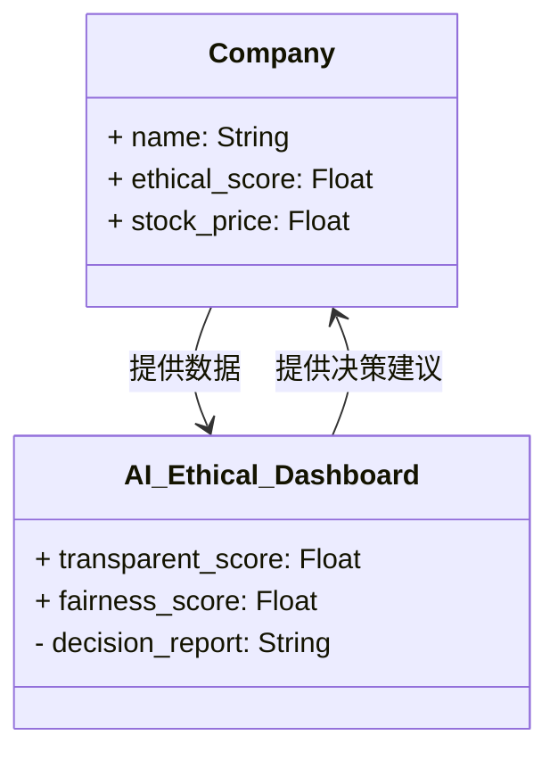

                 


# 特价股票与公司人工智能伦理决策能力的长期关系分析

---

## 关键词：特价股票、人工智能、伦理决策、公司治理、长期关系

---

## 摘要：  
本文旨在分析特价股票与公司人工智能伦理决策能力之间的长期关系。通过探讨特价股票的市场表现、公司治理与伦理决策能力的关联，结合人工智能技术的应用，本文揭示了伦理决策能力如何影响公司治理的效率和质量，进而影响特价股票的长期价值。文章从背景介绍、核心概念、算法原理、系统架构、项目实战等多个维度展开，结合实际案例和数学模型，深入剖析了两者之间的动态关系。

---

## 第一部分：背景介绍

### 第1章：特价股票的基本概念与特点

#### 1.1 特价股票的定义与分类  
特价股票是指低于面值发行的股票，通常反映公司财务状况不佳或市场对其前景的不看好。根据发行目的，特价股票可分为补偿性股票、激励性股票和债务转换股票等。

#### 1.2 特价股票的市场表现与投资价值  
特价股票的市场表现受多种因素影响，包括公司基本面、市场情绪和宏观经济环境。其投资价值需结合公司治理、财务状况和行业前景综合评估。

#### 1.3 特价股票与公司治理的关系  
特价股票的发行往往与公司治理问题密切相关，如管理层决策失误或公司治理结构不完善可能导致股价下跌，进而影响投资者信心。

---

### 第2章：人工智能伦理决策能力的核心概念

#### 2.1 人工智能伦理决策的定义与范围  
人工智能伦理决策是指AI系统在处理决策任务时，需遵循伦理规范，确保决策的公平性、透明性和责任性。

#### 2.2 人工智能伦理决策的主体与客体  
主体包括公司管理层、AI系统和决策者，客体则涉及公司员工、客户和市场参与者。

#### 2.3 人工智能伦理决策能力的评价标准  
包括决策透明度、结果公平性、责任可追溯性和决策效率等。

---

## 第二部分：核心概念与联系

### 第3章：特价股票与人工智能伦理决策能力的属性特征对比

#### 3.1 特价股票的属性特征  
- 市场表现波动大
- 投资风险高
- 公司治理问题突出

#### 3.2 人工智能伦理决策能力的属性特征  
- 决策透明
- 结果公平
- 责任明确

#### 3.3 两者属性特征对比表  
| 特性       | 特价股票                     | 人工智能伦理决策能力               |
|------------|------------------------------|--------------------------------------|
| 决策主体    | 投资者、管理层               | AI系统、管理层                     |
| 决策目标    | 股票价值最大化               | 确保决策公平性、透明性               |
| 决策影响    | 市场信任度、股价波动         | 公司治理效率、决策质量               |

---

### 第4章：特价股票与人工智能伦理决策能力的长期关系

#### 4.1 长期关系的定义与特征  
特价股票的长期价值与公司治理效率密切相关，而人工智能伦理决策能力是提升治理效率的关键因素。

#### 4.2 长期关系的形成机制  
- 公司通过提升AI伦理决策能力优化治理结构
- 优化的治理结构提升市场信任度
- 提升的市场信任度改善股票长期表现

#### 4.3 长期关系的动态演变  
随着时间推移，公司治理的改善和AI伦理决策能力的增强将共同作用，推动特价股票的长期价值上升。

---

## 第三部分：算法原理讲解

### 第5章：人工智能伦理决策算法的原理

#### 5.1 伦理评分模型  
通过数学模型评估公司决策的伦理风险，公式如下：  
$$ \text{伦理评分} = \frac{\text{决策透明度} + \text{公平性评分}}{2} $$  

#### 5.2 基于伦理的决策模型  
一种简单的伦理决策算法如下：  
1. 收集相关数据  
2. 评估伦理风险  
3. 生成决策方案  
4. 优化方案并输出  

#### 5.3 算法实现的Python代码示例  
```python
def ethical_decision(transparent_score, fairness_score):
    total_score = (transparent_score + fairness_score) / 2
    if total_score >= 0.8:
        return "决策符合伦理规范"
    else:
        return "决策存在伦理风险"
```

---

## 第四部分：系统分析与架构设计

### 第6章：系统功能设计

#### 6.1 领域模型（Mermaid 类图）  


#### 6.2 系统架构（Mermaid 架构图）  


---

## 第五部分：项目实战

### 第7章：环境安装与核心代码实现

#### 7.1 环境安装  
安装Python和相关库，如Pandas、NumPy、Matplotlib。

#### 7.2 核心代码实现  
```python
import pandas as pd
import numpy as np

def calculate_ethical_score(df):
    # 计算透明度评分
    transparent_score = df['transparent'].mean()
    # 计算公平性评分
    fairness_score = df['fairness'].mean()
    # 计算伦理评分
    ethical_score = (transparent_score + fairness_score) / 2
    return ethical_score

# 示例数据
data = {
    'transparent': [0.8, 0.7, 0.9],
    'fairness': [0.85, 0.8, 0.75]
}
df = pd.DataFrame(data)
score = calculate_ethical_score(df)
print(f"伦理评分: {score}")
```

---

## 第六部分：最佳实践与总结

### 第8章：最佳实践

#### 8.1 小结  
提升公司的人工智能伦理决策能力是改善治理结构、提升特价股票长期价值的关键。

#### 8.2 注意事项  
- 数据质量影响决策结果
- 需定期更新伦理评分模型
- 伦理决策能力的提升需要长期投入

#### 8.3 拓展阅读  
推荐相关书籍和论文，深入学习人工智能与伦理决策的结合应用。

---

通过以上分析，本文全面探讨了特价股票与公司人工智能伦理决策能力的长期关系，为投资者和企业管理者提供了有价值的参考和实践指导。

