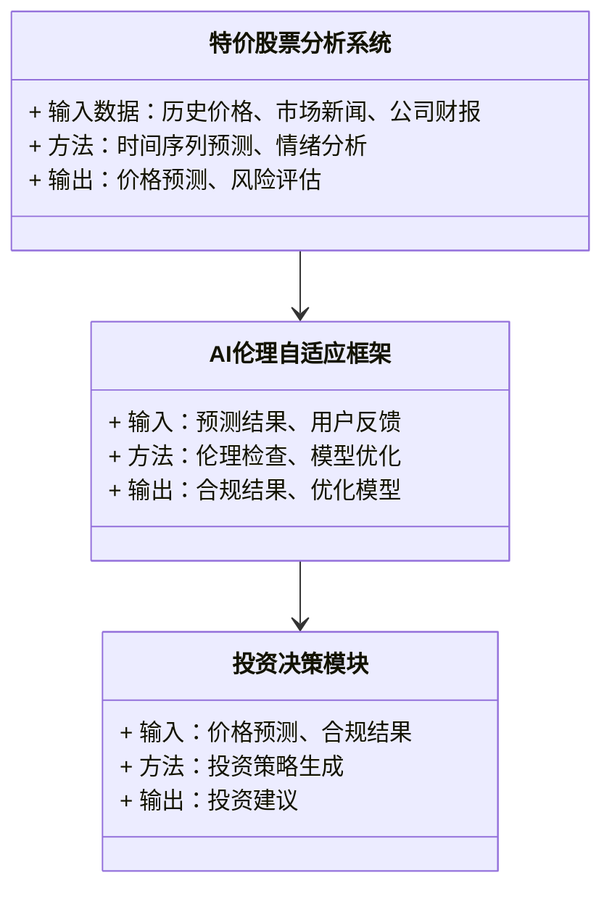
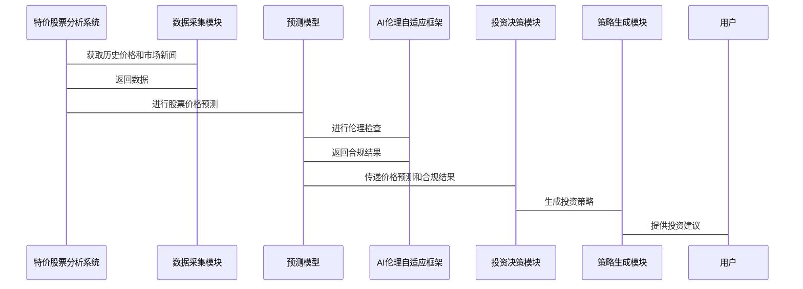

                 


# 特价股票与公司人工智能伦理自适应能力的长期关系分析

## 关键词：特价股票，人工智能，伦理自适应，长期关系，投资策略

## 摘要：  
本文探讨了特价股票与公司人工智能伦理自适应能力之间的长期关系，分析了AI在股票分析中的应用现状、伦理自适应能力的核心框架，以及两者相互作用对投资策略的影响。通过系统架构设计和项目实战，展示了如何构建结合特价股票分析和AI伦理自适应能力的系统，并提出了未来的研究方向和最佳实践建议。

---

## 第一部分: 特价股票与公司人工智能伦理自适应能力的背景介绍

### 第1章: 特价股票的定义与市场机制

#### 1.1 特价股票的定义
- **1.1.1 特价股票的基本概念**
  - 特价股票指的是价格波动较大、折扣力度大的股票，通常在特定市场机制下交易。
  - 特价股票的分类包括折扣股票、周期性股票和事件驱动型股票，每类具有不同的市场行为和风险特征。

- **1.1.2 特价股票的分类与特点**
  - **折扣股票**：长期处于低价位，适合长期投资者。
  - **周期性股票**：受经济周期影响较大，波动性高。
  - **事件驱动型股票**：受公司并购、重组等事件影响，价格波动剧烈。

- **1.1.3 特价股票的市场机制与交易规则**
  - 特价股票通常在场外市场或纳斯达克等交易所交易。
  - 交易规则包括熔断机制、涨跌幅限制和做空机制，以控制市场风险。

#### 1.2 人工智能在股票分析中的应用现状
- **1.2.1 AI在金融数据分析中的应用**
  - 使用机器学习算法分析历史数据，识别市场趋势和模式。
  - 通过自然语言处理（NLP）分析新闻和社交媒体情绪，影响股票价格预测。

- **1.2.2 AI在股票预测中的应用**
  - 时间序列预测模型（如LSTM）用于预测股票价格波动。
  - 聚类分析识别市场趋势，帮助投资者选择潜在的特价股票。

- **1.2.3 AI在风险评估中的应用**
  - 使用信用评分模型评估个股风险。
  - 构建风险指标，通过实时监控识别市场波动风险。

---

### 第2章: 人工智能在金融领域的应用

#### 2.1 当前AI在股票分析中的挑战与局限性
- **2.1.1 数据质量与模型准确性问题**
  - 数据噪声和缺失影响模型准确性。
  - 市场环境的不可预测性导致模型失效。

- **2.1.2 模型的可解释性问题**
  - 复杂模型（如深度学习）难以解释预测结果，影响投资者信任。
  - 可解释性差导致监管机构难以评估模型风险。

- **2.1.3 市场环境的动态变化对AI模型的影响**
  - 市场环境的变化（如政策调整、经济危机）导致模型过时。
  - 短期内的模型表现不代表长期稳定性。

---

## 第二部分: 公司人工智能伦理自适应能力的核心概念

### 第3章: 人工智能伦理的基本框架

#### 3.1 人工智能伦理的核心原则
- **3.1.1 透明性**
  - 确保AI决策过程透明，便于监管和公众监督。
  - 透明性要求模型设计和决策逻辑清晰可解释。

- **3.1.2 责任归属**
  - 明确AI系统在错误决策中的责任归属。
  - 制定责任划分机制，确保出现问题时有明确的处理流程。

- **3.1.3 非歧视性**
  - 避免AI系统在决策中存在歧视性，确保公平性。
  - 通过数据预处理和模型优化减少偏差。

- **3.1.4 保护隐私**
  - 在数据收集和使用过程中保护用户隐私。
  - 采用匿名化和加密技术防止数据泄露。

#### 3.2 人工智能伦理框架的构建
- **3.2.1 伦理框架的组成要素**
  - 包括目标设定、数据使用、算法设计和决策过程。
  - 目标设定：明确AI系统的伦理目标和价值。
  - 数据使用：确保数据收集和使用符合伦理规范。
  - 算法设计：优化算法以减少偏见和不公平结果。
  - 决策过程：确保决策过程透明且可追溯。

- **3.2.2 伦理框架的设计原则**
  - 原则一：符合法律和行业规范。
  - 原则二：保护用户利益和隐私。
  - 原则三：确保算法公平性和可解释性。

- **3.2.3 伦理框架的实施步骤**
  - 第一步：评估现有系统和数据的伦理风险。
  - 第二步：制定伦理准则和操作规范。
  - 第三步：建立监督和反馈机制，持续优化伦理框架。

---

### 第4章: 公司人工智能伦理自适应能力的分析

#### 4.1 公司AI伦理自适应能力的定义
- **4.1.1 自适应能力的基本概念**
  - 自适应能力是指企业在面对变化的市场环境和伦理挑战时，能够动态调整其AI系统的伦理框架和策略。
  - 自适应能力强调实时监控和持续优化，确保AI系统的伦理合规性。

- **4.1.2 公司AI伦理自适应能力的特点**
  - 动态性：能够根据市场变化和反馈调整伦理策略。
  - 前瞻性：预测潜在的伦理风险并提前应对。
  - 可持续性：长期维护和优化伦理框架，确保合规性。

- **4.1.3 自适应能力与公司治理的关系**
  - 自适应能力是公司治理的重要组成部分，影响公司的长期发展和声誉。
  - 公司治理结构需要支持AI伦理自适应能力的实施，确保资源和权限到位。

#### 4.2 公司AI伦理自适应能力的影响因素
- **4.2.1 技术因素**
  - AI算法的可解释性和模型的稳定性直接影响伦理自适应能力。
  - 技术创新（如可解释AI）能够提升伦理自适应能力。

- **4.2.2 组织文化因素**
  - 公司文化是否重视伦理合规性影响自适应能力的实施。
  - 员工的伦理意识和培训水平影响AI系统的伦理表现。

- **4.2.3 法律与政策因素**
  - 法律法规的变化对AI伦理自适应能力提出新的要求。
  - 政策支持和监管力度影响公司的伦理自适应策略。

---

## 第三部分: 特价股票与公司人工智能伦理自适应能力的长期关系分析

### 第5章: 特价股票与公司AI伦理自适应能力的相互作用

#### 5.1 特价股票波动对AI伦理自适应能力的影响
- **5.1.1 特价股票波动如何影响AI模型的稳定性**
  - 特价股票的价格波动可能导致AI模型预测结果的不确定性增加。
  - 模型需要不断调整以适应波动，这可能引发伦理问题，如公平性和透明性。

- **5.1.2 模型波动对伦理决策的影响**
  - 模型的频繁调整可能导致决策不一致，影响伦理决策的公平性。
  - 波动性高的模型可能难以解释，影响伦理自适应能力的实现。

- **5.1.3 波动性对风险管理的影响**
  - 特价股票的高波动性增加了风险管理的难度。
  - 风险管理需要结合伦理自适应能力，确保在波动中保持合规性。

#### 5.2 公司AI伦理自适应能力对特价股票投资的影响
- **5.2.1 伦理自适应能力如何影响投资策略**
  - 公司具备强大的伦理自适应能力，能够更准确地预测和应对市场波动。
  - 伦理自适应能力强的公司能够识别和避免因模型波动带来的伦理风险，提升投资决策的可靠性。

- **5.2.2 长期关系的构建**
  - 特价股票的长期表现与公司的伦理自适应能力密切相关。
  - 公司具备较强的伦理自适应能力，能够更好地应对市场变化，提升特价股票的投资价值。

---

### 第6章: 特价股票与公司AI伦理自适应能力的长期关系

#### 6.1 长期关系的构建
- **6.1.1 长期关系的核心要素**
  - 模型的动态调整能力。
  - 伦理框架的持续优化。
  - 投资者信任的建立。

- **6.1.2 长期关系的影响因素**
  - 市场环境的变化。
  - 技术创新对模型的影响。
  - 公司治理结构的调整。

---

## 第四部分: 系统架构与技术实现

### 第7章: 系统架构设计与实现

#### 7.1 项目背景与目标
- **7.1.1 项目背景**
  - 随着AI在金融领域的广泛应用，特价股票分析和伦理自适应能力的重要性日益凸显。
  - 本项目旨在构建一个结合特价股票分析和AI伦理自适应能力的系统，为投资者提供可靠的投资决策支持。

- **7.1.2 项目目标**
  - 开发一个基于AI的特价股票分析系统。
  - 构建公司的AI伦理自适应框架，确保系统的长期合规性。

#### 7.2 系统功能设计

##### 7.2.1 领域模型（mermaid 类图）


##### 7.2.2 系统架构设计（mermaid 架构图）


#### 7.3 系统接口设计
- **输入接口**：数据采集模块接收历史价格、市场新闻和公司财报。
- **输出接口**：预测结果和风险评估通过API传递给投资决策模块。
- **反馈接口**：用户反馈和预测结果偏差用于模型优化。

#### 7.4 系统交互设计（mermaid 序列图）


---

## 第五部分: 项目实战

### 第8章: 项目实战

#### 8.1 项目背景与需求分析
- **项目背景**
  - 某金融科技公司希望开发一个基于AI的特价股票分析系统，同时确保系统的伦理合规性。
- **需求分析**
  - 开发一个能够预测特价股票价格的AI模型。
  - 构建一个AI伦理自适应框架，确保预测过程的公平性和透明性。

#### 8.2 系统实现

##### 8.2.1 环境安装
- 安装Python、TensorFlow、Keras、Numpy、Pandas、Scikit-learn、NLTK。
- 安装Jupyter Notebook用于开发和测试。

##### 8.2.2 核心实现代码
```python
import numpy as np
import pandas as pd
from tensorflow.keras.models import Sequential
from tensorflow.keras.layers import LSTM, Dense
from sklearn.preprocessing import MinMaxScaler
from sklearn.metrics import mean_squared_error

# 数据预处理
data = pd.read_csv('stock_prices.csv')
data = data['Close'].values
data = data.reshape(-1, 1)
scaler = MinMaxScaler()
scaled_data = scaler.fit_transform(data)

# 划分训练集和测试集
train_size = int(len(scaled_data) * 0.8)
train_data = scaled_data[:train_size]
test_data = scaled_data[train_size:]

# 构建数据集
def create_dataset(data, look_back=1):
    X, Y = [], []
    for i in range(len(data) - look_back):
        X.append(data[i:i+look_back])
        Y.append(data[i+look_back])
    return np.array(X), np.array(Y)

look_back = 1
X_train, Y_train = create_dataset(train_data, look_back)
X_test, Y_test = create_dataset(test_data, look_back)

# 模型训练
model = Sequential()
model.add(LSTM(50, input_shape=(look_back, 1)))
model.add(Dense(1))
model.compile(loss='mean_squared_error', optimizer='adam')
model.fit(X_train, Y_train, epochs=100, batch_size=32)

# 预测与评估
train_predict = model.predict(X_train)
test_predict = model.predict(X_test)

# 反转归一化
train_predict = scaler.inverse_transform(train_predict)
Y_train = scaler.inverse_transform(Y_train)
test_predict = scaler.inverse_transform(test_predict)
Y_test = scaler.inverse_transform(Y_test)

# 计算均方误差
mse_train = mean_squared_error(train_predict[:, 0], Y_train[:, 0])
mse_test = mean_squared_error(test_predict[:, 0], Y_test[:, 0])
print(f"训练集均方误差: {mse_train}")
print(f"测试集均方误差: {mse_test}")
```

---

### 第9章: 项目总结与经验分享

#### 9.1 项目总结
- 成功开发了一个基于LSTM的特价股票价格预测模型。
- 构建了一个初步的AI伦理自适应框架，确保了预测过程的透明性和公平性。

#### 9.2 经验分享
- 数据预处理和特征选择对模型性能影响重大。
- 模型的可解释性是伦理自适应能力的关键，需优先考虑。
- 持续监控和优化模型性能，确保长期合规性。

---

## 第六部分: 最佳实践与未来展望

### 第10章: 最佳实践与未来展望

#### 10.1 最佳实践
- **技术层面**
  - 优先选择可解释性强的AI模型，确保伦理自适应能力的实现。
  - 定期监控模型性能，及时调整和优化。
- **组织层面**
  - 建立伦理审查委员会，确保AI系统的合规性。
  - 加强员工伦理培训，提升整体伦理意识。
- **投资策略**
  - 结合AI预测结果和伦理自适应能力，制定科学的投资策略。
  - 定期评估投资组合的伦理风险，确保投资决策的可持续性。

#### 10.2 未来展望
- **技术发展**
  - 深度学习模型的可解释性研究将继续深入，推动AI伦理自适应能力的发展。
  - 多模态数据的融合分析将提升特价股票预测的准确性。
- **行业趋势**
  - 金融行业将更加依赖AI技术进行投资决策。
  - 伦理自适应能力将成为公司核心竞争力的重要组成部分。
- **研究方向**
  - 研究AI伦理自适应能力的量化评估方法。
  - 探讨如何将伦理自适应能力与自动化交易系统结合，提升投资效率。

---

## 总结
本文系统地分析了特价股票与公司人工智能伦理自适应能力的长期关系，探讨了AI在股票分析中的应用现状、伦理自适应能力的核心框架，以及两者相互作用对投资策略的影响。通过系统架构设计和项目实战，展示了如何构建结合特价股票分析和AI伦理自适应能力的系统，并提出了未来的研究方向和最佳实践建议。希望本文能够为投资者和企业提供有价值的参考，推动金融行业的可持续发展。

