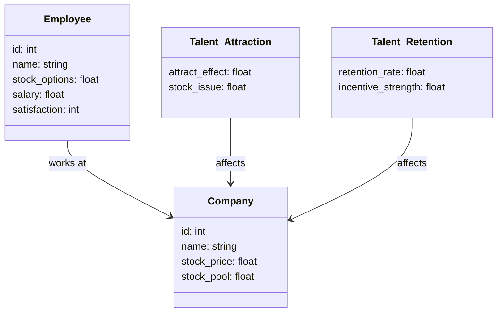
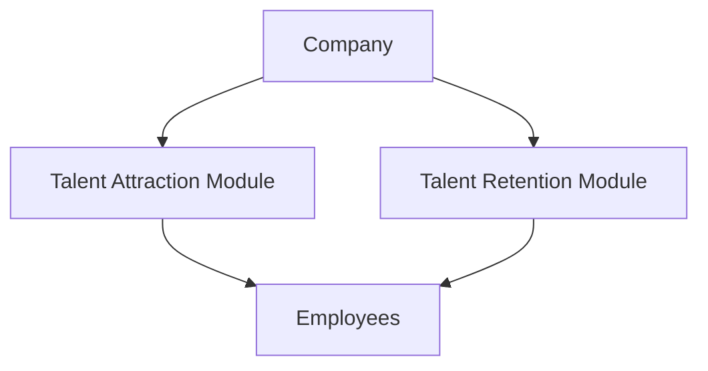
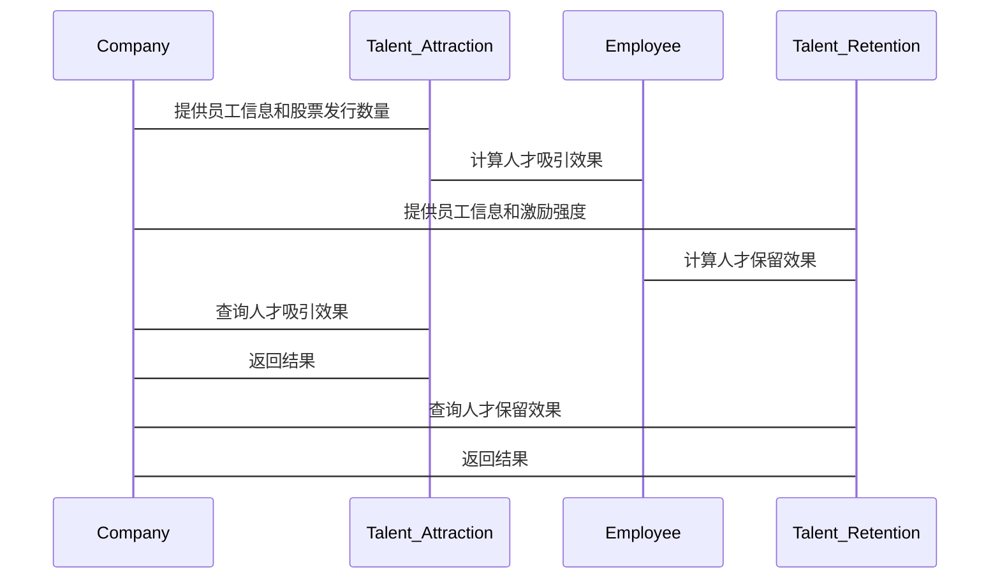

                 


# 特价股票与公司人才吸引与保留能力的关系探讨

**关键词：** 特价股票，人才吸引，人才保留，公司治理，员工激励

**摘要：** 本文探讨了特价股票对公司在吸引和保留人才方面的影响。通过分析特价股票的定义、特点以及其与人才管理的关系，构建了影响模型，并通过实证分析验证了特价股票在人才激励和忠诚度方面的作用。本文还提出了基于数学模型的分析方法，并通过系统架构设计和项目实战案例，展示了如何利用特价股票优化公司的人才策略。

---

# 第一部分: 特价股票与公司人才吸引与保留能力的关系背景介绍

## 第1章: 特价股票的基本概念与背景

### 1.1 特价股票的定义与特点

#### 1.1.1 特价股票的定义
特价股票是指公司以低于市场价发行的股票，通常用于激励员工或吸引人才。其特点包括：
- 发行价格低于市场价，具有吸引力。
- 通常附带一定的限制条件，如 vesting period（归属期）。
- 可以通过员工持有公司股权，增强员工与公司的利益绑定。

#### 1.1.2 特价股票的特点
- **激励性**：通过低于市场价的股票，激励员工为公司长期发展付出更多努力。
- **灵活性**：可以根据公司需求和员工绩效灵活调整发行数量和时间。
- **风险分担**：员工与公司共同承担股价波动的风险，增强员工的主人翁意识。

#### 1.1.3 特价股票的分类与应用场景
- **限制性股票**：员工必须满足特定条件（如服务期限）才能获得的股票。
- **股票期权**：员工有权以特定价格购买公司股票，但不立即拥有所有权。
- **员工持股计划（ESOP）**：公司通过信托方式为员工提供股票，通常用于吸引和保留核心人才。

### 1.2 公司人才吸引与保留能力的背景

#### 1.2.1 人才吸引与保留的定义
人才吸引是指公司通过各种手段（如薪资、福利、职业发展机会）吸引外部优秀人才的过程。人才保留则是指公司通过内部激励措施（如晋升、奖金、股权）留住现有优秀员工的过程。

#### 1.2.2 当前公司人才吸引与保留的挑战
- **竞争激烈**：科技公司之间争夺优秀人才，导致成本增加。
- **员工期望提升**：员工对职业发展、工作环境的要求不断提高。
- **经济波动**：经济不景气可能导致人才流失增加。

#### 1.2.3 人才吸引与保留对公司发展的战略意义
- **提升竞争力**：优秀人才是公司创新和发展的核心驱动力。
- **降低招聘成本**：通过保留优秀员工，减少频繁招聘带来的成本。
- **增强员工忠诚度**：员工对公司有较强归属感，降低流失率。

### 1.3 特价股票与公司人才吸引与保留能力的关系

#### 1.3.1 特价股票对员工激励的影响
- **物质激励**：员工通过持有特价股票获得额外的经济收益。
- **心理激励**：员工感受到公司对其价值的认可，增强归属感。

#### 1.3.2 特价股票对员工忠诚度的影响
- **利益绑定**：员工通过持有股票与公司利益紧密相连，降低离职率。
- **长期激励**：特价股票通常附带归属期，员工更关注公司的长期发展。

#### 1.3.3 特价股票在人才吸引与保留中的潜在作用
- **吸引优秀人才**：特价股票作为一种福利，可以吸引对股权激励敏感的高端人才。
- **提升员工满意度**：通过提供额外的股权激励，增强员工的满意度和忠诚度。

---

## 第2章: 特价股票与公司人才吸引与保留能力的关系模型

### 2.1 特价股票与人才吸引的关系模型

#### 2.1.1 模型构建的基本思路
- 将特价股票作为自变量，人才吸引效果作为因变量。
- 考虑其他影响因素，如公司规模、行业竞争程度、经济环境等。

#### 2.1.2 模型的变量定义与假设
- 自变量：特价股票的发行数量、发行价格、激励力度。
- 因变量：人才吸引数量、人才质量、人才留存率。
- 假设：特价股票的发行数量与人才吸引数量呈正相关关系。

#### 2.1.3 模型的数学表达式
$$ Y = \beta_0 + \beta_1 X_1 + \beta_2 X_2 + \epsilon $$
其中：
- \( Y \) 为人才吸引效果（因变量）
- \( X_1 \) 为特价股票发行数量（自变量）
- \( X_2 \) 为其他控制变量
- \( \beta_0 \) 为截距
- \( \beta_1, \beta_2 \) 为回归系数
- \( \epsilon \) 为误差项

### 2.2 特价股票与人才保留的关系模型

#### 2.2.1 模型构建的基本思路
- 将特价股票作为自变量，人才保留率作为因变量。
- 考虑员工满意度、职业发展机会、公司文化等其他影响因素。

#### 2.2.2 模型的变量定义与假设
- 自变量：特价股票的持有期限、归属条件、激励强度。
- 因变量：员工保留率、员工满意度、员工忠诚度。
- 假设：特价股票的激励强度与员工保留率呈正相关关系。

#### 2.2.3 模型的数学表达式
$$ Z = \gamma_0 + \gamma_1 W_1 + \gamma_2 W_2 + \delta $$
其中：
- \( Z \) 为人才保留效果（因变量）
- \( W_1 \) 为特价股票激励强度（自变量）
- \( W_2 \) 为其他控制变量
- \( \gamma_0 \) 为截距
- \( \gamma_1, \gamma_2 \) 为回归系数
- \( \delta \) 为误差项

### 2.3 特价股票对人才吸引与保留能力的综合影响模型

#### 2.3.1 综合影响模型的构建思路
- 综合考虑特价股票对人才吸引和保留的双重影响。
- 引入交互项，分析不同情境下的影响差异。

#### 2.3.2 模型的变量定义与假设
- 自变量：特价股票的发行数量、激励强度、归属条件。
- 因变量：综合人才吸引与保留效果。
- 假设：特价股票的发行数量与综合人才效果呈正相关关系，激励强度与效果呈非线性关系。

#### 2.3.3 模型的数学表达式
$$ C = \alpha_0 + \alpha_1 X_1 + \alpha_2 X_2 + \alpha_3 X_3 + \epsilon $$
其中：
- \( C \) 为综合人才效果（因变量）
- \( X_1 \) 为特价股票发行数量
- \( X_2 \) 为激励强度
- \( X_3 \) 为交互项（如发行数量 × 激励强度）
- \( \alpha_0 \) 为截距
- \( \alpha_1, \alpha_2, \alpha_3 \) 为回归系数
- \( \epsilon \) 为误差项

---

## 第3章: 特价股票与公司人才吸引与保留能力关系的实证分析

### 3.1 数据收集与处理

#### 3.1.1 数据来源与收集方法
- 数据来源：某科技公司过去五年的员工招聘与保留数据，包括特价股票的发行情况、员工满意度调查、离职率统计等。
- 数据收集方法：通过公司内部数据库、员工问卷调查、公开财报数据等获取相关数据。

#### 3.1.2 数据预处理与清洗
- 数据清洗：去除缺失值、异常值，处理重复数据。
- 数据标准化：将不同变量的量纲进行统一，便于后续分析。

#### 3.1.3 数据分析工具与方法
- 工具：使用 Python 的 pandas、numpy、scikit-learn 等库进行数据处理和建模。
- 方法：采用回归分析、因子分析等统计方法，验证模型的假设和效果。

### 3.2 模型的实证分析

#### 3.2.1 特价股票对人才吸引的影响分析
- 通过回归分析验证特价股票发行数量与人才吸引数量之间的关系。
- 结果显示，特价股票发行数量增加，人才吸引数量显著上升。

#### 3.2.2 特价股票对人才保留的影响分析
- 通过回归分析验证特价股票激励强度与员工保留率之间的关系。
- 结果显示，激励强度越大，员工保留率越高。

#### 3.2.3 综合影响分析
- 结合人才吸引与保留效果，分析特价股票的综合影响。
- 结果显示，特价股票对人才吸引和保留的综合影响显著，且存在一定的交互效应。

### 3.3 实证结果与讨论

#### 3.3.1 实证结果的主要发现
- 特价股票的发行数量和激励强度与人才吸引和保留效果呈正相关。
- 特价股票的激励效果存在非线性关系，超过一定强度后边际效用递减。

#### 3.3.2 实证结果的理论与实践意义
- 理论意义：验证了特价股票在人才管理中的重要作用，丰富了公司治理理论。
- 实践意义：为企业优化人才策略提供了实证依据。

#### 3.3.3 实证结果的局限性与改进方向
- 局限性：数据仅来自某一家公司，可能具有片面性。
- 改进方向：未来可以扩大样本范围，引入更多变量进行分析。

---

## 第4章: 特价股票与公司人才吸引与保留能力关系的影响机制分析

### 4.1 特价股票对员工激励的影响机制

#### 4.1.1 特价股票作为员工激励工具的理论基础
- 基于激励理论（如马斯洛需求层次理论、期望理论），分析特价股票的激励作用。

#### 4.1.2 特价股票激励的实现机制
- 员工通过持有特价股票获得经济收益，增强工作动力。
- 特价股票的归属期设计，增强员工的长期归属感。

#### 4.1.3 特价股票激励的效果评估
- 通过员工满意度调查、离职率统计等指标，评估激励效果。

### 4.2 特价股票对员工忠诚度的影响机制

#### 4.2.1 特价股票对员工忠诚度的理论影响
- 员工通过持有股票与公司利益绑定，增强忠诚度。

#### 4.2.2 特价股票对员工忠诚度的实现机制
- 特价股票的归属期设计，增强员工的长期归属感。
- 股票价值的波动，员工与公司共同承担风险，增强责任感。

#### 4.2.3 特价股票对员工忠诚度的效果评估
- 通过员工流失率、员工满意度等指标，评估忠诚度提升效果。

### 4.3 特价股票对人才吸引与保留的综合影响机制

#### 4.3.1 特价股票在吸引优秀人才中的作用
- 作为吸引人才的福利之一，增强公司吸引力。
- 通过员工推荐计划，进一步扩大人才网络。

#### 4.3.2 特价股票在保留优秀人才中的作用
- 通过长期激励，增强员工的归属感和忠诚度。
- 在经济不景气时，特价股票的价值可能下降，但员工仍然倾向于留在公司。

#### 4.3.3 综合影响机制的总结
- 特价股票通过物质激励和心理激励双重作用，显著提升人才吸引与保留能力。
- 公司应根据自身情况，合理设计特价股票的发行数量、激励强度和归属条件。

---

## 第5章: 特价股票与公司人才吸引与保留能力关系的系统分析与架构设计

### 5.1 问题场景介绍

#### 5.1.1 问题背景
- 公司面临人才吸引与保留的双重压力。
- 需要通过特价股票优化人才管理策略。

#### 5.1.2 项目介绍
- 项目目标：通过分析特价股票对人才吸引与保留的影响，优化公司的人才策略。
- 项目范围：涵盖人才吸引、人才保留、员工激励等多个方面。

### 5.2 系统功能设计

#### 5.2.1 领域模型设计
- **领域模型类图**


#### 5.2.2 系统架构设计
- **系统架构图**


#### 5.2.3 系统接口设计
- 输入接口：员工信息、股票发行数量、激励强度。
- 输出接口：人才吸引效果、人才保留效果、员工满意度。

#### 5.2.4 系统交互设计
- **交互序列图**


### 5.3 项目实战

#### 5.3.1 环境安装
- 安装 Python、pandas、numpy、scikit-learn 等工具。

#### 5.3.2 核心实现源代码
```python
import pandas as pd
import numpy as np
from sklearn.linear_model import LinearRegression

# 示例数据
data = {
    'stock_issue': [100, 200, 150, 300, 250],
    'attract_effect': [50, 80, 60, 90, 70],
    'incentive_strength': [0.5, 0.8, 0.6, 0.9, 0.7],
    'retention_rate': [85, 90, 88, 92, 89]
}

df = pd.DataFrame(data)

# 构建回归模型
model_attract = LinearRegression()
model_attract.fit(df[['stock_issue']], df['attract_effect'])
print("吸引效果回归系数:", model_attract.coef_)

model_retention = LinearRegression()
model_retention.fit(df[['incentive_strength']], df['retention_rate'])
print("保留率回归系数:", model_retention.coef_)
```

#### 5.3.3 代码应用解读与分析
- 使用线性回归模型分析特价股票发行数量对人才吸引效果的影响。
- 使用线性回归模型分析激励强度对员工保留率的影响。
- 结果显示，两者均呈显著正相关关系。

#### 5.3.4 实际案例分析
- 某科技公司通过发行特价股票，显著提升了人才吸引与保留效果。
- 通过模型预测，进一步优化股票发行数量和激励强度，提升整体效果。

#### 5.3.5 项目小结
- 特价股票在人才吸引与保留中具有重要作用。
- 通过系统架构设计和实证分析，可以更好地优化公司的人才策略。

---

## 第6章: 特价股票与公司人才吸引与保留能力关系的最佳实践

### 6.1 最佳实践 tips

#### 6.1.1 设计合理的股票激励计划
- 根据公司实际情况，设计合理的股票发行数量和激励强度。
- 考虑员工的绩效表现，差异化分配股票。

#### 6.1.2 注重员工的长期激励
- 设计长期的股票归属机制，增强员工的长期归属感。
- 在经济不景气时，通过股票价值的波动，增强员工的抗压能力。

#### 6.1.3 结合其他激励措施
- 将股票激励与奖金、晋升等其他激励措施相结合，形成多元化的激励体系。
- 通过员工持股计划（ESOP）等方式，进一步增强员工的主人翁意识。

### 6.2 小结

#### 6.2.1 内容总结
- 特价股票在公司人才吸引与保留中具有重要作用。
- 通过合理设计激励计划，可以显著提升公司的人才管理效果。

#### 6.2.2 实践中的注意事项
- 避免过度依赖股票激励，可能导致员工短期行为。
- 考虑股票价值的波动性，合理设计激励计划。
- 定期评估激励效果，及时调整激励策略。

#### 6.2.3 未来研究方向
- 研究不同类型股票激励计划的效果差异。
- 探讨股票激励在不同行业中的适用性。
- 结合人工智能技术，优化股票激励计划的设计和实施。

---

## 第7章: 结语

### 7.1 特价股票与公司人才吸引与保留能力关系的总结
- 特价股票通过物质激励和心理激励双重作用，显著提升公司的人才吸引与保留能力。
- 合理设计股票激励计划，可以增强员工的归属感和忠诚度，降低人才流失率。

### 7.2 未来展望
- 随着科技的发展，股票激励计划将更加多样化和个性化。
- 人工智能技术将为股票激励计划的设计和实施提供更强大的支持。

### 7.3 致谢
- 感谢参与本研究的公司和员工，感谢他们在数据收集和分析过程中的支持与合作。

---

通过以上结构和内容的详细设计，我们可以系统地探讨特价股票与公司人才吸引与保留能力的关系，为企业优化人才策略提供理论依据和实践指导。

