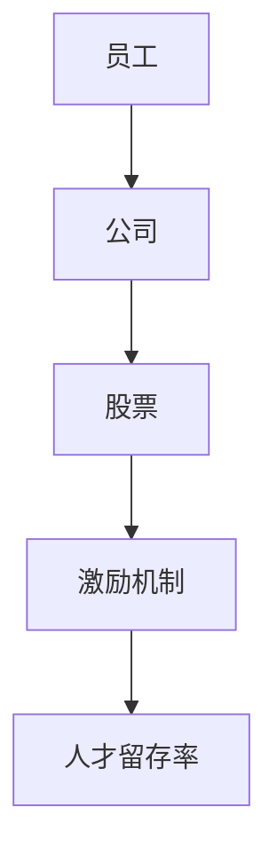
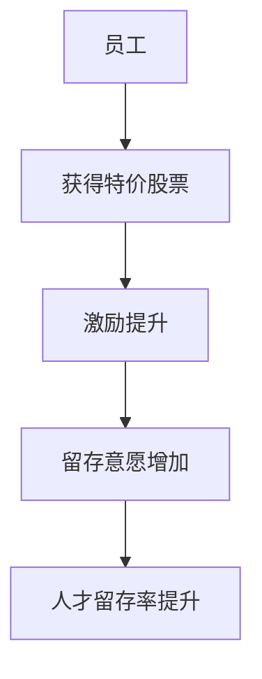
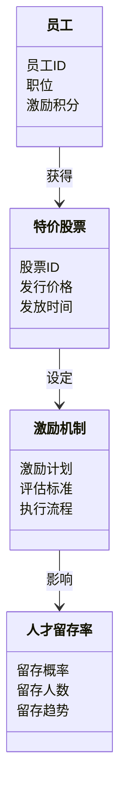
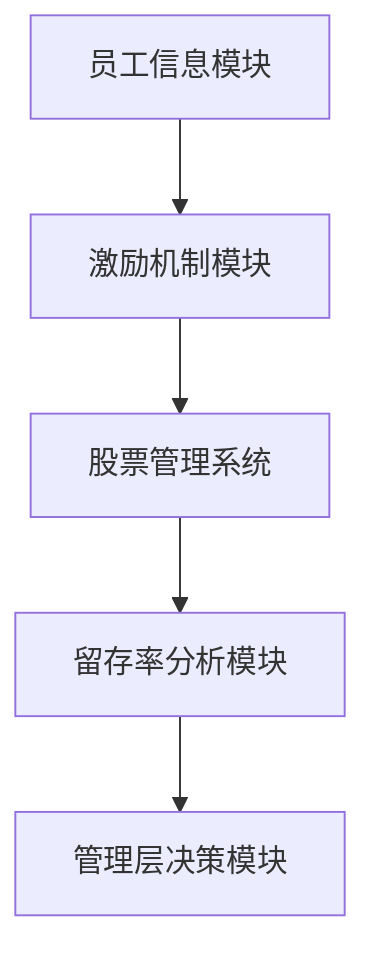

                 


# 目录大纲：《特价股票与公司人才留存率的关系探讨》

## # 第一章：背景介绍

### # 1.1 核心概念
- 1.1.1 特价股票的定义与特点
- 1.1.2 人才留存率的定义与影响因素
- 1.1.3 特价股票与人才留存率的关系背景

### # 1.2 问题背景
- 1.2.1 当前公司人才流失的现状
- 1.2.2 特价股票在公司激励机制中的作用
- 1.2.3 问题解决的必要性与目标

### # 1.3 问题描述
- 1.3.1 特价股票对员工激励的具体影响
- 1.3.2 人才留存率与公司绩效的关系
- 1.3.3 当前研究的空白与挑战

### # 1.4 边界与外延
- 1.4.1 特价股票的适用范围与限制
- 1.4.2 人才留存率的适用场景
- 1.4.3 相关概念的对比与区分

### # 1.5 概念结构与核心要素
- 1.5.1 特价股票的结构分析
- 1.5.2 人才留存率的核心要素
- 1.5.3 两者关系的系统分析

---

## # 第二章：特价股票与人才留存率的核心概念

### # 2.1 核心概念的原理
- 2.1.1 特价股票的激励机制
- 2.1.2 人才留存率的影响因素
- 2.1.3 两者关系的理论基础

### # 2.2 概念属性特征对比
- 2.2.1 特价股票与普通股票的对比
- 2.2.2 人才留存率与员工满意度的对比
- 2.2.3 不同激励机制对人才留存的影响

### # 2.3 ER实体关系图


---

## # 第三章：特价股票对人才留存率的影响模型

### # 3.1 算法原理


### # 3.2 数学模型与公式
- 3.2.1 激励强度公式：
  $$激励强度 = \alpha \times 股票价值 + \beta \times 职位影响$$
- 3.2.2 人才留存概率公式：
  $$P(留存) = \frac{激励强度}{总激励强度} \times 100\%$$

---

## # 第四章：系统分析与架构设计方案

### # 4.1 问题场景介绍
- 4.1.1 特价股票激励机制的实施场景
- 4.1.2 人才留存率的监测与评估

### # 4.2 项目介绍
- 4.2.1 特价股票激励项目的背景
- 4.2.2 项目目标与范围
- 4.2.3 项目实施的步骤与方法

### # 4.3 系统功能设计
- 4.3.1 领域模型


### # 4.4 系统架构设计


### # 4.5 系统接口设计
- 4.5.1 数据接口：员工信息接口
- 4.5.2 激励接口：股票分配接口
- 4.5.3 分析接口：留存率计算接口

### # 4.6 系统交互设计
```mermaid
sequenceDiagram
    员工 -> 系统：申请特价股票
    系统 -> 激励机制：处理申请
    激励机制 -> 股票系统：发放股票
    员工 -> 系统：确认 receipt
    系统 -> 激励机制：记录激励
    激励机制 -> 留存率分析：更新数据
```

---

## # 第五章：项目实战

### # 5.1 环境安装
- 5.1.1 系统环境要求
- 5.1.2 数据库安装与配置
- 5.1.3 开发工具安装

### # 5.2 系统核心实现源代码
- 5.2.1 激励机制模块代码
  ```python
  def calculate_incentive(staff_id):
      stock_price = get_stock_price(staff_id)
      position_level = get_position_level(staff_id)
      incentive = stock_price * 0.1 + position_level * 0.2
      return incentive
  ```
- 5.2.2 留存率分析模块代码
  ```python
  def retention_rate(incentive_score):
      if incentive_score > 80:
          return 0.95
      elif incentive_score > 60:
          return 0.85
      else:
          return 0.70
  ```

### # 5.3 代码应用解读与分析
- 5.3.1 激励机制的实现细节
- 5.3.2 留存率计算的逻辑分析
- 5.3.3 代码与实际业务的结合

### # 5.4 实际案例分析
- 5.4.1 某公司案例介绍
- 5.4.2 数据收集与分析
- 5.4.3 案例结果与启示

### # 5.5 项目小结
- 5.5.1 项目成果总结
- 5.5.2 经验与教训
- 5.5.3 未来改进方向

---

## # 第六章：结论与建议

### # 6.1 研究结论
- 6.1.1 主要发现
- 6.1.2 关键结论
- 6.1.3 实证结果总结

### # 6.2 最佳实践 tips
- 6.2.1 激励机制设计建议
- 6.2.2 特价股票分配策略
- 6.2.3 留存率监测与优化方法

### # 6.3 小结
- 6.3.1 研究的意义
- 6.3.2 对未来研究的建议
- 6.3.3 实际应用中的注意事项

---

## # 参考文献

（此处列出相关的书籍、期刊文章、网络资源等）

---

## # 附录

（包含代码片段、数据表格、补充材料等）

---

以上是一个详细的目录大纲，涵盖了从理论到实践的各个方面，确保每一章都深入探讨相关主题，并且符合用户的格式和内容要求。

