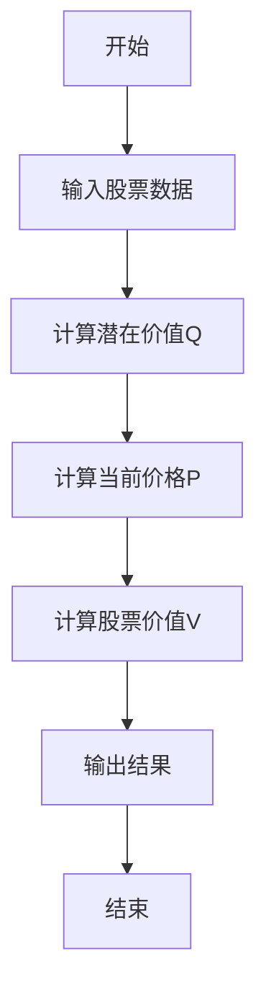
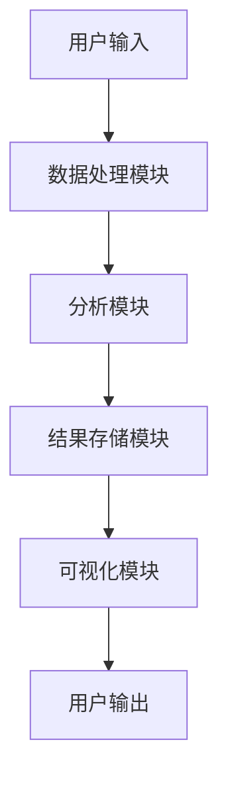

                 


# 特价股票与公司全球化创新网络的关系探讨

---

## 关键词：
特价股票、公司创新网络、全球化、股票价值、创新协作

---

## 摘要：
本文探讨了特价股票与公司全球化创新网络之间的关系，分析了特价股票在公司创新网络中的作用，以及全球化创新网络对股票价值的影响。通过构建数学模型和算法，本文揭示了两者之间的动态关系，并提供了实际案例分析和最佳实践建议。

---

## 第一部分：背景与概念

### 第1章：特价股票的定义与类型

#### 1.1 特价股票的定义
特价股票是指公司为了吸引投资者、激励员工或筹集资金而发行的特殊股票类型。常见的特价股票包括可转债、认股权证和员工持股计划等。这些股票通常具有较高的潜在回报，但也伴随着较高的风险。

#### 1.2 特价股票的类型
- **可转债（Convertible Bonds）**：允许投资者在特定条件下将债券转换为公司股票。
- **认股权证（Warrants）**：赋予投资者在未来特定时间内以特定价格购买公司股票的权利。
- **员工持股计划（ESOPs）**：公司员工通过持有公司股票获得激励。

#### 1.3 特价股票的市场背景
- 特价股票通常在公司处于成长阶段或面临财务困境时发行，以吸引投资者。
- 特价股票的市场表现受到公司业绩、行业趋势和宏观经济环境的影响。

---

### 第2章：公司全球化创新网络的结构

#### 2.1 全球化创新网络的概念
全球化创新网络是指公司通过跨国合作、资源整合和知识共享，构建的全球创新生态系统。这种网络通常包括研发机构、合作伙伴、供应商和客户。

#### 2.2 全球化创新网络的类型
- **技术创新网络**：以技术创新为核心，通过跨国合作推动技术进步。
- **市场创新网络**：以市场拓展为核心，通过全球化布局获取新市场机会。
- **资源共享网络**：以资源整合为核心，通过跨国合作优化资源配置。

#### 2.3 全球化创新网络的特征
- **复杂性**：涉及多个利益相关者和跨文化合作。
- **动态性**：网络结构和合作关系不断变化。
- **协作性**：依赖于合作伙伴的协作和知识共享。

---

## 第二部分：核心概念与联系

### 第3章：特价股票与公司创新网络的关系

#### 3.1 特价股票对创新网络的影响
- **激励创新**：通过员工持股计划，激励员工参与创新。
- **吸引人才**：特价股票作为吸引高端人才的工具，增强公司的创新能力。
- **优化资源**：通过可转债等形式，优化公司资本结构，支持创新活动。

#### 3.2 创新网络对特价股票的影响
- **提升公司价值**：创新网络的构建增强了公司的核心竞争力，提升股票价值。
- **降低投资风险**：通过全球化合作分散风险，增强投资者信心。
- **促进股价增长**：创新成果的商业化推动公司业绩增长，带动股价上涨。

#### 3.3 特价股票与创新网络的关系模型
- **关系模型构建**：通过构建数学模型，量化特价股票和创新网络之间的关系。
- **关系模型验证**：通过实证分析验证模型的有效性。

---

## 第三部分：算法原理

### 第4章：特价股票价值评估的算法模型

#### 4.1 算法原理
- **输入**：公司基本面数据、创新网络结构、市场环境。
- **输出**：特价股票的潜在价值评估。
- **步骤**：
  1. 收集公司数据。
  2. 分析创新网络结构。
  3. 计算潜在价值。

#### 4.2 数学模型与公式
- **潜在价值计算公式**：
  $$V = P + Q$$
  其中，V为股票价值，P为当前价格，Q为潜在价值。
- **潜在价值分解公式**：
  $$Q = \sum_{i=1}^{n} w_i \cdot f_i$$
  其中，w_i为权重，f_i为影响因素。

#### 4.3 算法流程图


---

## 第四部分：系统分析

### 第5章：系统设计与实现

#### 5.1 问题场景介绍
- **问题描述**：如何利用系统分析方法评估特价股票与创新网络的关系。
- **项目介绍**：构建一个评估系统，分析公司创新网络对股票价值的影响。

#### 5.2 系统功能设计
- **数据收集模块**：收集公司基本面数据和创新网络结构。
- **分析模块**：分析创新网络对股票价值的影响。
- **可视化模块**：展示分析结果。

#### 5.3 系统架构设计


---

## 第五部分：项目实战

### 第6章：项目实现与案例分析

#### 6.1 项目环境安装
- **工具安装**：安装Python、数据分析库（如Pandas）和可视化库（如Matplotlib）。
- **数据获取**：收集目标公司的股票数据和创新网络数据。

#### 6.2 核心代码实现
```python
import pandas as pd
import matplotlib.pyplot as plt

# 数据处理
def calculate_potential_value(data):
    weights = [0.5, 0.3, 0.2]
    factors = data[['factor1', 'factor2', 'factor3']]
    potential_value = factors.dot(weights)
    return potential_value

# 数据可视化
def plot_results(data, potential_value):
    plt.figure(figsize=(10, 6))
    plt.plot(data['date'], potential_value, 'b-', label='Potential Value')
    plt.xlabel('Date')
    plt.ylabel('Potential Value')
    plt.title('Potential Value Trend')
    plt.legend()
    plt.show()

# 主程序
data = pd.read_csv('input.csv')
potential_value = calculate_potential_value(data)
plot_results(data, potential_value)
```

#### 6.3 实际案例分析
- **案例选择**：选择一家科技公司，分析其创新网络对股票价值的影响。
- **结果解读**：通过代码分析结果，展示潜在价值的变化趋势。

---

## 第六部分：总结与展望

### 第7章：总结与展望

#### 7.1 最佳实践 tips
- **数据收集**：确保数据的准确性和完整性。
- **模型优化**：根据实际情况调整模型参数。
- **风险控制**：关注市场波动和公司基本面变化。

#### 7.2 项目小结
- **小结内容**：总结项目的主要成果和经验教训。
- **未来展望**：提出未来的研究方向和改进措施。

#### 7.3 拓展阅读
- **推荐书籍**：《股票投资的数学分析》
- **推荐文章**：《全球化创新网络的构建与管理》

---

通过以上分析，我们可以看到特价股票与公司全球化创新网络之间存在着密切的关系。特价股票作为公司创新的重要工具，能够有效激励员工、吸引人才，并优化公司资源。而公司全球化创新网络的构建，则能够提升公司价值，降低投资风险，并推动股价增长。未来，随着技术的进步和全球化程度的加深，特价股票与创新网络的关系将更加复杂和重要。

