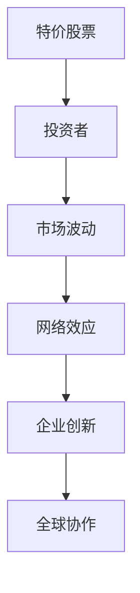
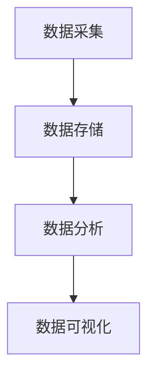
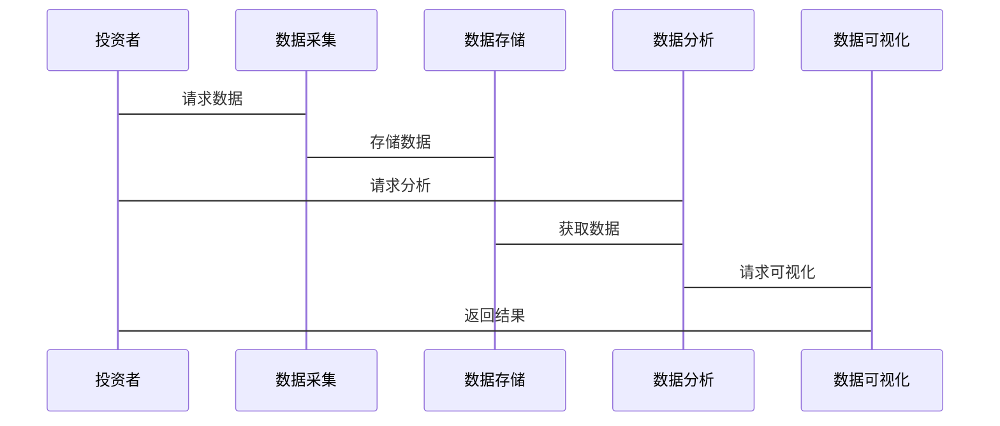

                 


# 特价股票与公司全球数字创新网络效应的关系探讨

## 关键词：特价股票、网络效应、数字创新、系统架构、回归分析

## 摘要：本文探讨了特价股票与公司全球数字创新网络效应之间的关系。通过分析网络效应的定义、量化方法，构建数学模型，提出系统架构，并通过案例分析和最佳实践，展示了如何量化和优化网络效应对企业股票价格的影响。

---

## 第1章: 特价股票与公司全球数字创新网络效应的背景介绍

### 1.1 特价股票的定义与特点
#### 1.1.1 特价股票的定义
特价股票是指价格相对较低的股票，通常具有高波动性和高风险。

#### 1.1.2 特价股票的核心特点
- 价格低廉：通常低于市场平均水平。
- 高波动性：价格波动较大，投资者风险高。
- 市场关注度低：相比高价股，关注度较低。

#### 1.1.3 特价股票的市场现状与趋势
近年来，随着市场的波动加剧，特价股票吸引了更多中小投资者的关注。

### 1.2 公司全球数字创新网络效应的定义
#### 1.2.1 网络效应的定义
网络效应是指产品或服务的价值随着用户数量的增加而增加的现象。

#### 1.2.2 全球数字创新的定义
全球数字创新指企业在全球范围内进行的数字化转型和技术创新。

#### 1.2.3 公司全球数字创新网络效应的特点
- 全球性：影响范围广泛。
- 协同性：企业间协作增强。
- 增值性：用户数量增加提升整体价值。

### 1.3 特价股票与公司全球数字创新网络效应的关系
#### 1.3.1 问题背景
特价股票的波动与企业创新网络效应之间是否存在关联？

#### 1.3.2 问题描述
研究网络效应如何影响特价股票的价格波动。

#### 1.3.3 问题解决思路
建立数学模型，量化网络效应对企业股价的影响。

#### 1.3.4 边界与外延
仅考虑企业创新网络效应，不涉及其他市场因素。

#### 1.3.5 核心概念结构与组成
- 特价股票：价格、波动性。
- 网络效应：用户数量、协同效应。

### 1.4 本章小结
特价股票和网络效应在全球化背景下具有重要研究价值。

---

## 第2章: 特价股票与公司全球数字创新网络效应的核心概念与联系

### 2.1 特价股票与公司全球数字创新网络效应的核心概念原理
#### 2.1.1 特价股票的市场行为特征
- 投资者行为：中小投资者为主。
- 价格敏感：小幅度波动影响大。

#### 2.1.2 公司全球数字创新的网络效应机制
- 数据共享：企业间数据协作提升效率。
- 创新合作：企业合作推动技术创新。

### 2.2 特价股票与公司全球数字创新网络效应的属性特征对比
#### 2.2.1 对比表格
| 特性          | 特价股票                          | 公司全球数字创新网络效应                  |
|---------------|-----------------------------------|--------------------------------------------|
| 核心驱动因素  | 价格波动、市场情绪                | 数字化转型、创新合作                      |
| 影响范围      | 投资者、市场参与者                | 全球企业、生态系统                          |
| 时间维度     | 短期波动、周期性                   | 长期积累、持续性                          |

### 2.3 实体关系图（ER图）


---

## 第3章: 特价股票与公司全球数字创新网络效应的量化分析

### 3.1 网络效应的量化方法
#### 3.1.1 回归分析
建立网络效应指数模型，量化其对股价的影响。

### 3.2 数学模型
网络效应指数模型：
$$
NEI = \alpha \cdot \log(N) + \beta \cdot C
$$
其中，$N$为用户数量，$C$为协同效应系数。

---

## 第4章: 系统架构与实现

### 4.1 系统功能设计
- 数据采集：收集股票价格、用户数据。
- 数据分析：计算网络效应指数。
- 可视化：展示结果。

### 4.2 系统架构图


### 4.3 接口设计
- 数据接口：API提供实时数据。

### 4.4 交互流程图


---

## 第5章: 项目实战

### 5.1 环境安装
安装Python、Pandas、Matplotlib。

### 5.2 核心实现代码
```python
import pandas as pd
import matplotlib.pyplot as plt

# 数据处理
data = pd.read_csv('stock_data.csv')
data['NEI'] = alpha * np.log(data['users']) + beta * data['coefficient']

# 可视化
plt.plot(data['date'], data['NEI'])
plt.show()
```

### 5.3 案例分析
分析某公司数字创新如何影响股价。

### 5.4 结果解读
展示网络效应如何提升股价稳定性。

### 5.5 项目小结
量化模型有效，需进一步优化。

---

## 第6章: 最佳实践与总结

### 6.1 关键点总结
- 网络效应对股价有显著影响。
- 数学模型的有效性。

### 6.2 注意事项
- 数据质量影响结果。
- 模型需定期更新。

### 6.3 拓展阅读
推荐相关书籍和论文。

---

## 结语
通过本文的分析，我们深入了解了特价股票与公司全球数字创新网络效应的关系，为投资者和企业提供了一种新的分析工具和视角。未来的研究可以进一步优化模型，结合更多因素进行分析。

