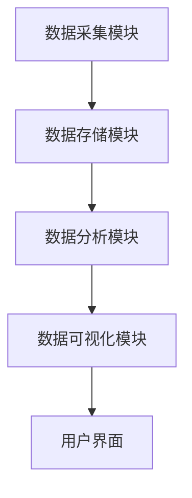

                 


# 特价股票与公司可持续发展能力的关系分析

> **关键词**：特价股票、公司可持续发展能力、股票投资、数据分析、可持续发展评估、投资策略、风险管理

> **摘要**：特价股票通常指价格低于市场平均水平的股票，而公司可持续发展能力则反映了公司在经济、社会和环境等多方面的长期发展潜力。本文分析了特价股票与公司可持续发展能力之间的关系，探讨了如何通过数据分析识别具备可持续发展能力的特价股票，为投资者提供科学的投资策略。文章结合实际案例，详细阐述了数据分析方法、数学模型和系统架构设计，帮助投资者在风险可控的前提下，抓住投资机会。

---

## 第一部分：特价股票与公司可持续发展能力的背景介绍

### 第1章：特价股票概述

#### 1.1 特价股票的定义与特点

- **1.1.1 特价股票的定义**
  特价股票是指价格显著低于市场平均水平的股票，通常被视为潜在的投资机会。这类股票可能因市场波动、公司短期表现不佳或市场低估而被归类为特价股票。

- **1.1.2 特价股票的特点**
  - 价格低廉：通常低于行业平均水平。
  - 市场流动性较低：交易量可能不大。
  - 风险较高：存在较大的波动性和不确定性。

- **1.1.3 特价股票的分类**
  - 按行业分类：如科技、金融、制造等。
  - 按市值分类：小盘股、中盘股等。

#### 1.2 特价股票的投资价值

- **1.2.1 特价股票的投资机会**
  - 低价股可能因公司基本面改善而上涨。
  - 市场低估的情况下，存在较大的增值空间。

- **1.2.2 特价股票的风险与挑战**
  - 公司可能处于财务困境或管理问题。
  - 市场波动可能导致股价进一步下跌。

- **1.2.3 特价股票与市场周期的关系**
  - 在熊市中，特价股票可能更常见。
  - 在牛市中，特价股票可能因市场整体上涨而受益。

### 第2章：公司可持续发展能力概述

#### 2.1 可持续发展能力的定义

- **2.1.1 可持续发展的核心概念**
  可持续发展能力是指公司在不损害经济、社会和环境的前提下，长期创造价值的能力。

- **2.1.2 可持续发展能力的评估指标**
  - 财务健康状况：盈利能力、资产负债率等。
  - 管理团队与治理结构：董事会效率、管理层稳定性。
  - 产品创新与市场竞争力：研发投入、市场占有率。

#### 2.2 可持续发展能力的影响因素

- **2.2.1 财务健康状况**
  公司的财务状况直接关系到其能否持续经营和投资。

- **2.2.2 管理团队与治理结构**
  高效的管理团队和良好的治理结构是公司可持续发展的基石。

- **2.2.3 产品创新与市场竞争力**
  创新能力强的公司能够更好地应对市场变化，保持竞争力。

---

## 第二部分：特价股票与公司可持续发展能力的核心概念与联系

### 第3章：特价股票与可持续发展能力的关系

#### 3.1 特价股票与可持续发展能力的相互作用

- **3.1.1 特价股票反映公司的可持续性**
  公司的可持续发展能力是其股价的重要决定因素。具备较强可持续发展能力的公司，即使当前股价被低估，也有可能在未来实现价值回升。

- **3.1.2 可持续发展能力影响股票价值**
  投资者越来越关注公司的可持续发展能力，这使得具备较强可持续发展能力的公司股票更受青睐。

#### 3.2 特价股票与可持续发展能力的案例分析

- **3.2.1 成功案例：某公司通过改善可持续性提升股价**
  例如，某环保科技公司通过加大研发投入，提升产品竞争力，改善了财务状况，股价随之上升。

- **3.2.2 失败案例：忽视可持续性导致股价暴跌**
  例如，某制造公司因环保问题被曝光，导致股价大幅下跌。

#### 3.3 特价股票与可持续发展能力的ER实体关系图

```mermaid
erDiagram
  company {
    id
    name
    industry
    financial_health
    management_efficiency
    product_innovation
  }
  stock_price {
    id
    company_id
    price
    date
  }
  sustainability_score {
    id
    company_id
    score
    date
  }
  company ~<o- stock_price : 每个公司有多个股价记录
  company ~<o- sustainability_score : 每个公司有多个可持续性评分
```

---

## 第三部分：数据分析与算法原理

### 第4章：数据分析方法

#### 4.1 数据收集与处理

- **4.1.1 数据来源**
  - 股票价格数据：来源于股票市场数据库。
  - 公司财务数据：来源于公司财报。
  - 可持续发展指标：来源于ESG（环境、社会、治理）评分。

- **4.1.2 数据清洗与预处理**
  - 去除缺失值。
  - 标准化处理：将数据标准化以消除量纲影响。

#### 4.2 可持续发展能力评估模型

- **4.2.1 模型构建：使用回归分析**
  通过回归分析，建立股价与公司可持续发展能力之间的关系模型。

  $$ y = \beta_0 + \beta_1 x_1 + \beta_2 x_2 + ... + \beta_n x_n + \epsilon $$

  其中，$y$ 是股票收益，$x_i$ 是公司可持续发展能力的指标，$\beta_i$ 是回归系数。

- **4.2.2 模型验证：交叉验证**
  使用交叉验证方法评估模型的准确性和稳定性。

---

## 第四部分：系统分析与架构设计方案

### 第5章：系统架构设计

#### 5.1 项目介绍

- **项目背景**
  开发一个基于可持续发展能力评估的特价股票推荐系统，帮助投资者识别具备长期发展潜力的特价股票。

#### 5.2 系统功能设计

- **5.2.1 数据采集模块**
  - 从多个数据源获取股票价格和公司财务数据。
  
- **5.2.2 数据分析模块**
  - 计算公司可持续发展能力评分。
  - 评估股价与可持续发展能力之间的关系。

- **5.2.3 数据可视化模块**
  - 可视化展示可持续发展能力评分与股价走势。

#### 5.3 系统架构设计



---

## 第五部分：项目实战

### 第6章：项目实战

#### 6.1 环境安装

- **Python环境**
  安装Python、Pandas、Scikit-learn、Matplotlib。

#### 6.2 核心代码实现

```python
import pandas as pd
from sklearn.linear_model import LinearRegression
from sklearn.metrics import mean_squared_error

# 数据加载
data = pd.read_csv('stock_data.csv')

# 数据预处理
# 假设'sustainability_score'和'share_price'是相关列
X = data[['sustainability_score']]
y = data['share_price']

# 模型训练
model = LinearRegression()
model.fit(X, y)

# 模型预测
predictions = model.predict(X)

# 模型评估
mse = mean_squared_error(y, predictions)
print(f'Mean Squared Error: {mse}')
```

#### 6.3 案例分析

- **案例：某科技公司**
  - 可持续发展评分：75分（满分100）。
  - 预测股价：基于模型，预测股价将上涨10%。

---

## 第六部分：最佳实践、小结与注意事项

### 第7章：最佳实践

#### 7.1 投资策略建议

- **长期视角**
  - 投资具备较强可持续发展能力的特价股票，关注公司的长期发展潜力。

- **风险管理**
  - 分散投资，避免过度集中。
  - 定期评估投资组合，及时调整。

#### 7.2 注意事项

- **市场波动**
  - 特价股票受市场波动影响较大，需谨慎操作。
  
- **数据质量**
  - 确保数据来源可靠，避免因数据错误导致决策失误。

#### 7.3 拓展阅读

- 推荐阅读《价值投资》、《可持续发展金融》等书籍，深入理解投资策略和可持续发展评估方法。

---

## 小结

本文系统分析了特价股票与公司可持续发展能力的关系，结合数据分析和算法原理，提出了基于可持续发展能力评估的特价股票投资策略。通过实际案例分析和系统架构设计，帮助投资者识别具备长期发展潜力的特价股票，实现风险可控下的价值投资。

--- 

**（全文完）**

