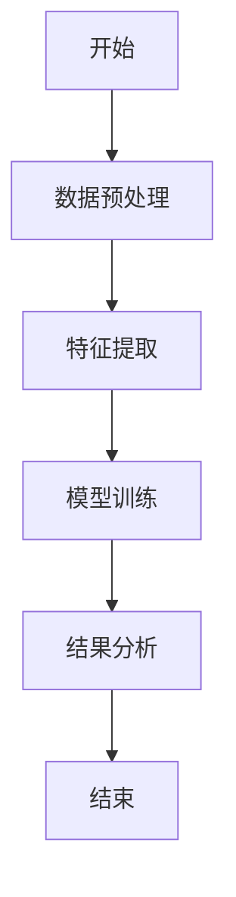
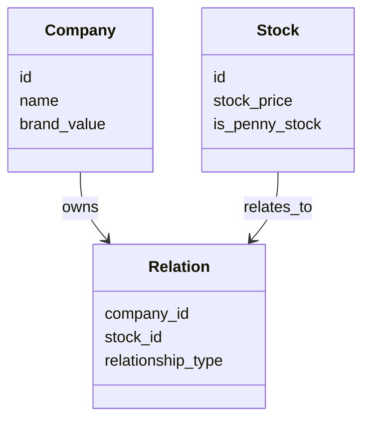
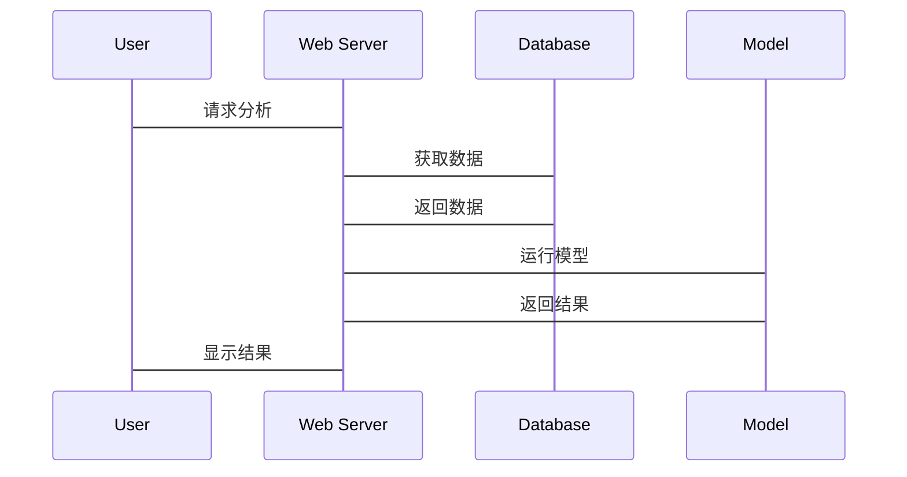

                 


# 特价股票与公司品牌价值的长期关系

## 关键词：特价股票、品牌价值、长期关系、股票价格、品牌资产

## 摘要：本文探讨特价股票与公司品牌价值之间的长期关系，分析特价股票对品牌价值的影响机制，结合数学模型和实际案例，提出有效评估和管理品牌价值的方法。

---

## 第1章：特价股票与品牌价值的背景介绍

### 1.1 特价股票的基本概念

#### 1.1.1 特价股票的定义
特价股票（Penny Stock）是指价格较低的股票，通常在1美元至5美元之间。这类股票多来自小公司或财务重组中的企业，风险较高，波动性大。

#### 1.1.2 特价股票的分类与特点
- **Micro Cap Stocks**：市值在5000万美元至3亿美元之间，流动性较低。
- **Nano Cap Stocks**：市值低于5000万美元，风险极高。

#### 1.1.3 特价股票的市场背景与现状
近年来，随着市场的波动，许多公司因财务问题发行特价股票，试图通过低价吸引投资者，改善财务状况。

### 1.2 公司品牌价值的核心要素

#### 1.2.1 品牌价值的定义与计算方法
品牌价值是企业形象、市场认知和客户忠诚度的综合体现，常用品牌价值评估模型如BrandFame进行计算。

#### 1.2.2 品牌价值的核心影响因素
- **产品质量**：产品性能直接影响客户满意度。
- **市场地位**：市场占有率越高，品牌价值越大。
- **客户忠诚度**：高忠诚度客户提升品牌价值。

#### 1.2.3 品牌价值与公司长期发展的关系
品牌价值影响公司的市场表现和客户信任度，是企业长期发展的基石。

### 1.3 特价股票与品牌价值的关系概述

#### 1.3.1 特价股票与品牌价值的关联性
特价股票的价格波动直接影响公司的市值和品牌价值。

#### 1.3.2 特价股票对品牌价值的影响机制
通过案例分析，说明特价股票如何影响市场对公司的看法，进而影响品牌价值。

---

## 第2章：特价股票与品牌价值的核心概念与联系

### 2.1 特价股票与品牌价值的核心概念对比

#### 2.1.1 特价股票的核心属性
| 属性 | 描述 |
|------|------|
| 价格 | 低价 |
| 风险 | 高风险 |

#### 2.1.2 品牌价值的核心属性
| 属性 | 描述 |
|------|------|
| 计量 | 无形资产 |
| 影响因素 | 质量、市场地位 |

#### 2.1.3 对比分析
特价股票价格波动大，但品牌价值受多种因素影响，两者呈负相关关系。

### 2.2 特价股票与品牌价值的ER实体关系图

```mermaid
erDiagram
    company {
        id
        name
        brand_value
    }
    stock {
        id
        stock_price
        is_penny_stock
    }
    relation {
        company_id
        stock_id
        relationship_type
    }
    company --> relation : owns
    stock --> relation : relates_to
```

---

## 第3章：特价股票与品牌价值的数学模型与算法原理

### 3.1 特价股票与品牌价值的关系模型

#### 3.1.1 线性回归模型
$$ y = \beta_0 + \beta_1x + \epsilon $$
其中，$y$ 为品牌价值，$x$ 为股票价格，$\beta_1$ 为回归系数。

#### 3.1.2 ARIMA 模型
$$ ARIMA(p, d, q) $$
用于分析时间序列数据，预测未来品牌价值。

### 3.2 算法流程图



### 3.3 Python代码实现

```python
import pandas as pd
from sklearn.linear_model import LinearRegression
from statsmodels.tsa.arima.model import ARIMA

# 加载数据
data = pd.read_csv('stock_brand.csv')

# 线性回归模型
model = LinearRegression()
model.fit(data[['stock_price']], data['brand_value'])

# ARIMA模型
model_arima = ARIMA(data['brand_value'], order=(1,1,1))
model_arima_fit = model_arima.fit()
```

---

## 第4章：特价股票与品牌价值的系统分析与架构设计

### 4.1 系统分析

#### 4.1.1 问题场景
分析特价股票对品牌价值的影响，识别潜在风险和机会。

### 4.2 系统功能设计



### 4.3 系统架构设计

```mermaid
containerDiagram
    container Web {
        Web Server
        Database
        User Interface
    }
    container Model {
        Linear Regression Model
        ARIMA Model
    }
    Web --> Model : calls
    Model --> Database : queries
```

### 4.4 系统交互设计



---

## 第5章：项目实战

### 5.1 环境安装

- **Python**：安装Anaconda或Miniconda。
- **库**：安装pandas、scikit-learn、statsmodels。

### 5.2 核心代码实现

```python
import pandas as pd
from sklearn.linear_model import LinearRegression
from statsmodels.tsa.arima.model import ARIMA

# 加载数据
data = pd.read_csv('stock_brand.csv')

# 线性回归模型
model = LinearRegression()
model.fit(data[['stock_price']], data['brand_value'])

# 预测品牌价值
predicted = model.predict(data[['stock_price']])

# ARIMA模型
model_arima = ARIMA(data['brand_value'], order=(1,1,1))
model_arima_fit = model_arima.fit()
forecast = model_arima_fit.forecast(steps=5)
```

### 5.3 实际案例分析

#### 5.3.1 数据分析结果解读
通过回归分析和ARIMA预测，评估特价股票对品牌价值的具体影响。

#### 5.3.2 结果分析与优化
根据预测结果，优化品牌管理策略，降低风险，提升价值。

### 5.4 项目小结
总结项目成果，强调模型的有效性和实际应用价值。

---

## 第6章：最佳实践

### 6.1 小结
特价股票与品牌价值的长期关系复杂，需综合分析财务状况和市场表现。

### 6.2 注意事项
- 定期评估品牌价值。
- 监控特价股票市场波动。
- 结合多种模型进行预测。

### 6.3 拓展阅读
推荐相关书籍和文章，深入理解品牌价值和股票市场的相互作用。

---

通过以上分析和实践，我们可以系统地理解特价股票与品牌价值之间的长期关系，并利用数学模型和系统架构设计有效评估和管理品牌价值，为企业的长期发展提供支持。

