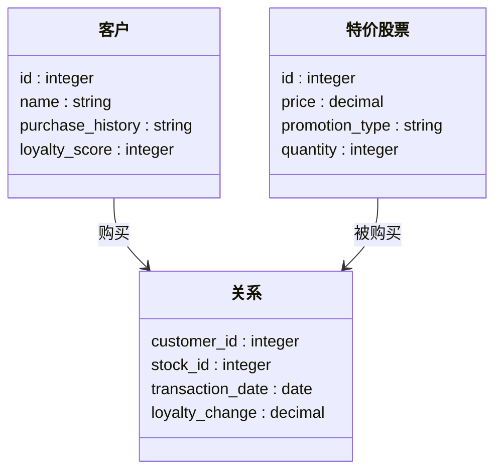
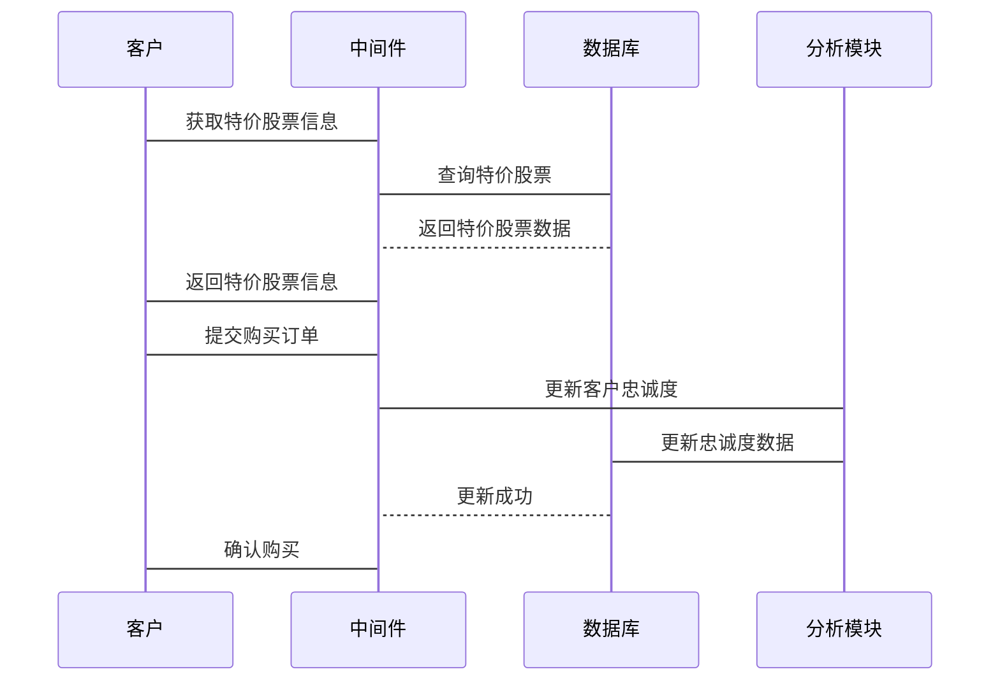

                 


# 特价股票与公司客户忠诚度的长期关系分析

## 关键词：特价股票，客户忠诚度，长期关系，金融策略，客户行为

## 摘要：本文分析了特价股票与公司客户忠诚度之间的长期关系，探讨了特价促销对客户忠诚度的影响，提出了平衡短期销售与长期品牌价值的策略。

---

# 第一部分: 特价股票与客户忠诚度的背景与概念

## 第1章: 特价股票与客户忠诚度的定义与背景

### 1.1 特价股票的定义与特征
- **1.1.1 特价股票的定义**
  特价股票是指公司以低于市场价出售的股票，通常用于促销或清理库存。
- **1.1.2 特价股票的特征**
  - 价格优惠
  - 促销策略
  - 快速销售
- **1.1.3 特价股票的分类**
  - 清理库存型
  - 吸引新客户型
  - 维持市场份额型

### 1.2 客户忠诚度的定义与特征
- **1.2.1 客户忠诚度的定义**
  客户忠诚度是指客户长期选择某品牌产品或服务的程度。
- **1.2.2 客户忠诚度的测量方法**
  - 调查问卷
  - 复购率
  - 顾客净推荐值(NPS)
- **1.2.3 客户忠诚度的分类**
  - 潜在忠诚度
  - 行为忠诚度
  - 情感忠诚度

### 1.3 特价股票与客户忠诚度的关系
- **1.3.1 特价股票对客户忠诚度的影响**
  - 短期内提升销量
  - 长期内可能削弱品牌价值
- **1.3.2 客户忠诚度对特价股票的影响**
  - 忠诚客户更可能参与促销活动
  - 忠诚客户对公司长期支持

## 第2章: 特价股票与客户忠诚度的核心概念与联系

### 2.1 特价股票与客户忠诚度的核心概念
- **2.1.1 特价股票的核心要素**
  - 价格优惠
  - 促销策略
  - 客户参与度
- **2.1.2 客户忠诚度的核心要素**
  - 品牌认同
  - 购买频率
  - 意见反馈

### 2.2 特价股票与客户忠诚度的属性特征对比
| 特性       | 特价股票                     | 客户忠诚度                  |
|------------|------------------------------|-----------------------------|
| 目标       | 提升销量                     | 提升长期支持                |
| 影响因素   | 价格、促销策略               | 品牌价值、客户体验          |
| 持续性      | 短期                         | 长期                        |

### 2.3 特价股票与客户忠诚度的ER实体关系图
```mermaid
erDiagram
    customer[客户] {
        id : integer
        name : string
        purchase_history : string
        loyalty_score : integer
    }
    stock[特价股票] {
        id : integer
        price : decimal
        promotion_type : string
        quantity : integer
    }
    relation[客户-特价股票关系] {
        customer_id : integer
        stock_id : integer
        transaction_date : date
        loyalty_change : decimal
    }
    customer --> relation : 购买
    stock --> relation : 被购买
```

---

# 第二部分: 特价股票与客户忠诚度的理论分析

## 第3章: 特价股票与客户忠诚度的理论基础

### 3.1 金融理论基础
- **3.1.1 资本资产定价模型(CAPM)**
  $$ E(R_i) = R_f + \beta_i (E(R_m) - R_f) $$
  其中，$E(R_i)$ 是股票的预期回报率，$\beta_i$ 是股票的贝塔系数，衡量其系统性风险。

### 3.2 客户忠诚度的理论基础
- **3.2.1 客户生命周期价值(CLV)**
  $$ CLV = \frac{贡献 margin \times 客户保持率}{1 - 客户流失率} $$

### 3.3 行为经济学视角
- **前景理论(Prospect Theory)**
  $$ V = \text{概率} \times \text{收益} - \text{损失} $$

## 第4章: 特价股票与客户忠诚度的数学模型

### 4.1 特价股票对客户忠诚度的影响模型
$$ L = \alpha S + \beta P + \gamma C + \epsilon $$
其中，$L$ 是忠诚度，$S$ 是特价促销强度，$P$ 是价格敏感度，$C$ 是客户满意度，$\alpha, \beta, \gamma$ 是系数，$\epsilon$ 是误差项。

### 4.2 客户忠诚度预测模型
$$ F = \alpha T + \beta L + \gamma C + \delta $$

---

# 第三部分: 特价股票与客户忠诚度的系统分析

## 第5章: 特价股票与客户忠诚度的系统架构

### 5.1 系统功能设计


### 5.2 系统架构设计


### 5.3 系统接口设计
- API接口：
  - GET /stocks 获取特价股票信息
  - POST /loyalty 提交客户忠诚度数据

### 5.4 系统交互流程


---

# 第四部分: 特价股票与客户忠诚度的项目实战

## 第6章: 项目环境与数据准备

### 6.1 环境安装
- 安装Python、Pandas、Scikit-learn等工具。

### 6.2 数据收集
- 收集客户购买记录、特价促销数据、客户满意度评分。

## 第7章: 核心算法实现

### 7.1 数据预处理
```python
import pandas as pd

# 读取数据
data = pd.read_csv('customer_stock.csv')

# 去除缺失值
data.dropna(inplace=True)
```

### 7.2 建立模型
```python
from sklearn.linear_model import LinearRegression

model = LinearRegression()
features = data[['S', 'P', 'C']]
target = data['L']

model.fit(features, target)
```

### 7.3 模型评估
```python
from sklearn.metrics import r2_score

predictions = model.predict(features)
print(r2_score(target, predictions))
```

## 第8章: 实际案例分析

### 8.1 案例介绍
分析某零售公司过去五年内的特价促销策略及其客户忠诚度变化。

### 8.2 数据分析
- 特价促销频率与客户复购率的相关性分析。
- 不同客户群体对特价促销的反应差异。

### 8.3 案例小结
- 特价促销短期内提升销量，但长期可能削弱品牌忠诚度。

---

# 第五部分: 结论与建议

## 第9章: 结论与管理建议

### 9.1 研究结论
- 特价促销短期内提升销量，但长期可能削弱客户忠诚度。
- 高忠诚度客户更注重品牌价值而非价格优惠。

### 9.2 管理建议
- 平衡短期促销与长期品牌建设。
- 提升客户整体体验，而不仅仅是价格优惠。

## 第10章: 未来研究方向

### 10.1 进一步研究
- 不同行业中的特价促销策略差异。
- 客户忠诚度与股东价值的长期关系。

---

# 第六部分: 最佳实践与小结

## 第11章: 最佳实践 tips

### 11.1 小结
- 特价促销需谨慎，长期客户忠诚度更值得投资。
- 综合策略比单一促销更有效。

### 11.2 注意事项
- 定期评估促销策略效果。
- 避免过度依赖价格竞争。

## 第12章: 拓展阅读

### 12.1 相关书籍
- 《客户忠诚度管理》
- 《定价策略与市场竞争》

### 12.2 在线资源
- 特价促销与客户忠诚度的学术论文链接
- 相关行业报告

---

# 结语

特价股票与客户忠诚度之间的关系复杂且多维度。本文通过理论分析、数学建模和实际案例，探讨了如何平衡短期促销与长期品牌建设，为公司制定有效的客户忠诚度策略提供了参考。

