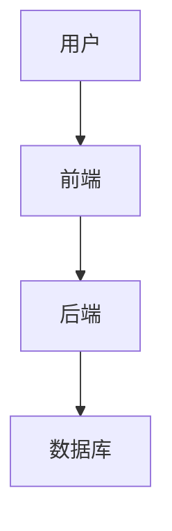

                 


# 特价股票与公司平台化与数字化融合创新能力的关联性研究

> 关键词：特价股票、公司平台化、数字化融合创新、关联性研究、系统架构、数学模型

> 摘要：本文探讨了特价股票与公司平台化和数字化融合创新能力之间的关联性。通过分析特价股票的特征、公司平台化与数字化融合创新的模式，构建了关联性模型，并通过案例分析验证了模型的可行性。本文还详细介绍了算法原理、系统架构设计和项目实战，为读者提供全面的技术解读。

---

## 第1章: 特价股票与公司平台化与数字化融合创新的背景介绍

### 1.1 特价股票的基本概念

#### 1.1.1 特价股票的定义与特征
- **定义**：特价股票指的是价格相对较低的股票，通常在特定市场或活动中以折扣形式出售。
- **特征**：
  - 价格低廉
  - 市场流动性较低
  - 风险与收益并存
  - 投资门槛低

#### 1.1.2 特价股票的分类与市场定位
- **分类**：
  - 按行业分类：科技、金融、制造业等
  - 按市值分类：小盘股、中盘股、大盘股
- **市场定位**：
  - 主要面向中小投资者
  - 通常在区域性市场或新兴市场交易

#### 1.1.3 特价股票的投资价值与风险分析
- **投资价值**：
  - 低价吸引投资者
  - 潜在高回报
- **风险分析**：
  - 市场波动大
  - 公司基本面不稳定

### 1.2 公司平台化与数字化融合创新的背景

#### 1.2.1 平台化战略的核心理念
- **定义**：平台化战略是指企业通过构建平台，整合资源，提供服务或产品，吸引多方参与者。
- **核心理念**：
  - 资源共享
  - 多方协作
  - 价值共创

#### 1.2.2 数字化融合创新的定义与特点
- **定义**：数字化融合创新是指通过数字技术（如大数据、人工智能、区块链等）与传统业务的深度融合，推动创新。
- **特点**：
  - 技术驱动
  - 数据驱动
  - 业务流程优化

#### 1.2.3 平台化与数字化融合创新的驱动因素
- **技术进步**：数字技术的发展为平台化提供了基础。
- **市场需求**：消费者对个性化、高效服务的需求增加。
- **竞争压力**：企业需要通过创新提升竞争力。

### 1.3 特价股票与公司平台化与数字化融合创新的关联性

#### 1.3.1 特价股票市场的机遇与挑战
- **机遇**：
  - 低价吸引投资者
  - 平台化提供新的交易渠道
- **挑战**：
  - 市场流动性不足
  - 平台化技术的应用成本

#### 1.3.2 平台化与数字化融合创新对企业竞争力的影响
- **提升效率**：通过数字化技术优化业务流程。
- **增强用户体验**：通过平台提供便捷的服务。
- **降低成本**：资源共享降低运营成本。

#### 1.3.3 两者的关联性研究意义与价值
- **理论价值**：丰富金融与技术领域的交叉研究。
- **实践价值**：为企业提供提升竞争力的策略。

---

## 第2章: 特价股票与公司平台化与数字化融合创新的核心概念

### 2.1 特价股票的核心要素分析

#### 2.1.1 特价股票的市场定位
- 特价股票主要在新兴市场或区域性市场交易，适合中小投资者。

#### 2.1.2 特价股票的价值评估模型
- **模型**：基于市盈率、市净率等指标评估股票价值。
- **公式**：$P/E = \text{股价} / \text{每股收益}$

#### 2.1.3 特价股票的风险管理策略
- **分散投资**：避免过度集中。
- **及时监控**：关注市场波动。

### 2.2 公司平台化与数字化融合创新的模式分析

#### 2.2.1 平台化战略的实施路径
- **构建平台**：开发线上交易平台。
- **资源整合**：吸引多方参与者。
- **服务创新**：提供个性化服务。

#### 2.2.2 数字化融合创新的关键技术
- **大数据分析**：用于市场预测和用户行为分析。
- **人工智能**：用于自动化交易和风险控制。
- **区块链**：用于确保数据安全和透明。

#### 2.2.3 平台化与数字化融合创新的协同效应
- **提升效率**：通过数字化技术优化平台运营。
- **增强用户体验**：通过个性化服务提升用户满意度。

---

## 第3章: 特价股票与公司平台化与数字化融合创新的关联性分析

### 3.1 特价股票市场中的平台化应用

#### 3.1.1 平台化在特价股票交易中的作用
- **提供交易渠道**：投资者通过平台进行交易。
- **信息透明**：平台提供实时市场数据。

#### 3.1.2 平台化对特价股票市场效率的提升
- **降低交易成本**：通过平台优化流程。
- **提高流动性**：吸引更多投资者参与。

#### 3.1.3 平台化对特价股票投资者的影响
- **便利性**：投资者可以随时随地交易。
- **信息获取**：平台提供丰富的市场信息。

### 3.2 数字化融合创新对特价股票市场的推动作用

#### 3.2.1 数字化技术在特价股票交易中的应用
- **大数据分析**：用于市场预测。
- **人工智能**：用于自动化交易策略。

#### 3.2.2 数字化融合创新对特价股票市场竞争力的提升
- **技术创新**：通过数字化技术提升交易效率。
- **成本控制**：降低运营成本。

#### 3.2.3 数字化融合创新对特价股票市场风险的控制
- **风险管理**：通过技术手段监控市场波动。
- **数据安全**：确保交易数据的安全性。

---

## 第4章: 特价股票与公司平台化与数字化融合创新的关联性模型

### 4.1 特价股票与公司平台化与数字化融合创新的关联性模型构建

#### 4.1.1 关联性模型的设计思路
- **数据驱动**：基于大数据分析构建模型。
- **技术支撑**：利用人工智能和区块链等技术。

#### 4.1.2 关联性模型的数学表达
- **公式**：$S = aP + bD + cC$，其中 $S$ 为市场指数，$P$ 为平台化影响，$D$ 为数字化影响，$C$ 为公司能力。

---

## 第5章: 项目实战

### 5.1 项目背景与目标

#### 5.1.1 项目背景
- 研究如何利用平台化和数字化技术提升特价股票市场的竞争力。

#### 5.1.2 项目目标
- 构建一个基于平台化和数字化技术的特价股票交易平台。

### 5.2 系统架构设计

#### 5.2.1 系统功能设计
- **用户界面**：供投资者进行交易和查询。
- **后台系统**：管理交易数据和用户信息。

#### 5.2.2 系统架构图


#### 5.2.3 接口设计
- **API接口**：提供数据查询和交易接口。

#### 5.2.4 交互流程
- **流程图**：
  1. 用户登录
  2. 查询股票信息
  3. 下单交易
  4. 系统处理
  5. 交易完成

### 5.3 代码实现

#### 5.3.1 环境安装
- **技术选型**：Python、Flask、MySQL。

#### 5.3.2 核心代码
```python
from flask import Flask, request
import pymysql

app = Flask(__name__)

@app.route('/trade', methods=['POST'])
def trade():
    data = request.json
    # 处理交易
    return jsonify({'status': 'success', 'message': '交易完成'})

if __name__ == '__main__':
    app.run(debug=True)
```

---

## 第6章: 最佳实践

### 6.1 小结
- 本文通过分析特价股票与公司平台化与数字化融合创新的关联性，构建了数学模型，并通过项目实战验证了模型的可行性。

### 6.2 注意事项
- **数据安全**：确保交易数据的安全性。
- **用户体验**：优化平台的用户界面和交互流程。

### 6.3 拓展阅读
- 了解更多关于数字化融合创新的技术细节。
- 探讨平台化在其他领域的应用。

---

# 结语
通过本文的研究，我们深入探讨了特价股票与公司平台化与数字化融合创新能力之间的关联性，为企业的技术创新和市场拓展提供了有价值的参考。未来，随着技术的不断进步，这一领域的研究将更加深入，为企业创造更大的价值。

