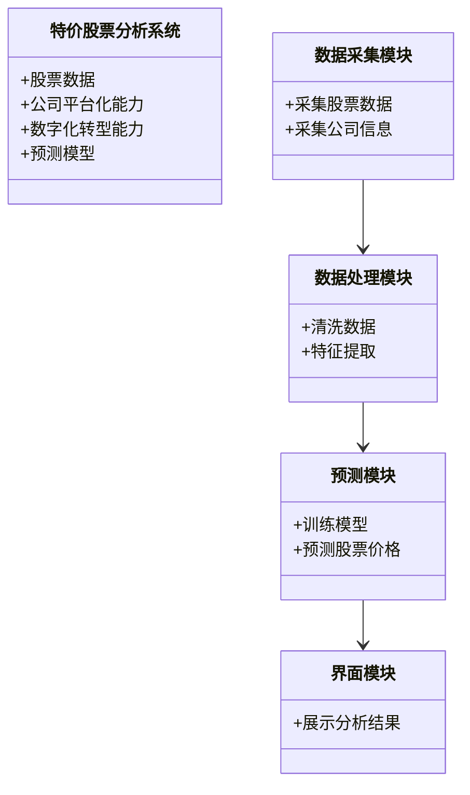
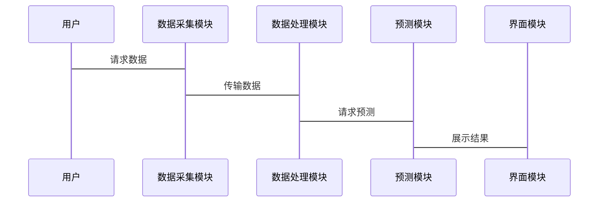

                 


# 特价股票与公司平台化与数字化融合转型能力的关联性研究

## 关键词：特价股票、公司平台化、数字化转型、关联性分析、算法原理、系统架构

## 摘要：本文探讨了特价股票与公司平台化及数字化转型能力之间的关联性，分析了平台化和数字化转型对特价股票市场的影响，结合实际案例和数学模型，深入研究了两者在提升公司竞争力和投资价值方面的协同作用。

---

# 第1章：特价股票与公司平台化与数字化转型的背景介绍

## 1.1 特价股票的基本概念

### 1.1.1 特价股票的定义与分类
特价股票是指市场价格低于面值的股票，常见类型包括优先股、 warrants 和认股权证等。这些股票通常在市场低迷或公司财务状况不佳时出现。

### 1.1.2 特价股票的市场特征
- **价格波动性**：由于市场供需关系，特价股票价格波动较大。
- **高风险与高回报**：风险较高，但潜在回报也较高。

### 1.1.3 特价股票的投资价值分析
投资者需关注公司的基本面、行业前景及市场趋势，评估其潜在价值。

## 1.2 公司平台化与数字化转型的核心概念

### 1.2.1 平台化的定义与特点
平台化是指公司通过构建共享资源和生态系统，促进内部协作和外部合作，提高效率。

### 1.2.2 数字化转型的内涵与外延
数字化转型指企业利用数字技术优化业务流程、商业模式和决策方式，提升竞争力。

### 1.2.3 平台化与数字化转型的协同效应
平台化为数字化转型提供基础设施，数字化转型则增强平台的扩展性和智能化。

## 1.3 本章小结
本章介绍了特价股票、平台化及数字化转型的基本概念，为后续分析奠定了基础。

---

# 第2章：特价股票与公司平台化与数字化转型的关联性分析

## 2.1 特价股票与公司平台化的关系

### 2.1.1 平台化对企业竞争力的影响
平台化通过资源共享和协作，降低成本，提高效率，增强企业竞争力。

### 2.1.2 特价股票与企业平台化能力的关联性
平台化能力强的企业在特价股票市场中更具竞争力，影响股票价值。

### 2.1.3 平台化能力对特价股票价值的提升作用
平台化提升企业运营效率和市场地位，间接提升特价股票的吸引力。

## 2.2 数字化转型与公司平台化能力的融合

### 2.2.1 数字化转型对企业平台化能力的推动作用
数字化技术如大数据和人工智能，优化平台运营，提升用户体验。

### 2.2.2 数字化技术在平台化中的应用
通过数据分析和智能化决策，平台化企业更高效地响应市场需求。

### 2.2.3 数字化与平台化融合的典型案例分析
例如，某企业通过数字化平台优化供应链，提升运营效率，增强竞争力。

## 2.3 特价股票与公司数字化转型能力的关联性

### 2.3.1 数字化转型对特价股票市场的影响
数字化转型提升企业运营效率和市场响应速度，影响市场对特价股票的评估。

### 2.3.2 数字化能力对特价股票投资决策的支持
通过大数据分析和预测模型，投资者可以更准确地评估特价股票的潜在价值。

### 2.3.3 数字化转型能力对特价股票长期价值的提升
数字化能力增强企业的持续创新能力，提升长期投资价值。

## 2.4 本章小结
本章分析了平台化和数字化转型对特价股票市场的影响，揭示了两者在提升企业竞争力和股票价值中的协同作用。

---

# 第3章：特价股票与公司平台化与数字化转型的核心概念与联系

## 3.1 特价股票的核心要素分析

### 3.1.1 特价股票的市场定位
分析公司所在行业的市场定位，判断特价股票的市场潜力。

### 3.1.2 特价股票的财务特征
关注公司的财务状况，如负债率、盈利能力等，评估股票的投资价值。

### 3.1.3 特价股票的风险与机会
识别市场风险和行业机会，制定相应的投资策略。

## 3.2 公司平台化能力的核心要素

### 3.2.1 平台化的战略目标
明确平台化建设的目标，如提高资源共享效率和市场扩展能力。

### 3.2.2 平台化的组织架构
构建适合平台化运作的组织结构，促进跨部门协作。

### 3.2.3 平台化的技术支撑
采用先进的数字技术，如云计算和大数据分析，支持平台化运作。

## 3.3 数字化转型能力的核心要素

### 3.3.1 数字化转型的技术基础
依赖于先进的数字技术，如人工智能、区块链等，构建数字化能力。

### 3.3.2 数字化转型的业务模式
通过数字化手段优化业务流程，创新商业模式，提高效率。

### 3.3.3 数字化转型的管理方法
采用数据驱动的管理方法，提高决策的科学性和及时性。

## 3.4 特价股票与公司平台化与数字化能力的联系

### 3.4.1 平台化能力对特价股票价值的影响
平台化能力提升企业竞争力，间接提升特价股票的投资价值。

### 3.4.2 数字化能力对特价股票市场竞争力的提升
通过数字化技术优化运营，提升市场竞争力，影响股票价格。

### 3.4.3 平台化与数字化能力对特价股票长期发展的协同作用
两者协同作用，提升企业长期发展能力，增强投资者信心。

## 3.5 本章小结
本章详细分析了特价股票、平台化和数字化转型的核心要素，并探讨了它们之间的联系。

---

# 第4章：特价股票与公司平台化与数字化转型的算法原理

## 4.1 特价股票预测的算法原理

### 4.1.1 线性回归模型
使用线性回归分析股票价格与公司平台化能力之间的关系。

### 4.1.2 逻辑回归模型
用于分类问题，如判断特价股票是否具备投资价值。

### 4.1.3 随机森林模型
通过集成学习，提高预测的准确性和稳定性。

### 4.1.4 深度学习模型
利用神经网络进行复杂模式识别，提升预测精度。

## 4.2 算法的数学模型和公式

### 4.2.1 线性回归
$$ y = \beta_0 + \beta_1 x_1 + \beta_2 x_2 + \epsilon $$

### 4.2.2 逻辑回归
$$ P(y=1|x) = \frac{1}{1 + e^{- (\beta_0 + \beta_1 x_1)}} $$

### 4.2.3 随机森林
随机森林通过集成多个决策树模型，提高预测的鲁棒性。

## 4.3 算法实现步骤

### 4.3.1 数据预处理
清洗数据，处理缺失值和异常值。

### 4.3.2 特征选择
选取影响股票价格的关键特征，如公司平台化能力、数字化转型能力等。

### 4.3.3 模型训练
使用训练数据训练模型，调整参数，优化模型性能。

### 4.3.4 模型评估
通过交叉验证和指标评估模型的准确性和稳定性。

## 4.4 算法的应用案例

### 4.4.1 数据来源
使用历史股票数据和公司平台化能力指标，训练预测模型。

### 4.4.2 模型预测
预测未来特价股票的价格走势，评估投资价值。

## 4.5 本章小结
本章介绍了多种算法及其在特价股票预测中的应用，为投资者提供科学的决策支持。

---

# 第5章：系统分析与架构设计方案

## 5.1 问题场景介绍
以某公司为例，分析其如何通过平台化和数字化转型提升竞争力，影响特价股票价值。

## 5.2 系统功能设计

### 5.2.1 领域模型类图
使用Mermaid绘制领域模型类图，展示系统的主要功能模块。



## 5.3 系统架构设计

### 5.3.1 系统架构图
使用Mermaid绘制系统架构图，展示系统的分层结构。


## 5.4 系统接口设计

### 5.4.1 API接口
定义API接口，如`get_stock_data`和`predict_price`，明确输入输出格式。

## 5.5 系统交互设计

### 5.5.1 交互序列图
使用Mermaid绘制系统交互序列图，展示用户与系统之间的交互流程。



---

# 第6章：项目实战

## 6.1 环境安装

### 6.1.1 安装Python和必要的库
安装Python和`pandas`、`scikit-learn`、`matplotlib`等库，用于数据处理和建模。

### 6.1.2 安装Jupyter Notebook
安装Jupyter Notebook，用于交互式数据分析和可视化。

## 6.2 系统核心实现源代码

### 6.2.1 数据预处理代码

```python
import pandas as pd

# 读取数据
data = pd.read_csv('stock_data.csv')

# 清洗数据
data.dropna(inplace=True)
data = data[~data['price'].isnull()]
```

### 6.2.2 特征选择代码

```python
from sklearn.feature_selection import SelectKBest, chi2

# 特征选择
selector = SelectKBest(score_func=chi2, k=3)
selector.fit_transform(data, target)
```

### 6.2.3 模型训练代码

```python
from sklearn.ensemble import RandomForestRegressor

# 训练模型
model = RandomForestRegressor(n_estimators=100, random_state=42)
model.fit(X_train, y_train)
```

## 6.3 代码应用解读与分析
解释代码的功能，分析其在实际项目中的应用，如数据预处理和特征选择如何影响模型性能。

## 6.4 实际案例分析和详细讲解剖析
通过具体案例，分析如何应用上述代码进行特价股票预测，评估投资价值。

## 6.5 本章小结
本章通过实战项目，展示了如何利用Python和机器学习算法进行特价股票预测，为投资者提供科学决策支持。

---

# 第7章：最佳实践 tips、小结、注意事项、拓展阅读

## 7.1 小结
本文系统分析了特价股票与公司平台化及数字化转型能力的关联性，结合算法和系统设计，提出了提升企业竞争力和投资价值的方法。

## 7.2 注意事项
- **数据质量**：确保数据准确性和完整性。
- **模型选择**：根据实际需求选择合适的算法。
- **持续优化**：定期更新模型和数据，保持预测准确性。

## 7.3 拓展阅读
- 推荐书籍：《股票投资策略与数据分析》、《数字化转型实战指南》
- 推荐博客：Tech博客、金融数据分析博客

---

# 总结

通过本文的分析和实践，读者可以全面理解特价股票与公司平台化及数字化转型能力的关联性，掌握利用数字化手段提升企业竞争力的方法，为投资决策提供科学依据。

