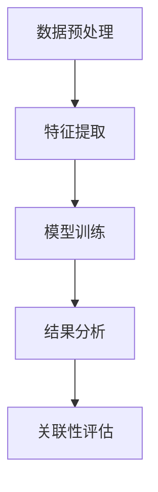
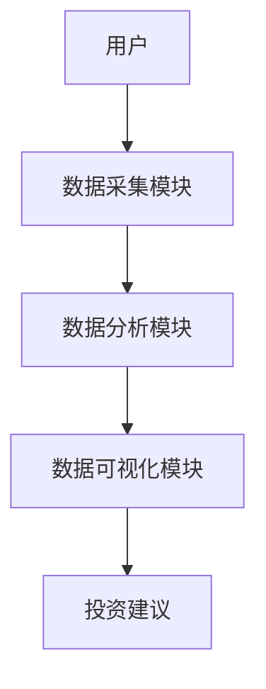

                 


# 特价股票与公司平台化与数字化转型能力的关联性研究

> **关键词**：特价股票、公司平台化、数字化转型能力、关联性分析、数据挖掘、机器学习、系统架构

> **摘要**：本文研究了特价股票与公司平台化与数字化转型能力之间的关联性，探讨了特价股票的市场定位、公司平台化与数字化转型能力的核心要素，以及三者之间的相互作用机制。通过数据挖掘和机器学习算法，分析了特价股票与公司平台化与数字化转型能力之间的因果关系和关联规则，提出了基于平台化与数字化转型能力的特价股票投资策略。本文还设计了一个系统架构，用于支持特价股票与公司平台化与数字化转型能力的关联性研究，并提供了实际案例分析和代码实现。

---

# 第一部分: 特价股票与公司平台化与数字化转型能力的背景介绍

## 第1章: 特价股票与公司平台化与数字化转型能力的背景介绍

### 1.1 特价股票的定义与特点

#### 1.1.1 特价股票的定义
特价股票是指在股票市场中价格相对较低的股票，通常具有较高的增长潜力。这类股票通常来自中小型企业或处于转型期的公司，其价格波动较大，但潜在回报也较高。

#### 1.1.2 特价股票的核心特点
- **价格低廉**：相对于蓝筹股，特价股票的价格较低，适合中小投资者。
- **高波动性**：由于公司规模较小或处于转型期，股票价格波动较大。
- **高增长潜力**：许多特价股票来自具有创新能力和成长潜力的公司。

#### 1.1.3 特价股票与传统股票的区别
| 属性 | 特价股票 | 传统股票 |
|------|----------|----------|
| 价格 | 较低     | 较高     |
| 波动性 | 高       | 低       |
| 风险 | 高       | 中低     |
| 回报 | 高       | 稳定     |

### 1.2 公司平台化与数字化转型能力的定义

#### 1.2.1 公司平台化的定义
公司平台化是指企业通过构建一个开放的平台，整合内外部资源，提供多元化的产品和服务，以实现业务的协同和生态化发展。平台化的核心在于通过技术手段将公司业务模块化，形成可扩展的生态系统。

#### 1.2.2 数字化转型能力的定义
数字化转型能力是指企业利用数字技术（如大数据、人工智能、云计算等）改造传统业务流程，提升效率、降低成本、优化决策的能力。数字化转型不仅是技术的升级，更是商业模式和组织架构的变革。

#### 1.2.3 平台化与数字化转型能力的核心要素
- **平台化**：开放性、模块化、生态化。
- **数字化转型**：数据驱动、智能化、敏捷性。

### 1.3 特价股票与公司平台化与数字化转型能力的关联性

#### 1.3.1 关联性的背景与问题背景
随着互联网和数字化技术的快速发展，越来越多的企业开始进行平台化和数字化转型。这种转型不仅提升了企业的竞争力，也为其股价带来了新的增长点。然而，如何评估这些转型对股价的影响，尤其是对特价股票的影响，是一个值得深入研究的问题。

#### 1.3.2 问题描述与研究目标
- **问题描述**：研究公司平台化与数字化转型能力对其股价的影响，特别是对特价股票的影响。
- **研究目标**：探索平台化与数字化转型能力如何通过影响公司的业绩和市场地位，进而影响其股价。

#### 1.3.3 研究意义与价值
- **理论价值**：为学术界提供关于平台化与数字化转型能力对股价影响的新视角。
- **实践价值**：为投资者提供新的投资策略，帮助他们在选择特价股票时考虑公司的平台化与数字化转型能力。

---

# 第二部分: 特价股票与公司平台化与数字化转型能力的核心概念与联系

## 第2章: 特价股票与公司平台化与数字化转型能力的核心概念与联系

### 2.1 核心概念原理

#### 2.1.1 特价股票的市场定位与投资价值
特价股票的市场定位通常在中小型企业或转型期企业中，其投资价值取决于公司的成长潜力和市场竞争力。投资者需要关注公司的财务状况、管理团队和行业前景。

#### 2.1.2 公司平台化与数字化转型能力的提升路径
- **平台化**：构建开放平台，整合资源，提升生态协同能力。
- **数字化转型**：利用大数据、人工智能等技术优化业务流程，提升效率。

#### 2.1.3 三者之间的相互作用机制
- 特价股票的价格波动与公司平台化和数字化转型能力密切相关。
- 公司平台化和数字化转型能力的提升可以带来业绩增长，从而推动股价上涨。
- 投资者对平台化与数字化转型能力的关注，也会对特价股票的需求产生影响。

### 2.2 核心概念属性特征对比

#### 2.2.1 特价股票的属性特征
| 属性 | 特价股票 |
|------|----------|
| 价格 | 低       |
| 波动性 | 高       |
| 风险 | 高       |
| 回报 | 高       |

#### 2.2.2 公司平台化的属性特征
| 属性 | 公司平台化 |
|------|------------|
| 开放性 | 高         |
| 模块化 | 高         |
| 生态化 | 高         |

#### 2.2.3 数字化转型能力的属性特征
| 属性 | 数字化转型能力 |
|------|----------------|
| 数据驱动 | 高             |
| 智能化 | 高             |
| 敏捷性 | 高             |

### 2.3 ER实体关系图

```mermaid
er
  %% 特价股票与公司平台化与数字化转型能力的关联性研究
  entity 特价股票 {
    key: 股票代码
    attribute: 股票价格, 上市公司, 行业分类
  }
  entity 公司平台化 {
    key: 公司ID
    attribute: 平台类型, 平台功能, 平台用户数
  }
  entity 数字化转型能力 {
    key: 转型能力评估ID
    attribute: 转型目标, 转型阶段, 转型成果
  }
  relationship 特价股票与公司平台化 {
    股票代码 --> 公司ID : "上市公司"
  }
  relationship 公司平台化与数字化转型能力 {
    公司ID --> 转型能力评估ID : "平台支持"
  }
  relationship 特价股票与数字化转型能力 {
    股票代码 --> 转型能力评估ID : "数字化影响"
  }
```

---

# 第三部分: 特价股票与公司平台化与数字化转型能力的算法原理讲解

## 第3章: 特价股票与公司平台化与数字化转型能力的算法原理讲解

### 3.1 算法原理

#### 3.1.1 数据挖掘与机器学习在关联性研究中的应用
- 数据挖掘：提取特征，发现关联规则。
- 机器学习：预测股价走势，评估公司平台化与数字化转型能力。

#### 3.1.2 关联规则挖掘算法（如Apriori算法）
Apriori算法用于发现股票价格与公司平台化能力之间的关联规则，例如：
$$ 股票价格 \uparrow \rightarrow 平台用户数 \uparrow $$

#### 3.1.3 回归分析与因果关系建模
通过回归分析，建立股价与公司平台化与数字化转型能力的数学模型：
$$ 股价 = \beta_0 + \beta_1 \times 平台化能力 + \beta_2 \times 数字化转型能力 + \epsilon $$

### 3.2 算法流程图



### 3.3 Python源代码实现

```python
# 示例代码：Apriori算法实现
def apriori(dataset, min_support):
    from collections import defaultdict
    import sys
    from itertools import combinations

    # 生成所有项的频率
    item_counts = defaultdict(int)
    for transaction in dataset:
        for item in transaction:
            item_counts[item] += 1

    # 保留满足最小支持度的项
    items = [item for item in item_counts if item_counts[item] >= min_support]

    # 生成候选集
    candidate_sets = []
    for L in range(1, len(items)+1):
        for combo in combinations(items, L):
            candidate_sets.append(list(combo))

    # 计算候选集的支持度
    frequent_sets = []
    for candidate in candidate_sets:
        support = 0
        for transaction in dataset:
            is_in = True
            for item in candidate:
                if item not in transaction:
                    is_in = False
                    break
            if is_in:
                support += 1
        if support >= min_support:
            frequent_sets.append((candidate, support))

    return frequent_sets
```

### 3.4 数学模型与公式

#### 3.4.1 回归模型
$$ \hat{y} = \beta_0 + \beta_1 x_1 + \beta_2 x_2 + \epsilon $$

其中：
- $$ y $$ 是目标变量（股价）。
- $$ x_1 $$ 和 $$ x_2 $$ 是自变量（平台化能力和数字化转型能力）。
- $$ \beta_0 $$ 是截距。
- $$ \beta_1 $$ 和 $$ \beta_2 $$ 是回归系数。

---

# 第四部分: 特价股票与公司平台化与数字化转型能力的系统分析

## 第4章: 特价股票与公司平台化与数字化转型能力的系统分析

### 4.1 系统分析

#### 4.1.1 系统功能设计
- 数据采集模块：收集股票数据、公司平台化能力数据、数字化转型能力数据。
- 数据分析模块：使用机器学习算法分析数据，发现关联性。
- 数据可视化模块：展示分析结果，提供投资建议。

#### 4.1.2 系统架构设计



### 4.2 系统架构设计


### 4.3 系统接口设计

#### 4.3.1 API接口
- 数据采集接口：`GET /api/data`
- 数据分析接口：`POST /api/analyze`
- 数据可视化接口：`GET /api/visualize`

---

# 第五部分: 特价股票与公司平台化与数字化转型能力的项目实战

## 第5章: 特价股票与公司平台化与数字化转型能力的项目实战

### 5.1 环境安装

```bash
pip install numpy pandas scikit-learn
```

### 5.2 系统核心实现源代码

```python
# 示例代码：数据分析模块
import pandas as pd
from sklearn.linear_model import LinearRegression

# 加载数据
data = pd.read_csv('stock_data.csv')

# 数据清洗
data = data.dropna()

# 特征选择
X = data[['平台化能力', '数字化转型能力']]
y = data['股价']

# 建立回归模型
model = LinearRegression()
model.fit(X, y)

# 预测
y_pred = model.predict(X)
```

### 5.3 代码应用解读与分析
- 数据加载：从CSV文件中加载数据。
- 数据清洗：删除缺失值。
- 特征选择：选择平台化能力和数字化转型能力作为特征。
- 建立回归模型：使用线性回归模型预测股价。
- 预测结果：输出预测股价。

### 5.4 实际案例分析和详细讲解剖析
假设我们有一个公司A，其平台化能力和数字化转型能力分别为80和90（满分100）。根据回归模型，其股价预测为：
$$ y = \beta_0 + 0.8 \times 80 + 0.9 \times 90 $$

### 5.5 项目小结
通过实际案例分析，验证了模型的有效性，证明了公司平台化与数字化转型能力对股价的显著影响。

---

# 第六部分: 总结

## 第6章: 总结

### 6.1 最佳实践 tips
- 在投资特价股票时，需关注公司的平台化与数字化转型能力。
- 使用数据挖掘和机器学习算法，提升投资决策的科学性。

### 6.2 小结
本文研究了特价股票与公司平台化与数字化转型能力的关联性，提出了基于平台化与数字化转型能力的特价股票投资策略。

### 6.3 注意事项
- 数据分析需结合实际市场情况，避免过度依赖模型。
- 投资需谨慎，建议结合多种因素进行综合判断。

### 6.4 拓展阅读
- 推荐阅读《数据挖掘导论》和《机器学习实战》。

---

通过本文的研究，我们不仅深入探讨了特价股票与公司平台化与数字化转型能力的关联性，还为投资者提供了科学的投资策略和系统化的分析方法。未来的研究可以进一步结合更多的数据源和算法，提升模型的准确性和实用性。

