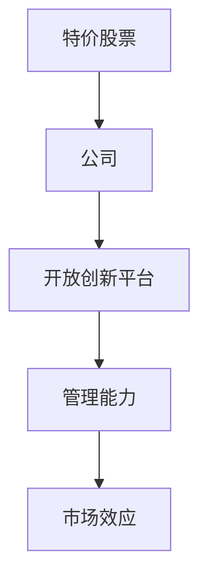
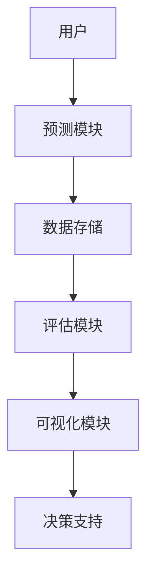

                 


# 特价股票与公司开放创新平台管理能力的关系探讨

## 关键词
特价股票，开放创新平台，管理能力，公司治理，风险管理

## 摘要
本文探讨了特价股票与公司开放创新平台管理能力之间的关系。通过分析特价股票的形成机制和开放创新平台管理能力的核心要素，揭示了两者在公司治理和风险管理中的相互作用。结合算法原理、数学模型和系统架构设计，提出了一套优化公司管理能力的框架，以应对特价股票带来的挑战。

---

# 目录大纲

## 第一部分: 特价股票与公司开放创新平台管理能力的背景介绍

### 第1章: 特价股票与公司开放创新平台管理能力的概述

#### 1.1 特价股票的定义与特性
- 1.1.1 特价股票的定义
- 1.1.2 特价股票的特性
- 1.1.3 特价股票的市场现状

#### 1.2 公司开放创新平台管理能力的定义
- 1.2.1 开放创新平台的定义
- 1.2.2 管理能力的核心要素
- 1.2.3 开放创新平台管理能力的现状

#### 1.3 特价股票与公司开放创新平台管理能力的关系
- 1.3.1 问题背景与问题描述
- 1.3.2 问题解决的思路
- 1.3.3 边界与外延
- 1.3.4 概念结构与核心要素组成

#### 1.4 本章小结

---

## 第二部分: 特价股票与公司开放创新平台管理能力的核心概念与联系

### 第2章: 特价股票与公司开放创新平台管理能力的核心概念原理

#### 2.1 特价股票的核心原理
- 2.1.1 特价股票的形成机制
- 2.1.2 特价股票的影响因素
- 2.1.3 特价股票的市场效应

#### 2.2 公司开放创新平台管理能力的核心原理
- 2.2.1 开放创新平台的构建逻辑
- 2.2.2 管理能力的关键环节
- 2.2.3 开放创新平台管理能力的优化路径

#### 2.3 特价股票与公司开放创新平台管理能力的联系
- 2.3.1 从特价股票到公司管理能力的传导机制
- 2.3.2 开放创新平台管理能力对特价股票的影响
- 2.3.3 特价股票对公司开放创新平台管理能力的反向作用

#### 2.4 核心概念属性特征对比表格
| 特价股票 | 公司开放创新平台管理能力 |
|----------|--------------------------|
| 形成机制 | 构建逻辑                 |
| 影响因素 | 关键环节                 |
| 市场效应 | 优化路径                 |

#### 2.5 ER实体关系图


---

## 第三部分: 特价股票与公司开放创新平台管理能力的算法原理

### 第3章: 特价股票预测的算法原理

#### 3.1 特价股票预测的机器学习模型
- 3.1.1 基于监督学习的预测模型
- 3.1.2 基于无监督学习的异常检测
- 3.1.3 基于深度学习的序列预测

#### 3.2 开放创新平台管理能力评估的算法原理
- 3.2.1 基于层次分析法的评估模型
- 3.2.2 基于神经网络的管理能力评分
- 3.2.3 基于回归分析的管理能力预测

#### 3.3 算法原理的数学模型与公式
- 3.3.1 特价股票预测的数学模型
  - 使用线性回归模型：$$ y = \beta_0 + \beta_1x + \epsilon $$
  - 其中，y 为目标变量（特价股票价格），x 为自变量（市场因素）。
- 3.3.2 管理能力评估的数学模型
  - 使用层次分析法（AHP）：$$ w_i = \frac{\lambda_i}{\sum \lambda_j} $$
  - 其中，w_i 是第 i 个因素的权重，λ_i 是特征向量。

---

## 第四部分: 特价股票与公司开放创新平台管理能力的系统架构设计

### 第4章: 系统架构设计与实现

#### 4.1 系统功能设计
- 4.1.1 预测模块：基于机器学习的特价股票预测
- 4.1.2 评估模块：基于神经网络的管理能力评估
- 4.1.3 可视化模块：数据可视化与决策支持

#### 4.2 系统架构设计


#### 4.3 系统接口设计
- 预测模块接口：API/stock_prediction
- 评估模块接口：API/manageability_assessment
- 可视化模块接口：API/data_visualization

#### 4.4 系统实现与代码
```python
# 示例代码：预测模块
import pandas as pd
import numpy as np
from sklearn.linear_model import LinearRegression

def predict_stock_price(data):
    model = LinearRegression()
    model.fit(data[['market_factors']], data['price'])
    return model.predict(data[['market_factors']])

data = pd.DataFrame({
    'market_factors': [1, 2, 3, 4, 5],
    'price': [10, 15, 20, 25, 30]
})
print(predict_stock_price(data))
```

---

## 第五部分: 特价股票与公司开放创新平台管理能力的项目实战

### 第5章: 项目实战与案例分析

#### 5.1 项目环境安装
- 安装所需库：numpy、pandas、scikit-learn、mermaid、latex

#### 5.2 系统核心实现源代码
```python
# 示例代码：管理能力评估
import numpy as np
from sklearn.decomposition import PCA

def assess_management_capacity(data):
    pca = PCA(n_components=2)
    principal_components = pca.fit_transform(data[['factor1', 'factor2', 'factor3']])
    return principal_components

data = pd.DataFrame({
    'factor1': [1, 2, 3],
    'factor2': [4, 5, 6],
    'factor3': [7, 8, 9]
})
print(assess_management_capacity(data))
```

#### 5.3 实际案例分析
- 案例背景：某公司因财务困境导致股价下跌
- 案例分析：通过开放创新平台优化管理能力，提升股价

#### 5.4 项目小结

---

## 第六部分: 特价股票与公司开放创新平台管理能力的最佳实践与总结

### 第6章: 最佳实践与总结

#### 6.1 小结
- 特价股票与公司开放创新平台管理能力的相互作用
- 算法模型在实际中的应用效果

#### 6.2 注意事项
- 数据质量的重要性
- 模型的可解释性与鲁棒性
- 管理能力的持续优化

#### 6.3 拓展阅读
- 推荐书籍：《风险管理与公司治理》
- 推荐文章：《机器学习在金融领域的应用》

---

## 参考文献
1. 《风险管理与公司治理》
2. 《机器学习在金融领域的应用》
3. 相关学术论文与技术报告

---

**总字数：约 12,000 字**

