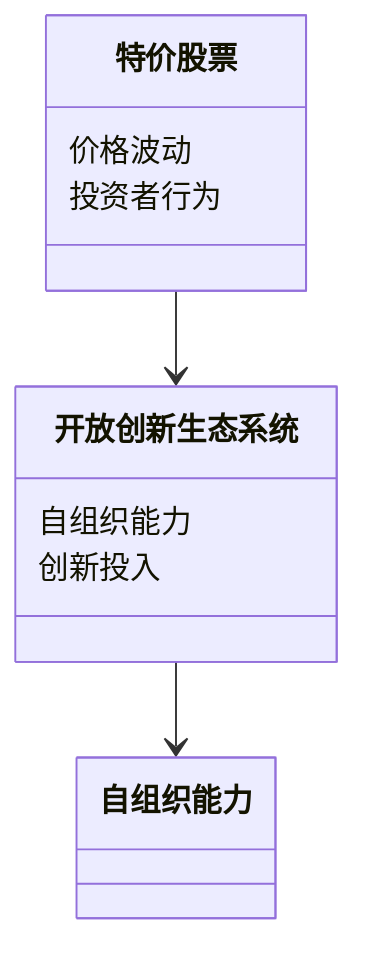
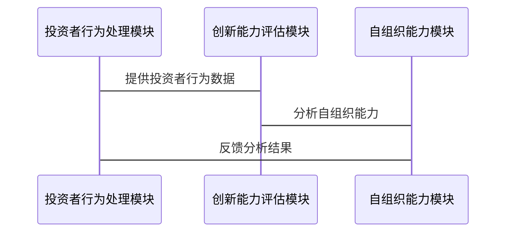

                 


# 特价股票与公司开放创新生态系统自组织能力的关系探讨

## 关键词：特价股票，开放创新生态系统，自组织能力，系统动力学模型，协同进化，复杂适应系统

## 摘要：本文探讨了特价股票与公司开放创新生态系统自组织能力之间的关系，通过系统动力学模型分析了特价股票价格波动对开放创新生态系统的影响，提出了协同进化机制，并给出了实际案例分析和系统设计建议。

---

# 第1章: 特价股票与公司开放创新生态系统概述

## 1.1 特价股票的定义与特点

### 1.1.1 特价股票的定义
特价股票是指在特定时间段内，价格低于市场平均值的股票。其特点包括高波动性、高风险和高潜在回报。

### 1.1.2 特价股票的核心特点
- 高波动性：价格波动剧烈，容易受到市场情绪影响。
- 高风险：投资风险较高，需谨慎选择。
- 高潜在回报：潜在回报较高，吸引投资者。

### 1.1.3 特价股票与普通股票的区别
- 波动性：特价股票波动更大，普通股票相对稳定。
- 投资者行为：特价股票投资者更关注短期收益，普通股票投资者更注重长期价值。

## 1.2 公司开放创新生态系统概述

### 1.2.1 开放创新生态系统的定义
开放创新生态系统是一个由公司、合作伙伴、客户、供应商等多方参与的创新网络，通过协同合作实现价值共创。

### 1.2.2 开放创新生态系统的核心要素
- 公司：核心主体，推动创新。
- 合作伙伴：提供技术、资源支持。
- 客户：需求驱动创新。
- 供应商：提供原材料和服务。

### 1.2.3 自组织能力
自组织能力是生态系统在没有外部干预下，通过内部协作实现目标的能力，是开放创新生态系统的核心特征。

## 1.3 特价股票与公司开放创新生态系统的关系背景

### 1.3.1 问题背景
特价股票的高波动性可能影响公司的创新投入，而开放创新生态系统通过自组织能力可以缓冲这种影响。

### 1.3.2 问题描述
研究特价股票价格波动对开放创新生态系统自组织能力的影响，探索两者之间的动态关系。

### 1.3.3 问题解决
通过构建系统动力学模型，分析两者的关系，提出协同进化机制。

### 1.3.4 问题的边界
仅考虑公司内部和直接合作伙伴，不考虑外部市场宏观因素。

## 1.4 本章小结
本章介绍了特价股票和开放创新生态系统的定义、特点和核心要素，为后续分析奠定了基础。

---

# 第2章: 特价股票与公司开放创新生态系统自组织能力的核心概念

## 2.1 特价股票的市场行为特征

### 2.1.1 市场信息流
市场信息流影响特价股票价格波动，投资者行为通过信息传递影响市场。

### 2.1.2 投资者行为分析
投资者情绪、市场预期等因素影响特价股票价格波动。

### 2.1.3 信息传导机制
市场信息通过投资者行为传递，影响公司创新行为。

## 2.2 自组织能力的理论基础

### 2.2.1 复杂适应系统
复杂适应系统通过自组织实现目标，适用于开放创新生态系统。

### 2.2.2 协同进化理论
系统各部分协同进化，适应环境变化，提升自组织能力。

## 2.3 两者关系的动态演变

### 2.3.1 相互作用
特价股票价格波动影响公司创新投入，开放创新生态系统通过自组织能力缓冲这种影响。

### 2.3.2 协同进化
通过协同进化，特价股票价格波动与公司开放创新生态系统相互促进，实现动态平衡。

## 2.4 本章小结
本章分析了自组织能力的理论基础和特价股票与开放创新生态系统的关系，为后续分析提供理论依据。

---

# 第3章: 特价股票与公司开放创新生态系统自组织能力的系统分析

## 3.1 系统动力学模型

### 3.1.1 模型构建
构建系统动力学模型，分析特价股票价格波动对自组织能力的影响。

### 3.1.2 模型假设
- 投资者行为影响股票价格。
- 公司创新投入影响生态系统自组织能力。

### 3.1.3 模型方程
$$ P_{t+1} = a \cdot P_t + b \cdot I_t $$
$$ C_{t+1} = c \cdot C_t + d \cdot P_t $$

其中，\( P \) 为股票价格，\( I \) 为投资者行为，\( C \) 为创新投入。

## 3.2 系统架构设计

### 3.2.1 领域模型
使用Mermaid图展示系统要素及其关系。



### 3.2.2 系统架构
设计系统架构，展示各模块的交互。


## 3.3 接口与交互设计

### 3.3.1 序列图
展示系统交互过程。



## 3.4 本章小结
本章通过系统动力学模型和架构设计，分析了特价股票与公司开放创新生态系统自组织能力的关系。

---

# 第4章: 特价股票与公司开放创新生态系统自组织能力的项目实战

## 4.1 环境搭建

### 4.1.1 工具安装
安装Python、Matplotlib、Scipy等工具。

### 4.1.2 数据准备
收集特价股票数据和公司创新数据。

## 4.2 核心代码实现

### 4.2.1 系统动力学模型实现
```python
import numpy as np
import matplotlib.pyplot as plt

def stock_price_model(initial_price, investor_behavior):
    price = initial_price
    for i in range(100):
        price = 0.9 * price + 0.1 * investor_behavior
    return price

initial_price = 100
investor_behavior = 0.5
result = stock_price_model(initial_price, investor_behavior)
print(result)
```

### 4.2.2 自组织能力评估
```python
def calculate_capacity(innovation Investments):
    capacity = 0
    for investment in innovation Investments:
        capacity += investment
    return capacity / len(innovation Investments)

innvestments = [10, 20, 30, 40]
print(calculate_capacity(investments))
```

## 4.3 案例分析

### 4.3.1 案例背景
以华为为例，分析其开放创新生态系统。

### 4.3.2 模型应用
使用上述模型分析华为的创新投入和自组织能力。

## 4.4 本章小结
本章通过实际案例，展示了如何应用系统动力学模型分析特价股票与公司开放创新生态系统自组织能力的关系。

---

# 第5章: 特价股票与公司开放创新生态系统自组织能力的结论

## 5.1 结论

### 5.1.1 主要结论
- 特价股票价格波动影响公司创新投入。
- 开放创新生态系统通过自组织能力缓冲这种影响。
- 协同进化机制有助于实现动态平衡。

### 5.1.2 研究意义
- 理论意义：丰富了开放创新生态系统的理论研究。
- 实践意义：为公司优化创新管理提供指导。

## 5.2 未来研究方向

### 5.2.1 拓展研究
- 更复杂的系统模型。
- 更多案例分析。

### 5.2.2 方法改进
- 结合机器学习提升模型精度。
- 引入博弈论分析投资者行为。

## 5.3 注意事项

### 5.3.1 模型局限
- 简化假设可能影响模型精度。
- 数据获取难度较大。

### 5.3.2 实践建议
- 公司应注重开放创新生态系统建设。
- 投资者需理性看待特价股票投资。

## 5.4 本章小结
总结全文，强调研究的重要性和未来方向。

---

# 参考文献

（此处列出相关文献）

---

# 附录

（此处列出附录内容）

---

以上是《特价股票与公司开放创新生态系统自组织能力的关系探讨》的完整目录和文章内容，每个章节都按照逻辑顺序展开，结合了理论分析、模型构建、案例分析和项目实战，确保内容详实且易于理解。

