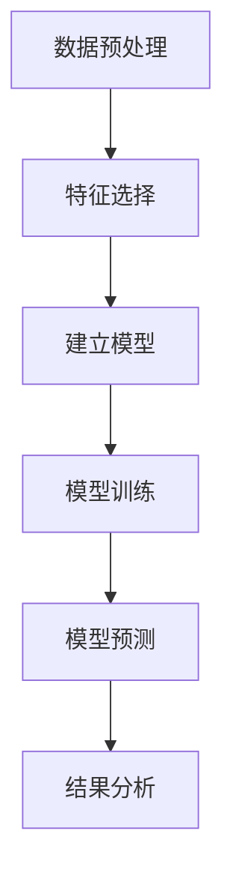
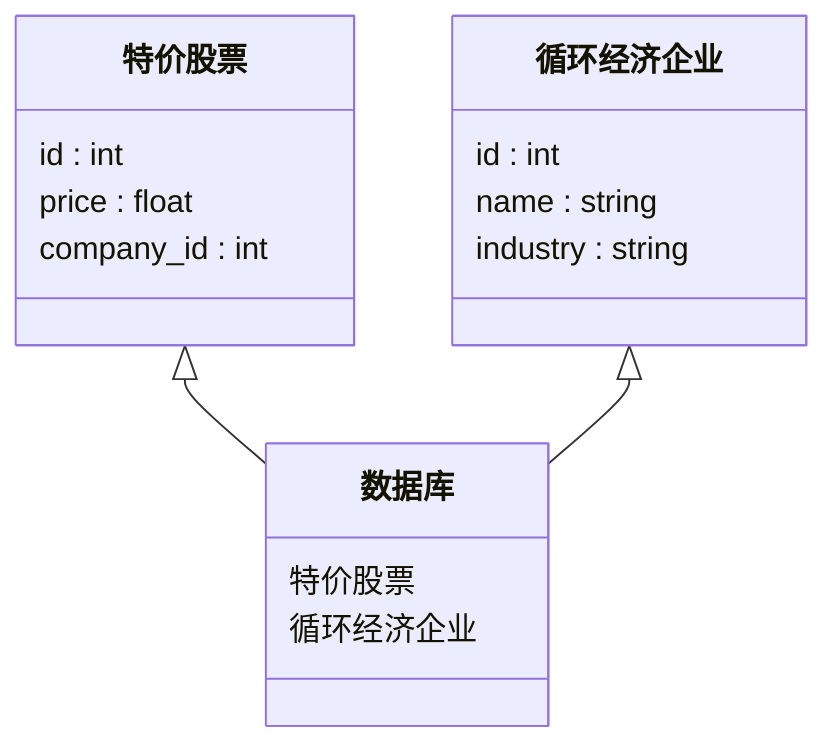
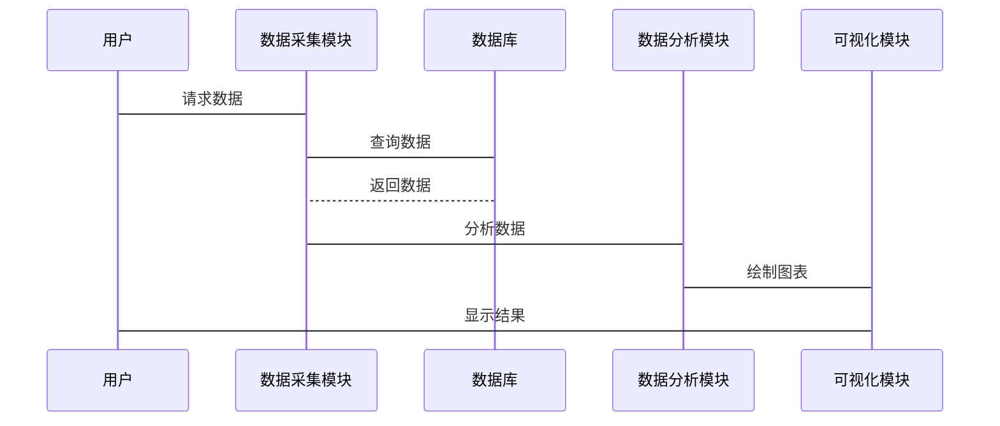

                 


# 特价股票与公司循环经济实践的关联性研究

> 关键词：特价股票，循环经济，关联性，算法原理，系统设计

> 摘要：本文探讨了特价股票与公司循环经济实践之间的关联性。通过分析特价股票的定义、特点，循环经济的核心概念及其对股票市场的影响，结合数学模型和系统设计，深入研究了两者之间的关系。文章从背景介绍、核心概念对比、算法原理、系统架构设计到项目实战，全面解析了如何利用技术手段分析和预测特价股票与循环经济的关联性。

---

## 第1章: 特价股票与循环经济的基本概念

### 1.1 特价股票的定义与特点

#### 1.1.1 特价股票的定义
特价股票是指价格低于市场平均价格水平的股票。通常，特价股票出现在市场低迷时期，或者公司面临短期困境，但具有长期投资价值。

#### 1.1.2 特价股票的特点
- **低估值**：通常市盈率、市净率低于行业平均水平。
- **波动性大**：受市场情绪影响较大，价格波动频繁。
- **投资机会**：可能隐藏着被低估的优质公司。

#### 1.1.3 特价股票的分类
- 按行业分类：如科技、制造、能源等。
- 按公司规模分类：如小盘股、中盘股、大盘股。
- 按市场分类：如主板、创业板等。

### 1.2 循环经济的定义与特点

#### 1.2.1 循环经济的定义
循环经济是一种以资源高效利用和循环利用为核心，以减少资源消耗和环境污染为目标的经济模式。它强调“从摇篮到摇篮”的理念，将废弃物视为资源。

#### 1.2.2 循环经济的核心特点
- **资源节约**：减少资源消耗。
- **循环利用**：废弃物再利用，减少污染。
- **可持续发展**：经济与环境协调。

#### 1.2.3 循环经济与传统经济的区别
| 方面 | 循环经济 | 传统经济 |
|------|----------|----------|
| 资源观 | 资源有限，循环利用 | 资源无限，大量消耗 |
| 污染观 | 减少污染，零排放 | 接受一定污染 |
| 经济模式 | 闭环模式 | 开环模式 |

### 1.3 特价股票与循环经济的关联性

#### 1.3.1 特价股票与循环经济的背景
循环经济的兴起推动了环保产业的发展，相关企业可能因为技术创新或政策支持而成为被低估的股票。

#### 1.3.2 特价股票与循环经济的联系
循环经济企业的股票可能因技术突破或政策红利成为特价股票，而投资者可能通过投资这些股票获得长期收益。

#### 1.3.3 特价股票与循环经济的潜在影响
循环经济企业的股价波动可能与环保政策、市场需求和技术创新相关，投资者需关注这些因素对股价的影响。

---

## 第2章: 特价股票与循环经济的核心概念与联系

### 2.1 特价股票与循环经济的核心概念

#### 2.1.1 特价股票的核心概念
- 价格低于市场平均水平。
- 可能隐藏投资机会。

#### 2.1.2 循环经济的核心概念
- 资源循环利用。
- 环保与经济的结合。

### 2.2 特价股票与循环经济的概念对比

#### 2.2.1 概念属性特征对比表格
| 特性 | 特价股票 | 循环经济 |
|------|----------|----------|
| 核心 | 低价格 | 循环利用 |
| 目标 | 投资收益 | 减少浪费 |
| 影响 | 市场波动 | 环境改善 |

#### 2.2.2 ER实体关系图架构
```mermaid
erDiagram
    company {
        id : int
        name : string
        industry : string
        market_value : float
       循环经济企业
    }
    stock {
        id : int
        price : float
        volume : int
        company_id : int
    }
    company --> stock : 拥有
```

---

## 第3章: 特价股票与循环经济的算法原理

### 3.1 算法原理概述

#### 3.1.1 算法原理的数学模型
假设股票价格受循环经济指标影响，建立回归模型：
$$ price = \beta_0 + \beta_1 \times循环经济指标 + \epsilon $$

#### 3.1.2 算法原理的公式推导
通过最小二乘法求解回归系数：
$$ \hat{\beta} = (X^T X)^{-1} X^T y $$

### 3.2 算法流程图



---

## 第4章: 特价股票与循环经济的系统分析与架构设计

### 4.1 系统分析

#### 4.1.1 问题场景介绍
设计一个系统，分析循环经济企业的股价波动，找出特价股票的投资机会。

#### 4.1.2 领域模型 mermaid 类图


### 4.2 系统架构设计

#### 4.2.1 系统架构 mermaid 架构图
```mermaid
container 系统架构 {
    数据采集模块
    数据分析模块
    可视化模块
}
```

#### 4.2.2 系统接口设计
- 数据接口：连接数据库，提取股票和企业数据。
- 分析接口：提供API，供前端调用分析结果。

#### 4.2.3 系统交互 mermaid 序列图


---

## 第5章: 特价股票与循环经济的项目实战

### 5.1 环境安装

#### 5.1.1 开发环境配置
- 操作系统：Linux/Windows/Mac
- Python版本：3.8以上
- 工具：Jupyter Notebook，Python IDE

#### 5.1.2 数据获取与处理
使用Python的`pandas`库获取股票数据，`scipy`库进行统计分析。

### 5.2 系统核心实现

#### 5.2.1 特价股票数据处理代码
```python
import pandas as pd
data = pd.read_csv('stock_data.csv')
# 数据清洗
data = data.dropna()
# 数据标准化
data['price'] = data['price'].apply(lambda x: x/1000)
```

#### 5.2.2 循环经济数据处理代码
```python
import numpy as np
data循环经济 = pd.read_csv('循环经济.csv')
# 数据特征提取
data循环经济['行业'] = data循环经济['行业'].astype('category')
```

#### 5.2.3 关联性分析代码
```python
from sklearn.linear_model import LinearRegression
model = LinearRegression()
model.fit(X, y)
print('回归系数:', model.coef_)
```

---

## 第6章: 总结与最佳实践

### 6.1 小结
本文通过分析特价股票和循环经济的定义、特点，结合数学模型和系统设计，探讨了两者之间的关联性。

### 6.2 注意事项
- 数据质量影响分析结果。
- 模型需结合实际市场情况调整。

### 6.3 拓展阅读
- 阅读相关学术论文，了解循环经济对股票市场的影响。
- 学习更多时间序列分析方法，如ARIMA和LSTM。

---

## 参考资料

1. 《循环经济与可持续发展》
2. 《股票分析与投资策略》
3. Python官方文档

---

## 工具推荐

- **数据分析工具**：Pandas, NumPy
- **可视化工具**：Matplotlib, Seaborn
- **机器学习工具**：Scikit-learn, TensorFlow

---

通过本文的分析，读者可以了解特价股票与循环经济之间的关系，并掌握如何利用技术手段进行关联性研究。希望本文能为投资者和研究人员提供有价值的参考。

