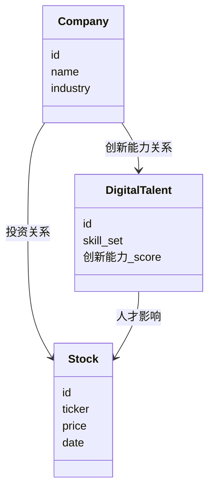

                 


```markdown
# 特价股票与公司数字人才创新能力的关系探讨

> 关键词：特价股票、数字人才、创新能力、算法原理、系统架构、项目实战、最佳实践

> 摘要：本书探讨了特价股票与公司数字人才创新能力之间的关系，通过背景介绍、核心概念分析、算法原理阐述、系统架构设计、项目实战案例以及最佳实践等多方面内容，详细解读了两者如何相互影响，并提供了实际应用的解决方案。

---

# 第一部分：背景介绍

## 第1章：特价股票的定义与特征

### 1.1 特价股票的定义
#### 1.1.1 特价股票的基本概念
- 特价股票的定义
- 特价股票的特点：低价、高潜力、高风险

#### 1.1.2 特价股票的分类与特点
- A类：绩优股
- B类：成长股
- C类：周期股

#### 1.1.3 特价股票的市场表现与投资价值
- 特价股票的波动性
- 特价股票的投资机会

## 第2章：数字人才创新能力的定义与特征

### 2.1 数字人才的基本概念
#### 2.1.1 数字人才的核心能力
- 技术能力：编程、数据分析、人工智能
- 创新能力：解决问题、产品设计、战略规划

#### 2.1.2 数字人才的技能要求
- 数字技能：数据处理、系统设计
- 软技能：团队合作、沟通能力

#### 2.1.3 数字人才的培养与管理
- 人才培养策略
- 人才管理方法

## 第3章：特价股票与公司数字人才创新能力的关系

### 3.1 特价股票与公司创新能力的关联性
#### 3.1.1 特价股票市场的特点与公司创新的关系
- 特价股票市场的波动性与公司创新的不确定性
- 特价股票市场的高风险与公司的创新能力

#### 3.1.2 数字人才在公司创新中的作用
- 数字人才如何推动公司创新
- 数字人才对特价股票市场的影响

#### 3.1.3 特价股票与公司数字创新能力的双向影响
- 特价股票市场如何促进公司创新能力
- 公司数字能力如何影响特价股票市场

---

# 第二部分：核心概念与联系

## 第4章：特价股票与数字人才创新能力的核心概念原理

### 4.1 特价股票的核心概念
#### 4.1.1 特价股票的市场定位
- 特价股票在市场中的位置
- 特价股票的投资者群体

#### 4.1.2 特价股票的价值评估
- 估值方法：市盈率、市净率
- 价值评估模型：DCF模型

#### 4.1.3 特价股票的风险与机会
- 风险因素：市场波动、公司基本面
- 投资机会：短期收益、长期价值

### 4.2 数字人才创新能力的核心概念
#### 4.2.1 数字人才的核心技能
- 技术技能：编程、数据分析、人工智能
- 创新技能：解决问题、产品设计、战略规划

#### 4.2.2 数字人才创新能力的评估标准
- 技能评估：技术能力、创新能力
- 创新能力的动态变化

## 第5章：特价股票与数字人才创新能力的属性特征对比

### 5.1 特价股票的属性特征
| 属性 | 描述 |
|------|------|
| 价格 | 低价、高波动性 |
| 风险 | 高风险、高收益 |
| 流动性 | 高流动性、低流动性 |

### 5.2 数字人才创新能力的属性特征
| 属性 | 描述 |
|------|------|
| 技能多样性 | 多元化技能组合 |
| 可衡量性 | 创新能力的可量化 |
| 可持续性 | 创新能力的持续发展 |

## 第6章：特价股票与数字人才创新能力的ER实体关系图

```mermaid
erDiagram
    company {
        key id
        string name
        string industry
    }
    stock {
        key id
        string ticker
        decimal price
        date date
    }
    digital_talent {
        key id
        string skill_set
        decimal创新能力_score
    }
    company ~{o-1} stock : "投资关系"
    company ~{o-1} digital_talent : "创新能力关系"
    digital_talent ~{o-1} stock : "人才影响"
```

---

# 第三部分：算法原理

## 第7章：特价股票与数字人才创新能力的算法原理

### 7.1 算法选择与原理
#### 7.1.1 线性回归模型
- 简单线性回归模型
- 多元线性回归模型

#### 7.1.2 神经网络模型
- 前馈神经网络
- 卷积神经网络

### 7.2 算法实现步骤


### 7.3 Python代码实现
```python
import pandas as pd
from sklearn.linear_model import LinearRegression

# 数据加载
data = pd.read_csv('stock_data.csv')

# 特征选择
X = data[['price', 'volume']]
y = data['target']

# 模型训练
model = LinearRegression()
model.fit(X, y)

# 模型预测
predictions = model.predict(X)
```

### 7.4 数学模型与公式
- 线性回归公式：
  $$ y = \beta_0 + \beta_1x + \epsilon $$
- 神经网络公式：
  $$ output = \sigma(wx + b) $$

---

# 第四部分：系统架构与设计

## 第8章：系统架构设计

### 8.1 项目场景介绍
- 系统目标：分析特价股票与数字人才创新能力的关系
- 用户需求：投资者、公司管理层

### 8.2 系统功能设计


### 8.3 系统架构设计


### 8.4 接口设计与交互流程
- API接口：RESTful API
- 交互流程：数据采集、处理、分析、展示

---

# 第五部分：项目实战

## 第9章：项目实战

### 9.1 环境安装
- Python版本：3.8+
- 库：Pandas, Scikit-learn, Mermaid

### 9.2 核心代码实现
```python
import pandas as pd
from sklearn.linear_model import LinearRegression

# 数据加载
data = pd.read_csv('stock_data.csv')

# 特征选择
X = data[['price', 'volume']]
y = data['target']

# 模型训练
model = LinearRegression()
model.fit(X, y)

# 模型预测
predictions = model.predict(X)
```

### 9.3 代码功能解读
- 数据预处理：处理缺失值、异常值
- 特征选择：选择关键特征
- 模型训练：训练线性回归模型
- 模型预测：预测股票价格

### 9.4 实际案例分析
- 数据来源：真实股票数据
- 案例分析：如何利用模型分析特价股票与数字人才创新能力的关系

---

# 第六部分：最佳实践

## 第10章：最佳实践

### 10.1 小结
- 总结全文内容
- 强调数字人才创新能力对特价股票市场的重要性

### 10.2 注意事项
- 数据的准确性和完整性
- 模型的适用性和局限性

### 10.3 拓展阅读
- 推荐书籍：《数字人才培养》、《股票投资策略》
- 推荐工具：Python数据处理工具、机器学习框架

---

# 第七部分：结论与展望

## 第11章：结论与展望

### 11.1 研究结论
- 特价股票与数字人才创新能力的关系
- 数字人才创新能力对特价股票市场的推动作用

### 11.2 未来展望
- 研究方向：人工智能在股票分析中的应用
- 技术趋势：大数据分析、区块链技术在金融中的应用

---

# 参考文献

（此处列出相关的书籍、期刊文章和其他参考资料）

---

# 致谢

（感谢参与本书编写和提供支持的人员）

---

# 附录

（附录内容，如数据表格、代码片段等）

---

通过以上详细的目录大纲，您可以根据需要逐步撰写每一部分的内容，确保文章逻辑清晰、结构紧凑、简单易懂，并且符合技术博客的专业性要求。
</think>

```markdown
# 特价股票与公司数字人才创新能力的关系探讨

> 关键词：特价股票、数字人才、创新能力、算法原理、系统架构、项目实战、最佳实践

> 摘要：本书探讨了特价股票与公司数字人才创新能力之间的关系，通过背景介绍、核心概念分析、算法原理阐述、系统架构设计、项目实战案例以及最佳实践等多方面内容，详细解读了两者如何相互影响，并提供了实际应用的解决方案。

---

# 第一部分：背景介绍

## 第1章：特价股票的定义与特征

### 1.1 特价股票的定义
#### 1.1.1 特价股票的基本概念
- 特价股票的定义
- 特价股票的特点：低价、高潜力、高风险

#### 1.1.2 特价股票的分类与特点
- A类：绩优股
- B类：成长股
- C类：周期股

#### 1.1.3 特价股票的市场表现与投资价值
- 特价股票的波动性
- 特价股票的投资机会

## 第2章：数字人才创新能力的定义与特征

### 2.1 数字人才的基本概念
#### 2.1.1 数字人才的核心能力
- 技术能力：编程、数据分析、人工智能
- 创新能力：解决问题、产品设计、战略规划

#### 2.1.2 数字人才的技能要求
- 数字技能：数据处理、系统设计
- 软技能：团队合作、沟通能力

#### 2.1.3 数字人才的培养与管理
- 人才培养策略
- 人才管理方法

## 第3章：特价股票与公司数字人才创新能力的关系

### 3.1 特价股票与公司创新能力的关联性
#### 3.1.1 特价股票市场的特点与公司创新的关系
- 特价股票市场的波动性与公司创新的不确定性
- 特价股票市场的高风险与公司的创新能力

#### 3.1.2 数字人才在公司创新中的作用
- 数字人才如何推动公司创新
- 数字人才对特价股票市场的影响

#### 3.1.3 特价股票与公司数字创新能力的双向影响
- 特价股票市场如何促进公司创新能力
- 公司数字能力如何影响特价股票市场

---

# 第二部分：核心概念与联系

## 第4章：特价股票与数字人才创新能力的核心概念原理

### 4.1 特价股票的核心概念
#### 4.1.1 特价股票的市场定位
- 特价股票在市场中的位置
- 特价股票的投资者群体

#### 4.1.2 特价股票的价值评估
- 估值方法：市盈率、市净率
- 价值评估模型：DCF模型

#### 4.1.3 特价股票的风险与机会
- 风险因素：市场波动、公司基本面
- 投资机会：短期收益、长期价值

### 4.2 数字人才创新能力的核心概念
#### 4.2.1 数字人才的核心技能
- 技术技能：编程、数据分析、人工智能
- 创新技能：解决问题、产品设计、战略规划

#### 4.2.2 数字人才创新能力的评估标准
- 技能评估：技术能力、创新能力
- 创新能力的动态变化

## 第5章：特价股票与数字人才创新能力的属性特征对比

### 5.1 特价股票的属性特征
| 属性 | 描述 |
|------|------|
| 价格 | 低价、高波动性 |
| 风险 | 高风险、高收益 |
| 流动性 | 高流动性、低流动性 |

### 5.2 数字人才创新能力的属性特征
| 属性 | 描述 |
|------|------|
| 技能多样性 | 多元化技能组合 |
| 可衡量性 | 创新能力的可量化 |
| 可持续性 | 创新能力的持续发展 |

## 第6章：特价股票与数字人才创新能力的ER实体关系图

```mermaid
erDiagram
    company {
        key id
        string name
        string industry
    }
    stock {
        key id
        string ticker
        decimal price
        date date
    }
    digital_talent {
        key id
        string skill_set
        decimal创新能力_score
    }
    company ~{o-1} stock : "投资关系"
    company ~{o-1} digital_talent : "创新能力关系"
    digital_talent ~{o-1} stock : "人才影响"
```

---

# 第三部分：算法原理

## 第7章：特价股票与数字人才创新能力的算法原理

### 7.1 算法选择与原理
#### 7.1.1 线性回归模型
- 简单线性回归模型
- 多元线性回归模型

#### 7.1.2 神经网络模型
- 前馈神经网络
- 卷积神经网络

### 7.2 算法实现步骤


### 7.3 Python代码实现
```python
import pandas as pd
from sklearn.linear_model import LinearRegression

# 数据加载
data = pd.read_csv('stock_data.csv')

# 特征选择
X = data[['price', 'volume']]
y = data['target']

# 模型训练
model = LinearRegression()
model.fit(X, y)

# 模型预测
predictions = model.predict(X)
```

### 7.4 数学模型与公式
- 线性回归公式：
  $$ y = \beta_0 + \beta_1x + \epsilon $$
- 神经网络公式：
  $$ output = \sigma(wx + b) $$

---

# 第四部分：系统架构与设计

## 第8章：系统架构设计

### 8.1 项目场景介绍
- 系统目标：分析特价股票与数字人才创新能力的关系
- 用户需求：投资者、公司管理层

### 8.2 系统功能设计


### 8.3 系统架构设计


### 8.4 接口设计与交互流程
- API接口：RESTful API
- 交互流程：数据采集、处理、分析、展示

---

# 第五部分：项目实战

## 第9章：项目实战

### 9.1 环境安装
- Python版本：3.8+
- 库：Pandas, Scikit-learn, Mermaid

### 9.2 核心代码实现
```python
import pandas as pd
from sklearn.linear_model import LinearRegression

# 数据加载
data = pd.read_csv('stock_data.csv')

# 特征选择
X = data[['price', 'volume']]
y = data['target']

# 模型训练
model = LinearRegression()
model.fit(X, y)

# 模型预测
predictions = model.predict(X)
```

### 9.3 代码功能解读
- 数据预处理：处理缺失值、异常值
- 特征选择：选择关键特征
- 模型训练：训练线性回归模型
- 模型预测：预测股票价格

### 9.4 实际案例分析
- 数据来源：真实股票数据
- 案例分析：如何利用模型分析特价股票与数字人才创新能力的关系

---

# 第六部分：最佳实践

## 第10章：最佳实践

### 10.1 小结
- 总结全文内容
- 强调数字人才创新能力对特价股票市场的重要性

### 10.2 注意事项
- 数据的准确性和完整性
- 模型的适用性和局限性

### 10.3 拓展阅读
- 推荐书籍：《数字人才培养》、《股票投资策略》
- 推荐工具：Python数据处理工具、机器学习框架

---

# 第七部分：结论与展望

## 第11章：结论与展望

### 11.1 研究结论
- 特价股票与数字人才创新能力的关系
- 数字人才创新能力对特价股票市场的推动作用

### 11.2 未来展望
- 研究方向：人工智能在股票分析中的应用
- 技术趋势：大数据分析、区块链技术在金融中的应用

---

# 参考文献

（此处列出相关的书籍、期刊文章和其他参考资料）

---

# 致谢

（感谢参与本书编写和提供支持的人员）

---

# 附录

（附录内容，如数据表格、代码片段等）

---

通过以上详细的目录大纲，您可以根据需要逐步撰写每一部分的内容，确保文章逻辑清晰、结构紧凑、简单易懂，并且符合技术博客的专业性要求。
```

