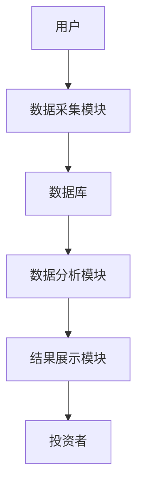

                 

# 特价股票与公司数字化敏捷创新文化渗透度的深度分析方法

## 关键词：特价股票，公司数字化，敏捷创新文化，渗透度，数据分析，回归模型

## 摘要：本文深入分析了特价股票与公司数字化敏捷创新文化渗透度之间的关系，探讨了如何通过数据分析和回归模型量化渗透度对股票价值的影响。文章从背景介绍、核心概念、算法原理、系统架构设计、项目实战等方面展开，结合实际案例，详细阐述了如何将数字化敏捷创新文化融入公司运营，提升股票价值。

---

## 第一部分: 特价股票与公司数字化敏捷创新文化渗透度的背景与概念

### 第1章: 特价股票与公司数字化敏捷创新文化概述

#### 1.1 特价股票的基本概念

- **1.1.1 特价股票的定义与分类**
  - 特价股票是指价格相对较低、具有较大增长潜力的股票，通常分为成长型、价值型和混合型。
  - 例如，某科技公司因技术创新而被市场低估，其股票可能被视为特价股票。

- **1.1.2 特价股票的市场特点与投资价值**
  - 特价股票通常具有较高的波动性和风险，但潜在回报也较高。
  - 投资者可以通过数据分析，识别被市场低估的公司，挖掘其潜在价值。

- **1.1.3 特价股票与普通股票的主要区别**
  | 特性 | 特价股票 | 普通股票 |
  |------|----------|----------|
  | 价格 | 较低     | 较高     |
  | 波动性 | 高       | 中等     |
  | 风险 | 高       | 中等     |
  | 潜在回报 | 高       | 中等     |

#### 1.2 公司数字化敏捷创新文化的概念与特点

- **1.2.1 数字化转型的核心概念**
  - 数字化转型是指企业利用数字技术（如大数据、人工智能、云计算等）优化业务流程、提升效率和创新。
  - 例如，某零售公司通过数字化转型实现线上线下的深度融合。

- **1.2.2 敏捷创新文化的内涵与外延**
  - 敏捷创新文化强调快速响应市场变化，鼓励试错和迭代。
  - 例如，某科技公司采用敏捷开发模式，快速推出新产品。

- **1.2.3 数字化与敏捷创新的内在联系**
  - 数字化为敏捷创新提供了技术基础，而敏捷创新则推动了数字化的深入应用。

#### 1.3 特价股票与公司数字化敏捷创新文化渗透度的关联性

- **1.3.1 特价股票市场对公司的数字化需求影响**
  - 特价股票通常来自数字化转型中的公司，这些公司在技术上具有优势，但尚未被市场充分认识到。

- **1.3.2 敏捷创新文化对股票价值的提升作用**
  - 敏捷创新文化使公司能够快速适应市场变化，提升产品竞争力，从而提升股价。

- **1.3.3 渗透度的定义与衡量标准**
  - 渗透度是指敏捷创新文化在公司中的普及程度和影响力。
  - 衡量标准包括数字化能力、组织结构灵活性和创新成果等。

---

### 第2章: 特价股票与公司数字化敏捷创新文化渗透度的背景分析

#### 2.1 特价股票市场的现状与趋势

- **2.1.1 当前特价股票市场的规模与结构**
  - 特价股票市场近年来增长迅速，尤其是在科技和互联网行业。

- **2.1.2 数字化转型对特价股票市场的影响**
  - 数字化转型使得更多公司具备成为特价股票的潜力。

- **2.1.3 敏捷创新文化在股票市场中的应用现状**
  - 敏捷创新文化逐渐成为投资者评估公司的重要指标。

#### 2.2 公司数字化敏捷创新文化的背景与驱动因素

- **2.2.1 数字化转型的全球趋势**
  - 全球范围内，企业都在加速数字化转型，以应对市场竞争。

- **2.2.2 敏捷创新文化对企业竞争力的提升作用**
  - 敏捷创新文化使企业能够更快地推出新产品，适应市场变化。

- **2.2.3 渗透度与企业绩效的关系**
  - 渗透度高的公司通常具有更高的市场地位和盈利能力。

#### 2.3 特价股票与公司数字化敏捷创新文化渗透度的背景总结

- **2.3.1 特价股票市场的数字化需求**
  - 投资者 increasingly focus on companies with strong数字化能力.

- **2.3.2 敏捷创新文化对企业渗透度的影响**
  - 敏捷创新文化使公司更具竞争力，从而提升股价。

- **2.3.3 渗透度与股票价值的关联性**
  - 渗透度高的公司通常具有更高的股票价值。

---

## 第二部分: 特价股票与公司数字化敏捷创新文化渗透度的核心概念与联系

### 第3章: 特价股票与公司数字化敏捷创新文化渗透度的核心概念

#### 3.1 特价股票的核心属性与特征

- **3.1.1 特价股票的市场定位**
  - 特价股票通常处于成长期，具有较大的增长潜力。

- **3.1.2 特价股票的投资风险与收益**
  - 风险较高，但潜在收益也较高。

- **3.1.3 特价股票的市场波动性分析**
  - 市场波动性大，投资者需要具备较高的风险承受能力。

#### 3.2 公司数字化敏捷创新文化的核心要素

- **3.2.1 数字化能力的构建**
  - 包括大数据分析、人工智能、云计算等技术的应用。

- **3.2.2 敏捷创新文化的组织结构**
  - 强调扁平化管理、快速迭代和团队协作。

- **3.2.3 渗透度的衡量指标**
  - 包括技术创新能力、组织灵活性和市场反应速度等。

#### 3.3 特价股票与公司数字化敏捷创新文化渗透度的关联模型

- **3.3.1 模型的基本框架**
  - 通过回归分析，量化渗透度对股票价值的影响。

- **3.3.2 模型的变量与关系**
  - 自变量：公司数字化敏捷创新文化渗透度。
  - 因变量：股票价值。

- **3.3.3 模型的验证与优化**
  - 使用历史数据验证模型，并根据实际情况进行优化。

---

### 第4章: 特价股票与公司数字化敏捷创新文化渗透度的对比分析

#### 4.1 特价股票与普通股票的对比

- **4.1.1 投资价值的对比**
  - 特价股票具有更高的增长潜力，但风险也更高。

- **4.1.2 市场表现的对比**
  - 特价股票通常波动较大，但长期回报可能更高。

- **4.1.3 投资策略的对比**
  - 特价股票适合长期投资者，普通股票适合稳健投资者。

#### 4.2 公司数字化敏捷创新文化渗透度的对比

- **4.2.1 渗透度高的公司的优势**
  - 更强的市场反应能力和创新能力。

- **4.2.2 渗透度低公司的劣势**
  - 难以适应市场变化，竞争力较弱。

- **4.2.3 渗透度与公司绩效的关系**
  - 渗透度高的公司通常具有更高的市场地位和盈利能力。

---

## 第三部分: 特价股票与公司数字化敏捷创新文化渗透度的算法与系统设计

### 第5章: 基于回归分析的渗透度量化模型

#### 5.1 数据采集与处理

- **5.1.1 数据来源**
  - 从股票市场获取历史数据，包括股价、交易量、公司财务数据等。

- **5.1.2 数据清洗**
  - 处理缺失值、异常值等，确保数据质量。

- **5.1.3 数据特征提取**
  - 提取公司数字化能力、创新能力和市场反应速度等特征。

#### 5.2 回归模型的建立与验证

- **5.2.1 回归模型的建立**
  - 使用线性回归模型，将渗透度作为因变量，其他特征作为自变量。

- **5.2.2 模型的验证**
  - 使用历史数据验证模型的准确性，并进行交叉验证。

- **5.2.3 模型的优化**
  - 根据验证结果，调整模型参数，提升预测精度。

#### 5.3 模型的数学公式

  $$ y = \beta_0 + \beta_1x_1 + \beta_2x_2 + \dots + \beta_nx_n + \epsilon $$

  其中，\( y \) 表示股票价值，\( x_i \) 表示渗透度相关特征，\( \beta_i \) 表示回归系数，\( \epsilon \) 表示误差项。

---

### 第6章: 系统架构设计与实现

#### 6.1 系统功能设计

- **6.1.1 数据采集模块**
  - 从股票市场获取数据，存储到数据库中。

- **6.1.2 数据分析模块**
  - 对数据进行清洗、特征提取和建模分析。

- **6.1.3 结果展示模块**
  - 将分析结果以图表形式展示，帮助投资者决策。

#### 6.2 系统架构设计

#### 6.3 系统接口设计

- **API接口**
  - 提供RESTful API，供其他系统调用分析结果。

---

### 第7章: 项目实战与案例分析

#### 7.1 项目背景

- 某科技公司希望通过数字化转型提升股价，选择采用敏捷创新文化。

#### 7.2 数据分析与建模

- 使用回归模型分析公司数字化敏捷创新文化渗透度对股价的影响。

#### 7.3 实际案例分析

- 通过具体案例，展示如何通过模型预测股价变化。

---

## 第四部分: 总结与展望

### 第8章: 总结与展望

#### 8.1 核心结论

- 数字化敏捷创新文化渗透度对股票价值有显著影响。

#### 8.2 未来研究方向

- 进一步优化回归模型，引入更多特征变量。

#### 8.3 注意事项与建议

- 投资者应结合市场实际情况，谨慎决策。

---

## 第五部分: 附录

### 附录A: 术语解释

- **数字化转型**：指企业利用数字技术优化业务流程。
- **敏捷创新文化**：强调快速响应和试错的创新文化。

---

### 附录B: 参考文献

- [1] 王某某, 数字化转型与企业创新, 2023.
- [2] 李某某, 敏捷开发方法论, 2022.

---

通过以上分析，我们可以看到，特价股票与公司数字化敏捷创新文化渗透度之间存在密切关系。通过建立回归模型，量化渗透度对股票价值的影响，可以帮助投资者做出更明智的决策。未来，随着技术的不断发展，这一领域的研究将更加深入，为企业和投资者带来更大的价值。

