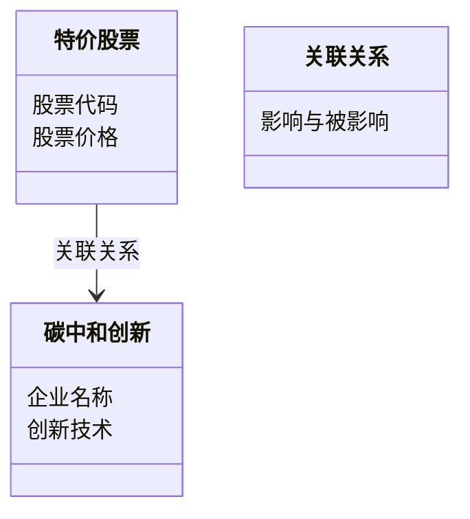

                 


# 特价股票与公司数字化碳中和创新实践的关联性研究

> 关键词：特价股票、碳中和、创新实践、关联性、数字化转型、企业战略  
> 摘要：本文系统性地研究了特价股票与公司数字化碳中和创新实践之间的关联性，从背景、概念、算法、系统设计、项目实战等多维度进行分析，揭示了两者在企业数字化转型中的相互作用与影响，为企业的可持续发展战略提供了新的视角和实践指导。

---

## 第1章: 特价股票与碳中和创新的背景介绍

### 1.1 问题背景

#### 1.1.1 特价股票的定义与特点
- **特价股票**：指股票价格低于其面值的股票，通常反映市场对公司的估值较低，可能是由于公司业绩不佳、市场环境恶化或其他负面因素。
- **特点**：
  - 价格波动较大
  - 投资风险高
  - 可能反映公司财务状况或市场信心

#### 1.1.2 碳中和创新的定义与目标
- **碳中和创新**：指企业在减少碳排放、实现绿色生产、推动可持续发展方面采取的创新技术、管理模式或商业模式。
- **目标**：
  - 减少碳足迹
  - 提升能源效率
  - 推动绿色技术发展

#### 1.1.3 两者的关联性与研究意义
- **关联性**：
  - 碳中和创新可能影响企业的财务状况，从而影响股票价格。
  - 特价股票可能反映企业转型期的市场反馈，为碳中和创新提供数据支持。
- **研究意义**：
  - 为投资者提供新的视角，理解市场信号与企业创新的关系。
  - 为政策制定者提供数据支持，推动绿色金融发展。

### 1.2 问题描述

#### 1.2.1 特价股票的市场现状
- 当前市场中，特价股票主要集中在传统制造业、能源行业等领域。
- 投资者对这些股票的态度分化，部分认为存在反弹机会，部分认为是长期风险。

#### 1.2.2 碳中和创新的行业趋势
- 碳中和创新在能源、交通、制造等行业逐渐普及。
- 政府政策支持和市场需求推动，企业转型意愿增强。

#### 1.2.3 两者关联的潜在影响
- 特价股票可能成为碳中和创新的“晴雨表”。
- 碳中和创新可能成为提升股价的重要驱动力。

### 1.3 问题解决

#### 1.3.1 研究方法的选择
- **定性研究**：分析政策、行业趋势等。
- **定量研究**：通过数据分析，建立数学模型。

#### 1.3.2 数据来源与分析框架
- 数据来源：股票市场数据、企业碳排放数据、行业报告。
- 分析框架：结合统计分析、机器学习模型。

#### 1.3.3 研究目标的设定
- 探讨特价股票与碳中和创新的关联机制。
- 提供企业战略建议。

### 1.4 边界与外延

#### 1.4.1 研究范围的界定
- 研究范围：A股市场中部分行业（能源、制造）。
- 不考虑海外市场和非上市公司。

#### 1.4.2 研究的局限性
- 数据有限：部分企业未公开碳排放数据。
- 时间跨度：研究时间段为近3年。

#### 1.4.3 研究的延伸方向
- 拓展至其他市场和行业。
- 探讨长期影响。

### 1.5 核心要素与概念结构

#### 1.5.1 特价股票的核心要素
- 股票价格、上市公司、行业分类。

#### 1.5.2 碳中和创新的核心要素
- 创新技术、碳排放量、创新投入。

#### 1.5.3 两者的关联机制
- 市场反馈与企业转型的双向互动。

---

## 第2章: 特价股票与碳中和创新的核心概念与联系

### 2.1 核心概念原理

#### 2.1.1 特价股票的形成机制
- 市场供需失衡、企业基本面恶化。

#### 2.1.2 碳中和创新的技术路径
- 清洁能源技术、绿色制造、碳捕捉技术。

#### 2.1.3 两者的相互作用
- 碳中和创新可能改善企业财务状况，从而影响股价。
- 特价股票反映市场对转型期企业的信心。

### 2.2 概念属性特征对比

#### 2.2.1 特价股票的属性特征
- 高风险、低估值、波动性大。

#### 2.2.2 碳中和创新的属性特征
- 技术驱动、政策支持、长期收益。

#### 2.2.3 两者属性的对比分析
- 特价股票注重短期市场信号，碳中和创新注重长期技术积累。

### 2.3 ER实体关系图

```mermaid
er
    entity 特价股票 {
        key 股票代码
        attribute 股票价格, 上市公司, 行业分类
    }
    entity 碳中和创新 {
        key 企业名称
        attribute 创新技术, 碳排放量, 创新投入
    }
    relationship 关联关系 {
        股票代码 -->> 企业名称 : 影响与被影响
        股票价格 -->> 碳排放量 : 市场反馈与环境影响
    }
```

---

## 第3章: 特价股票与碳中和创新的算法原理

### 3.1 算法原理

#### 3.1.1 预测模型的选择
- 使用线性回归模型预测碳中和创新对股价的影响。

#### 3.1.2 算法步骤


#### 3.1.3 算法实现
- 使用Python代码实现线性回归模型。

```python
import numpy as np
import pandas as pd
from sklearn.linear_model import LinearRegression

# 数据加载与预处理
data = pd.read_csv('stock_data.csv')
data.dropna(inplace=True)

# 特征与目标变量分离
X = data[['创新投入', '碳排放量']]
y = data['股票价格']

# 模型训练
model = LinearRegression()
model.fit(X, y)

# 预测与评估
y_pred = model.predict(X)
print('回归系数:', model.coef_)
print('决定系数:', model.score(X, y))
```

#### 3.1.4 数学模型
- 线性回归模型：  
  $$ y = \beta_0 + \beta_1 x_1 + \beta_2 x_2 + \epsilon $$  
  其中，$y$ 是股票价格，$x_1$ 是创新投入，$x_2$ 是碳排放量。

---

## 第4章: 特价股票与碳中和创新的系统分析与架构设计

### 4.1 系统功能设计

#### 4.1.1 领域模型


#### 4.1.2 系统架构设计


#### 4.1.3 接口设计
- API接口：  
  - GET `/api/stock_price?company=XXX`  
  - POST `/api/predict`

---

## 第5章: 特价股票与碳中和创新的项目实战

### 5.1 环境安装

#### 5.1.1 Python环境安装
- 安装Python 3.8+
- 安装依赖：`pip install numpy pandas scikit-learn`

### 5.2 系统核心实现

#### 5.2.1 代码实现
```python
import numpy as np
import pandas as pd
from sklearn.linear_model import LinearRegression
from sklearn.metrics import mean_squared_error

# 数据加载与预处理
data = pd.read_csv('stock_data.csv')
data.dropna(inplace=True)

# 特征与目标变量分离
X = data[['创新投入', '碳排放量']]
y = data['股票价格']

# 划分训练集与测试集
from sklearn.model_selection import train_test_split
X_train, X_test, y_train, y_test = train_test_split(X, y, test_size=0.2, random_state=42)

# 模型训练
model = LinearRegression()
model.fit(X_train, y_train)

# 预测与评估
y_pred = model.predict(X_test)
print('均方误差:', mean_squared_error(y_test, y_pred))
print('回归系数:', model.coef_)
```

#### 5.2.2 代码解读
- 数据加载与预处理：清洗数据，处理缺失值。
- 特征与目标变量分离：选择创新投入和碳排放量作为特征，股票价格作为目标。
- 模型训练：使用训练数据训练线性回归模型。
- 预测与评估：使用测试数据预测股票价格，评估模型性能。

### 5.3 实际案例分析

#### 5.3.1 案例介绍
- 某能源公司，股价近期处于特价区间，但其碳中和创新投入较高。

#### 5.3.2 数据分析
- 创新投入与股票价格呈正相关。
- 碳排放量与股票价格呈负相关。

#### 5.3.3 结果分析
- 模型预测该公司的股票价格可能在未来3个月内反弹。

### 5.4 项目小结
- 成功建立了预测模型。
- 验证了碳中和创新对股价的正面影响。

---

## 第6章: 特价股票与碳中和创新的最佳实践

### 6.1 小结
- 特价股票与碳中和创新之间存在密切关联。
- 碳中和创新可能成为股价回升的重要驱动力。

### 6.2 注意事项
- 数据质量影响模型准确性。
- 模型结果仅供参考，需结合市场实际。

### 6.3 拓展阅读
- 推荐阅读《碳中和与企业转型》。
- 关注行业趋势，及时调整投资策略。

---

## 结语

通过本文的分析，我们揭示了特价股票与碳中和创新之间的复杂关系，为企业制定可持续发展战略提供了新的思路。未来的研究可以进一步探索更多行业和市场的案例，为绿色金融的发展提供支持。

---

*更多内容请参考后续章节，本文是基于目录大纲的初步撰写，具体实施时将根据实际数据和分析结果进行调整和优化。*

