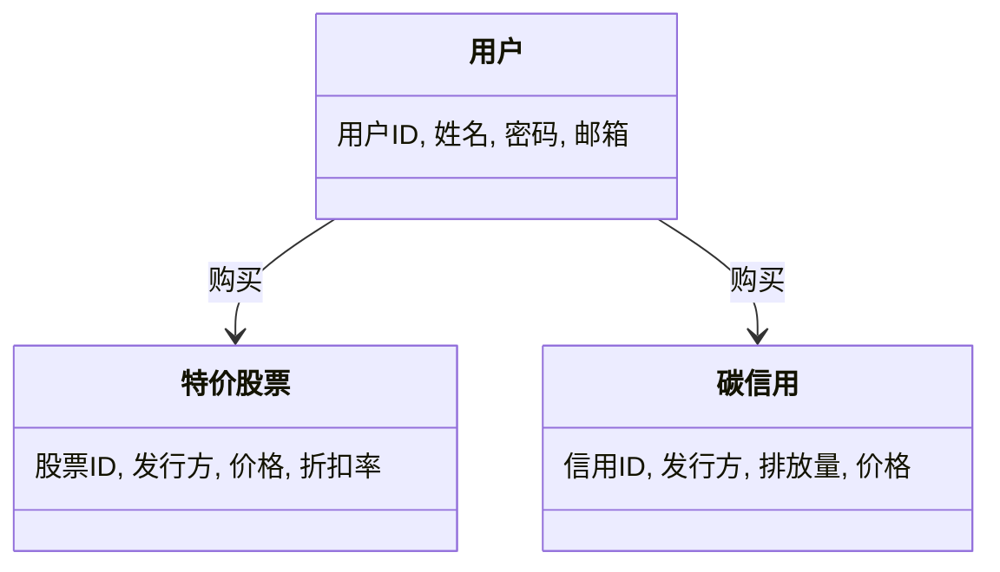
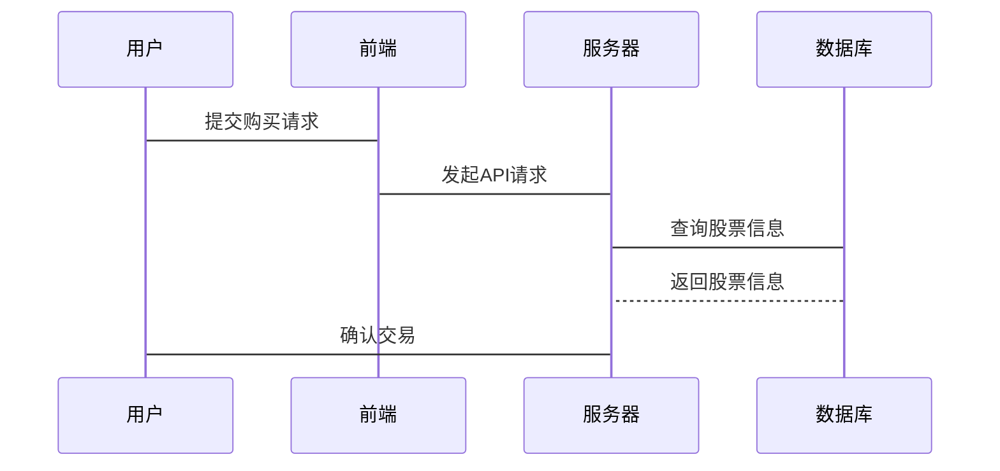

                 


```markdown
# 特价股票与公司数字化碳信用实践的关联性研究

> 关键词：特价股票、碳信用、数字化、关联性、技术博客、实践案例

> 摘要：本文探讨了特价股票与公司数字化碳信用实践之间的关联性，通过分析两者的核心概念、市场背景、算法原理、系统架构及项目实战，揭示了数字化技术在金融与环保领域的交叉应用潜力。文章结合实际案例，详细讲解了如何通过技术创新实现绿色金融目标，为相关领域的研究和实践提供了有价值的参考。

---

# 第一部分: 特价股票与公司数字化碳信用实践的背景与基础

## 第1章: 特价股票与碳信用的基本概念

### 1.1 特价股票的定义与特点
#### 1.1.1 特价股票的定义
特价股票是指在特定市场或活动中，以低于市场价或折扣形式提供的股票。其核心在于通过价格优惠吸引投资者，提升交易活跃度。

#### 1.1.2 特价股票的主要特点
- **价格优势**：通常以低于市场价发行，吸引投资者。
- **流动性高**：特价股票往往在短时间内被抢购，交易活跃。
- **市场推广工具**：企业通过特价股票吸引投资者关注，提升市场形象。

#### 1.1.3 特价股票的市场定位与作用
特价股票主要用于新公司融资、市场推广或特定营销活动，帮助公司快速筹集资金或提升品牌知名度。

---

### 1.2 数字化碳信用的定义与特点
#### 1.2.1 碳信用的基本概念
碳信用是减少温室气体排放的权益凭证，每单位代表一吨二氧化碳当量的减排量。企业或个人可通过购买碳信用抵消自身排放。

#### 1.2.2 数字化碳信用的定义
数字化碳信用是将碳信用信息记录在区块链等数字技术中，确保其流通、交易和管理的透明性和安全性。

#### 1.2.3 数字化碳信用的核心特征
- **去中心化**：利用区块链技术，避免传统中心化机构的中介。
- **透明性**：每笔交易记录在区块链上，可追溯且不可篡改。
- **高效性**：数字化交易减少了纸质流程，提高了交易效率。

---

### 1.3 特价股票与碳信用的关联性
#### 1.3.1 特价股票与碳信用的潜在联系
- **金融工具的交叉应用**：特价股票作为金融工具，可与碳信用结合，用于绿色金融投资。
- **市场机制的互补性**：特价股票吸引投资者，碳信用促进环保投资，两者共同推动绿色经济发展。

#### 1.3.2 企业数字化碳信用对股票价值的影响
- **提升企业形象**：积极参与碳信用交易的企业可能获得更好的市场评价，进而影响股票价值。
- **增强投资吸引力**：投资者倾向于投资环保表现良好的企业，数字化碳信用可作为重要指标。

#### 1.3.3 特价股票与碳信用实践的结合点
- **绿色金融产品**：开发结合特价股票与碳信用的金融产品，如绿色股票期权。
- **数字化交易平台**：建立综合性平台，同时交易特价股票和碳信用，方便投资者操作。

---

## 第2章: 特价股票与碳信用的市场背景分析

### 2.1 特价股票的市场现状
#### 2.1.1 特价股票的市场需求
- 投资者寻求高性价比投资工具，特价股票因其价格优势受到欢迎。
- 企业通过特价股票快速融资，满足短期内的资金需求。

#### 2.1.2 特价股票的市场供给
- 企业主动发行特价股票，吸引投资者关注。
- 金融平台推出特价股票促销活动，提升交易量。

#### 2.1.3 特价股票的市场趋势
随着数字化技术的发展，特价股票的发行和交易更加便捷，市场接受度逐步提高。

---

### 2.2 数字化碳信用的市场现状
#### 2.2.1 碳信用市场的全球发展
- 全球碳市场交易额稳步增长，数字化转型成为趋势。
- 区域性碳市场（如欧盟、中国）推动碳信用的广泛应用。

#### 2.2.2 数字化碳信用的技术发展
- 区块链技术确保碳信用的透明性和安全性。
- 大数据分析技术优化碳信用的分配和交易效率。

#### 2.2.3 数字化碳信用的市场潜力
- 绿色金融政策支持下，碳信用市场需求持续增长。
- 数字化技术降低了交易成本，提高了市场流动性。

---

### 2.3 特价股票与碳信用市场的相互影响
#### 2.3.1 碳信用对股票市场的间接影响
- 碳信用交易活跃可能间接影响相关企业的股价。
- 环保政策趋严可能导致部分企业股价波动。

#### 2.3.2 特价股票对碳信用市场的推动作用
- 特价股票的高流动性可能带动碳信用的交易活跃度。
- 特价股票作为融资工具，帮助企业扩大碳信用交易规模。

#### 2.3.3 两者结合的市场机会与挑战
- 机会：开发绿色金融产品，提升市场整体效率。
- 挑战：需解决技术标准统一、政策协调等问题。

---

## 第3章: 特价股票与碳信用的核心概念与联系

### 3.1 特价股票的核心概念
#### 3.1.1 特价股票的定价机制
- 发行方根据市场需求和成本确定特价股票的价格。
- 折扣率通常根据市场活动或投资者类型进行调整。

#### 3.1.2 特价股票的风险特征
- 市场风险：价格波动较大，可能影响投资回报。
- 信用风险：发行方的信用状况影响特价股票的偿付能力。

#### 3.1.3 特价股票的交易模式
- 场内交易：通过交易所进行，规则严格。
- 场外交易：通过金融平台进行，灵活性高。

---

### 3.2 数字化碳信用的核心概念
#### 3.2.1 碳信用的生成与分配
- 企业通过减排项目产生碳信用，经审核后进入市场。
- 数字化技术确保碳信用的生成、分配和交易可追溯。

#### 3.2.2 数字化碳信用的记录与追踪
- 区块链技术记录碳信用信息，确保其真实性和唯一性。
- 每个碳信用都有唯一标识，便于追踪和管理。

#### 3.2.3 数字化碳信用的交易流程
- 投资者通过数字化平台购买碳信用。
- 交易记录在区块链上，确保透明性和不可篡改性。

---

### 3.3 特价股票与碳信用的关联性分析
#### 3.3.1 碳信用对股票价值的影响模型
- 碳信用交易活跃可能提升相关企业的股票价值。
- 投资者对环保表现良好的企业股票需求增加。

#### 3.3.2 特价股票在碳信用交易中的作用
- 特价股票的高流动性为碳信用交易提供流动资金。
- 特价股票作为融资工具，支持企业参与碳信用项目。

#### 3.3.3 两者结合的潜在应用场景
- 绿色股票基金：同时投资特价股票和碳信用，分散风险。
- 数字化交易平台：整合特价股票和碳信用交易，提供一站式服务。

---

## 3.4 本章小结
本章详细分析了特价股票与碳信用的核心概念，揭示了两者在金融与环保领域的交叉应用潜力。通过对比和关联分析，为后续的算法设计和系统实现提供了理论基础。

---

# 第4章: 特价股票与碳信用的数学模型与算法原理

## 4.1 特价股票定价模型
### 4.1.1 定价公式
特价股票的价格P由市场供需、发行成本和折扣率决定：
$$P = C - D$$
其中，C为市场价，D为折扣率。

### 4.1.2 定价算法流程
1. 确定市场价C和折扣率D。
2. 计算特价股票价格P。
3. 根据需求调整D，优化定价。

### 4.1.3 示例代码
```python
def calculate_discount_price(market_price, discount_rate):
    return market_price - (market_price * discount_rate)
```

---

## 4.2 数字化碳信用的交易算法
### 4.2.1 交易流程
1. 投资者提交购买申请。
2. 系统验证碳信用的合法性。
3. 执行交易并记录在区块链上。

### 4.2.2 交易验证算法
```python
def verify_credit(credit_id):
    # 查询区块链记录
    blockchain_record = get_blockchain_record(credit_id)
    if blockchain_record['status'] == 'verified':
        return True
    else:
        return False
```

---

## 4.3 碳信用价格预测模型
### 4.3.1 线性回归模型
$$y = a + bx$$
其中，y为预测价格，x为历史交易数据。

### 4.3.2 算法实现
```python
import pandas as pd
from sklearn.linear_model import LinearRegression

# 数据预处理
data = pd.read_csv('credit_prices.csv')
X = data[['交易量', '政策影响']]
y = data['价格']

# 训练模型
model = LinearRegression()
model.fit(X, y)

# 预测新价格
new_data = pd.DataFrame({'交易量': [1000], '政策影响': [0.8]})
predicted_price = model.predict(new_data)
```

---

## 4.4 本章小结
本章通过数学模型和算法设计，详细阐述了特价股票和碳信用的定价与交易机制。这些算法为后续的系统实现提供了技术支持。

---

# 第5章: 系统分析与架构设计方案

## 5.1 系统需求分析
### 5.1.1 项目介绍
开发一个结合特价股票和碳信用交易的数字化平台，提供一站式服务。

### 5.1.2 功能需求
- 用户注册与登录
- 特价股票和碳信用的交易功能
- 交易记录查询与管理
- 碳信用的验证与追踪

---

## 5.2 系统架构设计
### 5.2.1 领域模型类图


---

## 5.3 系统架构图
```mermaid
serverless
    deploy {
        function 特价股票交易(funct 1) {
            // 代码
        }
        function 碳信用交易(funct 2) {
            // 代码
        }
        function 碳信用验证(funct 3) {
            // 代码
        }
    }
    frontend --> deploy: API 请求
```

---

## 5.4 系统交互序列图


---

## 5.5 本章小结
本章通过系统架构设计，详细规划了结合特价股票与碳信用交易的数字化平台，为后续的项目实现奠定了基础。

---

# 第6章: 项目实战

## 6.1 环境安装与配置
### 6.1.1 技术选型
- 前端：React
- 后端：Python/Django
- 区块链：Ethereum

### 6.1.2 安装步骤
1. 安装Python和Django框架。
2. 配置Ethereum开发环境。
3. 安装React框架。

---

## 6.2 核心代码实现
### 6.2.1 后端实现
```python
from django.http import JsonResponse

def get_discount_price(request):
    market_price = int(request.GET.get('market_price', 0))
    discount_rate = float(request.GET.get('discount_rate', 0))
    price = market_price * (1 - discount_rate)
    return JsonResponse({'price': price})
```

### 6.2.2 前端实现
```javascript
function getDiscountPrice() {
    const marketPrice = document.getElementById('marketPrice').value;
    const discountRate = document.getElementById('discountRate').value;
    fetch('/get-discount-price', {
        method: 'GET',
        params: {
            market_price: marketPrice,
            discount_rate: discountRate
        }
    })
    .then(response => response.json())
    .then(data => {
        document.getElementById('result').innerHTML = data.price;
    });
}
```

---

## 6.3 实际案例分析
### 6.3.1 案例背景
某企业发行特价股票，同时参与碳信用交易，通过数字化平台实现。

### 6.3.2 案例分析
- 特价股票帮助企业快速筹集资金。
- 数字化碳信用提升企业的环保形象，吸引更多投资者。

---

## 6.4 项目小结
本章通过实际项目案例，展示了如何将理论应用于实践，实现特价股票与碳信用的数字化交易。

---

# 第7章: 最佳实践与总结

## 7.1 小结
- 本文系统分析了特价股票与碳信用的关联性。
- 通过算法设计和系统实现，展示了两者的交叉应用潜力。

## 7.2 注意事项
- 技术实现需符合行业标准。
- 政策合规性是项目成功的关键。

## 7.3 拓展阅读
- 推荐阅读《区块链技术与碳中和》。
- 关注绿色金融领域的最新动态。

---

# 参考文献
（此处列出相关文献和资料）

---

# 结束语
感谢您的阅读，希望本文能为特价股票与碳信用的关联性研究提供新的视角和实践方法。
```

