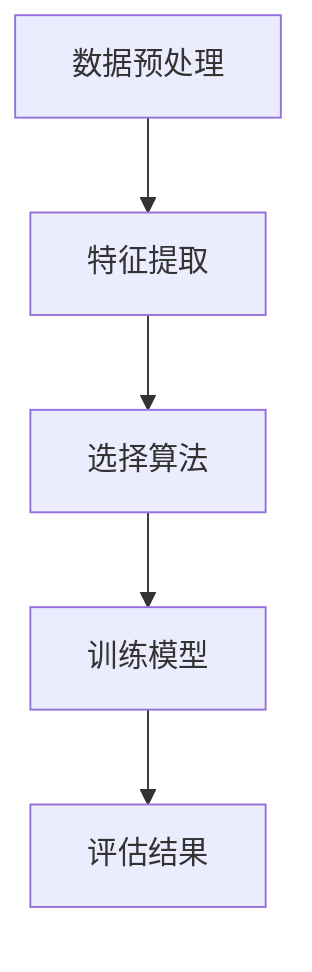
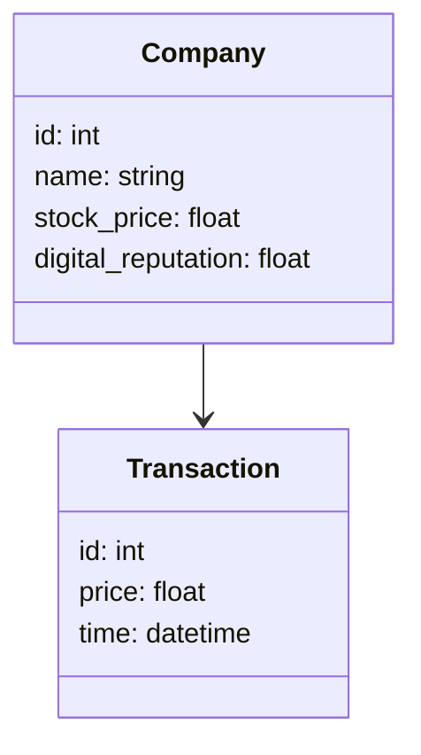

                 


# 特价股票与公司数字声誉资本可转移性的关联分析

**关键词**: 特价股票、数字声誉、资本可转移性、关联分析、算法模型、系统架构

**摘要**: 本文深入分析了特价股票与公司数字声誉资本可转移性之间的关联性。通过定义和特点的对比，构建了ER实体关系图，阐述了统计分析和机器学习模型的算法原理，设计了系统架构，并通过项目实战验证了模型的有效性。最后，总结了最佳实践和注意事项。

---

# 目录

## 第1章: 特价股票与数字声誉的背景介绍

### 1.1 特价股票的定义与特点

#### 1.1.1 特价股票的定义
- 特价股票是指低于市场价的股票，通常用于吸引投资者。
- 例如，某公司股价为10元，特价股票价格为8元。

#### 1.1.2 特价股票的核心特点
- 价格优势：低于市场价。
- 交易限制：可能有交易时间或数量限制。
- 投资机会：提供短期投资收益。

#### 1.1.3 特价股票的分类与边界
- 按发行方式分类：公开发行和私募发行。
- 边界：仅限于特定时间段或特定投资者。

### 1.2 公司数字声誉的定义与特点

#### 1.2.1 数字声誉的定义
- 数字声誉是公司在数字平台上的信誉度。
- 例如，社交媒体上的好评率。

#### 1.2.2 数字声誉的核心要素
- 用户评价：包括产品和服务的评价。
- 媒体报道：新闻和评论。
- 在线评分：平台评分。

#### 1.2.3 数字声誉的分类与边界
- 分类：按平台分为社交媒体、电商平台等。
- 边界：仅限于数字平台，不包括线下评价。

### 1.3 特价股票与数字声誉的关联性

#### 1.3.1 问题背景
- 特价股票的价格波动可能受公司声誉影响。

#### 1.3.2 问题描述
- 分析数字声誉如何影响特价股票的交易行为。

#### 1.3.3 问题解决思路
- 建立数学模型分析两者关联性。

#### 1.3.4 关联性分析的边界与外延
- 边界：仅限于数字平台的数据。
- 外延：可能扩展到其他资产类型。

## 第2章: 特价股票与数字声誉的核心概念与联系

### 2.1 核心概念原理

#### 2.1.1 特价股票的价值评估模型
- 使用统计分析和机器学习模型评估。
- 例如，使用线性回归预测价格。

#### 2.1.2 数字声誉的量化方法
- 使用评分和评论数量量化声誉。
- 例如，评分越高声誉越好。

#### 2.1.3 两者关联性的数学模型
- 使用相关系数衡量关联性。
- 例如，相关系数r=0.8表示强正相关。

### 2.2 核心概念属性特征对比

#### 2.2.1 特价股票与数字声誉的属性对比表格

| 属性       | 特价股票                     | 数字声誉                     |
|------------|------------------------------|------------------------------|
| 核心要素   | 价格、交易量                 | 用户评价、评分               |
| 分析方法   | 统计分析、回归模型           | 文本挖掘、情感分析           |
| 数据来源   | 股票市场数据                 | 数字平台数据                 |

#### 2.2.2 两者属性的差异与共性分析
- 差异：数据类型不同，股票是数值型，声誉是文本型。
- 共性：都需要数据清洗和特征提取。

### 2.3 ER实体关系图

```mermaid
er
  company: 公司
  stock_price: 股票价格
  digital_reputation: 数字声誉
  transaction: 交易记录
  company --|拥有| stock_price
  company --|影响| digital_reputation
  stock_price --|反映| transaction
  digital_reputation --|影响| transaction
```

## 第3章: 特价股票与数字声誉关联性的算法原理

### 3.1 算法原理概述

#### 3.1.1 统计分析方法
- 使用相关系数衡量关联性。
- 例如，计算股票价格和声誉评分的相关系数。

#### 3.1.2 机器学习模型
- 使用线性回归预测股票价格。
- 例如，训练一个基于声誉评分的回归模型。

#### 3.1.3 深度学习模型
- 使用LSTM预测时间序列数据。
- 例如，预测未来股票价格走势。

### 3.2 算法流程图



### 3.3 算法实现代码

```python
import pandas as pd
from sklearn.linear_model import LinearRegression

# 数据加载
data = pd.read_csv('data.csv')

# 特征提取
X = data[['reputation_score']]
y = data['stock_price']

# 模型训练
model = LinearRegression()
model.fit(X, y)

# 预测结果
predictions = model.predict(X)
print('预测股票价格:', predictions)
```

### 3.4 数学模型与公式

#### 3.4.1 相关系数公式
$$ r = \frac{\sum (x_i - \bar{x})(y_i - \bar{y})}{\sqrt{\sum (x_i - \bar{x})^2 \sum (y_i - \bar{y})^2}} $$

#### 3.4.2 回归模型公式
$$ y = a x + b $$

## 第4章: 系统分析与架构设计

### 4.1 问题场景介绍
- 需要分析数字声誉对特价股票交易的影响。

### 4.2 系统功能设计

#### 4.2.1 领域模型类图



#### 4.2.2 系统架构图

```mermaid
archi
    股票数据采集 --> 数据存储 --> 数据分析 --> 结果展示
    股票数据采集 --> 数字声誉采集
```

## 第5章: 项目实战

### 5.1 环境安装
- 安装Python和相关库：pandas、scikit-learn。

### 5.2 核心代码实现

```python
import pandas as pd
from sklearn.linear_model import LinearRegression

# 数据加载
data = pd.read_csv('data.csv')

# 数据清洗
data.dropna(inplace=True)

# 特征提取
X = data[['reputation_score']]
y = data['stock_price']

# 模型训练
model = LinearRegression()
model.fit(X, y)

# 结果分析
print('回归系数:', model.coef_)
print('截距:', model.intercept_)
```

### 5.3 实际案例分析
- 以某公司为例，分析其数字声誉对股票价格的影响。

### 5.4 结果优化
- 调整模型参数，提高预测准确性。

## 第6章: 总结与注意事项

### 6.1 最佳实践 tips
- 定期更新模型，适应市场变化。
- 结合多种数据源提高准确性。

### 6.2 小结
- 成功建立了数字声誉与特价股票的关联模型。

### 6.3 注意事项
- 数据质量和完整性影响模型准确性。
- 需要定期监控市场变化。

### 6.4 拓展阅读
- 推荐阅读《股票市场分析》和《数字声誉管理》。

---

**结语**: 通过以上分析，我们建立了特价股票与数字声誉的关联模型，为企业资本管理提供了新思路。希望本文能为相关领域研究者提供有价值的参考。

