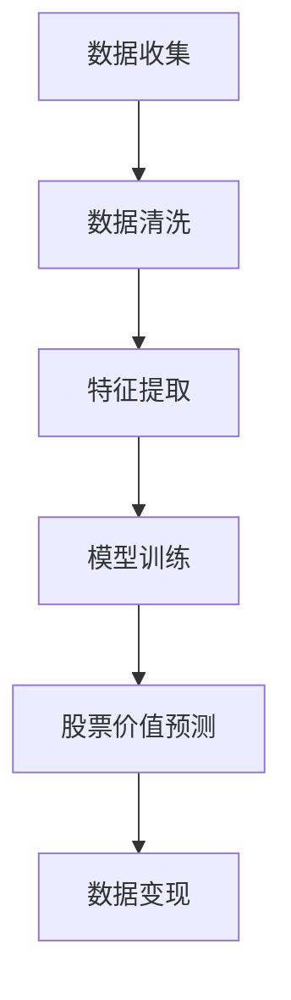

                 


# 特价股票与公司数据变现与价值创造能力的关系探讨

## 关键词：特价股票、数据变现、价值创造、公司数据、股票价值、数据驱动

## 摘要：本文探讨了特价股票与公司数据变现之间的关系，分析了数据如何驱动股票价值评估和价值创造。通过数学模型和算法，本文详细讲解了数据在股票交易中的应用，并设计了一个基于数据的交易系统。最后，文章总结了数据驱动的价值创造能力，并展望了未来的研究方向。

---

## 第一部分: 特价股票与公司数据变现的背景与概念

### 第1章: 特价股票与数据变现的背景介绍

#### 1.1 特价股票的定义与特征

- **1.1.1 特价股票的定义**：特价股票是指价格低于市场平均水平的股票，通常具有较高的潜在增值空间。
- **1.1.2 特价股票的核心特征**：包括低估值、高增长潜力、行业龙头等。
- **1.1.3 特价股票的分类与边界**：根据行业、市盈率、市净率等指标进行分类。

#### 1.2 数据变现的定义与特征

- **1.2.1 数据变现的定义**：通过收集、分析和利用数据，将其转化为经济价值的过程。
- **1.2.2 数据变现的核心特征**：数据质量高、分析能力强、商业模式清晰。
- **1.2.3 数据变现的分类与边界**：包括数据销售、数据服务、数据广告等。

#### 1.3 特价股票与数据变现的关联性

- **1.3.1 特价股票与数据变现的内在联系**：数据驱动的股票分析是实现数据变现的重要手段。
- **1.3.2 数据驱动的股票价值评估**：通过数据分析，识别潜在的特价股票。
- **1.3.3 数据变现对股票价值的影响机制**：数据变现能力提升公司价值，进而影响股票价格。

---

### 第2章: 特价股票与数据变现的核心概念与联系

#### 2.1 核心概念原理

- **2.1.1 特价股票的价值评估模型**：基于市盈率、市净率等指标的分析。
- **2.1.2 数据变现的商业模式**：通过数据销售、服务、广告等方式实现盈利。
- **2.1.3 两者结合的理论基础**：数据驱动的分析能力是连接两者的桥梁。

#### 2.2 核心概念属性特征对比表

| 特性       | 特价股票                     | 数据变现                     |
|------------|------------------------------|------------------------------|
| 核心目标   | 低价买入，高价卖出           | 通过数据创造经济价值         |
| 主要驱动   | 市场供需、公司基本面         | 数据质量、分析能力           |
| 风险因素   | 市场波动、公司业绩           | 数据隐私、技术能力           |

#### 2.3 ER实体关系图

```mermaid
er
  actor(投资者)
  actor(公司)
  entity(股票)
  entity(数据)
  relation(持有)
  relation(交易)
  relation(分析)
  relation(变现)
  relation(驱动)
```

---

## 第二部分: 数据驱动的股票价值评估与数据变现模型

### 第3章: 数据驱动的股票价值评估算法

#### 3.1 数据收集与预处理

- 数据来源：公开市场数据、公司财报、行业报告等。
- 数据清洗：去除缺失值、异常值，标准化处理。

#### 3.2 特价股票预测模型

- **3.2.1 模型选择**：使用线性回归、决策树等算法。
- **3.2.2 模型训练**：基于历史数据训练模型。
- **3.2.3 模型评估**：通过准确率、召回率等指标评估模型性能。

#### 3.3 数据变现算法

- **3.3.1 数据分析**：利用数据挖掘技术识别高价值股票。
- **3.3.2 数据变现策略**：制定数据驱动的交易策略。

#### 3.4 算法流程图



---

### 第4章: 数据驱动的股票价值评估模型的数学公式

#### 4.1 线性回归模型

$$ y = \beta_0 + \beta_1x_1 + \beta_2x_2 + ... + \beta_nx_n + \epsilon $$

其中，$y$ 是股票价格，$x_i$ 是影响股票价格的特征变量，$\beta_i$ 是回归系数，$\epsilon$ 是误差项。

#### 4.2 决策树模型

使用ID3或C4.5算法构建决策树，进行分类或回归预测。

---

## 第三部分: 基于数据驱动的股票交易策略

### 第5章: 数据驱动的股票交易策略设计

#### 5.1 数据驱动的交易策略优化

- 利用数据挖掘技术优化交易策略，提高盈利能力。

#### 5.2 数据驱动的交易系统设计

- **5.2.1 系统功能设计**：包括数据采集、分析、交易执行、风险控制等模块。
- **5.2.2 系统架构设计**：展示系统架构图。

#### 5.3 交易系统实现

- 使用Python编写交易策略代码，展示核心功能实现。

---

### 第6章: 项目实战——数据驱动的股票交易系统实现

#### 6.1 环境安装

- 安装Python、Pandas、NumPy、Scikit-learn等库。

#### 6.2 核心代码实现

```python
import pandas as pd
from sklearn.linear_model import LinearRegression

# 数据加载
data = pd.read_csv('stock_data.csv')

# 特征提取
features = data[['市盈率', '市净率', '营收增长率']]
target = data['股票价格']

# 模型训练
model = LinearRegression()
model.fit(features, target)

# 预测
predicted_price = model.predict(features)
```

#### 6.3 代码解读与分析

- 数据加载：从CSV文件中加载股票数据。
- 特征提取：选择影响股票价格的关键特征。
- 模型训练：使用线性回归模型进行训练。
- 预测：利用训练好的模型进行股票价格预测。

#### 6.4 案例分析

通过具体案例分析，验证交易系统的有效性和准确性。

---

## 第四部分: 公司价值创造能力的系统架构设计

### 第7章: 公司价值创造能力的系统分析

#### 7.1 公司价值创造能力的分析

- 分析公司基本面、财务状况、市场竞争力等。

#### 7.2 数据驱动的价值评估体系

- 构建数据驱动的价值评估模型，评估公司的潜在价值。

#### 7.3 系统架构设计图

展示公司价值创造能力的系统架构设计图，包括数据采集、分析、评估、反馈等模块。

---

### 第8章: 价值创造能力的数据驱动分析

#### 8.1 数据驱动的价值创造模型

- 使用数据挖掘技术分析公司价值创造能力。

#### 8.2 价值创造能力的提升策略

- 制定数据驱动的策略，提升公司价值。

---

## 第五部分: 数据驱动的股票交易系统实现

### 第9章: 数据驱动的股票交易系统实现

#### 9.1 系统实现的关键步骤

- 数据接口设计、系统功能实现、交易策略优化。

#### 9.2 系统功能实现

- 展示系统功能实现的核心代码，包括数据接口、交易策略等。

#### 9.3 交易系统实现案例分析

通过具体案例分析，展示系统的实现过程和效果。

---

## 第六部分: 数据驱动的股票交易与价值创造的总结与展望

### 第10章: 总结与展望

#### 10.1 总结

- 总结文章的主要内容，强调数据驱动的重要性。

#### 10.2 展望

- 展望未来的研究方向，提出改进和优化的建议。

---

## 第七部分: 最佳实践 tips、小结、注意事项、拓展阅读

### 7.1 小结

- 简要总结全文内容。

### 7.2 注意事项

- 强调数据安全、合规性、系统稳定性的重要性。

### 7.3 拓展阅读

- 推荐相关领域的书籍和资源，供读者进一步学习。

---

通过以上结构和内容，本文系统地探讨了特价股票与公司数据变现的关系，分析了数据如何驱动股票价值评估和价值创造，并设计了一个基于数据的交易系统。希望本文能为读者提供有价值的见解和实践指导。

