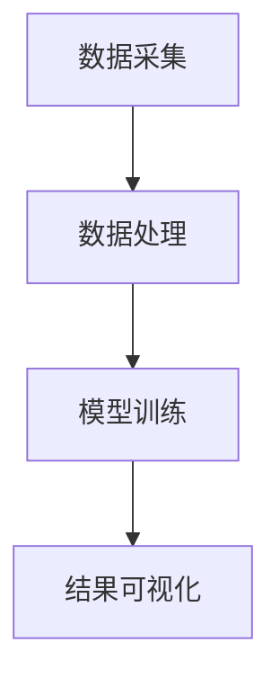
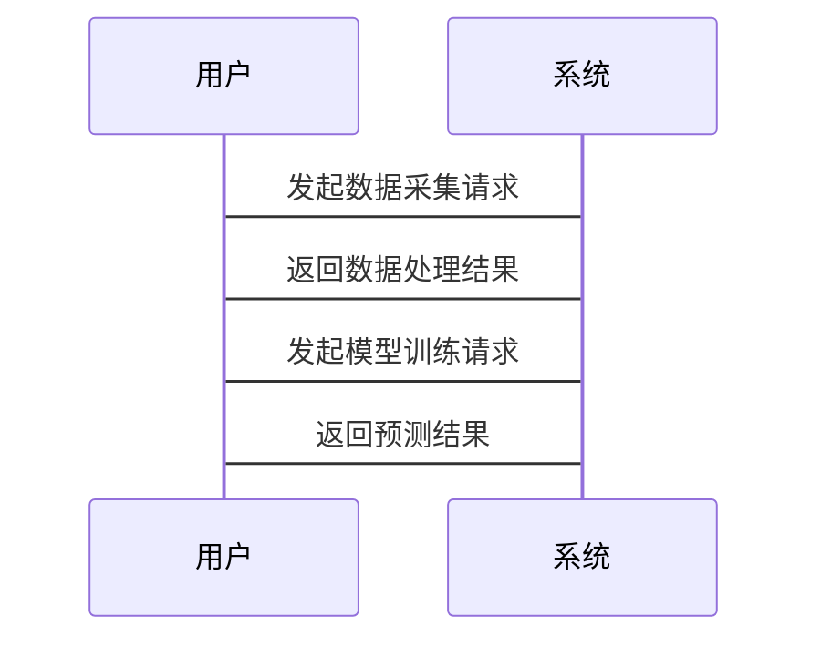

                 


# 特价股票与公司数据安全与隐私保护能力的关联性研究

## 关键词：特价股票、数据安全、隐私保护、股价波动、企业风险管理

## 摘要：本文探讨了公司数据安全与隐私保护能力如何影响其股价，特别是特价股票的情况。通过分析数据泄露事件对股价的影响、数据安全能力与股价波动的关系，以及如何通过技术手段提升数据安全能力以保护投资者信任，本文提供了深入的见解和解决方案。

---

# 第1章: 特价股票与数据安全的背景介绍

## 1.1 特价股票的基本概念

### 1.1.1 特价股票的定义
特价股票是指面值低于发行价的股票，通常反映公司财务状况不佳或市场对其前景的担忧。这种股票价格波动剧烈，风险高，但潜在回报也高。

### 1.1.2 特价股票的分类
- 按公司类型：科技、金融、制造等。
- 按风险等级：高风险、中风险、低风险。
- 按市场表现：活跃交易、清淡交易等。

### 1.1.3 特价股票的市场表现
- 价格波动剧烈，受市场情绪影响大。
- 投资者风险承受能力强，追求高回报。

## 1.2 数据安全与隐私保护的基本概念

### 1.2.1 数据安全的定义
数据安全是指保护数据的机密性、完整性和可用性，防止未经授权的访问和篡改。

### 1.2.2 隐私保护的核心原则
- 个人数据未经授权不得使用。
- 数据处理必须透明，符合相关法律法规。

### 1.2.3 数据安全与隐私保护的法律框架
- 《通用数据保护条例》（GDPR）：欧盟法规，严格规范数据处理。
- 《加州消费者隐私法案》（CCPA）：美国加州法规，赋予消费者更多数据控制权。

## 1.3 特价股票与数据安全的关联性

### 1.3.1 数据泄露对股价的影响
- 数据泄露可能导致公司股价暴跌，投资者信心下降。
- 重大数据泄露事件会引发监管调查，增加公司合规成本。

### 1.3.2 特价股票公司的数据安全风险
- 由于财务状况不佳，公司可能在数据安全投入不足。
- 数据泄露风险更高，因缺乏先进的安全措施。

### 1.3.3 数据安全能力与股价波动的关系
- 强大的数据安全能力可提升投资者信任，稳定股价。
- 数据安全能力差可能导致股价大幅波动，影响公司市值。

## 1.4 本章小结
本章介绍了特价股票和数据安全的基本概念，分析了两者之间的关联性，强调了数据安全能力对股价波动的影响。

---

# 第2章: 特价股票与数据安全的核心概念与联系

## 2.1 特价股票的核心要素

### 2.1.1 公司财务状况
- 财务健康状况影响投资者信心。
- 财务数据安全直接关系到公司信任度。

### 2.1.2 市场对公司的信任度
- 投资者信任度高，股价稳定。
- 数据泄露事件会迅速降低信任度。

### 2.1.3 特价股票的市场波动性
- 市场波动性高，投资者情绪影响股价。
- 数据安全事件会加剧市场波动。

## 2.2 数据安全的核心要素

### 2.2.1 数据分类与分级
- 根据重要性分类数据，确保关键数据得到重点保护。
- 数据分级帮助确定安全措施的优先级。

### 2.2.2 数据访问控制
- 基于角色的访问控制（RBAC）：确保员工只能访问其职责范围内的数据。
- 最小权限原则：限制用户权限，减少潜在风险。

### 2.2.3 数据加密技术
- 数据在传输和存储过程中加密，防止未经授权的访问。
- 使用强加密算法，如AES-256，保护敏感数据。

## 2.3 特价股票与数据安全的关系分析

### 2.3.1 数据安全能力与股价的相关性
- 数据安全能力强的公司，股价波动较小，投资者信任度高。
- 数据安全能力弱的公司，股价波动剧烈，投资者信心不足。

### 2.3.2 数据泄露事件对股价的影响
- 数据泄露事件发生后，公司股价通常会立即下跌。
- 长期来看，股价可能进一步下跌，难以恢复。

### 2.3.3 数据安全能力对投资者信任的影响
- 强大的数据安全能力提升投资者信任，股价稳定。
- 数据安全能力差的公司，投资者信任下降，股价波动加剧。

## 2.4 核心概念对比表格

| 核心概念 | 特价股票 | 数据安全 |
|----------|----------|----------|
| 核心要素 | 股价波动 | 数据保护 |
| 影响因素 | 市场情绪 | 数据泄露 |
| 目标 | 投资回报 | 数据保护 |

## 2.5 数据安全的ER实体关系图

```mermaid
erDiagram
    customer[投资者] {
        <属性>
        id : int
        name : string
        }
    company[公司] {
        <属性>
        id : int
        name : string
        stock_price : float
        }
    data_security[数据安全] {
        <属性>
        id : int
        security_level : int
        }
    投资者 -> 公司 : 持股
    公司 -> 数据安全 : 依赖
```

---

# 第3章: 数据安全能力与股价波动的算法分析

## 3.1 数据安全能力评估模型

### 3.1.1 模型概述
- 通过量化指标评估公司的数据安全能力。
- 指标包括数据分类、访问控制、加密技术等。

### 3.1.2 模型公式
$$ \text{数据安全能力} = \sum (\text{指标权重} \times \text{指标得分}) $$

## 3.2 股价波动预测模型

### 3.2.1 模型概述
- 使用历史数据训练模型，预测股价波动。
- 结合数据安全能力评分和市场情绪因素。

### 3.2.2 模型公式
$$ \text{股价波动} = \beta_1 \times \text{数据安全能力} + \beta_2 \times \text{市场情绪} + \epsilon $$

## 3.3 算法实现

### 3.3.1 数据准备
- 收集公司数据安全能力指标。
- 收集历史股价数据和市场情绪数据。

### 3.3.2 数据预处理
- 数据清洗：处理缺失值和异常值。
- 数据标准化：将数据归一化处理。

### 3.3.3 模型训练
```python
import pandas as pd
from sklearn.linear_model import LinearRegression
from sklearn.metrics import mean_squared_error

# 数据准备
data = pd.read_csv('stock_data.csv')
X = data[['data_security_score', 'market_sentiment']]
y = data['stock_price']

# 模型训练
model = LinearRegression()
model.fit(X, y)

# 模型评估
预测 = model.predict(X)
mse = mean_squared_error(y, 预测)
print(f"均方误差: {mse}")
```

---

# 第4章: 数据安全能力与股价波动的系统分析

## 4.1 系统功能设计

### 4.1.1 功能模块
- 数据采集模块：收集公司数据安全能力和股价数据。
- 数据处理模块：清洗和标准化数据。
- 模型训练模块：训练预测模型。
- 可视化模块：展示数据安全能力和股价波动的关系。

### 4.1.2 功能流程图


## 4.2 系统架构设计

### 4.2.1 系统架构图


## 4.3 系统接口设计

### 4.3.1 API接口
- `/api/data_collect`: 采集数据。
- `/api/data_process`: 处理数据。
- `/api/model_train`: 训练模型。
- `/api/result_show`: 展示结果。

## 4.4 系统交互设计

### 4.4.1 交互流程图


---

# 第5章: 数据安全能力与股价波动的项目实战

## 5.1 环境安装

### 5.1.1 工具安装
- 安装Python、Jupyter Notebook、Scikit-learn等工具。

## 5.2 核心实现

### 5.2.1 数据准备与清洗
```python
import pandas as pd
import numpy as np

# 数据准备
data = pd.read_csv('stock_data.csv')
# 数据清洗
data.dropna(inplace=True)
data = data[~data['data_security_score'].isin([np.nan])]
```

### 5.2.2 模型训练
```python
from sklearn.model_selection import train_test_split
from sklearn.linear_model import LinearRegression

X = data[['data_security_score', 'market_sentiment']]
y = data['stock_price']

# 数据分割
X_train, X_test, y_train, y_test = train_test_split(X, y, test_size=0.2, random_state=42)

# 模型训练
model = LinearRegression()
model.fit(X_train, y_train)

# 预测与评估
预测 = model.predict(X_test)
mse = mean_squared_error(y_test, 预测)
print(f"均方误差: {mse}")
```

## 5.3 实际案例分析

### 5.3.1 案例介绍
- 某科技公司因数据泄露事件导致股价大幅下跌。

### 5.3.2 案例分析
- 数据泄露事件前的数据安全能力评分较低。
- 事件后股价下跌，数据安全能力评分进一步降低。

### 5.3.3 解决方案
- 提升数据安全能力评分，通过技术手段加强数据保护。
- 加强投资者沟通，恢复市场信心。

---

# 第6章: 数据安全能力与股价波动的最佳实践

## 6.1 数据安全能力提升建议

### 6.1.1 加强数据分类与分级
- 重要数据优先保护。
- 定期审查数据分类策略。

### 6.1.2 提升数据访问控制
- 实施基于角色的访问控制。
- 定期审计用户权限。

### 6.1.3 强化数据加密技术
- 使用强加密算法保护数据。
- 定期更新加密密钥。

## 6.2 投资者保护建议

### 6.2.1 关注公司数据安全能力
- 选择数据安全能力强的公司投资。
- 通过数据安全能力评分筛选潜在风险。

### 6.2.2 监测股价波动
- 关注股价波动与数据安全事件的关联。
- 及时调整投资策略。

## 6.3 企业风险管理建议

### 6.3.1 建立数据安全管理体系
- 制定数据安全策略和操作规范。
- 定期进行数据安全演练。

### 6.3.2 加强员工培训
- 提高员工数据安全意识。
- 定期进行安全培训和演练。

## 6.4 小结
数据安全能力是影响股价波动的重要因素，企业和投资者都应重视数据安全问题，采取有效措施降低风险。

---

# 第7章: 总结与展望

## 7.1 总结
本文分析了数据安全能力与股价波动的关联性，提出了提升数据安全能力的建议，并通过案例分析展示了数据安全能力对股价的影响。

## 7.2 展望
未来，随着数据安全法规的完善和技术的发展，数据安全能力对股价的影响将更加显著。企业需要更加重视数据安全建设，投资者也需要更加关注数据安全能力评分。

---

# 参考文献
（此处列出相关文献和参考资料）

---

通过以上内容，我们详细分析了特价股票与公司数据安全与隐私保护能力的关联性，为企业和投资者提供了有价值的参考和建议。

