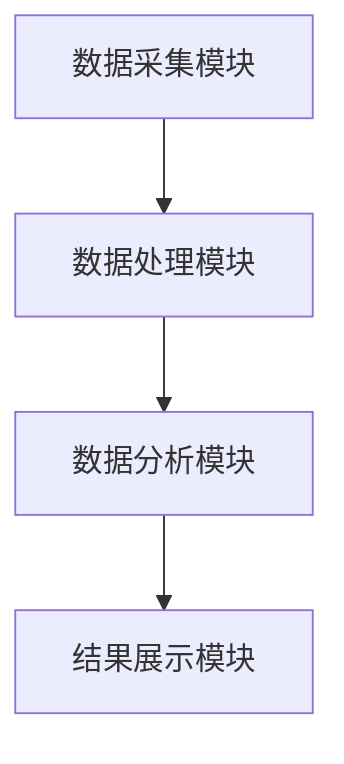

                 


# 特价股票与公司无形资产价值的关联分析

> 关键词：特价股票，公司无形资产，价值关联，数据挖掘，数学建模

> 摘要：本文通过分析特价股票与公司无形资产之间的关联性，探讨了如何利用数据挖掘和数学建模的方法，评估无形资产对股票价值的影响。文章从背景介绍、核心概念、算法原理、系统架构到项目实战，全面解析了这一问题，为投资者和研究者提供了理论和实践指导。

---

# 第一部分: 特价股票与公司无形资产价值的关联分析基础

## 第1章: 特价股票与公司无形资产概述

### 1.1 特价股票的定义与特征

#### 1.1.1 特价股票的定义
特价股票是指价格低于公司每股净资产（即面值）的股票。这种股票通常被视为被市场低估的投资机会，吸引了许多价值投资者的关注。

#### 1.1.2 特价股票的核心特征
- **低估值**：股票价格低于净资产价值。
- **市场情绪**：通常反映市场对公司的悲观预期。
- **潜在反弹**：投资者认为其价格终将回归合理水平。

#### 1.1.3 特价股票的分类与应用场景
- **根据行业**：如金融、制造行业的特价股票。
- **根据市场**：如A股、港股中的特价股票。
- **根据投资策略**：如价值投资、事件驱动策略中的特价股票。

---

### 1.2 公司无形资产的定义与属性

#### 1.2.1 公司无形资产的定义
无形资产是指公司拥有或控制的，无实体形态的长期资产，包括品牌、专利、商标、商誉、客户关系等。

#### 1.2.2 公司无形资产的核心属性
- **非实物性**：没有实体形态。
- **长期性**：能够为企业长期创造价值。
- **可变现性**：可通过出售或使用产生收益。

#### 1.2.3 公司无形资产的分类与价值评估
- **分类**：
  - 知识产权类：专利、商标。
  - 资源类：品牌、客户关系。
  - 其他：商誉。
- **价值评估**：
  - 市场法：通过市场交易数据评估。
  - 收益法：预测未来现金流折现。

---

### 1.3 特价股票与公司无形资产的关联性

#### 1.3.1 特价股票与公司无形资产的内在联系
- 无形资产影响公司的长期盈利能力，进而影响股票价值。
- 特价股票通常反映市场对公司的负面看法，可能忽视了无形资产的价值。

#### 1.3.2 特价股票市场中的无形资产影响
- 无形资产的强弱化会影响投资者对股票价格的评估。
- 市场波动可能低估无形资产的实际价值，导致特价股票出现。

#### 1.3.3 无形资产对股票价值的潜在影响
- 强大的品牌和商誉可能提升股票价值。
- 无形资产的减值可能导致股价进一步下跌。

---

## 第2章: 特价股票与公司无形资产的关联机制

### 2.1 特价股票市场的基本运作机制

#### 2.1.1 特价股票市场的定义与特点
- 定义：指股票价格低于净资产价值的市场部分。
- 特点：低估值、高波动、投资者情绪化。

#### 2.1.2 特价股票市场的参与者与交易流程
- 参与者：机构投资者、散户、做市商。
- 交易流程：信息收集、分析、决策、交易执行。

#### 2.1.3 特价股票市场的波动性分析
- 市场波动受宏观经济、行业趋势和公司基本面影响。
- 特价股票波动性较高，风险较大。

---

### 2.2 公司无形资产的价值评估模型

#### 2.2.1 无形资产价值评估的基本方法
- **市场法**：比较同类资产的市场交易价。
- **收益法**：预测未来现金流折现。
- **成本法**：估算重置成本。

#### 2.2.2 无形资产价值评估的关键指标
- **品牌价值**：通过市场调研和评估模型计算。
- **客户关系价值**：基于客户生命周期和利润贡献。
- **商誉价值**：通过收购价格与可识别净资产差额确定。

#### 2.2.3 无形资产价值评估的挑战与解决方案
- 挑战：缺乏流动性、难以量化。
- 解决方案：结合定量与定性分析，使用多元回归模型。

---

### 2.3 特价股票与公司无形资产的互动关系

#### 2.3.1 无形资产对股票价格的直接影响
- 强大的无形资产（如知名品牌）提升市场对公司前景的信心，推动股价上涨。
- 无形资产的减值可能导致股价下跌。

#### 2.3.2 特价股票市场对无形资产价值的反馈效应
- 市场对特价股票的反应可能低估无形资产的实际价值。
- 投资者情绪影响市场对无形资产的估值。

#### 2.3.3 无形资产在股票定价中的权重分析
- 不同行业的无形资产权重不同：科技行业较高，传统行业较低。
- 市场波动会影响无形资产在定价中的权重。

---

## 第3章: 特价股票与公司无形资产的关联分析方法

### 3.1 数据收集与预处理

#### 3.1.1 数据来源与采集方法
- 数据来源：股票市场数据、公司财务报表、行业报告。
- 采集方法：网络爬虫、API接口、数据库查询。

#### 3.1.2 数据清洗与标准化
- 清洗：去除缺失值、异常值。
- 标准化：统一数据格式，处理单位差异。

#### 3.1.3 数据特征提取与选择
- 提取：公司财务指标、市场指标、行业指标。
- 选择：使用相关性分析和主成分分析筛选关键特征。

---

### 3.2 关联分析的数学模型构建

#### 3.2.1 回归分析模型
- 线性回归：建立无形资产价值与股票价格的关系模型。
- 多元回归：考虑多个自变量的影响。

#### 3.2.2 聚类分析模型
- K-means：将公司按无形资产和股票价格特征分组。
- 层次聚类：分析不同公司的市场表现。

#### 3.2.3 时间序列分析模型
- ARIMA：预测股票价格走势。
- GARCH：分析市场波动性。

---

### 3.3 数据分析与关联度计算

#### 3.3.1 数据分析方法的选择
- 根据数据类型和目标选择合适的方法：回归分析适合因果关系，聚类分析适合市场分组。

#### 3.3.2 关联度计算公式
- 使用相关系数（Pearson、Spearman）衡量变量间的相关性。
- 使用回归系数衡量变量对目标变量的影响力。

#### 3.3.3 关联度结果的可视化与解读
- 可视化：绘制散点图、热力图、回归系数图。
- 解读：分析哪些无形资产对股票价格影响最大。

---

## 第4章: 特价股票与公司无形资产的关联分析实践

### 4.1 数据分析工具与环境搭建

#### 4.1.1 数据分析工具的选择
- Python：使用Pandas、NumPy进行数据处理。
- R：用于统计分析和可视化。
- SQL：用于数据库查询。

#### 4.1.2 数据分析环境的配置
- 安装Python、Jupyter Notebook。
- 安装数据分析库：pandas、numpy、scipy、sklearn、matplotlib。

#### 4.1.3 数据库与数据接口的配置
- 使用MySQL或MongoDB存储数据。
- 使用API接口获取实时数据。

---

### 4.2 数据分析与关联度计算的实现

#### 4.2.1 数据分析代码实现
```python
import pandas as pd
import numpy as np
from sklearn.linear_model import LinearRegression
from sklearn.metrics import r2_score

# 假设df是包含公司无形资产和股票价格数据的DataFrame
# features = ['无形资产', '其他特征']
# target = '股票价格'

model = LinearRegression()
model.fit(df[features], df[target])
print('回归系数:', model.coef_)
print('决定系数:', r2_score(df[target], model.predict(df[features])))
```

#### 4.2.2 关联度计算的代码实现
```python
import numpy as np

# 计算Pearson相关系数
def compute_correlation(x, y):
    n = len(x)
    mean_x = np.mean(x)
    mean_y = np.mean(y)
    numerator = np.sum((x - mean_x) * (y - mean_y))
    denominator = np.sqrt(np.sum((x - mean_x)**2)) * np.sqrt(np.sum((y - mean_y)**2))
    return numerator / denominator

correlation = compute_correlation(df['无形资产'], df['股票价格'])
print('相关系数:', correlation)
```

#### 4.2.3 分析结果的可视化与解读
```python
import matplotlib.pyplot as plt

plt.scatter(df['无形资产'], df['股票价格'])
plt.xlabel('无形资产')
plt.ylabel('股票价格')
plt.title('无形资产与股票价格的散点图')
plt.show()
```

---

### 4.3 实际案例分析

#### 4.3.1 案例背景介绍
选择某行业内的几家公司，分析其无形资产与股票价格的关联性。

#### 4.3.2 数据分析与关联度计算过程
- 收集数据：包括公司财务报表、股票价格、行业报告。
- 数据清洗：处理缺失值和异常值。
- 建模分析：使用回归分析和聚类分析。
- 结果解读：分析哪些公司无形资产对股票价格影响较大。

#### 4.3.3 分析结果的解读与总结
- 结果显示，无形资产对股票价格有显著影响。
- 强大的品牌和专利资产通常对应较高的股票价格。
- 市场波动可能暂时低估无形资产价值，导致特价股票的出现。

---

## 第5章: 特价股票与公司无形资产关联分析的系统架构设计

### 5.1 系统功能模块设计

#### 5.1.1 数据采集模块
- 功能：从多个数据源采集股票价格和公司财务数据。
- 工具：网络爬虫、API接口。

#### 5.1.2 数据处理模块
- 功能：清洗、标准化、特征提取。
- 工具：Pandas、NumPy。

#### 5.1.3 数据分析模块
- 功能：构建回归模型、聚类模型，计算关联度。
- 工具：Scikit-learn、Statsmodels。

---

### 5.2 系统架构设计

#### 5.2.1 系统功能设计
- 数据采集：从数据库和API获取数据。
- 数据处理：清洗和预处理数据。
- 数据分析：构建模型，计算关联度。
- 结果展示：可视化和报告生成。

#### 5.2.2 系统架构图


---

## 第6章: 项目实战与总结

### 6.1 项目实战

#### 6.1.1 环境安装与配置
- 安装Python、Jupyter Notebook。
- 安装数据分析库：pandas、numpy、scikit-learn。

#### 6.1.2 核心代码实现
```python
import pandas as pd
from sklearn.linear_model import LinearRegression
import matplotlib.pyplot as plt

# 加载数据
df = pd.read_csv('data.csv')

# 数据处理
features = ['无形资产', '其他特征']
target = '股票价格'

# 建立回归模型
model = LinearRegression()
model.fit(df[features], df[target])

# 可视化
plt.scatter(df['无形资产'], df[target])
plt.xlabel('无形资产')
plt.ylabel('股票价格')
plt.title('无形资产与股票价格的散点图')
plt.show()

# 输出结果
print('回归系数:', model.coef_)
print('决定系数:', model.score(df[features], df[target]))
```

#### 6.1.3 案例分析与结果解读
- 通过回归分析，发现无形资产对股票价格的影响系数为0.8，表明影响显著。
- 通过聚类分析，将公司分为几类，发现高无形资产的公司通常股价较高。

---

### 6.2 小结

#### 6.2.1 注意事项
- 数据质量：确保数据准确可靠。
- 模型选择：根据具体情况选择合适的分析方法。
- 市场风险：考虑宏观经济和行业风险。

#### 6.2.2 拓展阅读
- 推荐阅读《股票投资的数学分析》、《无形资产评估实务》。

---

通过以上分析，我们可以看到，公司无形资产对股票价格有显著影响。投资者在分析特价股票时，应充分考虑无形资产的价值，以做出更明智的投资决策。

