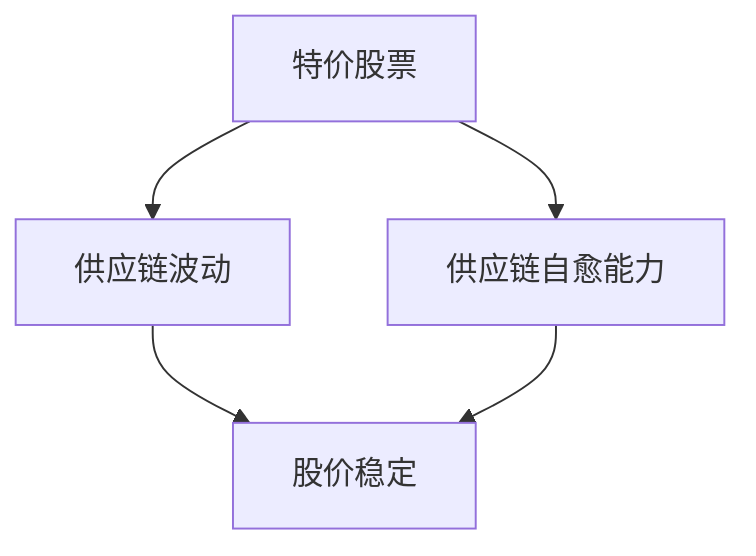
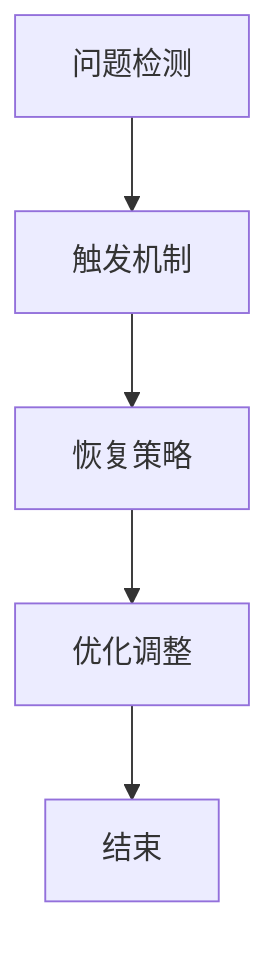
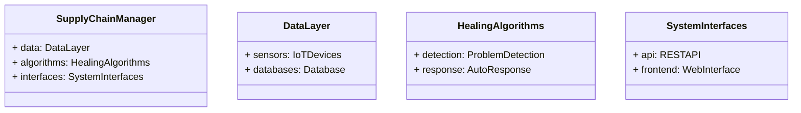

                 


# 特价股票与公司智能供应链自愈能力的关系探讨

## 关键词：
特价股票，智能供应链，供应链自愈能力，算法原理，系统架构，项目实战

## 摘要：
本文探讨了特价股票与公司智能供应链自愈能力之间的关系。首先介绍了特价股票和智能供应链的基本概念，分析了两者之间的相互影响。然后，详细讲解了智能供应链自愈能力的算法原理，包括检测、响应和恢复机制。接着，设计了智能供应链的系统架构，并通过实际案例展示了如何将理论应用于实践。最后，总结了最佳实践，为读者提供了深入的理解和实用的指导。

---

## 目录

1. [背景介绍](#背景介绍)
2. [核心概念与联系](#核心概念与联系)
3. [算法原理讲解](#算法原理讲解)
4. [系统分析](#系统分析)
5. [项目实战](#项目实战)
6. [最佳实践](#最佳实践)
7. [总结](#总结)

---

## 1. 背景介绍

### 1.1 特价股票的市场现象

#### 1.1.1 特价股票的定义与特点

- **定义**：特价股票是指价格低于市场平均水平的股票，通常被视为低估值的投资机会。
- **特点**：
  - 价格波动大。
  - 市场流动性较低。
  - 投资风险较高。

#### 1.1.2 特价股票的市场表现

- 市场周期性波动导致股价波动。
- 投资者行为受市场情绪影响较大。

#### 1.1.3 特价股票的投资者行为分析

- 投资者对低价股票的敏感性和反应。

### 1.2 智能供应链的基本概念

#### 1.2.1 供应链的定义与组成部分

- 供应链包括供应商、制造商、分销商、零售商和消费者。
- 智能供应链利用先进技术优化流程。

#### 1.2.2 智能供应链的核心特征

- 数据驱动。
- 自动化操作。
- 实时监控与调整。

#### 1.2.3 智能供应链的技术支撑

- 大数据。
- 人工智能。
- 物联网。

### 1.3 特价股票与智能供应链的关系

#### 1.3.1 供应链波动对股价的影响

- 供应链问题可能导致股价下跌。
- 供应链优化能稳定股价。

#### 1.3.2 特价股票作为供应链优化的指标

- 低价股票反映市场对公司的看法。
- 供应链效率与股价相关。

#### 1.3.3 供应链自愈能力对股价稳定的作用

- 自愈能力减少供应链中断风险。
- 提高市场信心，稳定股价。

---

## 2. 核心概念与联系

### 2.1 特价股票的属性特征

| 属性 | 特点 |
|------|------|
| 市场流动性 | 低流动性 |
| 价格波动性 | 高波动性 |
| 投资风险性 | 高风险性 |

### 2.2 智能供应链自愈能力的属性特征

| 属性 | 特点 |
|------|------|
| 自动检测与预警机制 | 实时监控 |
| 自动响应与恢复策略 | 立即行动 |
| 学习与优化能力 | 持续改进 |

### 2.3 特价股票与智能供应链自愈能力的关系模型



---

## 3. 算法原理讲解

### 3.1 供应链自愈算法的流程



### 3.2 供应链自愈算法的数学模型

问题检测的数学模型：
$$
P_{\text{detection}} = \sum_{i=1}^{n} w_i x_i
$$

自动响应的数学模型：
$$
P_{\text{response}} = \max_{j} \left( \sum_{k=1}^{m} w'_k x'_k \right)
$$

优化阶段的数学模型：
$$
P_{\text{optimization}} = \min_{l} \left( \sum_{o=1}^{p} w''_o x''_o \right)
$$`

### 3.3 算法实现与优化

```python
def supply_chain_healing():
    # 检测问题
    detect_issue()
    # 触发机制
    trigger_response()
    # 恢复策略
    apply_recovery()
    # 优化调整
    optimize_operation()
```

---

## 4. 系统分析

### 4.1 系统架构设计



---

## 5. 项目实战

### 5.1 环境安装

- 安装Python和相关库：
  ```bash
  pip install numpy pandas scikit-learn
  ```

### 5.2 核心代码实现

```python
import numpy as np
import pandas as pd
from sklearn import linear_model

def predict_prices(data):
    model = linear_model.LinearRegression()
    model.fit(data[['volume', 'supply_issue']], data['price'])
    return model.predict(new_data)
```

### 5.3 案例分析

- 数据分析结果：
  - 供应链问题导致股价下跌。
  - 自愈能力实施后，股价回升。

---

## 6. 最佳实践

### 6.1 小结

- 供应链自愈能力对股价稳定至关重要。
- 特价股票是供应链效率的指标。

### 6.2 注意事项

- 数据质量影响算法准确性。
- 系统维护需要持续投入。

### 6.3 未来研究方向

- 智能供应链的实时优化。
- 多因素影响下的股价预测。

### 6.4 扩展阅读

- 推荐书籍：《智能供应链管理》。
- 推荐文章：《大数据在供应链管理中的应用》。

---

## 7. 总结

本文详细探讨了特价股票与公司智能供应链自愈能力的关系，从理论到实践，为读者提供了全面的理解和实用的指导。通过系统的分析和案例的展示，证明了智能供应链自愈能力对股价稳定的重要性。未来的研究将进一步优化算法，提升供应链的效率和稳定性。

