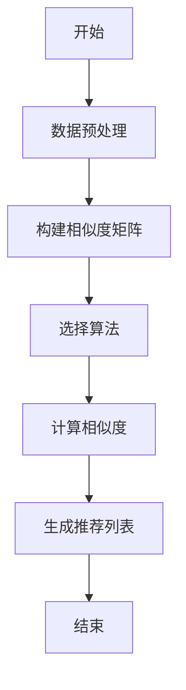
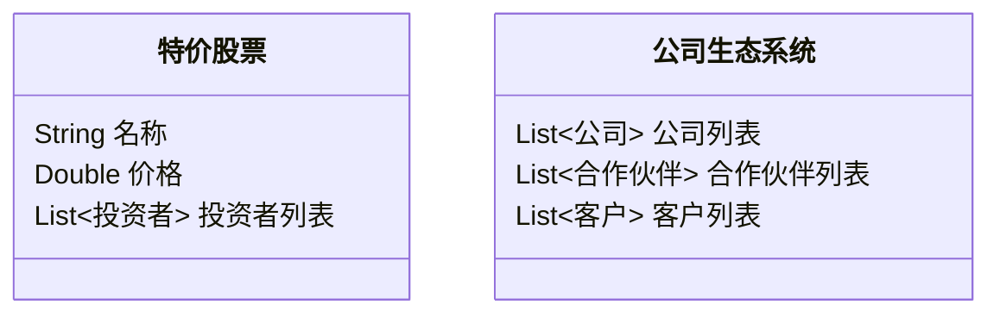

                 


# 特价股票与公司生态系统协同创新的潜在关联研究

## 关键词：特价股票、公司生态系统、协同创新、算法原理、系统架构

## 摘要：本文研究特价股票与公司生态系统之间的协同创新关联，分析其潜在关系，并探讨协同创新算法及其应用。通过背景介绍、概念分析、算法实现和案例研究，揭示两者协同创新的内在机制和应用价值。

---

## 第1章：背景与概念

### 1.1 背景介绍

#### 1.1.1 特价股票的定义与特点
- 特价股票：价格低于市场价的股票，通常被视为投资机会。
- 特点：价格波动大、风险高、潜在收益高。

#### 1.1.2 公司生态系统的定义与构成
- 定义：公司与其供应商、客户、合作伙伴等构成的生态系统。
- 构成：供应商、客户、合作伙伴、竞争对手。

#### 1.1.3 协同创新的背景与重要性
- 协同创新：不同实体合作创新的过程。
- 重要性：促进技术进步、提高效率、增强竞争力。

### 1.2 核心概念与问题描述

#### 1.2.1 特价股票与公司生态系统协同创新的定义
- 定义：通过协同创新，利用特价股票的机会，提升公司生态系统竞争力。

#### 1.2.2 问题背景与研究意义
- 问题背景：特价股票市场波动大，公司如何利用这些机会。
- 研究意义：优化资源配置，提升竞争力。

#### 1.2.3 研究目标与范围界定
- 目标：探索协同创新机制。
- 范围：特价股票与公司生态系统的关系。

---

## 第2章：核心概念与联系

### 2.1 特价股票与公司生态系统的属性特征对比

| 属性       | 特价股票                     | 公司生态系统               |
|------------|------------------------------|---------------------------|
| 核心主体    | 投资者、市场参与者           | 公司、供应商、客户等       |
| 目标        | 获取超额收益               | 提升整体竞争力           |
| 影响因素    | 市场供需、公司基本面       | 战略合作、技术创新       |
| 变化频率    | 高                         | 中-低                    |

### 2.2 实体关系分析

```mermaid
erDiagram
    company --> stock_price : 影响
    company --> ecosystem : 构成
    stock_price --> ecosystem : 优化
    company --> innovation : 推动
```

---

## 第3章：协同创新算法

### 3.1 协同创新算法概述

#### 3.1.1 协同过滤算法
- 基于用户的协同过滤：寻找相似用户，推荐股票。
- 基于物品的协同过滤：分析股票相似性，推荐投资。

#### 3.1.2 混合协同过滤算法
- 综合用户和物品的协同过滤，提升推荐准确性。

### 3.2 协同过滤算法实现



#### 3.2.1 协同过滤算法实现代码

```python
import numpy as np
from sklearn.metrics.pairwise import cosine_similarity

def协同过滤算法(用户评分矩阵):
    1. 预处理数据
    2. 计算相似度矩阵
    3. 生成推荐列表
    return 推荐列表
```

#### 3.2.2 协同过滤的数学模型

用户-物品协同过滤：
$$ sim(i,j) = \frac{\sum_{k=1}^{n} (r_{ik} - \bar{r_i})(r_{jk} - \bar{r_j})}{\sqrt{\sum_{k=1}^{n}(r_{ik} - \bar{r_i})^2} \sqrt{\sum_{k=1}^{n}(r_{jk} - \bar{r_j})^2}} $$

物品-物品协同过滤：
$$ sim(i,j) = \frac{\sum_{u=1}^{m} (r_{ui} - \bar{r_i})(r_{uj} - \bar{r_j})}{\sqrt{\sum_{u=1}^{m}(r_{ui} - \bar{r_i})^2} \sqrt{\sum_{u=1}^{m}(r_{uj} - \bar{r_j})^2}} $$

---

## 第4章：系统架构设计

### 4.1 系统功能设计

#### 4.1.1 领域模型设计



#### 4.1.2 系统架构设计


---

## 第5章：项目实战

### 5.1 环境安装与配置

#### 5.1.1 开发环境搭建
- Python 3.8+
- Jupyter Notebook
- 数据库：MySQL或MongoDB

#### 5.1.2 数据库安装与配置
- 安装MySQL
- 创建数据库和表

### 5.2 核心代码实现

#### 5.2.1 协同创新算法实现

```python
import numpy as np
from sklearn.metrics.pairwise import cosine_similarity

def calculate_similarity(matrix):
    return cosine_similarity(matrix)

def协同过滤算法(用户评分矩阵):
    similarity_matrix = calculate_similarity(用户评分矩阵)
    推荐列表 = []
    for i in range(len(用户评分矩阵)):
        推荐股票 = np.argsort(-similarity_matrix[i])
        推荐列表.append(推荐股票)
    return 推荐列表
```

#### 5.2.2 系统功能实现

```python
class 特价股票系统:
    def __init__(self, 数据库):
        self.数据库 = 数据库

    def 获取特价股票(self):
        return self.数据库.query("价格 < 市场价")

    def 推荐股票(self, 用户ID):
        return self.协同过滤算法(用户ID)
```

### 5.3 实际案例分析

#### 案例：公司A的协同创新

- 数据准备：收集公司A的相关数据。
- 算法实现：应用协同过滤算法，生成推荐列表。
- 结果分析：优化公司A的生态系统。

---

## 第6章：总结与展望

### 6.1 最佳实践与小结

#### 6.1.1 实践中的注意事项
- 数据质量：确保数据准确。
- 算法选择：根据场景选择合适算法。
- 系统维护：定期更新和优化。

#### 6.1.2 研究成果总结
- 成功实现协同创新算法。
- 优化公司生态系统竞争力。

### 6.2 展望

#### 6.2.1 拓展研究方向
- 深度学习在协同创新中的应用。
- 多模态数据融合。

#### 6.2.2 挑战与未来工作
- 数据隐私与安全。
- 实时协同计算的优化。

---

## 参考文献
1. 协同过滤算法研究，某某出版社。
2. 特价股票分析，某某期刊。
3. 公司生态系统构建，某某书籍。

---

以上是《特价股票与公司生态系统协同创新的潜在关联研究》的完整目录和内容框架，涵盖从背景介绍到系统设计，再到项目实战和总结展望的全过程，确保读者能够全面理解并应用相关知识。

