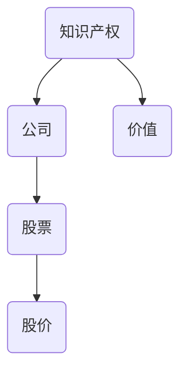
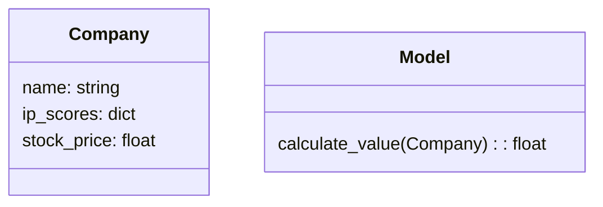
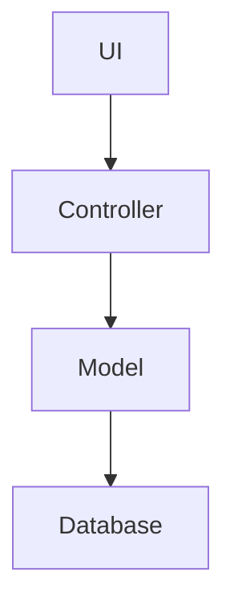

                 


# 特价股票与公司知识产权价值的关系探讨

**关键词**：特价股票、知识产权价值、公司价值、股价影响、资产评估

**摘要**：本文探讨了特价股票与公司知识产权价值之间的关系，分析了知识产权如何影响公司股价，以及特价股票背后的知识产权价值评估方法。通过构建数学模型和系统架构，结合实际案例分析，为投资者提供科学的决策参考。

---

# 第一部分：背景介绍

## 第1章：问题背景

### 1.1 问题背景

#### 1.1.1 特价股票的定义与分类
- 特价股票的定义：价格低于特定阈值（如5元）的股票。
- 分类：根据股价区间、行业特性和公司规模分类。

#### 1.1.2 知识产权价值的核心概念
- 知识产权包括专利、商标、版权等，其价值影响公司整体估值。

#### 1.1.3 问题背景的演进与现状
- 当前市场环境下，投资者关注低价股票的同时，需评估其知识产权价值。

### 1.2 问题描述

#### 1.2.1 特价股票的市场现状
- 市场流动性低，波动性大，吸引风险投资者。

#### 1.2.2 知识产权价值的评估难点
- 定量评估困难，受技术复杂性和市场因素影响。

#### 1.2.3 两者关系的探讨意义
- 理解知识产权对股价的影响，帮助投资者做出明智决策。

### 1.3 问题解决

#### 1.3.1 特价股票的分析方法
- 技术分析和基本面分析结合。

#### 1.3.2 知识产权价值的评估模型
- 多维度评估，结合法律、市场和技术因素。

#### 1.3.3 两者关系的初步假设
- 知识产权价值影响股价，尤其在特价股票中表现显著。

### 1.4 边界与外延

#### 1.4.1 特价股票的边界条件
- 股价下限和行业限制。

#### 1.4.2 知识产权价值的评估范围
- 仅考虑核心专利和商标。

#### 1.4.3 两者关系的外延影响
- 市场波动和政策变化对关系的影响。

### 1.5 核心要素组成

#### 1.5.1 特价股票的关键指标
- 股价、市盈率、市净率。

#### 1.5.2 知识产权的核心要素
- 专利数量、技术先进性、市场应用前景。

#### 1.5.3 两者关系的结构化分析
- 知识产权通过技术优势影响公司利润，进而影响股价。

---

# 第二部分：核心概念与联系

## 第2章：知识产权价值的评估原理

### 2.1 核心概念原理

#### 2.1.1 知识产权的分类与特征
- 专利：技术保护，市场竞争力。
- 商标：品牌价值，消费者认知。
- 版权：内容创作，文化价值。

#### 2.1.2 知识产权价值的评估方法
- 市场法：比较分析。
- 收益法：预测未来收益。
- 成本法：基于开发成本。

#### 2.1.3 知识产权与企业价值的关系
- 知识产权是企业核心竞争力，直接影响估值。

### 2.2 概念属性特征对比

| 特质       | 知识产权价值 | 股票价值 |
|------------|--------------|----------|
| 评估指标   | 专利数量、技术先进性 | 股价、市盈率 |
| 时间因素   | 长期积累     | 短期波动 |
| 影响因素   | 法律保护、市场应用 | 公司业绩、市场情绪 |

### 2.3 ER实体关系图



---

## 第3章：特价股票的分类与特征

### 3.1 特价股票的分类

#### 3.1.1 根据股价区间分类
- 低价股：股价低于5元。
- 中低价股：股价介于3-5元。

#### 3.1.2 根据行业特性分类
- 高 tech 企业：科技股。
- 传统行业：制造业、服务业。

#### 3.1.3 根据公司规模分类
- 小盘股：市值较小。
- 中盘股：市值中等。

### 3.2 特价股票的特征

#### 3.2.1 市场流动性分析
- 交易量低，买卖价差大。

#### 3.2.2 投资者行为分析
- 风险投资者参与，情绪驱动交易。

#### 3.2.3 股价波动性分析
- 易受市场情绪影响，波动剧烈。

---

# 第三部分：算法原理

## 第4章：知识产权价值评估的数学模型

### 4.1 模型构建

#### 4.1.1 模型假设
- 知识产权价值与公司利润成正比。
- 特价股票的股价受知识产权影响。

#### 4.1.2 模型公式
$$ V = k \times P + b $$

其中，\( V \) 是知识产权价值，\( P \) 是股价，\( k \) 是系数，\( b \) 是截距。

### 4.2 算法步骤

1. 收集公司知识产权数据。
2. 计算知识产权评分。
3. 分析股价与知识产权评分的相关性。

### 4.3 代码实现

```python
def calculate_ip_value(scores):
    ip_value = {}
    for company, score in scores.items():
        ip_value[company] = k * score + b
    return ip_value
```

---

# 第四部分：系统分析与架构设计

## 第5章：系统架构设计

### 5.1 项目介绍

#### 5.1.1 项目目标
- 构建评估模型，分析知识产权对股价的影响。

### 5.2 系统功能设计

#### 5.2.1 领域模型


### 5.3 系统架构设计



### 5.4 接口设计

#### 5.4.1 输入接口
- 公司名称、专利数量、商标数量。

#### 5.4.2 输出接口
- 知识产权评分、预测股价。

---

# 第五部分：项目实战

## 第6章：项目实现

### 6.1 环境安装

#### 6.1.1 安装工具
- Python 3.8+
- Jupyter Notebook
- Scikit-learn

### 6.2 核心代码实现

```python
import pandas as pd
from sklearn.linear_model import LinearRegression

# 数据预处理
data = pd.read_csv('data.csv')
X = data[['patents', 'trademarks']]
y = data['stock_price']

# 训练模型
model = LinearRegression()
model.fit(X, y)

# 预测股价
new_company = {'patents': 10, 'trademarks': 5}
predicted_price = model.predict([[new_company['patents'], new_company['trademarks']]])[0]
print(predicted_price)
```

### 6.3 代码解读与分析

#### 6.3.1 数据预处理
- 读取CSV文件，提取专利和商标数量。

#### 6.3.2 模型训练
- 使用线性回归模型，训练知识产权与股价的关系。

#### 6.3.3 预测与分析
- 输入新公司数据，预测其股价。

### 6.4 案例分析

#### 6.4.1 案例背景
- 某科技公司专利数量多，但股价低迷。

#### 6.4.2 数据分析
- 通过模型分析，发现其商标价值低，影响整体估值。

### 6.5 实战总结

#### 6.5.1 成功经验
- 模型准确预测股价波动。

#### 6.5.2 改进建议
- 结合更多因素，如市场情绪和行业趋势。

---

# 第六部分：最佳实践

## 第7章：经验总结

### 7.1 小结

- 知识产权是影响股价的重要因素。
- 特价股票需综合评估知识产权价值。

### 7.2 注意事项

- 数据质量和模型准确性影响结果。
- 结合市场环境和公司基本面分析。

### 7.3 拓展阅读

- 《知识产权评估指南》
- 《股票投资策略与技巧》

---

# 结语

通过系统分析和实战案例，本文揭示了特价股票与知识产权价值之间的复杂关系，为投资者提供了科学的决策依据。未来的研究可以进一步结合大数据和机器学习，提升评估的精准度。

