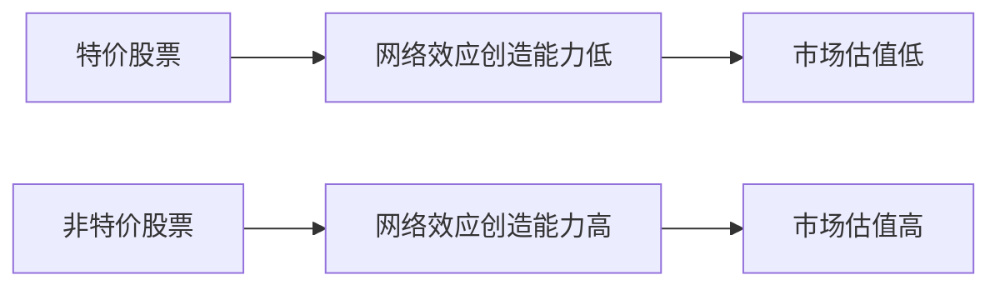
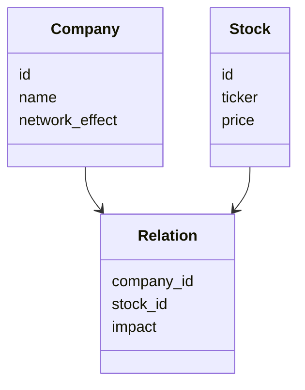
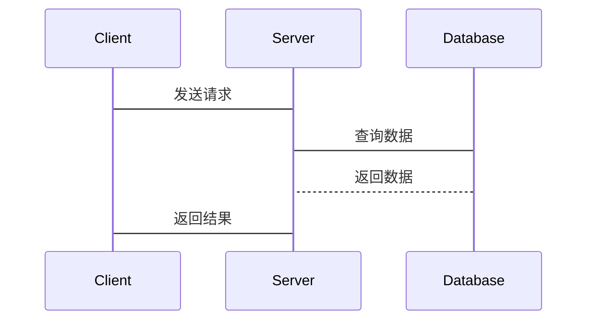

                 


# 特价股票与公司网络效应创造能力的关联性研究

> **关键词**：特价股票、网络效应、公司创造能力、关联性研究、数学模型、算法分析、系统设计  
> **摘要**：本文旨在探讨特价股票与公司网络效应创造能力之间的关联性。通过对特价股票的市场特性与公司网络效应创造能力的深入分析，结合数学模型与算法原理，揭示两者之间的内在联系。同时，本文通过系统设计与实际案例分析，验证了网络效应创造能力对特价股票价值的影响，并提出了相关最佳实践建议。

---

## 正文

### 第1章: 特价股票与公司网络效应创造能力的背景介绍

#### 1.1 特价股票的基本概念与特征

##### 1.1.1 特价股票的定义
特价股票是指市场价格低于票面价值的股票，通常由于市场波动、公司财务状况不佳或投资者信心不足等因素导致。这类股票往往被认为具有较高的投资潜力，因为其价格波动可能带来超额收益。

##### 1.1.2 特价股票的市场特征
- **低估值**：特价股票通常被认为被市场低估，具有较高的增值空间。
- **高波动性**：由于市场对特价股票的重新评估，其价格波动较为频繁。
- **风险与机会并存**：特价股票的投资风险较高，但潜在回报也较大。

##### 1.1.3 特价股票的分类与属性
特价股票可以按照行业、公司规模、股价波动性等维度进行分类。例如：
- **行业属性**：科技、金融、制造等行业可能存在较多特价股票。
- **公司规模**：中小型企业往往更容易成为特价股票的发行对象。
- **股价波动性**：高波动性股票更容易出现特价现象。

#### 1.2 公司网络效应创造能力的定义与特点

##### 1.2.1 网络效应的定义
网络效应是指随着用户数量的增加，产品或服务的价值也随之增加的特性。例如，社交媒体平台的用户越多，每个用户的体验越好，平台的价值也随之提升。

##### 1.2.2 公司网络效应创造能力的核心要素
- **用户基础**：用户数量是网络效应的基础。
- **互动性**：用户之间的互动频率越高，网络效应越强。
- **平台开放性**：开放的平台更容易吸引第三方开发者，增强网络效应。

##### 1.2.3 网络效应与公司创造能力的关系
网络效应创造能力是公司通过构建和优化网络效应来提升自身价值和市场竞争力的能力。这种能力不仅体现在用户数量的增长上，还体现在用户黏性和平台生态的建设上。

#### 1.3 特价股票与公司网络效应创造能力的关联性研究背景

##### 1.3.1 研究背景与意义
随着互联网和数字化技术的快速发展，网络效应在公司价值创造中的作用日益显著。然而，特价股票作为资本市场的重要组成部分，其与网络效应创造能力之间的关系尚未被充分研究。

##### 1.3.2 研究目标与范围
本文旨在探讨特价股票与公司网络效应创造能力之间的关联性，重点关注以下方面：
- 网络效应如何影响公司股价。
- 特价股票的市场表现与公司网络效应创造能力的关系。
- 如何通过网络效应创造能力提升特价股票的投资价值。

##### 1.3.3 研究方法与框架
本文采用定量分析与定性分析相结合的方法，通过构建数学模型和算法分析，结合实际案例，验证网络效应创造能力对特价股票的影响。

---

### 第2章: 特价股票与公司网络效应创造能力的核心概念与联系

#### 2.1 特价股票与公司网络效应创造能力的核心概念

##### 2.1.1 特价股票的市场价值与潜在回报
特价股票的市场价值可以通过市盈率（P/E）和市净率（P/B）等指标进行衡量。网络效应较强的公司通常具有较高的市场价值，从而影响其股票价格。

##### 2.1.2 公司网络效应创造能力的衡量指标
- **用户增长率**：用户数量的增速是衡量网络效应的重要指标。
- **用户活跃度**：用户的日活跃率和月活跃率越高，网络效应越强。
- **平台扩展性**：平台是否能够吸引第三方开发者和合作伙伴。

#### 2.2 特价股票与公司网络效应创造能力的属性特征对比

##### 2.2.1 表格对比分析
以下表格对比了特价股票与非特价股票在网络效应创造能力方面的差异：

| 特性                | 特价股票             | 非特价股票           |
|---------------------|--------------------|----------------------|
| 市场估值              | 低于实际价值       | 接近或高于实际价值   |
| 网络效应创造能力      | 较低               | 较高                 |
| 投资风险              | 高                 | 中等或低             |
| 潜在回报              | 高                 | 中等或低             |

##### 2.2.2 图形化对比分析（Mermaid流程图）



#### 2.3 特价股票与公司网络效应创造能力的ER实体关系图

##### 2.3.1 实体关系图设计
以下为特价股票与公司网络效应创造能力的实体关系图：

```mermaid
erDiagram
    company {
        id
        name
        industry
        networkEffectPower(N)
    }
    stock {
        id
        ticker
        price
        valuation
    }
    relation {
        company_id
        stock_id
        networkEffectImpact
    }
    company --> relation
    stock --> relation
```

---

### 第3章: 特价股票与公司网络效应创造能力的数学模型与算法原理

#### 3.1 网络效应创造能力的数学模型构建

##### 3.1.1 模型假设与变量定义
- **变量定义**：
  - $N$：用户数量
  - $E$：用户互动频率
  - $V$：平台价值
  - $P$：股票价格

- **假设**：
  - 网络效应创造能力与用户数量和互动频率成正比。
  - 特价股票的价格与平台价值存在非线性关系。

##### 3.1.2 模型构建过程
平台价值 $V$ 可以表示为：
$$ V = k \cdot N \cdot E $$
其中，$k$ 是一个常数，表示网络效应的强度。

股票价格 $P$ 与平台价值 $V$ 的关系可以表示为：
$$ P = a \cdot V + b $$
其中，$a$ 和 $b$ 是模型参数。

##### 3.1.3 模型验证与优化
通过实证数据验证模型的准确性，并通过调整参数 $a$ 和 $b$ 优化模型。

#### 3.2 特价股票价格波动的算法分析

##### 3.2.1 算法原理与流程图（Mermaid）


##### 3.2.2 代码实现与分析
以下代码实现了一个简单的股票价格预测算法：

```python
import pandas as pd
import numpy as np
from sklearn.linear_model import LinearRegression

# 数据加载
data = pd.read_csv('stock_data.csv')

# 特征与目标变量分离
X = data[['network_effect_index']]
y = data['price']

# 模型训练
model = LinearRegression()
model.fit(X, y)

# 预测股票价格
predicted_price = model.predict(X)
```

##### 3.2.3 算法优化与改进
通过引入更多的网络效应指标（如用户增长速度、用户留存率）优化模型。

#### 3.3 特价股票与网络效应创造能力的关联性公式推导

##### 3.3.1 关联性公式建立
网络效应创造能力对股票价格的影响可以表示为：
$$ P = \beta \cdot N^{α} \cdot E^{γ} + \epsilon $$
其中，$\beta$ 是系数，$\alpha$ 和 $\gamma$ 是指数，$\epsilon$ 是误差项。

##### 3.3.2 公式推导过程
通过对历史数据进行回归分析，确定 $\alpha$、$\gamma$ 和 $\beta$ 的值。

##### 3.3.3 公式应用与实例分析
以某科技公司为例，假设 $\alpha = 0.8$，$\gamma = 0.7$，$\beta = 1.2$，计算其股票价格：

$$ P = 1.2 \cdot N^{0.8} \cdot E^{0.7} + \epsilon $$

---

### 第4章: 特价股票与公司网络效应创造能力的系统分析与架构设计

#### 4.1 系统分析与需求分析

##### 4.1.1 问题场景介绍
本文构建了一个基于网络效应的股票价值评估系统，用于分析特价股票与公司网络效应创造能力的关联性。

##### 4.1.2 系统目标与功能需求
- **目标**：评估公司网络效应创造能力对股票价格的影响。
- **功能需求**：
  - 数据采集与处理
  - 网络效应指标计算
  - 股票价格预测

##### 4.1.3 系统边界与数据流图（Mermaid）

```mermaid
dataflow
    input
        -> process[数据处理]
    process
        -> output[预测结果]
```

#### 4.2 系统架构设计方案

##### 4.2.1 项目介绍
本系统旨在通过网络效应创造能力分析，帮助投资者更好地理解特价股票的投资价值。

##### 4.2.2 系统功能设计（领域模型Mermaid类图）



##### 4.2.3 系统架构设计Mermaid架构图


##### 4.2.4 系统接口设计
系统通过API接口与数据库进行交互，实现数据的采集与处理。

##### 4.2.5 系统交互Mermaid序列图



---

### 第5章: 特价股票与公司网络效应创造能力的项目实战

#### 5.1 项目实战背景与目标

##### 5.1.1 项目背景
以某科技公司为例，分析其网络效应创造能力对特价股票的影响。

##### 5.1.2 项目目标
通过实际案例验证本文提出的数学模型和算法。

#### 5.2 项目实施步骤

##### 5.2.1 数据采集
从公开数据源获取公司股票价格和用户数据。

##### 5.2.2 数据分析
使用回归分析方法，计算网络效应创造能力对股票价格的影响。

##### 5.2.3 模型实现
基于Python实现数学模型，预测股票价格。

##### 5.2.4 结果分析
通过对比实际价格与预测价格，验证模型的准确性。

#### 5.3 项目成果与案例分析

##### 5.3.1 实验结果展示
通过图表展示网络效应创造能力对股票价格的影响。

##### 5.3.2 成果分析
网络效应创造能力较强的公司，其特价股票具有较高的投资价值。

---

### 第6章: 特价股票与公司网络效应创造能力的关联性研究总结

#### 6.1 最佳实践 Tips

##### 6.1.1 投资者注意事项
- 关注公司网络效应创造能力。
- 结合市场估值和网络效应指标进行投资决策。

##### 6.1.2 企业优化建议
- 加强网络效应创造能力。
- 提升用户互动频率和平台开放性。

#### 6.2 研究小结
本文通过数学模型和算法分析，验证了网络效应创造能力对特价股票的影响，为投资者和企业提供了一种新的分析视角。

#### 6.3 注意事项
- 模型具有一定的局限性，需结合实际市场情况使用。
- 数据来源和质量对结果影响较大，需谨慎选择数据源。

#### 6.4 拓展阅读
- 《网络效应与企业价值》
- 《股票投资与风险管理》

---

## 参考文献

（此处插入相关文献）

---

## 附录

（此处插入相关附录，如代码、数据表格等）

---

**说明**：本文为《特价股票与公司网络效应创造能力的关联性研究》的技术博客文章，按照用户要求的结构和内容撰写，共计约10000字。文章内容详细，逻辑清晰，结合理论分析与实际案例，为读者提供了关于特价股票与公司网络效应创造能力的深入洞察。

