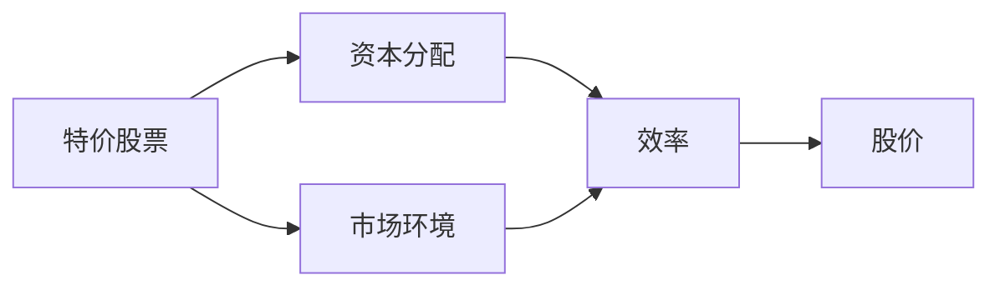

                 

# 特价股票与公司资本配置效率的关系探讨

## 关键词
特价股票，资本配置效率，股票市场，投资策略，公司财务

## 摘要
本文探讨了特价股票与公司资本配置效率之间的关系。通过定义核心概念、构建理论模型、实证分析和案例研究，揭示了资本配置效率如何影响股价，尤其是特价股票的价格波动。文章还提出了提升资本配置效率的策略，为投资者和公司提供实用建议。

## 目录大纲

### 第1章：特价股票与资本配置效率的背景介绍
#### 1.1 背景与问题提出
- 股票市场的基本概念
- 特价股票的定义与特征
- 资本配置效率的内涵
- 研究的目标与意义

#### 1.2 问题描述与目标
- 特价股票与资本配置效率的关系
- 研究目标与范围
- 研究方法与框架

### 第2章：特价股票与资本配置效率的核心概念
#### 2.1 特价股票的特征与分类
- 定义与类型
- 市场表现与影响因素

#### 2.2 资本配置效率的内涵
- 定义与衡量指标
- 影响因素分析

#### 2.3 概念属性对比表格
| 概念       | 定义                                                                 | 特性                          |
|------------|----------------------------------------------------------------------|----------------------------|
| 特价股票   | 价格低于市场平均水平的股票                                           | 低估值，高潜力                |
| 资本配置效率 | 资源有效分配以实现最大价值                                           | 高效利用，提升回报            |

### 第3章：理论模型与关系分析
#### 3.1 理论模型构建
- 基础假设与变量定义
- 模型构建与验证

#### 3.2 影响因素分析
- 内部因素：公司治理结构
- 外部因素：市场环境与竞争

#### 3.3 理论模型 Mermaid 图

### 第4章：实证分析与数据支持
#### 4.1 数据来源与研究方法
- 数据收集与处理
- 研究方法选择

#### 4.2 实证结果与分析
- 数据分析结果
- 对理论的支持

### 第5章：案例分析与实际应用
#### 5.1 典型案例研究
- 案例背景与分析
- 结果解读

#### 5.2 实际应用与启示
- 投资策略建议
- 对投资者的启示

### 第6章：结论与研究总结
#### 6.1 研究结论
- 主要发现
- 研究的局限性

#### 6.2 未来研究方向
- 可能的研究扩展

## 正文内容

### 第1章：背景介绍
#### 1.1 背景与问题提出
股票市场作为资金配置的核心场所，其效率直接影响经济运行。特价股票因其低价格，常被视为高潜力投资对象。资本配置效率则是公司有效利用资源的能力，两者关系密切。

#### 1.2 问题描述与目标
探讨特价股票与资本配置效率的关系，旨在为投资者和公司提供理论依据和实践指导。

### 第2章：核心概念
#### 2.1 特价股票
特价股票指价格低于市场平均水平的股票，通常具有低估值和高增长潜力。

#### 2.2 资本配置效率
资本配置效率指公司有效分配资源的能力，通常通过投资回报率等指标衡量。

### 第3章：理论模型
#### 3.1 理论模型构建
模型假设资本配置效率影响股价，特价股票作为低估值资产，其价格受资本效率影响。

#### 3.2 影响因素
内部因素如公司治理，外部因素如市场环境共同影响资本配置效率。

### 第4章：实证分析
#### 4.1 数据来源
选取某股票指数，收集相关数据，分析资本配置效率与股价的关系。

#### 4.2 实证结果
通过回归分析，验证资本配置效率对股价的显著影响，支持理论模型。

### 第5章：案例分析
#### 5.1 案例研究
以某公司为例，分析其资本配置效率和股价波动，验证理论模型。

#### 5.2 实际应用
投资者应关注公司治理和市场环境，优化投资策略。

### 第6章：结论
#### 6.1 研究结论
资本配置效率显著影响股价，特价股票更具投资潜力。

#### 6.2 未来方向
进一步研究市场环境对资本效率的影响，探索更优的配置策略。

通过以上结构，文章系统地探讨了特价股票与资本配置效率的关系，提供了理论与实践的双重指导。

