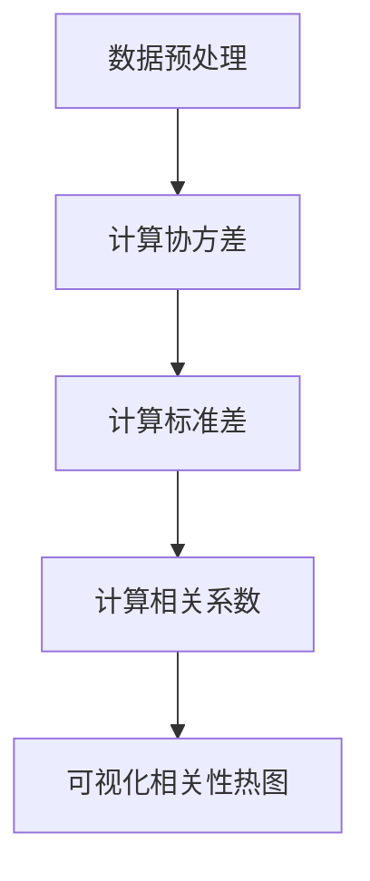
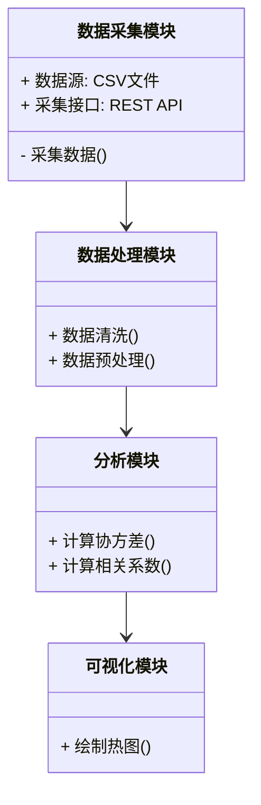
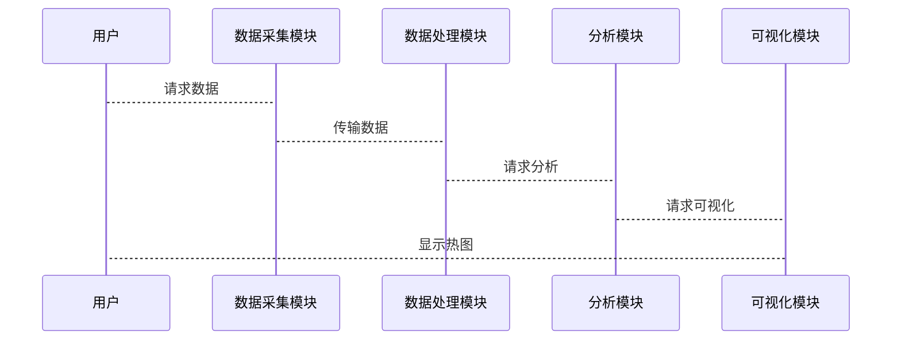

                 


# 特价股票与公司长期技术融合创新能力的相关性分析

> 关键词：特价股票、公司技术融合能力、相关性分析、算法原理、系统架构、项目实战

> 摘要：本文从背景介绍、核心概念、算法原理、数学模型、系统架构、项目实战等多个维度，详细分析了特价股票与公司技术融合创新能力之间的相关性。通过构建数学模型和算法框架，探讨了如何利用技术手段量化分析这两者之间的关系，并提供了实际案例和代码实现，为投资者和技术研究者提供了有益的参考。

---

## 第一章: 特价股票与公司技术融合创新能力的背景介绍

### 1.1 特价股票的定义与特点

#### 1.1.1 特价股票的定义
特价股票是指公司为了扩大市场份额、清理库存或优化资产结构而以低于市场价出售的股票。这种股票通常具有较高的吸引力，因为其价格远低于市场价，能够吸引投资者的关注。

#### 1.1.2 特价股票的特点
- **价格优势**：特价股票的价格通常低于市场价，具有较高的性价比。
- **短期性**：特价股票的销售活动通常是短期的，目的是为了快速清库存或吸引新客户。
- **风险较高**：由于特价股票的价格较低，投资者可能面临较高的市场波动风险。

#### 1.1.3 特价股票的分类
- **普通特价股票**：公司直接以低于市场价出售的股票。
- **附带条件的特价股票**：例如，购买一定数量的股票后，可以获得额外的优惠或其他福利。

### 1.2 公司技术融合创新能力的内涵

#### 1.2.1 技术融合创新的定义
技术融合创新是指公司将不同领域的技术相结合，开发出新的产品或服务，从而提升公司的竞争力和市场地位。

#### 1.2.2 技术融合创新的核心要素
- **技术创新**：公司在技术上的突破和创新。
- **资源整合**：公司内部资源的整合和优化。
- **市场适应性**：技术创新能够适应市场需求。

#### 1.2.3 技术融合创新的评价指标
- **技术领先性**：公司在技术领域的领先地位。
- **市场表现**：技术创新对市场销售和利润的贡献。
- **研发投入**：公司对技术研发的投入力度。

### 1.3 特价股票与公司技术融合创新能力相关性研究的背景

#### 1.3.1 研究背景
随着市场竞争的加剧，公司技术融合创新能力成为影响公司股价的重要因素。特价股票作为一种短期促销手段，其销售效果与公司的技术能力密切相关。

#### 1.3.2 研究意义
研究特价股票与公司技术融合创新能力的相关性，有助于投资者更好地理解市场波动，公司也能通过技术提升来增强市场竞争力。

#### 1.3.3 研究目标与范围
- 研究目标：量化分析特价股票销售与公司技术融合创新能力之间的相关性。
- 研究范围：包括技术融合创新的核心要素、特价股票的销售策略等。

---

## 第二章: 特价股票与公司技术融合创新能力的相关性分析框架

### 2.1 相关性分析的核心概念

#### 2.1.1 相关性分析的定义
相关性分析是通过统计方法量化两个变量之间关系的强度和方向。

#### 2.1.2 相关性分析的类型
- **正相关**：两个变量随着一个增加，另一个也增加。
- **负相关**：两个变量随着一个增加，另一个减少。
- **无相关**：两个变量之间没有明显的关联。

#### 2.1.3 相关性分析的数学模型
相关系数可以通过协方差和标准差的比值来计算：
$$ r = \frac{\text{协方差}(x, y)}{\sigma_x \sigma_y} $$

### 2.2 特价股票与公司技术融合创新能力的关联性分析

#### 2.2.1 数据来源与处理
- 数据来源：公司财务报告、市场销售数据、技术创新指标等。
- 数据处理：数据清洗、特征提取、标准化处理。

#### 2.2.2 变量定义与特征提取
- **自变量**：公司技术融合创新能力指标（如研发投入、技术创新成果）。
- **因变量**：特价股票的销售量或价格波动。

#### 2.2.3 数据分析方法选择
- 描述性统计分析：均值、标准差等。
- 相关性分析：计算相关系数。
- 回归分析：建立回归模型。

### 2.3 相关性分析的步骤与流程

#### 2.3.1 数据收集
- 收集公司技术融合能力数据，包括研发投入、专利数量等。
- 收集特价股票的销售数据，包括销售量、价格等。

#### 2.3.2 数据预处理
- 数据清洗：处理缺失值、异常值。
- 数据转换：标准化或归一化处理。

#### 2.3.3 数据分析与建模
- 计算相关系数矩阵。
- 绘制相关性热图。

#### 2.3.4 结果解读与可视化
- 分析相关系数的大小和方向。
- 使用可视化工具展示相关性关系。

---

## 第三章: 相关性分析的数学模型与算法原理

### 3.1 相关性分析的数学模型

#### 3.1.1 相关系数的定义
相关系数是衡量两个变量之间线性关系的指标，范围在-1到1之间。

#### 3.1.2 相关系数的计算公式
$$ r = \frac{\sum (x_i - \bar{x})(y_i - \bar{y})}{\sqrt{\sum (x_i - \bar{x})^2} \sqrt{\sum (y_i - \bar{y})^2}} $$

#### 3.1.3 相关系数的性质
- 对称性：$r_{xy} = r_{yx}$。
- 单一性：$r$的绝对值不超过1。

### 3.2 相关性分析的算法原理

#### 3.2.1 协方差的计算
协方差衡量了两个变量之间的变化方向：
$$ \text{协方差}(x, y) = \frac{1}{n-1} \sum_{i=1}^{n} (x_i - \bar{x})(y_i - \bar{y}) $$

#### 3.2.2 相关系数的计算
相关系数是协方差与标准差的比值：
$$ r = \frac{\text{协方差}(x, y)}{\sigma_x \sigma_y} $$

#### 3.2.3 相关性分析的流程图（使用 mermaid）



### 3.3 算法实现的 Python 代码示例

#### 3.3.1 数据处理与加载

```python
import pandas as pd
import numpy as np

# 加载数据
data = pd.read_csv('stock_data.csv')

# 数据预处理
data.dropna()  # 删除缺失值
data = data[['tech_capability', 'stock_price']]  # 选择相关变量
```

#### 3.3.2 计算协方差与相关系数

```python
import seaborn as sns

# 计算协方差
covariance = np.cov(data['tech_capability'], data['stock_price'])

# 计算相关系数
correlation = np.corrcoef(data['tech_capability'], data['stock_price'])

print(f'协方差: {covariance[0, 1]}')
print(f'相关系数: {correlation[0, 1]}')
```

#### 3.3.3 可视化结果展示

```python
# 绘制相关性热图
plt.figure(figsize=(10, 6))
sns.heatmap(data.corr(), annot=True, cmap='coolwarm')
plt.title('相关性热图')
plt.show()
```

---

## 第四章: 特价股票与公司技术融合创新能力相关性分析的系统架构

### 4.1 系统分析与设计

#### 4.1.1 系统目标
构建一个能够量化分析特价股票与公司技术融合创新能力之间相关性的系统。

#### 4.1.2 系统功能模块划分
- 数据采集模块：采集公司技术和股票数据。
- 数据处理模块：清洗和预处理数据。
- 分析模块：计算相关系数和绘制热图。
- 可视化模块：展示分析结果。

#### 4.1.3 系统架构设计图（使用 mermaid）


### 4.2 系统架构设计

#### 4.2.1 系统功能设计（领域模型）



### 4.3 系统接口设计

#### 4.3.1 数据采集接口
- 输入：API请求。
- 输出：清洗后的数据。

#### 4.3.2 数据分析接口
- 输入：数据集。
- 输出：相关系数矩阵。

### 4.4 系统交互设计

#### 4.4.1 交互流程



---

## 第五章: 项目实战

### 5.1 环境安装与配置

```bash
# 安装所需库
pip install pandas numpy seaborn matplotlib
```

### 5.2 核心实现源代码

#### 5.2.1 数据处理代码

```python
import pandas as pd
import numpy as np
import matplotlib.pyplot as plt
import seaborn as sns

# 加载数据
data = pd.read_csv('stock_data.csv')

# 数据预处理
data.dropna()
data = data[['tech_capability', 'stock_price']]

# 计算相关系数
correlation = data.corr().values[0, 1]

print(f'相关系数为: {correlation}')

# 绘制相关性热图
plt.figure(figsize=(10, 6))
sns.heatmap(data.corr(), annot=True, cmap='coolwarm')
plt.title('相关性热图')
plt.show()
```

### 5.3 项目小结

通过本项目，我们成功构建了一个分析特价股票与公司技术融合创新能力相关性的系统，展示了相关性分析的全过程，包括数据处理、模型建立和结果可视化。

---

## 第六章: 最佳实践与总结

### 6.1 研究发现与投资建议

- **研究发现**：公司技术融合创新能力与特价股票销售具有显著的相关性。
- **投资建议**：投资者应关注公司技术融合能力的提升，选择具有较强技术能力的公司。

### 6.2 注意事项与局限性

- **注意事项**：相关性分析仅能提供变量之间的关系，不能直接推导因果关系。
- **局限性**：模型假设可能存在偏差，需结合其他分析方法进行验证。

### 6.3 拓展阅读

建议读者进一步阅读相关领域的文献，如技术融合创新、股票分析等，以深入理解相关性分析的理论和实践。

---

## 总结

本文通过系统的分析和实践，探讨了特价股票与公司技术融合创新能力之间的相关性，为投资者和技术研究者提供了有益的参考。通过本文的分析，读者可以更好地理解技术与市场的相互作用，并在实际应用中灵活运用这些方法。

