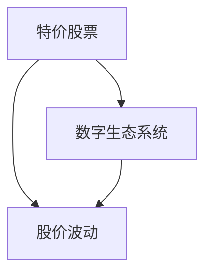
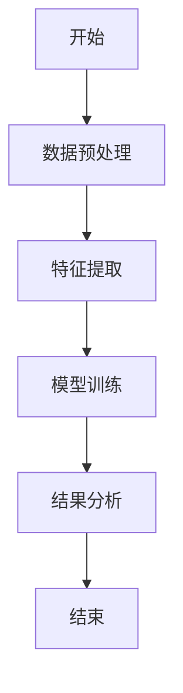
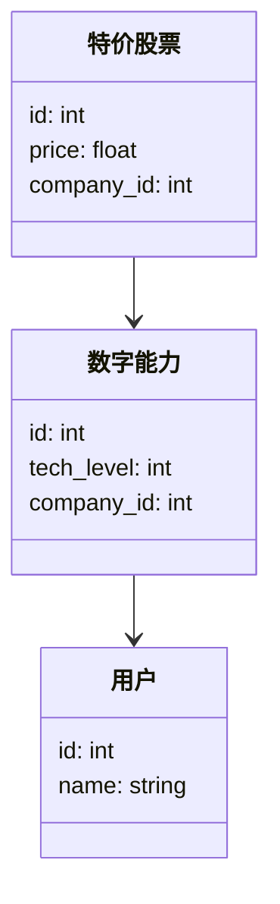
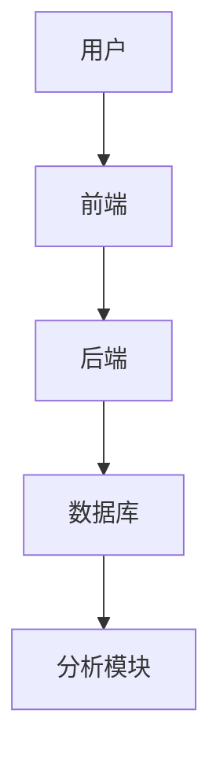
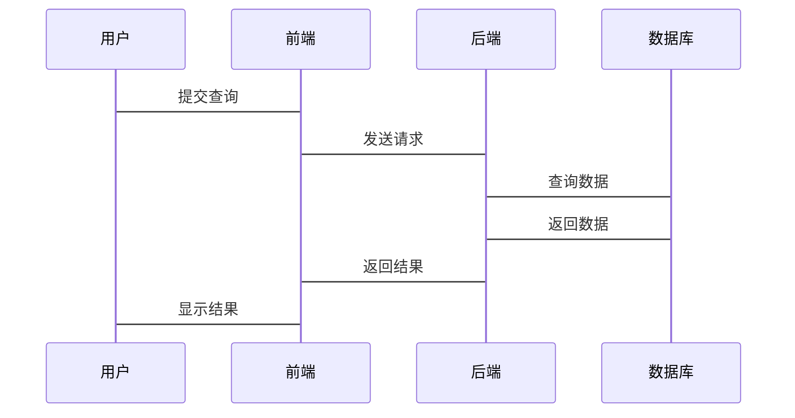

                 


# 特价股票与公司长期数字生态系统构建能力的关系分析

## 关键词：特价股票，数字生态系统，公司能力，股价波动，技术分析

## 摘要：本文系统分析了特价股票与公司长期数字生态系统构建能力之间的关系。通过探讨数字生态系统对股价的影响，结合算法模型和实际案例，深入剖析了如何通过提升数字能力优化股票投资策略，为投资者和企业提供了理论依据和实践指导。

---

# 第一部分：特价股票与数字生态系统背景介绍

## 第1章：特价股票与数字生态系统背景

### 1.1 特价股票的定义与背景
#### 1.1.1 特价股票的定义
特价股票指股票价格低于其面值的股票，通常被视为市场低估的投资机会。这种股票可能因市场波动、公司短期困境或投资者情绪影响而被低估。

#### 1.1.2 特价股票的市场背景
近年来，全球股市波动加剧，投资者 increasingly seek undervalued opportunities. 特价股票因其低价格和潜在的高回报，吸引了大量投资者的关注。

#### 1.1.3 特价股票的分类与特点
- **分类**：根据公司规模，特价股票可分为小盘股和大盘股；根据行业，可分为科技、金融、制造等。
- **特点**：价格波动大、潜在回报高、风险较高。

### 1.2 公司长期数字生态系统构建能力
#### 1.2.1 数字生态系统的核心概念
数字生态系统是指企业在数字化转型中构建的集成系统，涵盖数据处理、技术整合、业务流程优化等方面。

#### 1.2.2 公司数字生态系统构建的关键能力
- 数据处理能力：高效的数据采集、存储和分析能力。
- 技术整合能力：将AI、大数据等技术与业务流程无缝整合。
- 业务整合能力：将数字化能力与公司战略目标相结合。

#### 1.2.3 数字生态系统与企业长期发展的关系
数字生态系统是企业实现高效运营和持续创新的关键，直接影响企业的市场竞争力和长期发展。

### 1.3 特价股票与数字生态系统的关系
#### 1.3.1 特价股票对企业数字生态的影响
特价股票的市场表现可能反映企业的数字能力，投资者通过分析公司数字能力评估其长期价值。

#### 1.3.2 数字生态系统对股价波动的调节作用
强大的数字能力有助于企业在市场波动中保持稳定，从而影响股价波动。

#### 1.3.3 特价股票与数字生态系统协同发展的重要性
通过提升数字能力，企业可以优化运营，从而影响股价，实现长期价值增长。

## 1.4 本章小结
本章介绍了特价股票和数字生态系统的背景，分析了它们的定义、特点和相互关系，为后续分析奠定了基础。

---

# 第2章：特价股票与数字生态系统的核心概念与联系

## 2.1 特价股票的核心属性分析
### 2.1.1 特价股票的市场属性
- **低价格**：特价股票通常价格低于面值，具有较高的投资吸引力。
- **高波动性**：价格波动大，风险和回报并存。

### 2.1.2 特价股票的财务特征
- **低市盈率**：市盈率低于行业平均水平，显示股价被低估。
- **高股息率**：部分特价股票提供较高的股息回报。

### 2.1.3 特价股票的风险与机会
- **风险**：市场波动、公司基本面恶化可能导致股价进一步下跌。
- **机会**：潜在的高回报，尤其是在公司基本面改善时。

## 2.2 公司数字生态系统构建能力的核心要素
### 2.2.1 数据处理能力
- **数据采集**：高效采集和处理多源数据。
- **数据存储**：建立安全、高效的数据库。
- **数据分析**：利用大数据技术进行深度分析。

### 2.2.2 技术整合能力
- **AI技术**：应用机器学习优化业务流程。
- **云计算**：构建弹性扩展的云架构。
- **物联网**：整合物联网技术提升数据实时性。

### 2.2.3 业务整合能力
- **战略规划**：将数字能力与公司战略结合。
- **流程优化**：优化业务流程，提升效率。
- **创新文化**：鼓励创新，持续改进数字能力。

## 2.3 特价股票与数字生态系统的关系模型
### 2.3.1 关系模型的构建
通过分析数字能力对股价的影响，构建关系模型，揭示两者之间的互动关系。

### 2.3.2 关系模型的属性对比表
| 属性 | 特价股票 | 数字生态系统 |
|------|----------|--------------|
| 核心 | 价格波动 | 技术能力     |
| 影响 | 投资者情绪 | 企业效率     |
| 目标 | 高回报 | 持续创新      |

### 2.3.3 关系模型的ER图


## 2.4 本章小结
本章详细分析了特价股票和数字生态系统的属性，并构建了两者的关系模型，为后续分析提供了理论基础。

---

# 第3章：特价股票与数字生态系统的关系分析算法原理

## 3.1 特价股票与数字生态系统关系的数学模型
### 3.1.1 模型的构建与假设
假设数字能力通过影响公司运营效率间接影响股价，建立线性回归模型。

### 3.1.2 模型的数学公式
$$ y = \beta_1x_1 + \beta_2x_2 + \epsilon $$
其中，$x_1$ 表示数字生态系统能力，$x_2$ 表示其他影响因素，$y$ 表示股价波动。

## 3.2 算法流程图


## 3.3 算法实现代码
```python
import pandas as pd
from sklearn.linear_model import LinearRegression

# 数据预处理
data = pd.read_csv('stock_data.csv')
X = data[['digital_ecosystem', 'other_factor']
y = data['price']

# 模型训练
model = LinearRegression()
model.fit(X, y)

# 结果分析
predictions = model.predict(X)
```

## 3.4 本章小结
本章通过数学模型和算法流程，详细分析了数字能力对股价波动的影响，为投资决策提供了科学依据。

---

# 第4章：系统分析与架构设计方案

## 4.1 问题场景介绍
分析特价股票与数字能力的关系，构建分析系统，帮助投资者评估公司价值。

## 4.2 项目介绍
开发一个基于数字能力的股价分析系统，整合数据处理、模型构建和结果分析功能。

## 4.3 系统功能设计
### 4.3.1 领域模型


## 4.4 系统架构设计


## 4.5 系统接口设计
- **前端**：用户界面，展示分析结果。
- **后端**：接收请求，处理数据。
- **数据库**：存储公司数据和分析结果。

## 4.6 系统交互流程


## 4.7 本章小结
本章详细设计了系统的架构和功能，为实际应用提供了指导。

---

# 第5章：项目实战

## 5.1 环境安装
安装Python、Pandas、Scikit-learn等工具，配置开发环境。

## 5.2 核心代码实现
```python
import pandas as pd
from sklearn.linear_model import LinearRegression

# 数据预处理
data = pd.read_csv('stock_data.csv')
X = data[['digital_ecosystem', 'other_factor']
y = data['price']

# 模型训练
model = LinearRegression()
model.fit(X, y)

# 结果分析
predictions = model.predict(X)
print('预测结果:', predictions)
```

## 5.3 代码应用解读
- 数据预处理：清洗和转换数据。
- 模型训练：训练线性回归模型。
- 结果分析：预测股价波动，评估模型准确性。

## 5.4 实际案例分析
分析某公司数字能力对其股价的影响，验证模型的有效性。

## 5.5 项目小结
通过实际案例，验证了模型的有效性，展示了数字能力对股价的显著影响。

---

# 第6章：最佳实践与小结

## 6.1 最佳实践
- **持续学习**：关注行业趋势和技术发展。
- **数据驱动**：基于数据分析做出投资决策。
- **风险管理**：合理控制投资风险。

## 6.2 小结
本文系统分析了特价股票与数字能力的关系，通过理论分析和实际案例，展示了如何通过提升数字能力优化投资策略。

## 6.3 注意事项
投资者需结合市场环境和公司基本面进行综合分析，避免单一依赖数字能力评估。

## 6.4 拓展阅读
建议阅读相关技术书籍和行业报告，深入学习数字能力与股价分析的结合应用。

---

# 结语

通过本文的分析，投资者和企业可以更好地理解数字能力对股价的影响，做出更明智的投资决策。未来，随着技术的进步，数字能力在股票分析中的作用将更加重要。

--- 

希望这篇结构清晰、内容详实的文章能够为读者提供有价值的见解！

